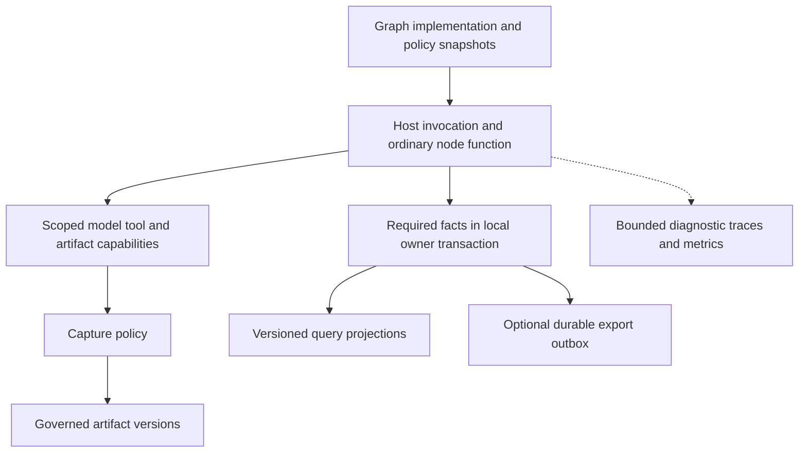
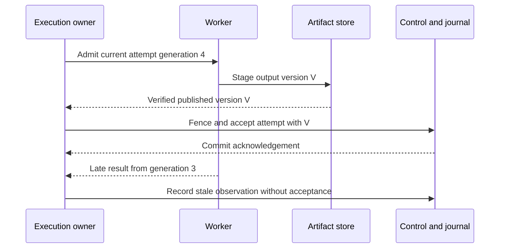
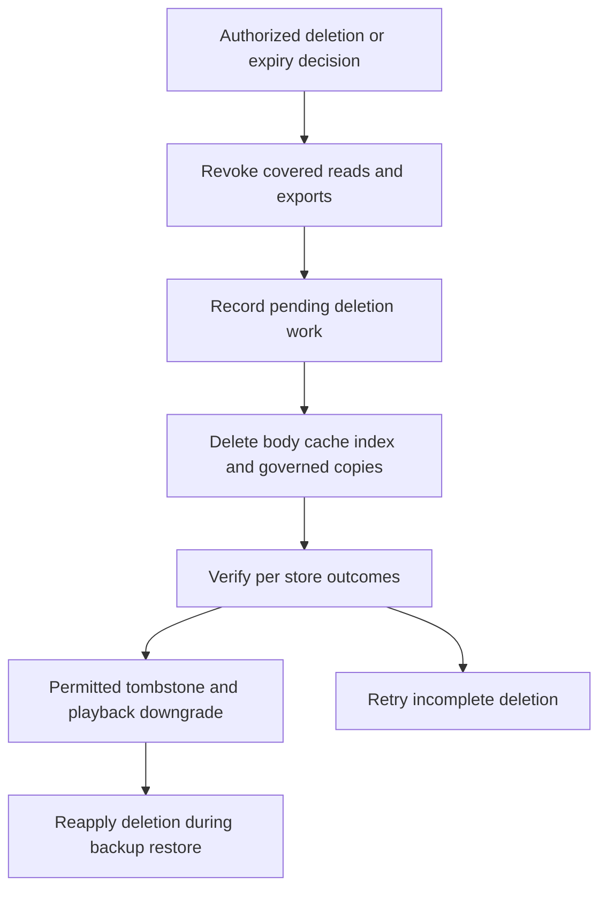
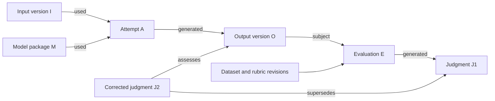

# Pantograph Execution Ledger and Provenance

Durable evidence for jobs models artifacts and evaluation

Research edition prepared 2 October 2026

Pantograph source baseline: `4938e405c7f656365eefdca492774ccae110c90d`, verified as current main during this research [L01]

## Abstract

Pantograph needs to explain what ran, why it ran, which inputs and model artifacts it used, what it produced, and what can still be inspected or reproduced after a failure or a retention decision. Those questions span several systems with different responsibilities. Scheduler state authorizes execution. An execution journal records accepted facts. Traces explain operational behavior. Artifact lineage relates data versions to activities. Evaluation records attach fallible judgments to particular outputs. Materialized views make those records useful to people. Collapsing these responsibilities into one stream of generic telemetry creates misleading completeness, replay and deletion guarantees.

The current repository already contains substantial foundations: a typed SQLite diagnostic event ledger, bounded payloads, model and license usage records, versioned projections, centrally wired node I/O capture, artifact bodies and descriptors, and retention-state events. The useful next step is to strengthen the boundaries between these components. Source inspection identifies concrete qualification needs: idempotent producer identity, consistent attempt-level artifact identity, atomic control/evidence publication where required, recoverable body/metadata commitment, an explicit capture policy, unified deletion orchestration, and versioned quality judgments. The file-backed ledger currently uses WAL with synchronous NORMAL, while artifact bodies and their JSON manifest are written separately; their durability guarantees must be stated precisely rather than summarized as "durable."

This paper develops a local-first design that builds on those foundations. It uses W3C PROV for meaning, Lamport ordering for causal discipline, OpenLineage for selected interchange, OpenTelemetry and Dapper for low-overhead observation, durable-workflow histories for replay boundaries, content-addressed storage for byte identity, and ML Metadata and MLflow for lineage and evaluation comparisons. None is a substitute for all the others. The recommendation is a small host-owned observation boundary with separate mandatory evidence and best-effort telemetry paths, an explicitly governed artifact store, and queryable projections. A distributed service is justified only by measured needs. The paper provides proposed identities, a logical schema, query examples, crash sequences and validation criteria; it does not report an implementation or benchmark.

## 1 The decision to make

The central design question is not which logging framework to install. It is which facts Pantograph must know before admitting an operation or committing its result, which facts may arrive later, which content it is allowed to retain, and which questions must remain answerable after content is gone.

A user inspecting a run should be able to ask:

1. Which graph revision, node implementation, runtime and model package were actually used?
2. Which attempt produced the accepted result, and what happened to the others?
3. Did a node consume a value, receive a cached result, or merely have a declared edge pointing toward it?
4. Is an output complete, provisional, rejected, unavailable, expired or deleted?
5. Is a missing observation evidence of inactivity, a disabled capture policy, a dropped event, or an interrupted process?
6. Can this result be shown again, recomputed under equivalent conditions, or only reevaluated statistically?
7. Who or what judged it, using which rubric, reference data and evaluator version?
8. If data is removed, what else must be removed, invalidated or marked unreproducible?

These are requirements, not assumptions about what the present implementation already guarantees. The scheduler companion owns dependency readiness, resource admission and execution ownership. The node-engine companion owns the callable boundary, capabilities and isolation. The inference-compatibility companion owns the validity of a model/task/runtime/option combination. This paper owns the evidence connecting those decisions, the data lifecycle and the interpretation of retained results. It does not propose a second scheduler or require every node to become a telemetry application.

### Six responsibilities that must remain distinct

| Responsibility | Main question | Required property | Typical failure if confused |
|---|---|---|---|
| Authoritative control state | May this attempt run or commit now? | Transactional ownership and fencing | An old attempt overwrites an accepted result |
| Execution journal | Which facts were durably accepted? | Stable identity and explicit acknowledgement | A retry inserts the same fact twice |
| Diagnostic trace | Where did time and failures occur? | Bounded cost and honest loss reporting | Sampling hides an operation counted as absent |
| Artifact and data lineage | Which versions were used and produced? | Byte/version identity and typed relationships | A mutable path is treated as immutable input |
| Evaluation evidence | How was this output judged? | Versioned subject, rubric and evaluator | A corrected label silently changes yesterday's score |
| Query projections | What should the UI or report show? | Rebuildability and freshness metadata | A stale summary becomes execution authority |

An event journal may share a database with control tables and projections. A single append can feed several views. Separation means clear semantics and ownership, not a requirement for six services.

## 2 What the relevant systems teach

### Provenance meaning and evidence strength

W3C PROV separates entities, activities and responsible agents, then relates them through use, generation and derivation. That fits a node attempt consuming particular input versions and producing particular output versions. Crucially, the fact that an activity used A and generated B does not by itself prove B was derived from A. Pantograph should distinguish declared graph connectivity, observed consumption and asserted semantic derivation. PROV constraints help detect inconsistent histories; they do not authenticate the observer. [E01, E02]

Consider an illustrative report generator that reads document A, reads a configuration record C and returns report B. A graph edge from A to the generator describes planned connectivity. A read receipt describes observed use of a particular version. A claim that a paragraph in B derives from a passage in A is stronger still. An execution can read a document and then take a branch that does not use its content. Recording all three as a generic "depends on" edge loses this distinction.

The same distinction explains why a trace tree is not a complete provenance graph. Suppose one batch operation consumes artifacts from five runs and produces one aggregate. Span links can preserve useful cross-trace relationships, but the aggregate still needs data-version identity and explicit input roles if a user must discover which records influenced it. A span's parent and its elapsed duration do not express that information by themselves. [E04]

### Interchange rather than execution authority

OpenLineage distinguishes a Job definition, a particular Run and input/output Datasets, with facets for source location, schema, versions and run-specific subsets. It also separates design-time descriptions from runtime observations. This makes it a plausible export format for Pantograph run and artifact lineage. It does not specify Pantograph's state transaction, local deletion policy, permission boundary or complete per-attempt execution history. Export should be a view of accepted records, not a second source of run truth. [E03]

### Transparent observation and relative completeness

Dapper's documented design emphasizes low-overhead observation at common library boundaries and sampling. The lesson is to instrument host adapters and shared services once, instead of requiring each node to remember logging calls. Sampling makes that evidence unsuitable as the sole complete audit record. [E07]

OpenTelemetry provides trace context, spans and links, including relationships that do not fit a single parent tree. Its SDK deliberately supports sampling and bounded queues that drop spans. Use it for operational telemetry and cross-process correlation while preserving required journal facts independently. A trace ID is neither an authorization credential nor a unique durable event key. [E04, E05]

The pinned GenAI convention comparison treats prompts, instructions and outputs as sensitive content that should not be captured by default. It also contemplates separate content-storage hooks. This supports separate payload governance rather than embedding user content in every span. The cited version is v1.37.0; the current unversioned page has moved, so an implementation must qualify its actual exporter/convention version. [E06]

Completeness is relative to a declared contract. A history sufficient to reconstruct a workflow decision can omit diagnostic detail about intermediate attempts. A sampled trace can be excellent for latency analysis while being unsuitable for counting every externally visible action. An artifact inventory can identify every retained output without proving that every transient input was captured. Temporal history and the OpenTelemetry SDK illustrate these different intentional boundaries. [E09, E05]

The practical analytical mistake is to treat absence uniformly. If a model-call span is absent, the call may not have happened, it may have been unsampled, its exporter may have dropped it, or the instrumented boundary may have been bypassed. If an authoritative state transition is absent from a correctly implemented transactional history, the inference can be much stronger. Queries need a coverage statement before absence becomes evidence. This conclusion follows from the different observation contracts, not from a preference for one storage product.

### Durable histories and composable transactions

Temporal shows the stronger contract needed when history drives recovery: service-created events, deterministic workflow logic and recorded results for nondeterministic operations. Its documented history also compacts aspects of activity retries, so even a durable workflow history is not necessarily an attempt-by-attempt diagnostic trace. Pantograph can borrow the discipline of declaring replay semantics without adopting Temporal or pretending arbitrary node callbacks are deterministic. [E09]

Event sourcing means the event stream is the authoritative source from which domain state can be rebuilt. An append-only diagnostic log beside mutable control state is not automatically event sourcing. Full event sourcing adds concurrency and evolution obligations. A control-state transaction plus an evidence/outbox record is often a narrower way to fix Pantograph's most important dual-write problems. [E12, E13]

Take an illustrative operation that writes an artifact body, inserts a database reference and exports an event. There are at least three independently visible effects. If the process fails after writing the body but before committing the reference, an orphan remains. If it commits the reference before making the body durably readable, consumers may receive a broken accepted result. If it commits locally and loses the export acknowledgement, retrying publication can duplicate delivery. A single "save succeeded" flag hides the distinction.

A transactional outbox addresses the state/publication-intent pair by recording both in the same transaction. It does not make a separate blob service or remote tool participate in that transaction. Stable event identity and duplicate handling are still necessary at the consumer. The useful unit of reasoning is the acknowledgement boundary and its failure model, rather than whether the database is branded embedded or server based. [E13]

SQLite's WAL and synchronization settings give a concrete example. Atomic commit, survival of an application crash, survival of power loss and remote replication are distinct guarantees. A receipt that follows a NORMAL-mode commit cannot silently be described using FULL-mode power-loss semantics. Conversely, a local application should not inherit the cost and failure modes of a distributed service merely to avoid specifying its own durability contract. [E10, E11]

### Artifact identity and governed persistence

Venti demonstrates content-addressed immutable blocks and deduplication: changing bytes changes their content identity. Pantograph should borrow that distinction, without copying perpetual retention or the historical hash choice. A content-addressed blob still needs authorization, namespace, encryption, reference tracking and deletion policy. A hash describes bytes, not their provenance, permitted use or current availability. [E15]

Content addressing distinguishes versions of bytes. It does not decide whether two identical byte sequences have the same owner, permitted purpose, lifecycle or semantic role. The same text can be a public fixture in one context and a private user input in another. A globally shared object may reduce storage while complicating access, deletion and membership privacy. These are original examples illustrating why the Venti-style identity mechanism must be composed with policy rather than treated as the whole artifact model. [E15]

ML Metadata supplies a concrete implementation vocabulary: artifacts, executions, contexts and input/output relationship events. This is useful for upstream/downstream lineage and reuse queries. It does not remove the need to ensure that an artifact URI refers to the recorded bytes. Pantograph can use these concepts in its existing relational model without adopting the complete TFX stack. [E16]

SQLite remains a suitable local candidate with one database owner, bounded transactions and checkpoint management. It is not a multi-host shared-file database. PostgreSQL is an optional server substrate when concurrent clients or centralized ownership are required; changing databases does not solve semantic idempotency or external-effect atomicity. PostgreSQL sequence allocation and logical-decoding re-delivery illustrate why "larger ID" and "delivered once" need explicit definitions. [E10, E14]

### Evaluation as versioned evidence

MLflow distinguishes evaluation inputs, predictions, scorers, human/code/model feedback and expected answers. Those distinctions are directly useful: a successful inference is an observation, while "correct" is an assessment under some criterion. A trace selected for review is not automatically a representative benchmark. Pantograph's proposed revisioned judgment chain below is a design choice, not a claim that all assessment systems preserve edits in that form. [E17]

Suppose output O is scored 0 by evaluator E1 and later scored 1 after a reference-label correction. The output's historical bytes did not change, and its computation did not become newly successful. The judgment changed under a different assessment context. A report that overwrites the score without retaining its population and criterion cannot explain what a release decision knew at the time.

A current view can select the accepted assessment while preserving earlier reports where retention policy permits. A model judge's answer remains evidence of that judge's behavior; agreement with the judge is not an independent proof of correctness.

For nondeterministic computation, repeated scores also require a statistical interpretation. Recording the seed and package versions supports investigation but does not erase backend and platform differences documented by PyTorch. Historical playback, a rerun within a tested envelope and statistical replication should therefore be named separately. This prevents an artifact browser from promising deterministic reproducibility merely because it retained a prompt and a model alias. [E18]

## 3 What Pantograph already implements

### 3 1 A real event ledger rather than just console logs

The diagnostics crate defines typed event kinds for scheduler estimates, queue decisions, admission, reservations, task attempts, model lifecycle, run lifecycle, node status, inference diagnostics, artifact observations, retention changes and errors. The envelope includes source identity, occurred and recorded times, run/workflow/node/runtime/model information, attribution fields, privacy and retention classes, a payload reference and a payload hash. Serialized event payloads are limited to 8,192 bytes, with additional bounds on collections and text. SQLite assigns an autoincrement event sequence and indexes the principal filters. [L02]

Appending validates and serializes the typed payload, hashes that JSON with BLAKE3, generates an event UUID, inserts in a SQLite transaction and returns after commit. This is useful durable local storage. The operation does not accept a producer event ID or idempotency key, so resubmitting the same request produces another event. The hash is a payload integrity aid; it is not a signature, a hash of the whole envelope, or an externally anchored tamper-evident chain. [L03]

### 3 2 Query projections already have versions and cursors

Scheduler timeline, run list/detail, I/O artifact, node status and library usage projections have explicit versions. Projection drains update rows and their applied-event cursor in one transaction. Rebuild resets a projection and repeatedly drains batches. This is a valuable foundation for schema evolution and repair. [L05]

There are two important interpretation limits. First, a diagnostic projection is not automatically the authoritative state from which execution resumes. Second, a bounded drain can return a `Current` status while more relevant events remain beyond the cursor. The UI should expose the processed watermark and target watermark, or a meaningful lag status, rather than relying on a single status word. Filtered projections need a watermark definition that accounts for event kinds they intentionally ignore.

### 3 3 Model usage and inference diagnostics are richer than a generic trace

Model/license usage records already carry client/session/bucket and workflow attribution, optional model revision/hash, runtime backend, contract lineage, output measurements, license metadata and a guarantee category. The managed submission helper validates that the capability route matches its node context. This establishes a typed interface; it does not prove universal submission across every execution route. [L06]

The event schema also has scheduler task and attempt identities. Inference records can carry request/task IDs, effective backend/variant/device information, usage and resource observations, cache handles, artifact references, settings and compatibility summaries. The recommendation is to connect and qualify these existing facts, not replace them with an unstructured payload bag. [L19]

### 3 4 Host owned I O capture is already wired in named paths

`NodeExecutionWorkflowLedgerSink` is constructed by embedded workflow-host and execution-session paths; repository search also identifies data-graph and edit-session composition. It centrally translates workflow events into node-status, inference and artifact observations. It receives graph/run identity from the host and can wrap a UI sink. This is distinct from the separate `NodeExecutionDiagnosticsRecorder` type discussed in the node-engine audit. A missing construction site for the latter would not imply that Pantograph has no production ledger capture. [L11, L12]

Coverage still needs qualification per execution path. The sink cannot observe events a path does not emit; some composition converts constructor failure into a no-op sink. Demand-engine event sends and some trace persistence paths ignore errors. These choices may suit optional UI diagnostics, but do not establish a universal required-evidence contract. [L12, L16, L22]

### 3 5 Artifact metadata and artifact bytes are separate

I/O records distinguish artifact facts, payload artifacts and logical lineage; they include producer/consumer node and port, content hash, format, access modes and retention state. Resolved-I/O views can explain explicit inputs, output production and graph-edge relationships. The type system names additional relationships such as cache replay, redaction, coercion, dynamic routing and fan-in. The existence of a variant is not proof that every corresponding transformation is captured. [L02, L18, L21]

ArtifactStore holds body files plus a JSON manifest, with cache, disk and per-artifact controls. The body store uses caller-supplied or generated IDs and records a content hash. It permits replacement under an existing ID. It is therefore not currently a write-once content-addressed store, even when an ID happens to contain a hash of some other identity tuple. Its inspected read method does not recompute the body hash before returning bytes. [L09, L10]

### 3 6 Small payload capture has privacy implications today

The inspected I/O helper materializes strings or JSON and attempts to retain bodies of at most 64 KiB. It labels retained references SensitiveReference. Larger values, or unsuccessful writes, fall back to metadata-only, using the same generic reason in this helper. It also accepts already-formed artifact descriptors. This is centrally implemented capture, not node-author tracing boilerplate. [L13]

The 64 KiB check occurs after `node_io_artifact_body` fully materializes the value, including image base64 decoding where applicable. Metadata-only fallback still hashes that full body. This is a retention threshold, not an allocation or CPU bound. A bounded capture path should check sizes before copying or decoding and use capped or streaming serialization, decoding and hashing with explicit truncation outcomes. [L13]

The distinction is consequential: a privacy-class label describes a record after capture; it does not decide whether retaining the bytes was permitted. The inspected helper does not demonstrate field-sensitive redaction or a per-invocation capture-policy decision. A plain-text prompt or secret passed as an ordinary small value can fall within the same retention mechanism. This is a source-visible exposure to test with synthetic canaries, not a claim that a real user's secrets were captured.

### 3 7 Retention state is not the same as physical erasure

The ledger has explicit retained, metadata-only, external, truncated, too-large, expired and deleted states. Its standard retention settings construct several role-specific scopes from one retention-days value, with no configured aggregate byte budget in that settings constructor. The default standard duration is 365 days. The ledger cleanup path appends Expired state events and refreshes a projection. It does not invoke ArtifactStore deletion. [L07, L08]

ArtifactStore has a separate TTL cleanup and delete-on-consume path that actually removes bodies and preserves descriptors. Its read API does not consult the ledger retention projection in the inspected method. The desktop's default artifact policy uses no TTL and no total disk cap, although it does impose memory and single-artifact limits. Thus "expired in the ledger," "readable from the body store" and "physically removed" are separate states until a composed policy explicitly synchronizes them. This describes the inspected paths and constructor, not every deployment or outer access-control layer. [L09, L14, L15]

### 3 8 Durability needs a failure model

File-backed SQLite uses WAL and synchronous NORMAL. SQLite documents that this preserves consistency but may lose acknowledged transactions after power loss or an operating-system crash; an application crash is a different case. A promise of surviving process termination is weaker than a promise of surviving sudden power loss. FULL adds a synchronization step per transaction, with performance consequences to measure. [L04; E10, E11]

Artifact persistence introduces a second boundary. A body write occurs before the manifest save, and the manifest helper writes directly to its destination. Recovery detects a manifest entry whose body is missing, but this does not establish recovery from every torn manifest, body replacement, orphan or ledger/body mismatch. No crash experiment was performed in this research. [L09, L10]

### 3 9 The journal is not proven to be a complete replay authority

The workflow-service constructor uses separate in-memory task-event and dispatch-assignment repositories. Startup diagnostic repair can mark abandoned nonterminal runs failed. Existing session checkpoint and bootstrap facilities must be examined under their own contracts; the diagnostics stream alone should not be advertised as equivalent to a complete durable-workflow history. [L17]

The trace store separately retains a default maximum of 200 run traces in memory and optionally persists timing and status summaries. Several such writes ignore errors. This is a useful diagnostic plane with different loss and lifetime semantics. [L16]

### 3 10 Main gaps and their evidence strength

| Question | Source-supported conclusion | Required next evidence |
|---|---|---|
| Are events durable locally? | Transactional SQLite append exists | Crash/power-loss tests under chosen settings |
| Is append idempotent for delivery retries? | New UUID generated per append | Stable producer key and duplicate-conflict tests |
| Is attempt identity available? | Yes in scheduler attempt events | Consistent propagation into I/O and judgments |
| Are payload versions immutable? | Existing artifact ID can be replaced | Versioned identity and accepted-result tests |
| Are small I/O values retained? | Yes on inspected helper paths | Policy matrix and synthetic-secret tests |
| Does ledger expiry erase bodies? | Not in the inspected cleanup path | Composed expiry/read-denial/delete reconciliation |
| Does a content hash prove provenance? | No authenticated chain established | Threat-model-specific verification if needed |
| Is there a quality-judgment store? | None established by inspected interfaces/search | Deliberate evaluation-domain contract |

Negative searches for outbox, capture policy, consent, encryption and a generic causal ID found no indexed matches. They are not whole-repository proofs. The practical conclusion is that these guarantees were not established by this audit, rather than that no related mechanism can exist anywhere. Exact source links and search limits are included in this paper's bibliography and evidence section.

## 4 Identity is the foundation

The same node can appear in many graph revisions, execute several times in a run, retry on several workers and reuse a result produced yesterday. Model display names can refer to changing packages. A mutable file path can continue to exist while its content changes. Identity must represent these distinctions before storage or query design can be trusted.

### Proposed identity set

| Identity | Meaning | Must not be substituted with |
|---|---|---|
| workflow_id and graph_revision_id | Logical workflow and immutable definition snapshot | Current editable graph |
| node_instance_id | Node occurrence within that snapshot | Node type name |
| node_definition_id and implementation_digest | Callable contract and executable/dependency identity | Contract digest alone |
| run_id | One submitted execution intent | UI session ID |
| invocation_id | One logical node activation, including loop/branch activation | Node ID alone |
| attempt_id and generation | One try under an owner/fencing generation | Logical invocation ID |
| operation_id | One model/tool/artifact/external operation | Trace span ID |
| event_id and producer_sequence | One producer fact and local order | New UUID created only after a delivery retry |
| artifact_version_id | One immutable semantic payload version | Mutable path or logical port |
| content_digest | Algorithm-qualified digest of particular bytes | Artifact authorization or human-readable model name |
| evaluation_id and judgment_revision_id | Evaluation execution and individual assessment revision | Current score in a dashboard |

These can be compact opaque identifiers. Not every event needs every field, and some identities belong in typed payloads rather than a huge universal envelope. The host must supply or validate attribution; untrusted node code should not be able to impersonate a different run by putting an ID in its output.

Pantograph already differentiates several of these identities, especially scheduler attempts, artifact facts and logical payload lineage. The immediate gap is consistency across boundaries. The small-I/O identity functions currently hash run, role/family, node and port. They do not include attempt or activation. If the same tuple produces another body, ArtifactStore replacement can update the bytes behind that ID. This is a conditional overwrite risk demonstrated by the combination of those functions, not a reproduced workflow failure. Add attempt/version identity or prohibit conflicting reuse; keep a separate logical alias for "the accepted output of this port." [L09, L13, L19]

### Model and environment identity

An inference reproducibility manifest should reference the selected package bytes, configuration, tokenizer/processor, shard set, task head/recipe, composed dependencies and adapters. Record what is actually known. If the provider supplies only a model alias and API version, say that exact weight identity is unavailable. A missing hash must not be fabricated from the path or schema version.

Record requested options separately from effective options after defaults, overrides and runtime normalization. Preserve requested route, selected route and any actual fallback. Include runtime/adapter build, device/provider/driver where relevant, dtype and actual quantization representation, accepted transformations and the qualification envelope under which the combination was tested. Shared resident model identity is different from per-request state or KV-cache identity. The inference companion owns the detailed compatibility contract; the ledger references its immutable manifest and decision evidence.

Secrets in the environment are represented by scoped identifiers and, where necessary, credential-version identifiers rather than values. Environment capture is an allowlist, not a dump of process variables. The package manifest itself may reveal private paths or repositories and requires access control.

## 5 Order correlation and causality

Four different orders matter:

1. Source order within one producer epoch, measured by a monotonically increasing sequence
2. Journal acceptance order, assigned by the journal when a fact becomes durable
3. Causal order, established by actual dependencies, message handoffs and accepted-result references
4. Human time, represented by occurred/observed wall timestamps with known uncertainty

Lamport's happened-before relation is a partial order. A timestamp order consistent with causality does not establish the reverse implication. Two events can receive consecutive journal sequence numbers even though neither caused the other. A clock skew can make a child appear earlier than its parent in wall time. [E08]

Use local monotonic clocks for elapsed duration and explicitly identify their process/boot epoch. They are not comparable across hosts and should not be converted into a universal timeline by subtraction. Store wall time for correlation and a clock-quality indicator when available. Prefer explicit parent operation, consumed artifact version and `caused_by_event_id` relationships for explanation. A graph edge says a dependency was declared; a consumption record says a particular activation actually read a particular version.

A remote producer can send a stable event ID, producer instance/epoch, source sequence and causal references. The central ledger assigns a receipt cursor; late arrivals remain late arrivals. Do not edit old facts to make a wall-time picture look ordered. Detect missing source-sequence ranges and retain a coverage gap until it is filled or declared unrecoverable. A collector restart must create a new producer epoch rather than silently reuse sequence numbers.

For a local SQLite owner, the current event sequence is a practical ingestion/rebuild cursor. For a future PostgreSQL implementation, a sequence value allocated inside concurrent transactions is not a safe universal commit watermark. A transaction with a lower number may commit after one with a higher number. Use a serialized per-stream append, a commit-ordered change stream or a consumer protocol that cannot skip uncommitted lower IDs. This is a migration hazard to test, not a reason to distribute the ledger now. [E14]

## 6 A host owned observation contract

The node author should write domain work: transform a value, invoke a model or call an authorized tool. The host owns invocation start/end, attempt identity, exception/cancellation handling, result acceptance and capability mediation. The model/tool/artifact adapters own their operation evidence. The capture policy decides what content, if any, can leave those boundaries for storage.

This gives three honest observation levels:

- Boundary observation: inputs presented, result returned, duration, failure, cancellation and cache reuse at the callable boundary
- Mediated-operation observation: model calls, artifact reads/writes and external effects routed through declared services
- Optional internal detail: application-specific milestones or intermediate values deliberately supplied through an additional interface

Ordinary callbacks need no explicit recorder object. An SDK can bind context internally or the runtime can inject a small domain-service interface. The observer should normally be absent from the agent/model's tool vocabulary and should not alter the prompt merely to ask the agent to log itself. That implementation transparency must coexist with a visible operator/user capture policy. "Invisible to the agent" is not permission for secret, unrestricted data collection.

The host cannot truthfully claim visibility into arbitrary external code that opens its own sockets, files or subprocesses. If the node uses an unmediated escape hatch, reduce the stated coverage level. Do not label the run fully observed because the invocation's outer start and end were captured. The node-engine companion owns enforcement/isolation; the ledger stores evidence of the policy and observed coverage.

### Proposed interface responsibilities

The following is a contract sketch, not a new public API proposal to implement verbatim:

- Begin invocation with host-authenticated run, activation, attempt, definition and policy identities
- Observe a typed boundary fact without requiring a node-created span
- Ask capture policy for a decision using port/operation classification, purpose, size and access scope
- Store allowed content through ArtifactStore and receive a versioned reference or an explicit unavailability reason
- Commit the accepted result with its required evidence or record an indeterminate/rejected outcome
- Export best-effort telemetry independently and expose dropped/truncated/sampled counts

Capture decisions should include `metadata_only`, `retain_reference`, `retain_redacted`, `sampled_payload`, `deny_capture` and `not_applicable`, with policy version and reason. A body-storage failure differs from a policy refusal or a size limit. Preserve that distinction instead of using one fallback reason for all three.

### Two delivery lanes

Mandatory evidence includes admitted attempt identity, accepted result references, external-effect intent/receipt where required, deletion decisions and policy changes. Its write failure has explicit admission/commit consequences. Optional telemetry includes frequent progress, debug logs and fine-grained timing spans. It can be sampled or dropped under a stated budget, with loss accounting.

An unavailable tracing backend must not turn an already-completed external mutation into an automatic retry. Conversely, an operation requiring a durable authorization/effect-intent record must not start if that record cannot be accepted. The failure mode is decided at the boundary before the side effect, not improvised by a logger after it.

## 7 Crash consistency and result commitment

### 7 1 State and journal should share a transaction when they share an owner

For a required state transition in one database, validate the current attempt generation, write authoritative state, append its evidence and enqueue any export intent in the same transaction. A commit acknowledgement means that the specified durability policy has been met. Projection refresh and remote export can follow asynchronously.

Pantograph currently updates the retention-policy row and appends its change event through separate calls. That illustrates a concrete dual-write window: a crash or append failure can leave a changed policy without its corresponding event. The narrow fix is an owner operation that changes the policy and records its evidence atomically. It does not require converting the entire application to event sourcing. [L08; E13]

Where control state and diagnostics remain in distinct stores, a local outbox in the control owner's transaction records publication intent. Delivery is at least once. Consumers deduplicate using the original event ID; an identical retry succeeds idempotently, while the same key with different canonical bytes is a conflict. A random UUID assigned only at each destination append cannot recognize such a retry. Debezium provides a concrete outbox routing implementation if a server database eventually warrants it; a local application can drain its own outbox without a broker. [E13]

### 7 2 Blob and database commitment need recovery

An immutable-blob design can stage bytes under a temporary identity, enforce limits while streaming, compute/verify a digest, flush according to the durability contract, then atomically publish the blob. A database transaction references the published immutable object and accepts the result. A crash before the database commit may leave an unreferenced blob, which a grace-period garbage collector can reclaim. A database must never advertise a durable committed body solely because bytes once entered an in-memory buffer.

The exact file protocol depends on the filesystem and operating system; temporary-file rename alone is not a complete power-loss proof. The manifest/database and object store require tests for their documented guarantees. If the design keeps a JSON manifest initially, use recoverable replacement and an explicit reconciliation journal rather than assuming two writes are one transaction.

For remote object storage, stage the object, verify the object identity/availability under that provider's contract, then commit the reference. Protect provisional objects with short staging leases. Recovery should classify missing body, hash mismatch, stale reference and orphan separately. Do not repeat model inference merely because its completed artifact's metadata acknowledgement was lost.

### 7 3 External side effects remain a different problem

A local transaction cannot atomically commit a payment, email, remote tool action or arbitrary provider mutation. Record intent and an idempotency key before the call where the provider supports it; record the provider receipt afterward. A lost response creates an unknown outcome. Query/reconcile the provider using the same identity instead of issuing an unbounded fresh action. An outbox makes publication reliable; it does not create exactly-once behavior in a receiver that has no matching idempotency semantics.

Represent intent, attempted send, acknowledged effect, rejected effect and unknown effect separately. The node's successful return is not proof that an external destination committed the intended action. Redact request/response bodies according to capture policy and retain bounded receipt metadata when sufficient.

### 7 4 Attempts and accepted output

An attempt can produce provisional artifacts before its result is accepted. Acceptance compares invocation identity and current fencing generation, validates output contracts, and atomically selects the winning artifact versions. Rejected late output remains diagnostic evidence but must not change the accepted alias or unlock downstream work. A cached output records reuse of its original artifact/version and producer attempt; it is not a newly computed output.

Cancellation requested, cancellation delivered, worker stopped, producer drained and resources released are distinct events. A partial stream may be retained for diagnosis yet never qualify as a committed complete output. Stream chunks need an operation/version identity and sequence; an end marker and digest/manifest define the complete version. Per-token journal records are unnecessary unless a specific product requirement justifies their cost.

## 8 Retention deletion and privacy

### 8 1 Separate capture from retention

Capture policy decides whether data enters the store. Retention policy governs how long permitted data stays. Access policy governs who may read it. Evaluation policy governs whether it can be reused for scoring, labeling or training. A longer retention setting must not silently grant a new use or export permission.

A safe proposed default retains bounded operational metadata and content-free identifiers; it does not persist arbitrary prompt/input/output bodies by default. Final user-visible outputs can have a separately configured product retention policy. Reproducibility or debugging capture is scoped to selected runs, ports or datasets, with a duration, byte budget and reason. This is a proposed change to qualify against Pantograph's present small-value retention behavior, not a description of the current default.

Policy should be evaluated before serialization into durable buffers, temporary files or exporter queues where practical. Redacting a span after its raw payload has already been written elsewhere is too late. Error strings, URLs, tool arguments, filenames, retrieved documents, screenshots, tensors and embeddings can all reveal content. A text-control sanitizer is not a secret detector. Pantograph's current sanitizer bounds text and removes control characters; that is useful, but it does not establish privacy filtering. [L20]

Avoid indexing prompt bodies by default. Search indexes, thumbnails, embeddings and summaries are additional retained copies or derivatives. A content hash can itself leak membership for predictable inputs. Use random scoped artifact IDs publicly; restrict raw digests, or use keyed equality tokens within an authorized domain when appropriate. Hashing is not a general anonymization guarantee. [E06]

### 8 2 A deletion state machine

Deletion should be observable and retryable:

1. Accept an authorized deletion or expiry decision, identifying policy version, scope and dependencies
2. Immediately revoke new reads/exports and mark deletion pending where the policy requires it
3. Remove body replicas, caches, preview files, index entries and governed derivatives
4. Verify the expected storage responses; retry transient failures idempotently
5. Record completion, partial completion or a bounded failure, without preserving the deleted sensitive content in the completion event
6. Apply the declared backup/recovery policy so a restore cannot silently resurrect accessible deleted data

"Expired" means policy eligibility or access expiry. "Deleted" needs a documented operational meaning. "Securely erased" is a stronger media/key-lifecycle claim. NIST SP 800-88 Revision 2 treats sanitization as rendering data access infeasible at a stated level of effort; a database DELETE or filesystem unlink alone is not evidence of that outcome. This paper makes no legal-compliance conclusion. [E19]

Metadata can remain only when its retention is permitted. A minimal tombstone may preserve opaque identity, removal time and reason, but a graph of who supplied which sensitive document can itself be sensitive. Deletion policy must be able to remove or pseudonymize lineage edges as well as bytes. "Audit metadata" is not a universal exemption from privacy requirements.

### 8 3 Referential integrity after body removal

An artifact record can remain addressable while its body state is unavailable. Lineage queries should return "used version X, now deleted," rather than silently substituting current bytes or dropping the relationship. Evaluate downstream retention by use and sensitivity: deleting an input may require removal of copies/derivatives, invalidation of cached outputs, or simply marking reproducibility unavailable, depending on the authorized policy. Do not infer that every output is a safe non-sensitive derivative.

Reference counting alone is insufficient. An object may have no current table reference yet still be retained by an active stream, lease, legal hold, pinned evaluation dataset or backup. Conversely, a surviving historical reference does not necessarily justify keeping a body forever. Garbage collection operates over policy-authorized roots and active leases, not every reference indiscriminately. If cross-user deduplication is considered, evaluate information leakage and incompatible deletion/retention scopes first; local or tenant-scoped deduplication is easier to reason about.

### 8 4 Encryption and key management

Encryption at rest protects against some storage exposure; it does not prevent an authorized application from reading or exporting too much. Separate access roles for operational metadata, private payloads and evaluators. Never make a content hash or `artifact-read://` handle sufficient authority by itself. Validate scope at dereference, including previews and byte-range reads.

Per-scope envelope encryption can support bounded key revocation, but cryptographic erasure only has the claimed effect if all usable key copies, wrapping keys and plaintext copies are covered. Keys do not belong in events or artifact manifests. Rotation and backup restoration need a key-version inventory. Treat secure erasure as a qualified operational procedure, not a marketing property obtained merely by encrypting a directory. [E19]

### 8 5 Append only evidence and redactable content

Append-only describes the ordinary mutation interface. It need not mean every record is retained forever, nor does it make sensitive metadata harmless. Prefer a small event envelope plus separately governed content references. An authorized redaction records which reference or fields became unavailable and why, without copying the forbidden content into a compensating event. If existing sensitive bytes must be removed from the event store itself, preserve only the permitted deletion evidence and explicitly mark the gap; do not claim that the original immutable byte stream still exists.

Tamper evidence is a separate optional requirement. Per-stream hash chaining, signed checkpoints or external anchoring may detect some edits, but only under a stated threat model and key custody. They do not prove that an observer saw every operation or told the truth, and a privileged party controlling both data and local checkpoints can still omit evidence. Redaction and cryptographic verification must be designed together: a payload can be removed while its permitted digest/reference remains, but even that digest may need removal for predictable sensitive content. A full immutable audit archive is therefore a policy decision, not the automatic next step after adding BLAKE3.

The policy manifest should identify purpose, allowed uses, audience/storage scope, authority or consent reference where applicable, expiry and revocation behavior. Withdrawal stops future capture or reuse as specified and can initiate deletion of covered content. It must not silently rewrite a past authorization decision into a claim that the action never happened. These are proposed product/security semantics; applicable legal requirements require their own review.

## 9 Evaluation is a separate evidence domain

A run can complete successfully and produce a wrong answer. A score can be computed correctly against a wrong label. A model judge can change its opinion when its prompt, backend or model revision changes. The ledger should preserve these differences.

### Evaluation manifest

An evaluation identifies:

- Subject artifacts or exact run/attempt/output versions, including partial/accepted status
- Dataset snapshot, record identities, split and inclusion/exclusion rule
- Reference-answer or label revision, where applicable
- Rubric/metric definition and version, scorer code/package digest and configuration
- Model-judge identity, prompt/template version, effective options and available environment evidence
- Evaluation execution identity, seeds/repetitions, time, sampling design and missing-data treatment
- Result value, unit/scale, uncertainty or disagreement, rationale reference and status
- Reviewer/source identity, permissions and any superseded judgment reference

The model judge's raw rationale is another payload governed by capture policy. It may reproduce the sensitive input. A human reviewer should receive only the subject content they are authorized to see. Retention of a production trace does not automatically authorize sending it to an external evaluator or turning it into a training example.

### Corrections without rewriting history

A judgment revision says who changed which assessment, why, and which previous revision it supersedes. It need not overwrite the original event. Reports can then answer both "what did the release gate know then?" and "what is the best current assessment now?" Record effective/valid time separately from recorded time when a correction applies retrospectively.

Do not put "the current correct score" directly onto an immutable output as if it were an intrinsic property. Multiple reviewers or metrics can legitimately disagree. A materialized view can select a current accepted judgment under an explicit arbitration policy. Recompute aggregates when the selected label/rubric revisions change, preserving the old aggregate's population and revision manifest.

### Three meanings of replay

1. Historical playback reads the recorded output and events; it needs retained bytes but executes nothing
2. Controlled re-execution runs the recorded implementation/environment/input versions; it may or may not produce identical bytes
3. Reevaluation scores recorded or newly generated outputs under a stated evaluator and dataset revision

Rebuilding a SQL projection is a fourth, narrower operation: replaying accepted journal facts through a deterministic reducer. It should never trigger real tools or inference. A UI action called "replay" must specify which of these it performs.

Exact seeds and versions improve reproducibility but do not guarantee it across hardware or runtime releases. PyTorch explicitly documents such limits, including CPU/GPU differences. Remote model services may expose even less identity. State the reproducibility tier and missing ingredients rather than claiming a complete replay package from a model name and prompt. [E18]

A useful tier scheme is: metadata explanation; historical payload playback; environment-specified rerun; tested deterministic rerun within an envelope; statistical replication. A deleted input, unavailable package or changed external tool can lower the achievable tier without making the remaining metadata worthless.

## 10 A proposed logical schema

This schema is illustrative. It extends the existing concepts rather than prescribing an immediate database migration or a universal graph engine. Existing Pantograph records should remain canonical where their owner already supplies the required semantics.

| Relation | Principal fields | Important constraint |
|---|---|---|
| run | run_id, graph_revision_id, submitter_scope, policy_manifest_id | Snapshot identity fixed for this run |
| invocation | invocation_id, run_id, node_instance_id, activation_key | Unique activation within run |
| attempt | attempt_id, invocation_id, generation, host_epoch, state | Accepted result fenced by current generation |
| execution_event | event_id, stream_id, stream_version, producer_epoch, producer_seq, kind, schema_version, occurred_at, recorded_at, cause_id, payload_ref | Stable duplicate key; conflicting duplicate rejected |
| artifact_version | artifact_version_id, logical_artifact_id, digest, media/schema, size, storage_scope, availability, policy_id | Committed version never points to different bytes |
| artifact_use | attempt_id, operation_id, port_id, artifact_version_id, role, observation_kind, event_id | Declared versus observed explicitly distinguished |
| artifact_derivation | output_version_id, input_version_id, transform_id, evidence_kind, event_id | Only asserted derivations, not every co-occurring input |
| accepted_output | invocation_id, port_id, attempt_id, artifact_version_id, generation | One accepted version per defined output slot |
| effect_receipt | operation_id, attempt_id, provider, idempotency_key_ref, outcome, receipt_ref | Unknown outcome distinct from failure |
| capture_decision | decision_id, policy_version, scope, content_class, action, reason, budget | No secret values in decision metadata |
| deletion_job | deletion_id, scope, requested_at, status, policy_version, verification_ref | Retryable steps with explicit completion scope |
| evaluation | evaluation_id, dataset_revision, rubric_revision, evaluator_manifest, subject_manifest | Immutable population and scoring context |
| judgment_revision | judgment_id, subject_id, metric, value, source, supersedes_id, recorded_at, valid_at | Append revision, derive current view |
| projection_checkpoint | name, reducer_version, applied_cursor, target_cursor, status | View/cursor update committed together |
| export_outbox | event_id, destination, delivery_state, retry_after | Original event identity survives redelivery |

Foreign keys and namespace checks should prevent cross-scope joins from becoming accidental data disclosure. Opaque references can survive content deletion, but their own retention policy still applies. Event schema version, reducer version and application version are independent. A new reducer can reinterpret old supported event versions through explicit upcasters; it must not silently reinterpret an old field with a new meaning.

### Queries that the design should support

The following first query uses existing inspected event columns. Run it through an authorized application query surface or on a read-only diagnostic copy, not by giving plugins unrestricted database access:

```sql
SELECT event_seq, event_id, event_kind, source_component,
       occurred_at_ms, recorded_at_ms, node_id,
       runtime_id, model_id, privacy_class, payload_ref
FROM diagnostic_events
WHERE workflow_run_id = :run_id
  AND event_seq > :after_seq
ORDER BY event_seq
LIMIT :page_size;
```

This orders journal acceptance, not cross-host causality. The application must enforce scope and bound page size.

The next queries use the proposed schema, not existing Pantograph tables:

```sql
-- Which attempt produced each currently accepted output?
SELECT o.port_id, o.attempt_id, a.generation,
       v.artifact_version_id, v.digest, v.availability
FROM accepted_output AS o
JOIN attempt AS a ON a.attempt_id = o.attempt_id
JOIN artifact_version AS v
  ON v.artifact_version_id = o.artifact_version_id
WHERE o.invocation_id = :invocation_id;
```

```sql
-- Which recorded inputs influenced a selected output?
WITH RECURSIVE ancestors(version_id) AS (
  SELECT :output_version_id
  UNION
  SELECT d.input_version_id
  FROM artifact_derivation AS d
  JOIN ancestors AS a ON d.output_version_id = a.version_id
)
SELECT v.artifact_version_id, v.digest, v.availability
FROM ancestors AS a
JOIN artifact_version AS v ON v.artifact_version_id = a.version_id;
```

The recursive query uses declared derivation evidence, not timestamp adjacency. Production implementations require scope filters, depth/work limits and cycle validation. Missing edges mean unknown provenance, not proof of independence.

```sql
-- What judgment was current in the recorded history at a cutoff?
SELECT j.*
FROM judgment_revision AS j
WHERE j.subject_id = :subject_id
  AND j.recorded_at <= :cutoff
  AND NOT EXISTS (
    SELECT 1 FROM judgment_revision AS newer
    WHERE newer.supersedes_id = j.judgment_id
      AND newer.recorded_at <= :cutoff
  );
```

This can return multiple judgments when reviewers disagree or separate metrics exist. Arbitration is a named policy, not "take the maximum timestamp." A production correction model must define whether branches are allowed and how retractions work.

## 11 Storage options and migration triggers

### Option A Strengthen the local SQLite owner

Keep one authoritative local owner for the diagnostics database and artifact lifecycle. Add stable append identities, coherent attempt/artifact links, explicit capture policy, a composed deletion operation, recoverable blob commitment and required-evidence boundaries. Use bounded batched writes where acceptable, WAL checkpoint monitoring and versioned projections. This is the recommended first option because it addresses observed gaps without introducing network uncertainty.

Measure writer wait, append latency, projection lag, checkpoint age/size, disk growth, artifact scan cost, UI query latency and startup recovery. Set durability by data class or a clearly documented whole-database contract. Do not switch synchronization modes opportunistically without considering concurrent connections and acknowledgement semantics. Back up the SQLite database through a supported consistent method and coordinate the artifact snapshot; copying only the main file during WAL activity is not a full recovery plan.

### Option B Local owner with asynchronous export

Keep control and accepted evidence local. Publish authorized projections to an observability backend, OpenLineage endpoint or analytical store through a durable outbox. Export only allowlisted fields; payload export requires its own policy. This supports cross-run analytics and centralized operations without making a remote telemetry outage block every local invocation.

The exporter tracks original event IDs, destination, acknowledged cursor and deletion propagation. Network retries and remote duplicates are normal. A remote report shows freshness and coverage, not an invented globally complete view. This option is appropriate when analytics or shared support is needed while local operation remains primary.

### Option C Central transactional service

Use a server database and object store when multiple authenticated machines need shared ownership, concurrent writes, centralized access/deletion policy or availability beyond one host. Keep short transactions, scope-aware uniqueness and row-level ownership/fencing rules. Add authenticated producer registration, leases/epochs, bounded ingestion and explicit offline behavior.

PostgreSQL is one plausible substrate, not an automatic choice of distributed consensus for every node. A broker may help fan-out and buffering at measured scale, but it does not replace the transaction boundary. A shared SQLite file on network storage is not the middle step. Migrate identities and event semantics first; storage migration cannot repair ambiguous provenance already emitted. [E10, E14]

### What does not justify a platform migration

The presence of many node types, the desire for a timeline, or the word "ledger" does not by itself require Kafka, a graph database, a trace collector or a durable-workflow platform. SQLite can express useful lineage through indexed relationship tables and bounded recursive queries. A graph store becomes a candidate only after measured graph-query needs exceed a simpler relational projection, with deletion and authorization semantics still preserved.

## 12 Cost budgets indexing and data lifecycle

Bound each resource independently: metadata bytes per event, events per invocation/run, total producer queue bytes, retained payload bytes per run/scope, largest artifact, stream rate, query work, index size and export bandwidth. A 64 KiB per-value retention threshold alone does not bound a long run with many values or the cost of fully materializing one large value before the check. [L13] A bounded event size alone does not bound an event flood.

As an illustrative capacity calculation, 10,000 runs per day, 30 node activations per run, eight journal events per activation and 2,000 serialized bytes per event yield 4.8 GB per day before indexes, replicas or payloads. This is arithmetic on invented workload assumptions, not a Pantograph measurement. A single 10 MB image per run would add 100 GB per day. Lifecycle policy and sampling decisions matter more than shaving a few bytes from an ID.

Use low-cardinality metrics for aggregate rates/latency, trace exemplars for selected diagnosis, and indexed event columns for run/attempt/operation lookup. Do not put every prompt, artifact hash or run ID into metric labels. Do not index every optional JSON field. Prefer compound indexes motivated by actual queries, such as scope plus run plus sequence, artifact version plus role, and evaluator/dataset revision plus metric. Explain query plans and test late-event and high-cardinality workloads.

Separate hot operational views from cold governed evidence. Ageing payloads can move to cheaper storage only when permitted and still resolvable under their policy. Metadata-only retention should explicitly downgrade playback/reproduction status. Compression reduces bytes; it does not change sensitivity or authorize retention. Deleting a projection is not deleting its source, and rebuilding a projection must not resurrect content that a later deletion decision revoked.

Completeness must be queryable. Record capture coverage, source gaps, export lag, dropped diagnostic counts and known pruned intervals. A "no errors found" report over a sampled trace population needs that qualification. Timing and model-selection analytics must distinguish cache hits, cold loads, incomplete runs and changing runtime envelopes; otherwise the ledger can feed misleading estimates back to the scheduler.

## 13 Proposed evidence and lifecycle flows

### 13 1 Separate evidence paths



Figure 1. Proposed composition over existing owners. The observer is host owned; ordinary node code supplies domain computation. Required facts have an explicit acceptance policy. Private payloads pass through capture policy and artifact storage rather than being copied indiscriminately into spans. This figure does not claim that all these contracts are already enforced.

### 13 2 Attempt and output acceptance



Figure 2. Proposed acceptance protocol. Only the current authorized generation can update the accepted output slot. A crash between publishing bytes and database acceptance can leave an orphan for recovery; it must not force re-inference merely to rediscover that orphan. A stale result remains evidence without overwriting V. Artifact publication and local acceptance are separate failure boundaries.

### 13 3 Composed deletion



Figure 3. Proposed deletion reconciliation. The current ledger Expired state alone does not establish this composed lifecycle. Completion has a declared scope and records incomplete replicas. A minimal tombstone is kept only where policy permits; it must not preserve the sensitive content being deleted. Media sanitization requires a separate qualified procedure.

### 13 4 Provenance and evaluation revisions



Figure 4. An illustrative evidence graph. Use and generation do not by themselves establish a semantic derivation claim. A corrected judgment changes the assessment, not O's bytes or A's execution status. If a permitted output tombstone replaces retained bytes, the identity can remain explainable while historical playback becomes unavailable.

## 14 Validation criteria before stronger guarantees

The following are proposed qualification experiments. None was run against Pantograph in this research.

| Property | Experiment | Required observation |
|---|---|---|
| Append idempotency | Deliver one stable event repeatedly; then change its payload under the same key | One fact for identical retries; explicit conflict for changed bytes |
| Required state/evidence atomicity | Crash at every boundary of policy/result transition | Both accepted state and required evidence present, or neither |
| Power-loss contract | Fault-inject under actual SQLite/filesystem settings | Acknowledged-loss behavior matches stated guarantee |
| Artifact commitment | Crash during body write, publish, manifest write and DB commit | No accepted reference silently returns wrong bytes; orphans recoverable |
| Attempt isolation | Retry a node twice with different outputs at the same port | Distinct versions; old output cannot overwrite accepted newer version |
| Source ordering | Send late, duplicated and reordered events; restart producer | Stable IDs, explicit epoch and gap/late-arrival representation |
| Projection replay | Compare incremental view with clean rebuild across old schema versions | Equivalent results and correct watermark; no external effects |
| Capture privacy | Send synthetic secrets through inputs, error strings, URLs and tool outputs | Policy prevents unauthorized persistence in DB, files, logs and exports |
| Capture failure honesty | Exercise policy denial, size limit, disk full and unavailable store | Distinct reasons and accurate coverage status |
| Deletion integrity | Expire/delete a body referenced by views, cache and evaluation | Access revoked; governed copies removed; lineage/reproducibility updated |
| Backup resurrection | Restore a snapshot older than a deletion decision | Deletion state reapplied before content is readable |
| Artifact authorization | Try cross-scope handles, previews and range reads | Denied independently of knowing an ID or digest |
| External effect uncertainty | Lose a successful provider response | Unknown/reconciliation state, not automatic fresh mutation |
| Cancellation accuracy | Cancel mid-stream while producer continues briefly | Request, stop, drain and accepted partial status remain distinct |
| Nondeterministic rerun | Repeat fixed manifests across qualified/unqualified environments | Reproducibility tier and variance reported honestly |
| Evaluation correction | Change label/rubric after publishing an aggregate | Old report reproducible; new aggregate cites new revisions |
| Overload behavior | Flood progress/logs while mandatory facts continue | Bounded memory, visible telemetry loss, preserved required semantics |
| Retention capacity | Run high-cardinality workloads until budgets are reached | Predictable rejection/eviction policy, no unbounded silent growth |

Use representative canonical runtime and non-runtime paths, legacy edit/data-graph paths where still supported, cache hits, failed startup, partial output and restart. A passing test of one sink constructor is not qualification of every route. Where no bytes are captured by policy, the expected result is an honest metadata-only explanation rather than a failed demand for reproducibility.

## 15 Recommended sequence

First, write a short evidence contract for one canonical invocation and one model operation: ownership, attempt identity, acknowledgement boundary, capture classification and output acceptance. Map that contract onto existing emitters and stores before adding interfaces.

Second, qualify the present behavior with synthetic values: central sink coverage, small-body capture, existing attempt/event linkage, cache reuse, artifact replacement and the two retention paths. Publish the limits in UI/API terminology so "expired," "complete" and "replay" cannot overstate what they mean.

Third, strengthen identities and transactions: producer-stable append keys, consistent activation/attempt artifact versions, atomic policy/result evidence, and recoverable artifact commitment. Prefer narrow owner operations and reuse the existing journal/projections.

Fourth, introduce a selective capture policy and composed deletion lifecycle. Set explicit total budgets, read-denial semantics and backup recovery behavior. Keep content governance independent from optional trace sampling and exporter availability.

Fifth, add a separate evaluation manifest and revisioned judgments only when the intended scoring workflow is defined. Start with a small frozen dataset and explicit evaluator, then demonstrate historical and corrected reports.

Finally, measure local append/query/rebuild/storage behavior. Add asynchronous exports for a real consumer. Move to a server-backed owner only if requirements or measured limits justify the additional failure and security model.

## Conclusion

Pantograph already has the core ingredients of an execution evidence system. Its next design challenge is to make their promises compose: the accepted attempt must name immutable output versions; required transitions must have reliable evidence; content capture must be deliberate; expiry must reconcile with actual readability and deletion; and evaluations must remain attributable, versioned judgments.

The recommended system is locally authoritative, host-observed and explicit about coverage. It can export traces or lineage without outsourcing its truth to a sampled telemetry stream. It can retain enough information to explain a result without retaining every secret or every byte. It can support reproducibility while stating when exact reproduction is impossible. These guarantees come from identity, transaction and lifecycle contracts, then failure qualification. A larger framework is useful only when it helps satisfy those contracts at a demonstrated scale.

## Evidence and limitations

This report uses read only source inspection at the pinned revision and primary documentation and papers retrieved on 2 October 2026. The repository investigation materialized and hashed 21 source files. All implementation findings are scoped to named files, inspected call sites and disclosed search coverage. No Pantograph application code, migrations, models or tests were run. No live database, installation configuration, actual artifact directory, backup system or user payload was inspected. No performance or crash result is claimed.

The proposed interfaces, schemas, queries, lifecycle flows and qualification experiments are design synthesis. The node execution companion, Pantograph Node Execution and Dynamic Extensions, owns the author API and adapter boundary. Scheduler and inference research remain separate contracts. This paper connects their evidence without making a diagnostic stream the authority for all execution decisions.

## References

### Repository sources

#### L01 Current revision and project boundary

[Commit 4938e405](https://github.com/MrScripty/Pantograph/commit/4938e405c7f656365eefdca492774ccae110c90d). The latest commit is a planning change selecting shared Pumas owner/client integration, not evidence that implementation or real-model qualification has completed. [Active plan](https://github.com/MrScripty/Pantograph/blob/4938e405c7f656365eefdca492774ccae110c90d/docs/plans/domain-architecture-and-multimodal/plan.md) retains blocked acceptance and separates producer facts from executable qualification.

#### L02 Typed event surface and bounded records

[event.rs lines 9-33](https://github.com/MrScripty/Pantograph/blob/4938e405c7f656365eefdca492774ccae110c90d/crates/pantograph-diagnostics-ledger/src/event.rs#L9-L33), [event.rs lines 2470-2569](https://github.com/MrScripty/Pantograph/blob/4938e405c7f656365eefdca492774ccae110c90d/crates/pantograph-diagnostics-ledger/src/event.rs#L2470-L2569), [schema.rs lines 347-407](https://github.com/MrScripty/Pantograph/blob/4938e405c7f656365eefdca492774ccae110c90d/crates/pantograph-diagnostics-ledger/src/schema.rs#L347-L407). Envelope identities, producer/record times, privacy and retention tags, payload hash/reference, 8,192-byte event-payload limit, autoincrement sequence and indexed query columns. No inference that optional fields are always populated.

#### L03 Append transaction and delivery identity

[event_sqlite.rs lines 33-130](https://github.com/MrScripty/Pantograph/blob/4938e405c7f656365eefdca492774ccae110c90d/crates/pantograph-diagnostics-ledger/src/sqlite/event_sqlite.rs#L33-L130). Validates payload, hashes serialized JSON, generates a new UUID on each append, inserts in a transaction, commits and returns the record. A caller-supplied idempotency identity is absent from this append request. Hash covers payload JSON, not a signed envelope chain.

#### L04 SQLite configuration and durability

[sqlite.rs lines 47-101](https://github.com/MrScripty/Pantograph/blob/4938e405c7f656365eefdca492774ccae110c90d/crates/pantograph-diagnostics-ledger/src/sqlite.rs#L47-L101). File-backed open configures a 5-second busy timeout, WAL and synchronous NORMAL; initialization enables foreign keys. `from_connection` does not itself call the file-backed configuration helper. Durability interpretation comes from E10 and E11, not an executed crash test.

#### L05 Materialized projections and rebuild

[event_sqlite.rs lines 340-430](https://github.com/MrScripty/Pantograph/blob/4938e405c7f656365eefdca492774ccae110c90d/crates/pantograph-diagnostics-ledger/src/sqlite/event_sqlite.rs#L340-L430), [lines 1202-1290](https://github.com/MrScripty/Pantograph/blob/4938e405c7f656365eefdca492774ccae110c90d/crates/pantograph-diagnostics-ledger/src/sqlite/event_sqlite.rs#L1202-L1290). Transactional projection update plus cursor, version reset, batch drain and replay. A `Current` status after a bounded drain is not by itself proof of catch-up to every event; consumers should inspect a relevant watermark.

#### L06 Model usage and license evidence

[records.rs lines 147-219](https://github.com/MrScripty/Pantograph/blob/4938e405c7f656365eefdca492774ccae110c90d/crates/pantograph-diagnostics-ledger/src/records.rs#L147-L219), [sqlite.rs lines 104-237](https://github.com/MrScripty/Pantograph/blob/4938e405c7f656365eefdca492774ccae110c90d/crates/pantograph-diagnostics-ledger/src/sqlite.rs#L104-L237), [node_execution_ledger.rs lines 1645-1748](https://github.com/MrScripty/Pantograph/blob/4938e405c7f656365eefdca492774ccae110c90d/crates/pantograph-embedded-runtime/src/node_execution_ledger.rs#L1645-L1748). Model identity and optional revision/hash, attribution, contract digest, license snapshots, measurements and guarantee classes; the capability submission validates contextual identity. Existence of this public helper is not proof that every execution path submits one usage record.

#### L07 Privacy and retention taxonomy

[event.rs lines 161-253](https://github.com/MrScripty/Pantograph/blob/4938e405c7f656365eefdca492774ccae110c90d/crates/pantograph-diagnostics-ledger/src/event.rs#L161-L253), [records.rs default constant lines 1-14](https://github.com/MrScripty/Pantograph/blob/4938e405c7f656365eefdca492774ccae110c90d/crates/pantograph-diagnostics-ledger/src/records.rs#L1-L14), [records.rs lines 258-346](https://github.com/MrScripty/Pantograph/blob/4938e405c7f656365eefdca492774ccae110c90d/crates/pantograph-diagnostics-ledger/src/records.rs#L258-L346). Privacy classes SystemMetadata/UserMetadata/SensitiveReference; artifact states retained, metadata-only, external, truncated, too-large, expired and deleted. Standard settings expose per-role scopes but construct them from one retention-days value; byte budgets are None in that standard settings constructor.

#### L08 Ledger retention operation

[sqlite.rs lines 288-459](https://github.com/MrScripty/Pantograph/blob/4938e405c7f656365eefdca492774ccae110c90d/crates/pantograph-diagnostics-ledger/src/sqlite.rs#L288-L459), [diagnostics_api.rs lines 1275-1389](https://github.com/MrScripty/Pantograph/blob/4938e405c7f656365eefdca492774ccae110c90d/crates/pantograph-workflow-service/src/workflow/diagnostics_api.rs#L1275-L1389). Policy row update and policy-change event append are separate calls/transactions. Cleanup emits Expired artifact-state events; this path does not invoke ArtifactStore body deletion. Usage pruning deletes separate model-license usage records.

#### L09 Actual artifact persistence

[artifact_store.rs lines 136-271](https://github.com/MrScripty/Pantograph/blob/4938e405c7f656365eefdca492774ccae110c90d/crates/pantograph-workflow-service/src/workflow/artifact_store.rs#L136-L271), [lines 272-328](https://github.com/MrScripty/Pantograph/blob/4938e405c7f656365eefdca492774ccae110c90d/crates/pantograph-workflow-service/src/workflow/artifact_store.rs#L272-L328), [replacement helper lines 391-415](https://github.com/MrScripty/Pantograph/blob/4938e405c7f656365eefdca492774ccae110c90d/crates/pantograph-workflow-service/src/workflow/artifact_store.rs#L391-L415). IDs can be provided or generated; replacing an ID removes an existing entry; body write precedes manifest save; content BLAKE3 is recorded. Read path uses cache or file bytes without recomputing the content hash in the inspected method. TTL cleanup and delete-on-consume remove bodies but retain descriptors. The current design is not a write-once content-addressed store.

#### L10 Artifact recovery and manifest write

[manifest.rs lines 79-149](https://github.com/MrScripty/Pantograph/blob/4938e405c7f656365eefdca492774ccae110c90d/crates/pantograph-workflow-service/src/workflow/artifact_store/manifest.rs#L79-L149), [lines 190-198](https://github.com/MrScripty/Pantograph/blob/4938e405c7f656365eefdca492774ccae110c90d/crates/pantograph-workflow-service/src/workflow/artifact_store/manifest.rs#L190-L198). Restricted artifact-ID character set and non-path handle scheme; recovery marks referenced missing bodies failed/metadata-only. Manifest is serialized then written directly with `fs::write`; no temporary-file rename/fsync protocol occurs in this helper. This is a source-visible crash window, not a measured incident.

#### L11 Centralized ledger sink

[node_execution_ledger.rs lines 115-250](https://github.com/MrScripty/Pantograph/blob/4938e405c7f656365eefdca492774ccae110c90d/crates/pantograph-embedded-runtime/src/node_execution_ledger.rs#L115-L250), [lines 394-631](https://github.com/MrScripty/Pantograph/blob/4938e405c7f656365eefdca492774ccae110c90d/crates/pantograph-embedded-runtime/src/node_execution_ledger.rs#L394-L631). Host-created graph/run context, capture of resolved inputs and produced outputs, skipping connected input ports, model diagnostic translation and error return. This is distinct from `NodeExecutionDiagnosticsRecorder` discussed in the node paper.

#### L12 Sink composition evidence

[embedded_workflow_host.rs lines 316-370](https://github.com/MrScripty/Pantograph/blob/4938e405c7f656365eefdca492774ccae110c90d/crates/pantograph-embedded-runtime/src/embedded_workflow_host.rs#L316-L370), [workflow_execution_session_execution.rs lines 279-348](https://github.com/MrScripty/Pantograph/blob/4938e405c7f656365eefdca492774ccae110c90d/crates/pantograph-embedded-runtime/src/workflow_execution_session_execution.rs#L279-L348). Actual construction and sink injection, with `.ok()` and NullEventSink fallback visible. GitHub search also found data-graph and edit-session composition. These source sites establish wiring in named paths, not universal canonical-path coverage.

#### L13 Small I O body retention and identities

[node_io_artifacts.rs lines 13-137](https://github.com/MrScripty/Pantograph/blob/4938e405c7f656365eefdca492774ccae110c90d/crates/pantograph-embedded-runtime/src/node_io_artifacts.rs#L13-L137), [lines 147-192](https://github.com/MrScripty/Pantograph/blob/4938e405c7f656365eefdca492774ccae110c90d/crates/pantograph-embedded-runtime/src/node_io_artifacts.rs#L147-L192), [body materialization lines 185-218](https://github.com/MrScripty/Pantograph/blob/4938e405c7f656365eefdca492774ccae110c90d/crates/pantograph-embedded-runtime/src/node_io_artifacts.rs#L185-L218), [lines 218-278](https://github.com/MrScripty/Pantograph/blob/4938e405c7f656365eefdca492774ccae110c90d/crates/pantograph-embedded-runtime/src/node_io_artifacts.rs#L218-L278). Raw string/JSON materialization; retain up to 64 KiB through ArtifactStore; otherwise or on write failure return metadata-only with a common reason. Identity hashes run, payload family/role, node and port; no attempt component appears in these functions. Descriptor parsing may reuse an existing artifact identity. Findings are conditional on paths reaching this helper.

#### L14 Physical body API and separate policy

[artifact_api.rs lines 15-63](https://github.com/MrScripty/Pantograph/blob/4938e405c7f656365eefdca492774ccae110c90d/crates/pantograph-workflow-service/src/workflow/artifact_api.rs#L15-L63), [lines 153-182](https://github.com/MrScripty/Pantograph/blob/4938e405c7f656365eefdca492774ccae110c90d/crates/pantograph-workflow-service/src/workflow/artifact_api.rs#L153-L182). Artifact read delegates to its writer and does not consult the ledger projection in this method; separate cleanup delegates to ArtifactStore. Do not infer absence of all outer API authorization from this storage-layer API.

#### L15 Desktop default artifact policy

[app_setup.rs lines 26-37](https://github.com/MrScripty/Pantograph/blob/4938e405c7f656365eefdca492774ccae110c90d/src-tauri/src/app_setup.rs#L26-L37), [lines 55-86](https://github.com/MrScripty/Pantograph/blob/4938e405c7f656365eefdca492774ccae110c90d/src-tauri/src/app_setup.rs#L55-L86). Shipped constructor uses no TTL or total-disk cap, a 256 MiB memory cap, 128 MiB single-artifact limit, 8 MiB spill threshold and delete-on-consume false. This describes this constructor, not every binding/configuration or user-selected setting.

#### L16 Transient trace storage and best effort persistence

[trace/store.rs lines 30-32](https://github.com/MrScripty/Pantograph/blob/4938e405c7f656365eefdca492774ccae110c90d/crates/pantograph-workflow-service/src/trace/store.rs#L30-L32), [lines 249-289](https://github.com/MrScripty/Pantograph/blob/4938e405c7f656365eefdca492774ccae110c90d/crates/pantograph-workflow-service/src/trace/store.rs#L249-L289), [lines 404-455](https://github.com/MrScripty/Pantograph/blob/4938e405c7f656365eefdca492774ccae110c90d/crates/pantograph-workflow-service/src/trace/store.rs#L404-L455). Default 200 retained trace runs; memory state eviction; optional timing ledger; ignored write results for timing/summary/node status on these paths. Neither this trace store nor its UI summary is a lossless execution authority.

#### L17 Startup repair and independent control state

[diagnostics_api.rs lines 598-672](https://github.com/MrScripty/Pantograph/blob/4938e405c7f656365eefdca492774ccae110c90d/crates/pantograph-workflow-service/src/workflow/diagnostics_api.rs#L598-L672), [service_config.rs lines 47-84](https://github.com/MrScripty/Pantograph/blob/4938e405c7f656365eefdca492774ccae110c90d/crates/pantograph-workflow-service/src/workflow/service_config.rs#L47-L84). Startup diagnostic repair writes failed terminals for abandoned nonterminal runs; runtime task-event/dispatch repositories use in-memory implementations in this constructor. This is evidence against describing the diagnostic stream alone as full deterministic workflow recovery, not a complete checkpoint-system audit.

#### L18 Resolved I O provenance projection

[diagnostics_api.rs lines 235-300](https://github.com/MrScripty/Pantograph/blob/4938e405c7f656365eefdca492774ccae110c90d/crates/pantograph-workflow-service/src/workflow/diagnostics_api.rs#L235-L300), [lines 1788-1988](https://github.com/MrScripty/Pantograph/blob/4938e405c7f656365eefdca492774ccae110c90d/crates/pantograph-workflow-service/src/workflow/diagnostics_api.rs#L1788-L1988). Explicit resolution/provenance labels and reconstruction using graph edges and artifact observations. Declaration of variants such as dynamic route and coercion does not prove those runtime transformations are all observed.

#### L19 Existing attempt and inference facts

[event.rs lines 843-911](https://github.com/MrScripty/Pantograph/blob/4938e405c7f656365eefdca492774ccae110c90d/crates/pantograph-diagnostics-ledger/src/event.rs#L843-L911), [lines 1829-1876](https://github.com/MrScripty/Pantograph/blob/4938e405c7f656365eefdca492774ccae110c90d/crates/pantograph-diagnostics-ledger/src/event.rs#L1829-L1876). Scheduler attempt IDs exist in typed payloads; inference request/task IDs, backend selection, device, artifact references, resource/usage/cache/runtime-setting/compatibility summaries exist. Recommendation is to consistently link these identities, not claim Pantograph lacks them.

#### L20 Error sanitization and causality

[event.rs lines 2399-2470](https://github.com/MrScripty/Pantograph/blob/4938e405c7f656365eefdca492774ccae110c90d/crates/pantograph-diagnostics-ledger/src/event.rs#L2399-L2470). Error records include related IDs and caused-by ID. The sanitizer replaces control characters and enforces a length bound; it is not a secret or personal-data redactor. Generic event-envelope causal links remain a proposed extension.

#### L21 Workflow boundary observations

[session_execution_api.rs lines 1277-1407](https://github.com/MrScripty/Pantograph/blob/4938e405c7f656365eefdca492774ccae110c90d/crates/pantograph-workflow-service/src/workflow/session_execution_api.rs#L1277-L1407). Boundary input/output bindings generate typed I/O observation records. This differs from proof that every dynamically transformed downstream input byte was retained.

#### L22 Demand event delivery

[execution_events.rs lines 1-63](https://github.com/MrScripty/Pantograph/blob/4938e405c7f656365eefdca492774ccae110c90d/crates/node-engine/src/engine/execution_events.rs#L1-L63), [sinks.rs lines 1-125](https://github.com/MrScripty/Pantograph/blob/4938e405c7f656365eefdca492774ccae110c90d/crates/node-engine/src/events/sinks.rs#L1-L125). Event-send and broadcast failure can be ignored. These paths are suited to best-effort telemetry unless stronger acknowledgement is added elsewhere; they do not establish durable acknowledgement at the operation boundary.

### Primary external sources

External documents were opened through web research on 2 October 2026. Standards and versioned sources are pinned where practical; live documentation is explicitly dated. Summaries are short and the design synthesis is identified as such. No vendor performance claim is used as a Pantograph measurement.

#### E01 W3C PROV data model

[PROV-DM Recommendation 30 April 2013](https://www.w3.org/TR/2013/REC-prov-dm-20130430/). Entities, activities, agents, use/generation, derivation and bundles. In particular, section 2.1.2 cautions that use plus generation is insufficient to establish derivation. Supports semantic distinctions, not runtime enforcement.

#### E02 W3C PROV constraints

[PROV-CONSTRAINTS Recommendation 30 April 2013](https://www.w3.org/TR/2013/REC-prov-constraints-20130430/). Consistency through identity, event ordering, type and impossibility constraints. A valid provenance graph is not evidence that its reported facts are true.

#### E03 OpenLineage object model

[Object model](https://openlineage.io/docs/spec/object-model/), documentation displayed version 1.53.0. Jobs, Runs, Datasets and extensible facets; runtime versus design-time events; dataset versions and input/output subsets. Useful interchange/export model, not a storage, consent or exactly-once contract.

#### E04 OpenTelemetry tracing API

[Tracing API](https://opentelemetry.io/docs/specs/otel/trace/api/). Parent relationships and links, including links across traces and fan-in/batching relationships. Trace context supplies correlation; it is not a durable event key or authorization credential.

#### E05 OpenTelemetry tracing SDK

[Tracing SDK](https://opentelemetry.io/docs/specs/otel/trace/sdk/). Sampling, collection limits, bounded queues and dropped-span behavior. An ordinary tracing pipeline cannot be silently substituted for required complete execution evidence.

#### E06 OpenTelemetry content capture and privacy

[GenAI spans at v1.37.0](https://github.com/open-telemetry/semantic-conventions/blob/v1.37.0/docs/gen-ai/gen-ai-spans.md), especially full-content capture and external-storage hooks. This deliberately pinned comparison says instructions, inputs and outputs should not be captured by default. The unversioned documentation page now redirects readers to a separate GenAI convention repository, so the paper does not present v1.37.0 as the latest contract. [Sensitive-data handling](https://opentelemetry.io/docs/security/handling-sensitive-data/) explains minimization, redaction and predictable-input hashing limits.

#### E07 Dapper

Sigelman et al., 2010, [Dapper publication and abstract](https://research.google/pubs/dapper-a-large-scale-distributed-systems-tracing-infrastructure/). Transparent common-library instrumentation, low overhead and sampling. Cited only for those documented design principles, not as an audit or artifact-retention system.

#### E08 Lamport ordering

Leslie Lamport, 1978, [Time Clocks and the Ordering of Events in a Distributed System](https://lamport.azurewebsites.net/pubs/time-clocks.pdf), Communications of the ACM 21(7), 558-565. Message-based happened-before partial order and logical clocks; ordered scalar timestamps do not imply the converse causal relationship.

#### E09 Temporal history

[Events and Event History](https://docs.temporal.io/workflow-execution/event), live documentation. Durable workflow history and recovery, service-created events, bounded histories and recorded nondeterministic side-effect results. The source explicitly explains that activity history need not include every retry as a separate terminal event. This is a focused architectural comparison, not a proposal to adopt Temporal or reuse its replay semantics for arbitrary Pantograph nodes.

#### E10 SQLite WAL

[Write-ahead logging](https://sqlite.org/wal.html). Read/write concurrency, single-writer properties, checkpointing and same-host shared-memory limitation. WAL on a shared network filesystem is not the migration path to multi-host writers.

#### E11 SQLite synchronization

[PRAGMA synchronous](https://sqlite.org/pragma.html#pragma_synchronous). WAL NORMAL preserves atomicity/consistency but an acknowledged transaction may be lost after power loss/system crash; application-crash durability is a distinct case. FULL adds a WAL sync per transaction. Hardware/filesystem behavior remains relevant.

#### E12 Event sourcing

[Microsoft event-sourcing pattern](https://learn.microsoft.com/en-us/azure/architecture/patterns/event-sourcing). An authoritative event stream can reconstruct state; query projections and schema evolution introduce complexity. Used to distinguish diagnostic append logs from authoritative event-sourced control state.

#### E13 Transactional outbox

[AWS transactional-outbox guidance](https://docs.aws.amazon.com/prescriptive-guidance/latest/cloud-design-patterns/transactional-outbox.html). The dual-write problem and transactionally recording business state plus publication intent. [Debezium Outbox Event Router](https://debezium.io/documentation/reference/stable/transformations/outbox-event-router.html) supplies a concrete implementation with event IDs for deduplication and aggregate keys for ordered partitions. Neither makes a remote side effect atomic with a local database.

#### E14 PostgreSQL transaction and replication semantics

[PostgreSQL 18 transaction isolation](https://www.postgresql.org/docs/18/transaction-iso.html). Serializable behavior, retries and non-transactional sequence allocation. [PostgreSQL 18 logical decoding](https://www.postgresql.org/docs/18/logicaldecoding-explanation.html) documents possible re-delivery after crashes and replication-slot lifecycle. Supports treating a server database as an optional next substrate rather than assuming serial IDs equal commit order.

#### E15 Venti artifact addressing

Quinlan and Dorward, 2002, [Venti a new approach to archival storage](https://www.usenix.org/legacy/events/fast02/quinlan/quinlan.pdf), FAST 2002. Content-addressed blocks, immutable addresses and coalescing duplicate content. Pantograph should borrow identity/integrity ideas without adopting perpetual retention or its historical SHA-1 choice.

#### E16 ML Metadata

[TensorFlow ML Metadata guide](https://www.tensorflow.org/tfx/guide/mlmd). Separates artifact/execution/context records and input-output relationship events; provides lineage and reuse queries. Cited as a semantic and relational implementation reference, not evidence that an artifact URI fixes mutable bytes.

#### E17 MLflow evaluation and annotation

[Evaluation](https://mlflow.org/docs/latest/genai/eval-monitor/), [Feedback collection](https://mlflow.org/docs/latest/genai/assessments/feedback/), [Expectations](https://mlflow.org/docs/latest/genai/concepts/expectations/). Evaluation data/prediction/scorer separation, attribution of human/code/model feedback and distinction between expectations and judgments. A scored trace is not automatically a qualified representative benchmark; the paper's immutable correction chain is a proposal, not a claim that MLflow stores every edit that way.

#### E18 Reproducibility limits

[PyTorch reproducibility notes](https://docs.pytorch.org/docs/main/notes/randomness.html), page dated 14 May 2026. Cross-release/platform/CPU-GPU reproducibility is not guaranteed even with identical seeds. Supports distinguishing historical playback, deterministic re-execution and statistical reevaluation.

#### E19 Sanitization and key lifecycle

[NIST SP 800-88 Revision 2](https://csrc.nist.gov/pubs/sp/800/88/r2/final), published September 2025, superseding Revision 1; [full publication](https://nvlpubs.nist.gov/nistpubs/SpecialPublications/NIST.SP.800-88r2.pdf). Used for the distinction between application deletion and validated media sanitization, including cryptographic erase. Does not establish Pantograph's compliance or a particular legal retention requirement.

### Verification limits and negative searches

GitHub searches for `outbox`, `capture_policy`, `consent`, `encryption` and `causation_id` returned no indexed matches in this repository; searches for evaluation/assessment returned other execution, planning and runtime-health concepts. These searches do not prove repository-wide absence. The inspected event/repository interfaces did not establish a dedicated quality-judgment store, generic idempotent append protocol, general causal envelope or deletion inventory. The paper therefore treats these as design/qualification gaps.

No live database, GUI settings, actual artifact directory, installation-specific encryption, remote provider, backup system, crash-recovery behavior, performance or model execution was inspected. Existing source tests were not rerun. All proposed failure experiments and SQL/schema examples are research designs, not passed production tests.
