# Designing Compatible Inference Backends

Architecture discovery task semantics and a practical native roadmap

Research edition 2 October 2026

This book asks how an inference backend can accept many model packages without accumulating a separate integration for every checkpoint. Its answer is to standardize the evidence and lifecycle around inference while keeping model and task semantics explicit. Established Hugging Face conventions are valuable inputs to this design. They identify artifacts, configuration families, processors and compositions that maintained libraries already understand. They are not a universal executable specification.

The distinction is practical. A checkpoint can be readable but incompatible with the selected architecture. Its architecture can execute while its task head is wrong. Its output tensor can have the right shape while its labels, coordinate system or embedding recipe are wrong. It can pass a numerical test and still leak state between concurrent requests. A useful compatibility program has to distinguish all of these cases.

The intended reader is designing a Rust application that may execute models through native Candle code, a specialized runtime such as llama.cpp, graph runtimes, or a governed Python ecosystem route. Pantograph and its Pumas integration provide the concrete application case. The design is deliberately broader than language and diffusion models. Vision, speech, audio codecs, time series, tabular predictors, retrieval, structured decisions and scientific tensors are recurring tests of whether an abstraction is genuinely useful.

The book contains source walkthroughs and proposed architecture. It labels the difference. Descriptions of current code refer to immutable commits inspected on 2 October 2026. A newer upstream snapshot is not substituted for Pantograph's consumed dependency. No model was executed, no accelerator was benchmarked and no production code or pull request was changed for this research. Numerical tolerances, qualification records and API examples are design proposals unless explicitly stated otherwise.

Read Parts I and III for the core architecture. Part II explains why existing ecosystems behave as they do, including detailed Candle loading and task examples. Part IV turns support claims into an operating discipline. Part V proposes a bounded native roadmap and the criteria for deciding when an upstream contribution is worth maintaining. The appendices provide a task matrix, schema sketches, qualification recipes and the pinned source inventory.


# Part I What compatibility means


# 1 The model is more than its weights

## The central conclusion
Hugging Face conventions are an excellent interoperability layer for discovering, describing and loading many model families. They are not a universal definition of executable model semantics. Broad compatibility comes from reusing a maintained collection of architecture implementations, loaders and task adapters, and from qualifying those components together. It does not come from the spelling of a filename or one common method signature.

This distinction matters especially for Pantograph. Its current package contracts deliberately align with Transformers, but its intended domain is broader than language generation. A model may classify an image, rank a query-document pair, estimate depth, transcribe audio, forecast a numerical series, select one item from a variable candidate set, or predict a continuous action. All are inference. They do not all have a tokenizer, a language-model head, a next-token loop, or a meaningful temperature parameter.

The goal should be a common control and evidence plane with multiple explicit semantic task contracts. A backend should report exactly which combinations it can implement. A runtime may reuse the same tensor engine across many contracts without pretending that the contracts are interchangeable.

## Four meanings of model identity
A repository name identifies a distribution location. It can change over time, contain multiple artifacts, or refer to weights that depend on another repository. It is insufficient as a cache key or a reproducibility claim.

An artifact identity identifies selected bytes. A useful proposed identity contains the package source, immutable revision or verified content digest, selected variant, shard set, and component dependency closure. The identity of an adapter or a quantized derivative should also reference its base. The digest should cover configuration and preprocessing files as well as weights. Two packages with identical weights and different tokenizers can compute different application-level functions.

An architecture identity identifies a computational family and its semantic version: attention organization, convolution layout, recurrence, normalization, activation, positional representation, expert routing, heads and other operations. A configuration instantiates this family. A family name does not prove that every version or every optional branch has been implemented by a given runtime.

A task identity identifies the meaning of the request and result. A BERT-family backbone can participate in masked language modeling, sequence classification, token classification, extractive question answering or sentence embedding. The backbone family does not choose which of these the caller intended. The selected head, training objective, preprocessing and output interpretation complete the task.

Pantograph already separates parts of these concerns. `ResolvedModelPackageFacts` carries component evidence, Transformers and Diffusers evidence, task evidence, custom-code facts and backend hints. Its backend hints are advisory. Its compact execution descriptor explicitly omits much of the detailed tokenizer, processor and compatibility information. These are useful boundaries to preserve rather than collapse [R001](#ref-001).

## What weights contain and what they omit
A tensor container can describe names, element types, dimensions and byte ranges. Safetensors' documented header does this directly. It does not, by itself, say whether a matrix is multiplied on the left or right, whether an activation follows it, which tensors share a role, whether attention is causal, how an image is resized, or what an output index means [R002](#ref-002) [R003](#ref-003).

An elementary counterexample establishes the limit without depending on a particular library. Consider a package containing one matrix W. Program A computes W x. Program B computes 2 W x. The parameter names, dimensions, types and bytes can be identical. If neither program nor a recognized schema includes the factor of two, no loader can infer which function was intended solely from those bytes. More complicated architecture ambiguity follows the same principle. This is an information deficit, not a missing clever heuristic.

Configuration helps only when its fields have known semantics. A loader that reads `hidden_size` and `num_layers` still needs an implementation of the block. Unknown fields may alter the block significantly. Silently dropping a new positional-scaling field or an attention-layout field can produce a model that loads and emits plausible numbers while computing the wrong function.

Serialized graphs reduce this deficit by carrying operations and connectivity. They move the compatibility requirement from a named architecture implementation to an operator set, graph semantics and runtime implementation. They do not eliminate it. The runtime must implement the required operator versions, types, shapes, control flow and custom extensions, and the export must preserve the original computation. Preprocessing and decoding may still live outside the graph.

## Three package families
### Code-defined model packages

A code-defined package supplies configuration and parameters for an implementation in an installed library, or supplies executable custom code. Transformers' Auto classes primarily dispatch into such implementations. Candle model modules likewise encode architectures in Rust. The reusable loader selects and constructs known code; it does not synthesize arbitrary architectures from weights.

### Graph-defined model packages

A graph-defined package carries a more explicit computation. ONNX-style graphs are promising for many numerical, vision, audio and tabular inference tasks because the consumer can execute an operator graph instead of a named high-level family. Their costs shift toward export correctness, graph validation, operator coverage, execution-provider support and semantic wrappers. Chapter 7 examines those boundaries in detail.

### Composed model packages

A composed package describes multiple pieces and how a host-level pipeline connects them. Diffusers resolves a pipeline class and loads its components; sentence-transformers resolves an ordered set of modules and their configurations. A diffusion system can include tokenizers, text encoders, a denoiser, a scheduler and a decoder. A sentence embedding system may include a transformer, pooling, projection and normalization. The composition is part of model semantics, not disposable application glue [R004](#ref-004) [R005](#ref-005) [R006](#ref-006).

These categories overlap. A Diffusers component can be graph-backed. A sentence-transformers encoder can use an ONNX or OpenVINO backend. A native adapter can implement a composed task while dispatching one component to another runtime. The useful abstraction is a typed component dependency graph with declared semantic boundaries, not a rigid mutually exclusive file-format enum.

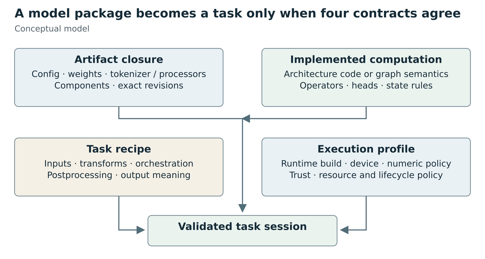

Figure 1. Artifact data, implemented computation, task semantics and an execution profile must agree. This is the book's proposed conceptual model, not an existing universal API.


# 2 From package to execution

## The loader as a small linker
A robust loader is best understood as a linker and validator. It resolves an identity, checks what implementation is available, binds named data to a computation, and produces an executable object with a known interface. It should proceed in explicit stages.

1. Resolve the selected artifact and its immutable component closure
2. Inspect non-executable metadata and identify candidate package conventions
3. Parse configuration according to a recognized schema version
4. Resolve the architecture or graph implementation and task-specific head
5. Validate required tensor names, shapes, layouts, dtypes, shards and aliases
6. Resolve preprocessing, decoding and semantic output interpretation
7. Evaluate trust, license, dependency and runtime constraints
8. Construct a loading plan that records transformations and selected implementations
9. Load under a resource and cancellation policy
10. Validate the executable session and return a task-bound handle

Some libraries interleave these steps for convenience. A Pantograph adapter does not need to reproduce their internals, but its public diagnostics should preserve the distinctions. A missing tokenizer, unknown architecture, unsupported quantized kernel and untrusted custom processor are different failures with different remedies.

The linker analogy also explains why names cannot be treated as proofs. A symbol can be declared yet unavailable. A backend can know a model family yet lack one task head. An operator can exist on CPU but not on a selected device. A weight file can be readable yet fail binding. The completed loading plan is a more useful artifact than a boolean returned from filename inspection.

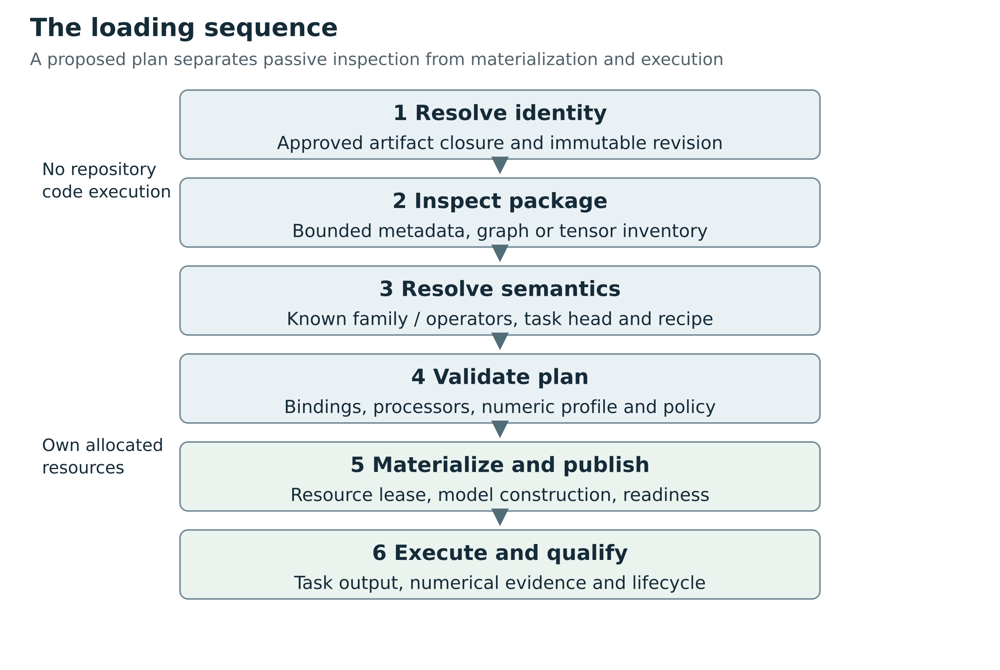

Figure 2. Inspection and planning establish a bounded executable recipe before materialization and publication. A successful load remains distinct from numerical and task qualification.

## Recognition should accumulate evidence

A resolver should begin with hypotheses rather than a single guessed label. A package containing config.json, tokenizer assets and model.safetensors is consistent with a Transformers convention, but these filenames do not establish a task or a trustworthy architecture. A repository can contain several model variants, an encoder and a decoder, training checkpoints and export artifacts. It can include a config written for a base model while an additional module manifest defines the actual product.

Keep an evidence record with the origin of each fact. The source may be a signed or otherwise trusted catalog assertion, a parsed configuration field, a graph input signature, a tensor inventory or a user-selected task. Confidence is not a substitute for a rule. When a known registry maps a configuration to an implementation, record that mapping and its version. When only a filename suggests a family, record weak evidence and ask for a stronger source or report ambiguity.

Evidence can conflict. Suppose the package metadata says sequence classification, the requested task is dense embedding, and the tensor inventory includes a classification projection. These facts do not require rejecting the entire package forever. They require rejecting the proposed execution binding until an explicit embedding recipe and appropriate executable output are identified. A base encoder might be usable, but ignoring the trained head is a task change that belongs in the plan rather than a silent recovery.

This approach also separates catalog quality from runtime quality. An excellent backend should reject misleading metadata when the tensor or configuration evidence contradicts it. An incomplete catalog should not permanently prevent a backend from using stronger verified package facts. The resolver's task is to reconcile authorized evidence, not to declare one metadata field infallible.

## A traced example from bytes to an embedding session

Consider an illustrative package with an encoder configuration, two safetensors shards, a tokenizer, special-token settings and a module recipe that specifies masked mean pooling followed by normalization. The requested task is document embedding with an explicit maximum input length. The example is hypothetical and asserts no measured checkpoint support.

First, resolve the selected package revision and its complete dependency closure. The closure includes the tokenizer and module recipe because changing either can change the final embedding. Read the index and headers without executing repository code. Verify that every referenced shard remains within the approved root, each indexed tensor is present in its declared shard, duplicate keys obey a strict policy, and the total declared storage is within the inspection budget.

Second, select a known encoder configuration schema. Validate semantic fields, not only required dimensions. If the package asks for an unsupported positional-embedding branch, stop before device allocation. Check the intended head. In this example the adapter needs the encoder output; it must not accidentally construct a masked-language-model head and pool vocabulary logits.

Third, resolve the task recipe. Confirm that the tokenizer implementation, added tokens, padding side, truncation, prompt policy, mask interpretation, pooling denominator and normalization are all supported. The plan should say what happens to an empty input or a batch item whose effective mask has no valid positions. A divide-by-zero guard chosen by the wrapper is a semantic policy, not a neutral numerical patch.

Fourth, bind tensors. Build the required inventory from the family constructor or a maintained parameter specification. Resolve permitted prefixes and tied aliases. A transpose is accepted only if a named family rule requires it. A missing learned matrix is a hard error. Extra tensors are reported and either accepted under an explicit optional-head rule or rejected as evidence of the wrong package selection.

Fifth, admit the execution profile. Select the runtime build, CPU or accelerator, compute dtype and qualified shape envelope. The scheduler checks the resource lease against the plan's declared needs. The loader may discover that actual requirements exceed the estimate; it must fail or request renewed admission rather than silently consuming unaccounted resources.

Finally, construct the executable and bind its task contract to a session. A readiness probe can show that the object accepts a representative input, but it does not create reference qualification. The session should carry both the plan identity and the evidence level already established. When a request executes, its result identifies the effective recipe and representation. Downstream retrieval can reject vectors from a different embedding space instead of mixing them into an existing index.

## The graph route changes the middle of the sequence

For a graph artifact, family selection may be unnecessary. The resolver still identifies artifacts and task semantics, then validates graph inputs, outputs, operator domains and versions. Graph compilation and provider partitioning replace much of named-family construction. Export provenance becomes a dependency because it explains how the original model was represented and which dynamic shapes or control-flow cases were retained.

The outer sequence survives. A graph classifier still needs label order and image preprocessing. A graph forecast still needs time and scaling semantics. A graph with a custom operation still needs an implementation for that operation. Common loading interfaces should accommodate this different middle without pretending that a graph is merely another model_type string.
## Separate artifact discovery from parameter materialization
A robust native loader should produce a reviewable plan before allocating the model on a device. This is a proposed Pantograph-level design, not a claim about an existing Candle API:

```text
package identity and immutable revision
    -> bounded artifact inventory
    -> task and family candidate resolution
    -> configuration and tensor-schema validation
    -> processor / head / postprocessor recipe
    -> device, dtype, quantization and resource plan
    -> model construction
    -> readiness probe
    -> qualified task execution
```

Each arrow should either add evidence or produce a structured rejection. Successful safetensors deserialization is only evidence for one early stage. Model construction is stronger, but still does not prove numerical or task compatibility.

An artifact inventory should record named files and roles, byte sizes, digests, safetensors headers, shard-index mappings, tensor shapes and stored dtypes, tokenizer and processor assets, and the configuration revision. Path containment and resource budgets belong here. The inventory should not evaluate repository Python or treat configuration strings as commands. Record derivations and defaults: for example, “output projection uses tied embedding weights because the supported family configuration explicitly enables tying,” rather than silently filling a missing matrix.

Candle already supplies important building blocks. `MmapedSafetensors::multi` maps multiple files and builds a name-to-file lookup; the examples have shared helpers for reading a Hugging Face safetensors index and finding the shard filenames. But the first is a tensor source and the second is a convenience helper. Neither is by itself a full package-integrity validator. The local index helper joins the filenames it finds to a path, and the multi-file loader documents that the last entry wins when tensor names repeat across files. A hardened package loader should validate path containment, duplicate-name policy, the full index-to-header relationship, and deterministic ordering before using them. [R066](#ref-066) [R067](#ref-067).

This is a subtle but concrete maintenance opportunity. A model library does not necessarily want to change a documented permissive “last wins” behavior used by existing consumers. An opt-in strict loader or inventory validator can add better application safety without breaking that behavior. Its errors should name the tensor, competing shard files, expected owner from the index, and selected policy. That is more useful than a generic “model failed to load” message.

Preflight validation can also reduce waste. If the missing tensor is in the final layer, detecting it after copying most weights to a GPU is expensive and complicates cleanup. Header-based validation can often detect a missing parameter or wrong shape before materialization. It cannot prove kernel support or numerical equivalence, so those remain later gates.

## Normalize naming conservatively, and audit every transformation
A tensor-name adapter can safely bridge equivalent export conventions when the relationship is understood. Useful transformations include a known root prefix, a documented alias, or an explicit fused-to-separate projection transform. Their risks differ. Renaming is a key mapping; splitting QKV tensors requires the correct packing order and dimensions; transposing requires knowing the source convention. An adapter should record the transformation and its version, detect collisions, validate both source and destination shapes, and refuse ambiguous alternatives.

Do not implement a generic “keep trying replacements until the shapes fit.” Several tensors can share the same shape while playing different roles. A transposed square matrix has the same shape as the original. Query and key normalization can have identical vector dimensions. Shape matching is a necessary structural check, not a semantic proof.

A real upstream change illustrates why small compatibility fixes still need cross-use-case tests. The inspected September commit fixes a LayerNorm tensor-lookup regression: aliases for `weight/gamma` and `bias/beta` must coexist with initialization through a fresh `VarMap`, while non-affine normalization must not require a bias. Its tests exercise RMS normalization from `VarMap`, LayerNorm from `VarMap`, and gamma/beta aliases. Improving compatibility for one exported BERT convention had affected another legitimate construction path. The lesson is to test both pretrained loading and initializer-backed construction when modifying shared parameter utilities. [R041](#ref-041) [R068](#ref-068).

The inspected Llama loader uses `unwrap()` while collecting block loads, permitting a panic on a returned block-loading error. This is source inspection, not a reproduced failure. [R047](#ref-047)

A small regression test and ordinary error propagation are plausible upstream improvements. An outer `Result` return type alone cannot establish that every nested operation is non-panicking.


# 3 A compatibility calculus

## A compatibility relation rather than a support label
Define a proposed execution case as a tuple C = (A, T, Q, B, R, D, E, P), where A is the immutable artifact closure, T the task contract, Q the requested options and input envelope, B the adapter build, R the runtime and dependency versions, D the device and driver profile, E the execution policy, and P the preprocessing/postprocessing implementation revisions.

Compatibility is a relation over C. It requires several predicates to hold together:

- The artifact is readable and its provenance and trust policy are admissible
- The architecture or graph semantics are implemented for this configuration
- Tensor bindings and quantization representation are correct
- Every required operator is supported for the dtype, shape and target device
- The task head and semantic input/output contract match the request
- Preprocessing and postprocessing preserve the intended task semantics
- Requested generation, batching, streaming, state and cancellation features are implemented
- Runtime and dependency versions fall inside a qualified envelope

Resource admission is a further predicate at dispatch time. A compatible model can be temporarily inadmissible because memory is unavailable. Conversely, ample memory cannot make an unsupported architecture correct. Scheduler ranking should compare only eligible cases, after compatibility and policy have been established.

Do not model unknown as supported. A three-state static check; supported, unsupported, unknown; is a useful start. A more expressive evidence model also distinguishes uninspected, structurally valid, load-validated, reference-qualified and deployment-qualified. These are evidence claims with scope, not permanent badges. A new tokenizer revision, driver, kernel implementation or configuration field can invalidate a previous qualification.


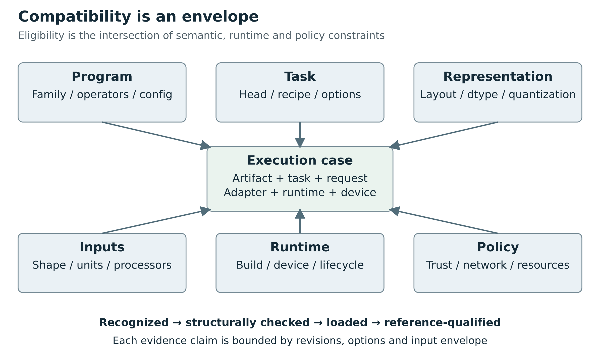

Figure 3. Every support claim is about a bounded artifact, task, implementation, numeric, device and policy combination. Evidence is scoped to that combination and its revisions.

## What a support matrix must record
A defensible matrix row names a bounded family envelope rather than claiming a whole ecosystem. At minimum it records architecture and relevant config variants; task/head; artifact and tensor layout; dtype and quantization scheme; preprocessing and postprocessing; requested options; streaming and state behavior; device and execution provider; runtime/adapter versions; trust policy; license constraints; and qualification evidence.

For example, “BERT supported” omits whether the adapter accepts token-type IDs, which pooling recipe it uses, whether the checkpoint contains a classification head, which maximum length is enforced, whether outputs are normalized and which device is qualified. “Safetensors supported” answers only the serialization part of that row. “CUDA supported” answers neither which operators work nor whether the installed build includes them.

The result should be queryable. The user should be able to ask why one backend is eligible and another is not. The answer should list bounded missing capabilities and the evidence that established them, rather than expose an opaque global compatibility score.

## Reuse without false universality
Per-family adapters are the best default amortization unit. A validated family adapter can accept many checkpoints whose configuration and tensor layouts fall within its declared envelope. A generic tokenizer loader, shard reader, tensor mapper, preprocessing primitive library and task runner can be reused across these adapters. A new checkpoint within the envelope may require no code change, only qualification evidence. A new semantic architecture branch may require code.

The distinction is between parameter variability and program variability. Changing weights or vocabulary inside a supported family is parameter variability. Introducing a new operator, a different state update, a custom routing mechanism or a new interpretation of inputs is program variability. A maintenance strategy that treats program variability as unvalidated metadata merely moves engineering cost into production failures.

This book therefore recommends maximizing reusable substrate while making unsupported semantics visible. The honest ambition is broad, steadily growing compatibility with bounded per-family work. No finite registry, safe tensor format or Rust trait can guarantee arbitrary future model compatibility without implementing or executing the missing computation.
## Compatibility is conjunctive and evidence is incremental

A useful mental model is a set of admissible execution cases. Each adapter defines constraints; each artifact, request and environment supplies facts. Eligibility is the intersection of all required constraints. The system should produce the reasons for an empty intersection, not collapse them into a mysterious confidence score.

For example, a family adapter might admit absolute positional embeddings, a bounded token length, dense F32 weights and two pooling modes. A CPU build might implement the required operations for those shapes. A package that satisfies these conditions is structurally admissible. If the selected device lacks a required operation, the same family remains recognizable but that execution case is ineligible. If the task recipe requests a third pooling mode, changing devices will not repair it.

This distinction matters for scheduling. The scheduler may choose among compatible and policy-admissible cases using latency, memory or affinity. It should not convert an unsupported case into a supported one because its score is cheaper. Unknown cases can be offered for explicit qualification, but they should not be ranked as if absence of evidence were success.

Evidence has dependencies. A tokenizer golden depends on tokenizer bytes and the tokenizer implementation. A binding audit depends on the artifact inventory and tensor-mapping rule. A cached-logit comparison depends on the family implementation and cache procedure. A provider qualification depends on the runtime build, device profile and shape envelope. Recording these dependencies makes invalidation precise: a label-name change may not invalidate the encoder numerics, but it invalidates an application-level classification result contract.

## Constraint failures should be useful to a developer

A rejection should identify the smallest supported explanation without overstating certainty. “Unsupported model” is too broad when the actual gap is one task head. “Requires CUDA” is misleading if the CPU implementation exists but was not compiled. “Bad weights” is unfair when the package uses a known layout the selected adapter has not implemented.

Prefer diagnostics such as “this native family adapter supports absolute positions; the configuration requests relative-key attention,” or “the task requires normalized dense embeddings; the loaded recipe produces unnormalized token vectors.” A failed tensor check should name the expected role, actual tensor and rule that established the expectation. These explanations map directly to extension work, artifact correction or a different qualified route.

The assessment should distinguish unsupported from unqualified. Unsupported means the known implementation cannot express the required case. Unqualified means it may be expressible but the necessary evidence is absent. This distinction prevents a support program from advertising guesses while allowing deliberate experimentation to expand coverage.

## Closed world execution with open world discovery

Model discovery is open ended: new repositories, configurations and task types will continue to appear. Execution should be closed over the implementations and policies the current build actually admits. This is not a contradiction. The catalog may retain unknown metadata and display the existence of an unfamiliar model. The execution planner refuses to invent semantics for it.

An extensible registry is the bridge. New native family code, an admitted graph operator implementation or a reviewed Python environment can add executable semantics. The registry then publishes a new envelope and runs qualification. This creates a controlled path from unknown to experimental to qualified without forcing discovery to understand all future code in advance.


# Part II How existing ecosystems work


# 4 Transformers automatic classes under the hood

## What Transformers gets right
The strongest argument for following Transformers conventions is practical reuse. The ecosystem provides shared packaging, download and revision handling, configuration classes, task-specific model factories, standardized pretrained loading, tokenizer/processor factories and generation utilities. This reduces the number of bespoke integration paths an application must own. The Auto-class approach is not limited to large language models: the inspected task mappings include image classification, object detection, segmentation, depth estimation, audio classification, CTC, speech sequence-to-sequence, keypoints, time series and other tasks [R007](#ref-007).

There is an important boundary to this success. The automatic factory selects an implementation from maintained mappings. It does not derive a computation from arbitrary weights. A custom model can join the interface by registering configuration and model classes or by distributing executable code. Both mechanisms supply the missing implementation; neither makes a different runtime automatically understand it.

Pantograph should therefore preserve the conventions that provide leverage, especially artifact metadata and known task naming. It should not copy one library's complete object hierarchy into its host API or assume that matching `from_pretrained` signatures makes backends semantically interchangeable.

## Pinning matters before describing behavior
The inspected Pantograph requirements specify `transformers>=4.52,<4.54`. That is a range, not a lock to an exact installed build. For a concrete in-range comparison this research inspected Transformers v4.53.3 at a5923d4de7df2fbd1f373dfcfe983216b79b6937. It separately inspected upstream main at 35924ec379eec682bbdca219886e16eff4df8b09, observed on 2026-10-02. Upstream main describes that source snapshot, not the version executing inside Pantograph [R008](#ref-008) [R009](#ref-009) [R010](#ref-010).

A useful example of drift appears in AutoConfig. Version 4.53.3 falls back to model-name pattern matching when `model_type` is missing. The inspected 2026 implementation instead ends with an error requiring `model_type`. Its docstring still mentions the earlier fallback. Describing the implementation rather than repeating its prose documentation avoids a subtle but material error. The newer implementation also contains a narrow Mistral-to-Ministral heuristic based on `layer_types`. That is curated compatibility knowledge in code, not evidence that arbitrary new variants are inferred automatically [R009](#ref-009) [R010](#ref-010).

A production adapter should pin and qualify an actual resolved environment. Dependency ranges, runtime discovery and documentation versions should not be treated as equivalent evidence.

## AutoConfig chooses a configuration class
At a high level, AutoConfig reads configuration metadata, checks whether an `auto_map` entry supplies an AutoConfig implementation, and checks whether a known `model_type` maps to an installed configuration class. With an admitted remote-code route, it resolves a class from a dynamic module. With a recognized built-in type, it instantiates the mapped configuration class from the parsed dictionary. Unrecognized types fail [R009](#ref-009) [R010](#ref-010).

The configuration object is a typed parameterization of an implementation. A field named `model_type` is not a portable executable opcode. For a native backend, it is evidence that can choose a Rust family adapter. That adapter still must validate which fields and variants it implements.

Configuration loading itself may execute code when custom AutoConfig is allowed. A host that wants read-only package inspection should parse the relevant JSON directly under size, path and duplicate-key limits. Calling a convenience Auto loader is not equivalent to passive metadata inspection.

## AutoModel dispatch depends on the requested task
An AutoModel task factory maps configuration classes to supported model classes. When several alternatives exist, `_get_model_class` uses a matching `architectures` entry or defaults to the first mapped class. It does not import an arbitrary class named by that field. [R011](#ref-011) [R012](#ref-012).

This has three consequences.

First, architecture evidence is contextual. A listed class name does not override all task semantics. Second, recognizing the configuration type is insufficient if the selected Auto class has no mapping for it. Third, reusing a base model without its intended head is not the same task. Hidden states from a base transformer are not automatically sentence embeddings or classification probabilities.

Current upstream mappings make the breadth explicit. There are separate mappings for sequence classification, token classification, multiple choice, CTC, speech seq2seq, image classification, object detection, depth, time-series prediction and many others. Pantograph can borrow this task-aware dispatch principle without adopting every Auto class as a permanent public API type [R007](#ref-007).


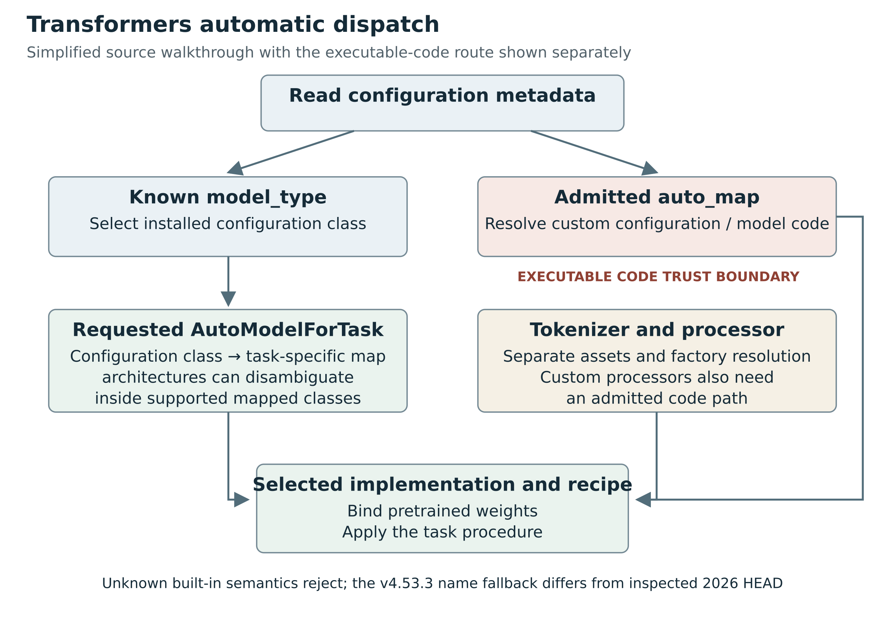

Figure 4. Built-in dispatch selects among implemented configuration and task-model mappings. Custom-code dispatch crosses a separate trust boundary. The inspected v4.53.3 name fallback differs from the inspected 2026 source.

## from_config and from_pretrained do different work
Constructing a model from a configuration establishes architecture structure but does not load pretrained weights. Loading a pretrained model then resolves checkpoint files or shards, chooses appropriate loading behavior, binds parameters, handles dtype and quantization integrations, deals with tied parameters and reports missing, unexpected or mismatched keys [R011](#ref-011) [R013](#ref-013).

These layers should remain distinguishable in compatibility reports. A successful configuration parse proves less than successful construction. A successful construction proves less than complete checkpoint binding. A successful binding proves less than correct preprocessing and task output.

The generic pretrained loader intentionally supports workflows broader than strictly reproducing an inference checkpoint. For example, model adaptation can legitimately initialize a new task head. A production inference adapter should apply a stricter policy when the request is to reproduce a supplied pretrained task: unexpected missing required weights should fail or produce an explicit non-qualified result. A permissive library feature should not silently become the application's compatibility policy.

Tensor aliases and transformations require similar discipline. A documented renaming or transpose can be legitimate. A fused query/key/value layout may require a specific split or permutation. A matching shape is not enough to validate an arbitrary transformation. Each transformation should have a named rule, an applicable family/config envelope and independent golden tests.

## Tokenizers are part of the model function
AutoTokenizer has its own dispatch and configuration path. Tokenizer class information, configuration mapping, tokenizer assets and optional custom code determine the implementation. A tokenizer JSON is useful for native Rust reuse, but the complete application contract may also require added tokens, special token IDs, normalization, padding/truncation choices and chat templates [R014](#ref-014).

The semantic function for text is not simply model(tokens). It is decode(model(encode(text, options), generation state), output options). Every stage can alter results. Unicode normalization and whitespace can change token IDs. A missing beginning-of-sequence token can change an entire completion. Different left/right padding can affect a model that pools the last meaningful token. Special image/audio tokens can participate in a multimodal alignment protocol.

Chat formatting belongs in a task recipe with a versioned template. A text-generation backend can implement the neural network perfectly while using the wrong role delimiters, end-of-turn markers or assistant prefix. Tool calling adds another layer: the model's prompt convention, schema rendering, output grammar/parser and validation semantics must agree. The existence of a `tools` JSON field in a transport is not proof that a checkpoint can use it correctly.

Native tokenizer reuse is therefore high-value work, but it should be accompanied by fixtures of exact token IDs and templates, including multilingual text, added tokens, empty inputs, padding and truncation boundaries.

## Processors are not merely tokenizers with another name
The inspected AutoProcessor implementation searches processor, image/preprocessor, video, tokenizer and model configuration information and can fall back to specific Auto factories. This shows the convenience of the convention, but also its complexity: processors can combine multiple modalities and implementation classes [R015](#ref-015).

An image processor may resize, crop, pad, rescale values, normalize channels and construct masks. An audio feature extractor may enforce sampling rate, choose channel handling, compute time-frequency features and pad chunks. A multimodal processor can align text spans with image patches or audio segments. These transforms affect the model's mathematical input and must travel with its compatibility evidence.

A generic host should not independently choose preprocessing merely because it sees an image or audio MIME type. The request contract should supply semantically described raw data; the task recipe should select the package's qualified preprocessing. When callers intentionally provide tensors, the tensor contract must identify the preprocessing already applied so the backend does not apply it twice.

## Generation is an algorithm around a model
Generation configuration controls a procedure, not simply a single forward pass. Sampling, beam search, stopping rules, cache use, output scores and special token behavior interact with model and runtime implementation. Some architectures override or extend generation. Non-text models can also generate sequences, so `generate` alone does not imply text semantics [R016](#ref-016).

A common host contract should normalize a useful subset of generation options, record precedence among model defaults and request options, and reject unsupported options explicitly. It should preserve namespaced backend extensions only when their schema and applicability are known. Silently dropping beam count or stop rules can change a task's meaning.

The strongest reproducibility claim is also bounded. A seed does not guarantee identical output across different kernels, devices, quantization schemes or floating-point reduction orders. Qualification should compare deterministic intermediate outputs where possible and use task-appropriate stochastic criteria where necessary.

## Custom code extends reach and changes the trust problem
Transformers' registration API lets an installed implementation bind a new configuration class and task model. Distribution through `auto_map` can instead load model or configuration code from a repository. Official guidance warns that trusting remote code executes that code locally; the inspected factory explicitly routes through dynamic module loading [R011](#ref-011) [R017](#ref-017) [R018](#ref-018).

This is why Transformers can be broadly extensible with less application-specific architecture code: the model author or ecosystem supplies Python implementations. A Rust-native backend cannot consume that arbitrary Python merely by reading its configuration. Its choices are to implement the family natively, execute an admitted graph export, or retain a separately governed Python route.

The phrase `local_files_only` should not be confused with sandboxing. It controls retrieval behavior, not the power of local code already present. Safe tensor deserialization likewise does not make a custom configuration class, processor or generation method safe. Code trust must cover the entire executable dependency closure, including code revisions that may live in another repository.

## Walk the registry rather than trusting the Auto name

The automatic API can be understood as three selections. The first selects a configuration class. The second selects a task-specific model class for that configuration. The third delegates construction and checkpoint loading to the selected class. The shared API hides these selections from ordinary users; it does not eliminate them.

`_LazyAutoMapping` connects configuration types to the task mapping, importing installed family modules on demand. Extra registered entries can extend the mapping. The selected class still supplies construction and execution semantics. [R011](#ref-011)

Lazy import reduces initialization work; it does not synthesize an architecture from a tensor header.

The following conceptual trace is explanatory pseudocode. It omits the actual factory's numerous compatibility and download details:

```text
configuration evidence
    -> known configuration class
requested task factory + configuration class
    -> installed task mapping
mapped alternatives + applicable architectures evidence
    -> selected implementation class
selected implementation + configuration + checkpoint
    -> constructed module tree with bound parameters
processor assets + task procedure
    -> application-level result
```

This trace answers an important design question: where is the per-model work? The reusable factory and file loader are common infrastructure. The family-specific module class owns the mathematical structure. The task mapping chooses a class with the appropriate head. The model author can publish many compatible checkpoints without modifying the factory, because dimensions and numerical values are data. A novel block still needs a maintained implementation somewhere in the registry or an admitted custom-code path.

Changing the requested task changes the second selection even when the configuration is unchanged. Asking for a base encoder, a classifier or a causal model is not just changing the desired output label on one object. The selected class may create different learned parameters and return different structured values. This is the reason a backend cannot derive the intended task from the presence of attention layers alone.

## Composite configurations expose the hidden decisions

The current factory can select a composite configuration's text subconfiguration and retain parent quantization settings. A source comment leaves some prefix-sensitive quantization validation unresolved. This is a source observation, not a reproduced defect. [R011](#ref-011)

Composite loading therefore contains curated interpretation rules beyond dictionary parsing.

Consider an illustrative multimodal package with a vision encoder, a text decoder and a projection between them. The text decoder's dimensions might be nested inside a parent configuration. If a caller intentionally requests a text-only task from a supported submodel, the runtime needs a rule for which configuration, tensor prefixes, tokenizer assets and quantization exclusions belong to that submodel. Taking the parent dictionary unchanged can be wrong; discarding the parent indiscriminately can also lose required behavior. A component-aware resolver has to preserve these relationships.

A generic native interface should learn from this mechanism rather than copy all its heuristics into the host. Let the runtime adapter own the known composition rules, record which rules it applied, and qualify the result. That is reuse of existing semantic knowledge. A second independent host implementation of every upstream exception would create the maintenance burden the common interface was meant to avoid.


# 5 Pipelines and compositions

## Diffusers loads a component system
Diffusers' generic pipeline configuration is `model_index.json`. Its loader resolves a pipeline class, derives expected components from the class signature, iterates declared component library/class pairs, loads or accepts each component, checks missing modules and constructs the pipeline. It supports component-specific placement and dtype decisions within the implementation's constraints [R004](#ref-004).

The manifest is a component registry description. The pipeline class still supplies the execution procedure. The denoising loop, conditioning scheme, guidance behavior, scheduler interaction, latent scaling, VAE decoding and output processing are not fully specified by listing components. A scheduler is an algorithmic component with parameters and state, not just another tensor file.

This provides a strong design lesson for Pantograph. A common component mechanism can support many diffusion families without one monolithic loader. However, the task adapter must validate the compatibility of the component combination and the pipeline procedure. Replacing a UNet with a transformer denoiser, adding a second text encoder, introducing image conditioning or switching to audio/video changes more than the set of filenames.

The current Pantograph diffusion path makes an intentionally narrower promise than upstream Diffusers. It admits only built-in StableDiffusionPipeline bundles, checks a closed component list, rejects custom code mappings, restricts weights to safetensors, and requires the installed Diffusers version to equal 0.37.0. A broad “Diffusers compatible” label would hide these real restrictions [R019](#ref-019).

## Sentence-transformers exposes why the head and composition matter
In the inspected sentence-transformers snapshot, model loading reads `modules.json`, resolves module types, loads the modules in order and preserves per-module configuration. Pooling supports multiple modes, including mean, maximum, CLS, weighted mean and last-token forms, and it can exclude prompt tokens. Prompts, projection, normalization and routing can all participate in the final embedding contract [R005](#ref-005) [R006](#ref-006) [R020](#ref-020).

Consequently, loading a BERT encoder and averaging all positions is not a generic sentence-transformers implementation. Attention masks, prompt exclusion, pooling mode, projection and normalization must match the saved recipe. Two adapters can return vectors of equal length while producing incompatible embedding spaces. That can silently corrupt retrieval when stored vectors were created with another recipe.

The inspected Transformer wrapper can select torch, ONNX or OpenVINO backends. This is useful evidence for layered design: a stable high-level embedding recipe can delegate an internal encoder to another execution substrate. It does not prove that every module in an arbitrary composed model is exportable or natively implemented [R020](#ref-020).

Retrieval also requires typed distinctions. A dense sentence vector, sparse vocabulary-weight vector and multi-vector late-interaction representation are different output contracts. Cross-encoder reranking consumes query-document pairs and emits joint scores rather than independent reusable vectors. Their adapters should share infrastructure where appropriate but expose the correct semantics.

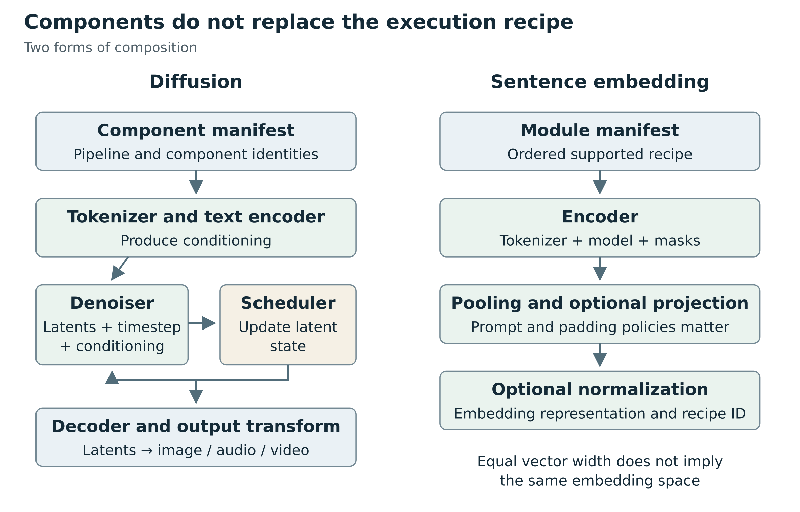

Figure 5. Diffusion requires an iterative procedure around components. Sentence embedding requires an ordered recipe whose pooling, prompts and normalization retain semantic meaning.

## A component manifest is a bill of materials

A manifest can tell a loader which components to obtain, but a bill of materials is not an assembly procedure. Components also need typed connections and an execution schedule. A text encoder produces a conditioning representation; a denoiser consumes that representation together with latents and a timestep; a scheduler transforms the latent state using the prediction. Matching tensor widths is necessary, yet it does not establish the intended prediction convention or scaling.

A proposed composition contract should therefore distinguish component identity, port signature, connection semantics and orchestration recipe. Component identity names the exact artifacts and implementation family. A port signature describes representation and shape relations. Connection semantics describe transformations such as normalization, concatenation or projection. The orchestration recipe defines order, iteration, stopping and state.

Composition makes reuse possible only when these interfaces are stable. Swapping an encoder for another with equal output width is not automatically valid because the learned representation may have a different meaning. An adapter or bridge trained for one representation is itself a model dependency. Record it in the artifact closure and qualify the combination.

## Planning a composed task

Resolve the full dependency graph before loading. Detect cycles unless the recipe explicitly defines them as execution-time recurrence. Distinguish a dependency cycle from an intended denoising loop: the model's files need not recursively depend on themselves just because its runtime procedure iterates.

Check each connection with a semantic signature. In a hypothetical image-generation plan, verify that the text-conditioning layout matches the denoiser, the latent channels match the decoder, and the scheduler's prediction interpretation matches the denoiser's training convention. Record effective guidance and schedule options. The plan can then produce a component placement map rather than a single vague device string.

Placement introduces additional compatibility conditions. Different components can live on different devices, but intermediate transfers require supported representations, synchronization and sufficient temporary memory. A scheduler running on the host may be cheap or expensive depending on its operations and the transfers around it. The book makes no speed claim for a placement strategy; it requires the strategy to be visible and testable.

Qualification can reuse component fixtures, but full-pipeline fixtures remain necessary. Correct components connected in the wrong order are an incorrect pipeline. Compare intermediate boundaries so that a changed output can be traced to conditioning, denoising, scheduling, decoding or result formatting. A final image or vector alone rarely identifies the source of disagreement.

## Reuse without forcing a single graph language

The host does not need to invent a universal graph language merely to represent these dependencies. A bounded collection of registered task recipes can describe useful compositions and expose their component signatures. A graph runtime may execute one component or the entire neural graph. A Python pipeline may retain orchestration inside its trusted implementation. A native recipe may orchestrate known Candle components directly.

The common contract should reveal enough identity, capability and lifecycle information for correct routing and observation while leaving implementation details behind the adapter. If a future requirement genuinely needs arbitrary operator-level composition, treat that as an interpreter/compiler project with its own scope. Do not smuggle it into an untyped metadata field and assume the maintenance problem has disappeared.


# 6 Candle as a native runtime foundation


The central recommendation is to use Candle as a maintained native implementation layer beneath a task-aware compatibility system. Reuse family implementations across checkpoints; reuse artifact handling and task processing across families. Do not promise that a filename, Hugging Face configuration, or deserializable tensor collection can create previously unknown inference semantics.

Two snapshots must remain distinct throughout this chapter. The inspected upstream Candle commit is `5ba5d5b468b5b1df40e82dd3d556987bedeea041`, dated 28 September 2026, with workspace version `0.11.0`. Pantograph's inspected lockfile resolves Candle to `88ed7911de9e88196b1f55b199145d22647f415e`, dated 23 January 2026, version `0.9.2-alpha.2`. Its manifest requests `branch = "main"`, but that declaration does not turn its existing lockfile into September's implementation. A dependency update must be an explicit requalification event. [R041](#ref-041) [R042](#ref-042) [R022](#ref-022).

## A framework, a model library, and application examples
Candle's repository contains several different layers. `candle-core` supplies tensors, devices, storage, operations, safetensors loading, and quantized tensor representations. `candle-nn` supplies neural-network components and parameter builders. `candle-transformers` supplies family implementations and utilities. `candle-examples` supplies much of the demonstrated application behavior: downloading assets, selecting a model profile, preparing inputs, decoding outputs, and running generation loops. CUDA and Metal kernel crates sit below those abstractions. There is also a separate `candle-onnx` evaluator. Treating this entire stack as a single model loader hides the places where application integration must still do work. [R043](#ref-043) [R044](#ref-044).

The model module is a list of explicit Rust module declarations. At the inspected upstream commit it has 124 `pub mod` declarations; the consumed January snapshot has 120. These counts are neither distinct architecture counts nor qualified task counts: quantized variants, helpers, and related implementations appear separately. The four added declarations in the compared file are `gemma4`, `lfm2`, `nomic_bert`, and `rwkv_v7`. This comparison establishes a version difference, not that the remaining implementations are unchanged. [R045](#ref-045) [R046](#ref-046).

Those declarations reveal much broader scope than chat:

| Area | Examples of declared native implementations | What this evidence establishes |
|---|---|---|
| Autoregressive language | Llama, Qwen2/3, Mistral, Mixtral, Gemma, Phi, DeepSeek2 | There are explicit family modules, with different configurations and execution details |
| Recurrent/state-space language | Mamba/Mamba2, RWKV v5/v6/v7, RecurrentGemma | A common task can require different persistent-state semantics |
| Encoders and embeddings | BERT, DistilBERT, ModernBERT, Jina BERT, Nomic BERT, Stella, NVEmbed | Encoder availability does not define a complete sentence-embedding recipe |
| Vision | ViT, ResNet, DINOv2, ConvNeXt, SegFormer, Segment Anything | Heads, preprocessing, geometry, and result types differ |
| Multimodal | CLIP, BLIP, LLaVA, PaliGemma, Pixtral, Qwen3-VL, TrOCR | Submodel composition and modality placement are part of execution |
| Audio | Whisper, EnCodec, Mimi, DAC, SNAC, MetaVoice, Parler-TTS, Voxtral | Speech recognition, audio codecs, and synthesis are separate task families |
| Image generation | Stable Diffusion, Wuerstchen, Flux, MMDiT, Z-Image | Denoisers, encoders, schedules, and latent representations must be composed |

This is a declaration inventory. It does not certify every released checkpoint, every family option, every task head, every quantization, or every device. The walkthroughs below inspect representative implementations more closely. A production support table should say which of those stronger claims has actually been tested.

## Static Rust code does not mean static checkpoint dimensions
The sentence “Rust needs a model compiled in” is useful only if it is carefully qualified. The forward program and available implementation branches must exist in the executable or an explicitly supported interpreter/plugin mechanism. The checkpoint's numerical values do not. Neither do all model sizes: Candle models commonly deserialize a configuration and construct a runtime `Vec` of layers. Hidden dimensions, vocabulary size, number of attention heads, and layer count are often ordinary integers in that configuration.

`LlamaConfig` carries runtime dimensions and semantic options; construction loops over `num_hidden_layers` and retrieves named tensors through `VarBuilder`. [R047](#ref-047)

One compiled implementation can consequently cover compatible sizes and fine-tunes. Another set of weights inside the same semantic envelope should not require a new source branch.

Conversely, Rust's type system does not prove that an arbitrary configuration has valid attention-head divisibility, matches the tensor layout, or uses the intended activation. Candle tensors have runtime shapes. Operations return shape-related errors; a valid Rust binary can encounter invalid model data at runtime. This is different from a design in which every tensor dimension is encoded in a compile-time type.

The ordinary `VarBuilder` uses a boxed `SimpleBackend` trait object. [R048](#ref-048)

A downstream application can also dynamically select registered constructors or use a boxed task interface. These mechanisms choose existing implementations; they do not create unknown operator semantics. Python offers convenient dynamic imports, but its registries also need executable implementations.

A practical distinction follows:

- A new checkpoint of an existing supported family should usually be data and qualification work
- A known family with a new serialization convention may need a reusable tensor-name/layout adapter
- A new family variant with a different positional encoding, normalization, routing rule, or cache behavior requires semantic implementation work somewhere
- A truly new operation may require backend and kernel work in addition to a model adapter

The objective is to make the first two cases cheap, and make the last two explicit. Calling all four cases “load a model” guarantees confusing support promises.

## VarBuilder is the parameter seam, not an architecture generator
`VarBuilder` is especially valuable because model code can request a tensor by expected shape and logical name without owning file I/O. Prefix builders make paths such as `model.layers.7.self_attn.q_proj.weight` compositional. Existing backends cover tensor maps, safetensors, NPZ, PyTorch tensor files, zero initialization, and `VarMap` initialization. `from_backend` is explicitly intended for downstream custom backends. `rename` and `rename_f` allow name mapping without copying the whole model implementation. A separate sharded builder supports parameter slicing for tensor-parallel use cases. [R048](#ref-048).

That is already much of the mechanism needed to eliminate per-checkpoint forks. A BERT exporter that changes a prefix can often be handled at the parameter boundary. A family variant with different attention mathematics cannot. Renaming a tensor called `q_norm.weight` to an unrelated name does not implement the normalization operation that consumes it.

The ordinary safetensors backend retrieves a tensor, converts to the requested dtype, and checks the requested shape. `get_unchecked` intentionally omits the expected-shape check. The `contains_tensor` method tests an exact tensor key, not a namespace prefix: having `bert.embeddings.word_embeddings.weight` does not by itself make `contains_tensor("bert")` true. This distinction matters when designing automatic prefix discovery. Use actual keys or validated inventories rather than treating a dotted namespace like a directory. [R048](#ref-048).

The same loading API serves training initialization and inference. An inference validator must therefore be more restrictive than every possible `VarBuilder`. A random initializer or zero-producing backend is legitimate for constructing a trainable model; it is not evidence that a pretrained checkpoint supplied all required parameters. Missing tensors must fail closed for a qualified inference plan, except for narrowly documented derivations such as explicitly tied weights or nonlearned buffers.


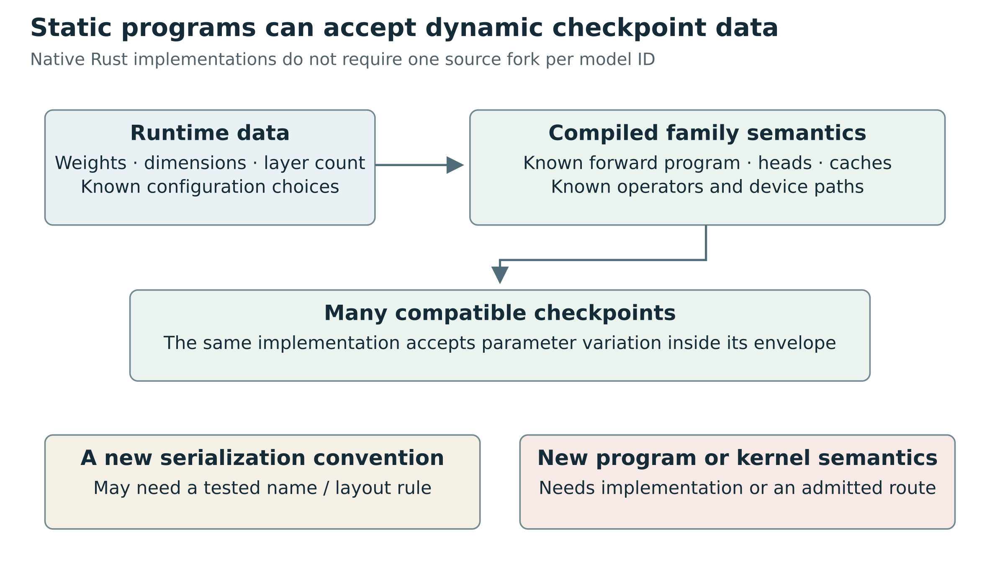

Figure 6. Configuration and weights can vary within compiled family semantics. Unsupported operators, state procedures or kernel requirements still need implementation.

## BERT: a tensor encoder is not yet a sentence-embedding product
The BERT configuration includes dimensions, activation, position limits, token-type vocabulary and normalization epsilon. Its positional enum exposes only `Absolute`; its activations include GELU, approximate GELU and ReLU. [R049](#ref-049)

A BERT family label therefore cannot stand in for validation of every semantic variant.

The loader constructs token, position, and token-type embeddings, followed by encoder layers. `BertModel::forward` accepts input IDs, token-type IDs, and an optional attention mask. It returns the sequence representation. If the caller omits the mask, the implementation creates an all-ones mask. The result is a token-level tensor, conventionally batch by sequence by hidden width. It is not automatically a pooled, normalized retrieval embedding. [R049](#ref-049).

The example makes the missing product semantics visible. It fetches a configuration, tokenizer, and weights, explicitly chooses BERT, tokenizes a batch, stacks token IDs and masks, calls the encoder, performs masked mean pooling, and optionally applies L2 normalization. There is also an option to include padding embeddings, retained to reproduce the example's older pooling behavior. That option changes semantics while leaving all weight shapes unchanged. [R050](#ref-050).

A reusable embedding adapter should consequently load a recipe, not attach “mean pooling” to every BERT checkpoint. That recipe needs an input prompt policy, truncation limit, special-token policy, padding side and mask semantics, pooling method, possible projection modules, normalization, and output dimension. Where a Sentence Transformers package specifies a module chain, the adapter should resolve a supported chain or route it to a maintained ecosystem runtime. A successful `BertModel::load` cannot establish compatibility with arbitrary custom Sentence Transformers modules.

The source separately defines `BertForMaskedLM` and its `bert` plus `cls` parameter groups. [R049](#ref-049)

The distinction between an encoder and a trained task head is fundamental. Masked-token prediction, sentence retrieval, classification and reranking interpret outputs differently. Sharing a backbone does not authorize attaching every task label to its raw tensor.

A qualification fixture should include sentences of unequal lengths. Run each sentence alone and in a padded batch and compare its final embedding within the declared numerical tolerance. Compare intermediate token IDs and masks exactly. A golden output for a single unpadded sentence would miss the important pooling and attention-mask bugs. Also test empty or special-token-only inputs under the product's explicit policy, truncation at the boundary, Unicode, and a query/document prompt distinction where applicable.

Pantograph currently stops before this task adapter. Its Candle resource object contains a device, requested dtype, tokenizer, and tensor map; the comments explicitly say it does not construct an executable model. The staged planner accepts embedding packages with BERT model-type evidence, but `start()` returns a startup failure. This is why importing upstream's BERT availability into Pantograph's executable support matrix would be wrong. [R029](#ref-029).

## A small BERT shape trace

The inspected Candle BERT source constructs embeddings, attention, intermediate and output blocks explicitly. Its encoder loops over a runtime number of layers. Within a block, query/key/value projections, head reshaping, scaled attention, masking, softmax, residual connections, normalization and the feed-forward activation are code. Tensor names and shapes parameterize that code. [R049](#ref-049)

A toy shape trace makes the boundary concrete. Suppose batch B is 2, sequence length S is 5, hidden width H is 12 and the supported configuration uses 3 attention heads. These numbers are explanatory, not a tested checkpoint. Token and token-type IDs begin with shape B by S. Their embedding lookups produce B by S by H values, to which the implemented positional representation is added. Attention projects the hidden states into query, key and value tensors and interprets H as three heads of width 4. The score tensor relates each of five query positions to each of five key positions within each head. The attention mask changes which relationships contribute.

After attention, the heads are recombined into hidden-width states. A projection, residual and normalization produce the attention-block output. The intermediate projection expands the last axis, applies the configured supported activation, then contracts it for another residual and normalization. Repeating the block changes the token representations without changing the meaning of the batch and sequence axes. The final base-model output is still a representation for each token.

Several compatibility failures follow directly from this trace. H must be consistent with the chosen head decomposition. A tokenizer vocabulary must index the supplied embedding table. An attention mask must correspond to the same token order and padding convention. The feed-forward matrix shape cannot tell the runtime which activation was used. A tensor inventory can reveal a missing projection, but it cannot prove that residual normalization was placed in the intended order.

This also explains why a base encoder is not yet a sentence embedding. Pooling selects or combines the sequence axis. Masked mean pooling needs the same validity mask and an explicit zero-valid-token policy. Projection can change the representation space. Normalization changes how downstream similarity is interpreted. The shape B by H is an output structure, not a proof of a particular retrieval recipe.

## Parameter builders and forward programs solve different problems

A parameter builder answers a model constructor's requests for named arrays. A forward program tells the runtime how to use those arrays. In an illustrative linear layer, the binding rule can specify the stored matrix shape and whether a known conversion transposes it. The forward rule still decides the multiplication convention, bias application and subsequent activation. Keeping these layers separate permits shared shard readers and name adapters without pretending they define every architecture.

This separation is the practical path to broad native compatibility. Reuse a verified block where mathematics matches; allow dimensions and weights to vary inside its configuration envelope; use explicit task recipes above it. If a new checkpoint changes only names, a tested loader rule may suffice. If it changes the attention normalization or state update, the forward program must change. The amount of code needed depends on semantic novelty rather than repository count.

## Llama and Qwen: close family resemblance is not interchangeability
Llama reads dimensions, grouped-query head counts, selected RoPE settings, EOS IDs and tied-embedding policy. It loads embeddings, blocks, final normalization and the output head; the tied case reuses the embedding tensor. [R047](#ref-047)

This makes compatible fine-tunes data substitutions. A different forward rule remains an implementation change.

Yet the implementation is a specific program. Its RoPE configuration recognizes the implemented default and Llama3 cases. Its feed-forward path explicitly computes a SiLU-gated product. Its attention projections have the implemented bias convention. An unfamiliar configuration option cannot safely be ignored merely because the dominant dimensions still deserialize. A schema validator must distinguish harmless descriptive metadata from fields that change the forward function.

Qwen3 demonstrates why a universal “decoder-only transformer” loader is more work than a name map. Its configuration includes an explicit head dimension and attention-bias flag. Its attention applies per-head query and key RMS normalization before RoPE. The constructor explicitly rejects `use_sliding_window = true`. A family-level claim of Qwen3 support therefore needs at least that configuration constraint; declaring every Qwen3 checkpoint supported would overstate the inspected source. [R051](#ref-051).

This is not an argument against abstraction. It identifies the right abstraction: a finite family descriptor with explicit attention layout, positional encoding, normalization, activation, cache, and head semantics. Such a descriptor is only useful when each selectable behavior corresponds to implemented and tested code. A string field saying `rope_type = new_method` is not an implementation of the new method.

Generation is another layer above forward execution. Llama's model returns last-position logits and uses a cache passed through its forward call. The example owns tokenization, prefill versus one-token decode, repetition penalty, sampling, EOS termination, and streaming detokenization. The shared generation module implements several sampling strategies; it is not a drop-in implementation of every Transformers `generate` feature. [R047](#ref-047) [R052](#ref-052) [R053](#ref-053).

Chat formatting should be an explicit processor step. Current upstream even has a reusable example helper for reading chat templates from tokenizer configuration and applying them with MiniJinja. That is a stronger starting point than hand-writing a prompt string for every checkpoint, but it is not evidence that every multimodal template, tool-call convention, or generation option is supported. Qualify the supported template environment and message schema. [R054](#ref-054).

Cache ownership should also be part of the task adapter contract. Llama receives a separate mutable cache; Qwen3 stores mutable cache state inside attention objects. A server that treats every loaded model as a freely shared immutable object can accidentally leak state between requests or serialize more work than intended. A common session interface can hide those implementation differences while still defining reset, prefill, decode, cancellation, and concurrent-request behavior. Tests should compare cached incremental logits with full-prefix logits and verify that a fresh request after cancellation has no inherited state.

## Vision: model heads and pixels must agree
Candle's ViT implementation exposes a deserializable configuration with image and patch size, channels, QKV bias, and transformer dimensions. Its classifier constructor takes `num_labels` separately and loads a classification head. Its forward path selects the class token and applies final normalization and the classifier. This demonstrates both reuse and limits: the encoder machinery is reusable, but the particular `Model` object is a classification model. [R055](#ref-055).

The small example is deliberately more specific. It chooses a fixed base-patch16-224 configuration, 1,000 labels, an ImageNet image helper, and an ImageNet class-name list. Passing a different weights path does not automatically update those other choices. That is a useful teaching example, not a generic pretrained-image-classification package loader. [R056](#ref-056).

A production adapter should resolve preprocessing from the actual package's supported recipe: color conversion, interpolation, resize/crop policy, channel layout, rescale factor, mean and standard deviation. The inspected helper uses RGB, triangle-filter resize-to-fill, CHW layout, division by 255, and fixed ImageNet normalization. These are concrete operations, not neutral formatting. A weights-only compatibility test cannot establish that they match a different package's intended image processor. [R057](#ref-057).

The same discipline extends to detection and segmentation. A detector requires box decoding, coordinate restoration to the original image, label mapping, threshold policy, and often suppression of overlapping proposals. A promptable segmenter requires an image transform plus prompt-coordinate transforms and mask restoration. The presence of vision modules does not allow a generic `Tensor -> Tensor` endpoint to claim these user-facing semantics.

CLIP adds a different lesson. Its native model has text and vision towers, separate projections, and a logit scale. It exposes feature methods and a joint forward method that normalizes the projected features and computes a similarity matrix. An API must distinguish projected features, normalized retrieval embeddings, and scaled cross-modal similarity scores. Calling them all “embeddings” discards useful meaning. [R058](#ref-058).

## Whisper: the decoder algorithm is part of speech recognition
The native Whisper configuration covers mel bins, encoder/decoder dimensions and layer counts, vocabulary, position limits, and suppressed tokens. The module also defines audio preprocessing constants, including a 16 kHz sample rate and 30-second analysis chunk. The core model consists of an audio encoder and text decoder; its loader retrieves `model.encoder` and `model.decoder` tensors. That is necessary but not sufficient to expose a reliable transcription service. [R059](#ref-059) [R060](#ref-060).

The example supplies the rest of the demonstration. It decodes the audio file, rejects an unexpected sample rate, selects 80- or 128-bin mel filters, computes the mel spectrogram, optionally detects language, chooses transcription or translation task tokens, suppresses tokens, applies timestamp rules, handles segments, and retries decoding with a temperature schedule. A wrapper that only calls the neural decoder and converts token IDs to text is a materially narrower implementation. [R061](#ref-061).

The distinction between code presence and task parity is particularly visible here. The example's decoding result sets `compression_ratio` to `NaN`, while its fallback logic compares that field with a threshold. From source alone, that comparison cannot activate the compression-ratio branch; other fallback conditions remain. This is an observed code property, not a reproduced transcription incident. It is a reason to inventory algorithm details before advertising equivalence with a reference Whisper pipeline. [R061](#ref-061).

The example's quantized path is also narrower than the general family name. It selects tiny and tiny-English profiles and explicitly leaves other selections unimplemented in that branch. That does not prove larger quantized Whisper models are impossible; it means this example cannot be cited as generic coverage of them. [R061](#ref-061).

For qualification, compare decoded PCM and mel features before comparing text. Test short and long inputs, silence, languages, translation versus transcription, timestamp monotonicity, segment boundaries, and unsupported sample-rate handling. Word-error-rate alone can conceal timestamp and chunking mistakes. An API also needs units: sample offsets, seconds, confidence meaning, and whether timestamps refer to chunks, tokens, or words.

Audio is not synonymous with ASR. EnCodec's native model explicitly composes an encoder, residual vector quantizer, and decoder, with separate `encode` and `decode` methods. Its task is audio coding, not token-to-word transcription. It is a useful counterexample to an API that requires every audio result to be text. [R062](#ref-062).

## Stable Diffusion: a compatible component set and a compatible procedure
Candle's Stable Diffusion support is not merely one model forward pass. Its configuration combines a text-encoder configuration, optional second text encoder, autoencoder configuration, UNet configuration, geometry, and scheduler configuration. There are explicit presets for the implemented variants. Builder methods construct VAE, UNet, text transformer, and scheduler objects. The scheduler uses trait objects, illustrating runtime composition of known implementations in Rust. [R063](#ref-063) [R064](#ref-064).

The example chooses files and presets, builds one or two text-embedding paths, constructs the VAE and UNet, initializes latents, scales the model input according to the scheduler, predicts noise, applies classifier-free guidance, advances the scheduler, and decodes latents into images. Image-to-image and inpainting introduce more transforms and state. [R065](#ref-065).

This explains why “supports safetensors” and even “supports UNet” are weak diffusion claims. A compatible plan must account for latent scaling, scheduler prediction type, timestep spacing, conditioning dimensions, text-encoder combination, image dimensions, and component weights. Substituting a scheduler or VAE can preserve type and shape compatibility while changing the generated result. A package that contains a custom Diffusers pipeline cannot be turned into Candle inference merely by reading its `model_index.json`.

The right reusable abstraction is a bounded pipeline recipe: known component roles, supported component families, explicit schedule and conditioning semantics, and a validated assembly. New checkpoints that share the recipe should be data changes. New conditioning pathways or denoising architectures should be an explicit implementation extension or an ecosystem fallback. Native diffusion can be broad within its supported recipes without pretending to execute every Python pipeline.

A golden test should fix initial latent tensors rather than rely only on “same seed.” Different RNG implementations can produce different noise from the same numeric seed. Compare text conditioning, a denoiser output at a fixed timestep, several scheduler states, and VAE output under declared tolerances. End-to-end image checks are useful, but intermediate fixtures make it possible to identify which component introduced a discrepancy.


## Quantization is a model, representation, and kernel contract
Candle has ordinary dense tensors and a separate quantized tensor path. Its quantized builder reads GGUF tensors into `QTensor` objects. Quantized model modules explicitly consume those representations. The inspected `GgmlDType` enum covers F32/F16/BF16 and a specified set of Q4, Q5, Q8, and K-family formats; unknown serialized type codes produce an error. That does not establish compatibility with every type supported by every other GGUF consumer. [R069](#ref-069) [R070](#ref-070).

The Llama GGUF loader explicitly extracts family metadata such as attention-head counts, embedding length, RoPE dimensions, and normalization epsilon, then constructs the implemented model using its expected tensor conventions. The architecture metadata participates in an implemented choice such as rotary convention. It does not turn the file into a universal executable architecture description. [R071](#ref-071).

A quantized plan must identify more than a bit count. Record the actual encoding, block layout, group size where applicable, packing, scale and zero-point conventions where applicable, affected tensor roles, compute/accumulation dtype, and available kernels. “4-bit” does not identify a portable binary representation. Similarly, a safetensors container can carry tensors for a quantization scheme that an ordinary dense `VarBuilder` plus dense model cannot interpret correctly.

Kernel coverage also differs by operation. For example, the inspected quantized tensor code's indexed MoE path is CUDA-specific and contains panic branches for unsupported platforms. That is sufficient evidence against a blanket statement that every Candle quantized model works on every Candle device. It is not a general claim that every quantized model uses that path. [R070](#ref-070).

Dtype conversion and quantization conversion must remain visible in the load report. Dequantizing a model may let a dense path execute, but it can change memory needs, startup time, and numerical behavior enough to invalidate the requested deployment budget. A fallback policy cannot promise “same model on the same device” merely because the output is still a tensor.

## Device names are not capability proofs
The inspected core `Device` enum includes CPU, CUDA, and Metal. Cargo features control access to optional CUDA, cuDNN, NCCL, Metal, Accelerate, MKL, and newer optional kernel facilities. The example device helper selects among compiled/available choices; it is not a per-model proof that the chosen device supports every needed operation. [R072](#ref-072) [R073](#ref-073) [R067](#ref-067).

The custom-operation traits make the limitation explicit. A custom op has a CPU forward method and separate CUDA and Metal methods whose defaults return “no implementation” errors. A contributor can add an architecture using an op that is only available on a subset of devices. Existing operators can also have dtype, layout, shape, or feature constraints. [R074](#ref-074).

A device-qualified record should therefore identify the runtime build, enabled features, device class, driver/runtime requirements, dtype, quantization, relevant operation path, and tested input shape envelope. CPU F32 qualification cannot be silently promoted to CUDA BF16 qualification. Nor does a CUDA matrix-multiplication benchmark establish speech-pipeline or diffusion-pipeline correctness.

Generalizing execution backends is a deeper project than adding a `VarBuilder` backend. `VarBuilder::Backend` governs tensor retrieval. The core backend traits govern storage and operations, while `Device` and storage dispatch have concrete variants. These similarly named extension points solve different problems. A new storage loader is not a new accelerator backend, and a new accelerator implementation is not an automatic model-family loader. [R075](#ref-075).


# 7 Specialized and graph runtimes

The primary upstream snapshots were inspected on 2 October 2026: llama.cpp `a4cb4c61fd9d9c2066c7c1747821d3d65b8943bd`; ONNX Runtime `27f3d47e38cd949539662415f3791cf9ed751cbd`; OpenVINO `c9879810c9ae1cb48d2b0f4cf0aee51b12ea0bac`; ONNX specification `a24171e36ee8d9ed42548f0e9bf78628e4d3cc9e`. These are source snapshots, not a tested combination of released binaries. ONNX Runtime's inspected `VERSION_NUMBER` says `1.31.0`; that alone is not evidence of a published release. Pantograph statements below refer separately to its previously inspected `4938e405c7f656365eefdca492774ccae110c90d` snapshot. The source appendix identifies the inspected implementations.


## Three different answers to “where is the program?”
A tensor archive says which arrays exist. An architecture implementation says how to use them. A computational graph serializes some of that program. These are different mechanisms for moving a trained model into an application.

llama.cpp usually reconstructs an implemented architecture from GGUF metadata and named tensors. It brings substantial model-family knowledge with the runtime: architecture classes, tensor naming, tokenization, attention and position rules, state management, and task-specific facilities. GGUF makes this knowledge easier to parameterize and distribute, but does not supply arbitrary missing architecture implementations.

ONNX supplies a graph whose nodes refer to versioned operators or functions. The runtime need not have a named class for every network composed of supported operators. This can eliminate repeated architecture implementation work across otherwise unrelated vision, language, audio, and tabular models. It shifts work into faithful export, operator support, graph constraints, and the application contract around the graph.

OpenVINO provides frontends that translate supported source representations into its own model representation, then compiles that representation for a selected device or multi-device mode. It can consume ONNX, but it is not merely another ONNX file reader: frontend translation, graph transformations, preprocessing integration, device compilation, and request/state APIs are distinct parts of its deployment path.

The productive comparison therefore is not “which one loads the most file extensions?” It is: which layer already knows this computation; where is that knowledge represented; what semantic information remains outside it; and who maintains the boundary when a model, exporter, driver, or kernel changes? These mechanisms overlap. A Rust application can use a family-native Candle model, an ONNX Runtime C API binding, an OpenVINO binding, and a llama-server process under the same ownership and task contracts without pretending they expose the same internal abstraction.


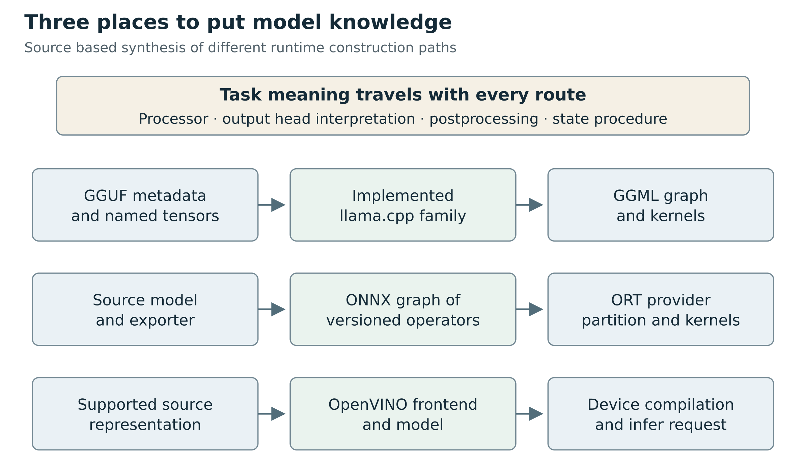

Figure 7. Family code, serialized operators and frontend/compiler routes place model knowledge at different layers. Each still requires a semantic task contract.

## llama.cpp and GGUF: a richly described package still needs implemented semantics
### Recognition is a sequence of checks

The GGUF specification defines a binary container with typed metadata, tensor descriptors and tensor data. Among its consequential metadata are `general.architecture`, architecture-specific hyperparameters, quantization-format version information, tokenizer fields, and an optional chat template. A filename is a human hint: even the specification warns that naming is not perfectly parsable in practice. The format's extension, a filename containing “Llama,” and a successful metadata parse are all weaker evidence than an implemented architecture plus an audited tensor binding. [R080](#ref-080)

At the pinned llama.cpp snapshot, `llm_arch` enumerates recognized architectures and the architecture table maps metadata strings to these identifiers. The model factory selects concrete implementations; unknown architecture names produce an error. The selected implementation loads architecture-specific hyperparameters and named tensors, then constructs its graph. The Llama implementation illustrates this without any need to infer a whole network from tensor dimensions: it explicitly creates token embeddings, output normalization, output weights, attention projections, feed-forward tensors, and optional architecture-dependent components. Its graph code explicitly implements the forward computation. [R081](#ref-081) [R082](#ref-082) [R083](#ref-083)

This distinction is important when designing a probe. Reading `general.architecture=llama` permits a candidate route. It does not establish that every metadata combination, quantization encoding, tensor type, context setting, or task head in this particular package works in this build. The loader checks required metadata types, required tensors, tensor shapes and split-file consistency. Those checks are useful rejection points. They are not a proof that every supplied value represents the intended trained program. [R084](#ref-084)

Consider two checkpoints with equal-shaped query and key matrices but different conventions for rotary-position layout. A loader can accept both shapes while one interpretation is wrong. llama.cpp's Llama conversion implementation contains explicit query/key permutation logic; this is a concrete example of semantic conversion, not just renaming files or packing bytes. Pantograph should preserve conversion provenance and family rules rather than assuming shape agreement is sufficient. [R085](#ref-085)

### Conversion is an architecture adapter of its own

The inspected `convert_hf_to_gguf.py` selects a model class after reading hyperparameters and resolving the source architecture. The conversion package has separate text and multimodal-projector registries. An unregistered source architecture is rejected; registered names import maintained converter modules. Architecture discovery includes top-level and nested configuration handling and named exceptions. It is therefore inaccurate to describe this tool as a general “Transformers to GGUF” serialization pass. It is a maintained collection of source-family translations sharing substantial infrastructure. [R086](#ref-086) [R087](#ref-087) [R088](#ref-088)

An ordinary supported conversion can reuse the same family class across many sizes and fine-tunes. That is the real maintenance economy. New weights with the same configuration semantics, tensor layout, tokenizer behavior and head contract may require little additional code, though still require qualification. A new attention rule, unusual tensor packing, changed positional encoding, encoder composition, or tokenizer variant may require a converter change, runtime change, or both. The source and target sides must agree about every transformation.

A sensible conversion record stores the source repository revision and component hashes; source configuration; converter commit and options; output artifact hashes; tensor-name transformations and deliberate exceptions; tokenizer/processor inputs; quantization recipe; and the independent reference used for validation. “Converted successfully” is an artifact-production event. “Qualified for this task on this target” is a later claim.

### A text-generation walkthrough

Imagine admitting a supported decoder model distributed as one or more GGUF shards. The following sequence is a design recipe, not a test performed here:

1. Validate the container and shard set, inspect architecture metadata and per-tensor encodings, and bind the files to immutable content identities. Do not select by filename alone.
2. Resolve the runtime architecture implementation and required hyperparameters. Check the requested context envelope, positional settings and memory policy rather than silently overriding them to make loading succeed.
3. Audit required, optional and tied tensors according to that implementation. A missing output tensor may be a documented tied-embedding case for one family; it is not a general license to synthesize missing weights.
4. Load the matching vocabulary/tokenizer semantics and chat formatting. Verify special-token handling, byte/Unicode behavior, beginning/end tokens, and exact prompt token IDs on representative fixtures before judging generated prose.
5. Construct the device-specific graph and allocate its model and execution state. The actual GGML backend makes operation-support decisions; selecting a GPU or a quantized file is not proof every operation is placed or accelerated there.
6. Evaluate the prompt, obtain logits, apply the selected decoding policy, append accepted tokens, update state, and emit task events. The application must distinguish token IDs, partial UTF-8 bytes, user-visible text, tool-call structures, and completion reasons.
7. On cancellation or failure, establish what state changed before returning the session to a pool. Reuse must be an explicit lifecycle decision.

Steps 1-5 are supported by the inspected loader, architecture implementation, tokenizer source and GGML backend interfaces. Steps 6-7 derive from the public llama API and the requirements of the proposed task contract. The API has explicit encode/decode, sampling, memory and state facilities; it is not one generic tensor `forward` function. [R082](#ref-082) [R084](#ref-084) [R089](#ref-089) [R090](#ref-090)

The failure semantics are unusually instructive. At this pin, `llama_decode` documents a KV-slot failure, abort, invalid input and fatal error as distinct outcomes. After abort or fatal error, already-processed microbatches may remain in context memory. The documented remedy is to query the memory positions and handle the state correctly. An adapter that labels every exception “request failed” and then retries the complete prompt against the same state can duplicate or corrupt its logical sequence. A common cancellation API must express when cancellation has been requested, when execution has quiesced, and whether state is reusable, restored, reset, or tainted. [R090](#ref-090)

Embeddings and reranking are separate task contracts even when their runtime also serves generation. Pooling choice, normalization, input formatting, output dimensionality and score meaning are part of the result. The ability to expose hidden vectors is not enough to promise compatibility with a sentence-embedding checkpoint's full recipe. Similarly, a ranking score is not necessarily a probability, and its scale need not be comparable across models.

### Multimodal walkthrough: the projector is a component boundary

The current upstream multimodal documentation explicitly describes image, audio and video input. The multimodal implementation lives in `libmtmd`, a separate subsystem whose README warns of heavy development and expected breaking changes. Its typical package consists of a language-model GGUF plus a matching `mmproj` GGUF. “Projector” here should not be read as merely one small matrix: the component can include the media encoder and model-specific projection/preprocessing path. The separate layer exists precisely because vision preprocessing, projection and prompting differ across families. [R091](#ref-091) [R092](#ref-092)

For a supported vision-language pair, the conceptual route is:

- Resolve the exact language and media components together, including the processor and prompting assumptions associated with that pair
- Decode the supplied image into a declared pixel representation; preserve orientation, aspect ratio and any geometry needed by the task
- Use the family-specific media preprocessing and encoder path to produce media embeddings
- Interleave text and media chunks with the required special tokens and positional conventions
- Feed these chunks into the language model with the appropriate causal/non-causal masking and, when needed, multidimensional rotary positions
- Decode output under the model's task and prompt contract

`mtmd.h` defines RGB image and float-PCM audio inputs, media-support/sample-rate queries, chunk token/position metadata and encoding APIs. Marker tokenization validates marker/bitmap agreement; a structured-parts route avoids marker interpretation. [R093](#ref-093)

These are distinct semantic inputs. A single prompt string cannot safely preserve all of their validation and alignment requirements.

The API distinguishes embedding-token counts from media position information. Serialized chunk metadata omits media payload and reloads as non-encodable placeholders. [R093](#ref-093)

Consequently, a robust cache identity should cover original media, processor revision, chunk ordering and position policy. A token-text hash or cached chunk description is not a self-contained replay artifact.

This separation explains why a file named `mmproj` with a compatible-looking output width is not enough. The dimensions may align while the image crop policy, feature selection, token order, patch merge behavior, positional convention or checkpoint pairing differs. Qualification must include processor fixtures and full paired-model outputs. For OCR-style models, upstream itself points out that particular prompts and input structures are required; “vision supported” does not establish every vision task. [R091](#ref-091)


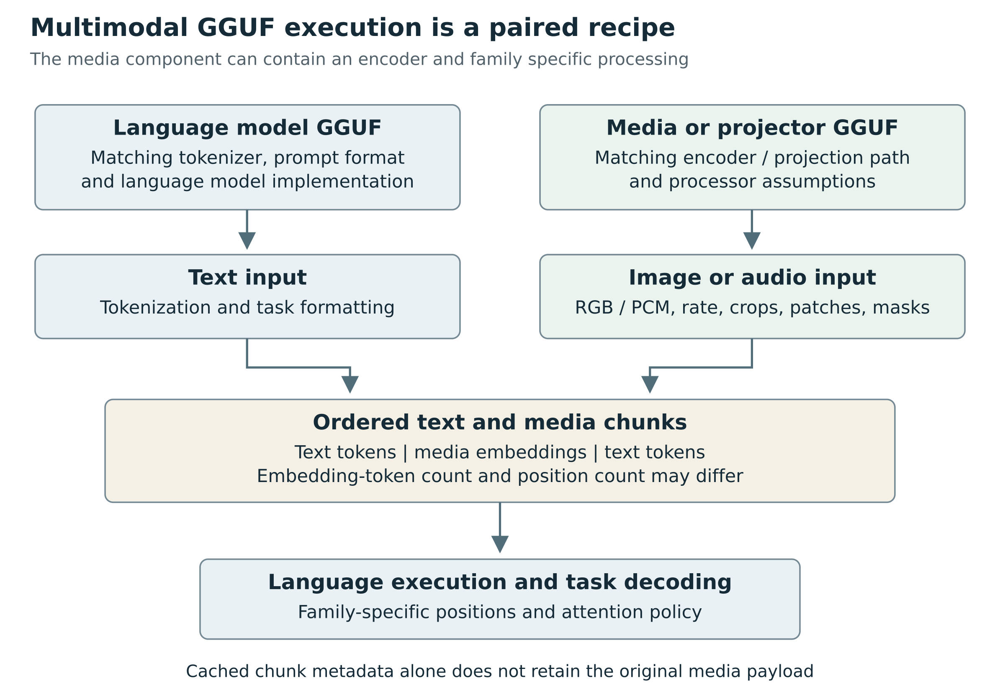

Figure 8. The language and media components require matching processors, chunk ordering and position semantics. Current upstream reach is distinct from Pantograph adapter reach.

### Audio is verified upstream, but it is not a generic speech API

At the inspected pin, upstream documentation lists audio-input examples including Ultravox, Voxtral and Qwen3-ASR, and mixed audio/vision input families. `mtmd.cpp` contains explicit projector-type cases for Qwen2-Audio, Voxtral and Ultravox, rather than deriving their behavior from an undifferentiated audio tensor. This is enough to state that specific audio-input routes exist in current upstream. It is not evidence that arbitrary audio models, arbitrary sample rates, speech diarization, streaming CTC, or every output modality is supported. [R091](#ref-091) [R094](#ref-094)

A useful input-audio walkthrough starts with the selected family and matching components, obtains the expected sample rate, decodes and resamples under a specified policy, creates float-PCM input, applies the family's encoder/preprocessing, and injects the resulting chunks in the expected prompt arrangement. The task result may be a transcription or an audio-conditioned answer. Those are different task claims even when the implementation shares a language decoder.

Audio output must be checked separately. The inspected source also contains bounded audio-generation API/types and model-specific Qwen3-TTS/PocketTTS branches. This chapter does not qualify those pipelines, their voice-conditioning behavior, timing, codecs or hardware coverage. The safe statement is that an audio-output implementation is visible for particular families, not that all audio-input families can synthesize speech. A production compatibility matrix should make input and output modalities separate fields. [R093](#ref-093) [R094](#ref-094)

### Quantization and devices multiply the envelope

GGUF records tensor encodings; quantization version and the encoding of each tensor matter independently of the file's informal label. A package can mix tensor types. Architecture support plus a recognized quantization label does not ensure the selected backend implements every required operation for those operand types and layouts. GGML's backend API has operation-support checks and its scheduler consults them in assignment decisions. This is the source-level basis for treating placement and kernel coverage as separate evidence. [R080](#ref-080) [R095](#ref-095)

There are three different questions: can this build parse the encoding; can it compute the graph under the requested memory/device constraints; and does the resulting numerical error meet the task tolerance? A lower-bit package that runs without errors can still miss an embedding-retrieval threshold, flip a close classifier decision, degrade rare-token handling, or change tool-selection behavior. Quantization qualification needs representative task fixtures and a stated reference, not just lower memory usage or a successful first token.

### What this means for Pantograph today

Pantograph's inspected llama.cpp backend wraps a managed `llama-server` process and forwards requests through its HTTP API. Its declared stable tasks are text/image chat completion, text embedding and text rerank. The static facts mark custom code unsupported; they distinguish a CPU runtime capability from unavailable CUDA/Metal readiness reporting. These are declarations in the inspected adapter, not measurements of installed binary availability or task accuracy. [R026](#ref-026)

Do not copy the current upstream multimodal list into Pantograph's support table. Upstream's current source revision, Pantograph's bundled/selected binary, the adapter's request schema, and the task qualification are four separate facts. Audio or video present in upstream is not evidence that the inspected Pantograph adapter accepts or correctly forwards it. Conversely, Pantograph's narrower public contract is not evidence that upstream lacks those modalities.

## ONNX Runtime: graph portability has a boundary on every side
### What an ONNX model establishes

The ONNX IR specifies a computational graph, operator/function references, typed inputs/outputs, initializers and metadata. The model carries an IR version and imports operator-set versions by domain. Operator identity and semantics therefore involve more than an operation's short name. Standard ONNX operators, `ai.onnx.ml`, vendor/contrib domains and model-local functions are materially different cases. A plain `MatMul` node is not interchangeable with an arbitrary vendor operator just because both produce a matrix. [R096](#ref-096) [R097](#ref-097)

Unlike a weights-only package, a well-formed graph can tell a runtime how many supported primitives compose an unfamiliar architecture. This is a substantial compatibility advantage. It permits one operator implementation to serve many unrelated models. However, graph metadata is not automatically a complete task schema. An input called `input` with shape `[N,3,H,W]` does not establish RGB versus BGR, normalization, crop method, physical units, or whether the output is logits, probabilities, boxes, depth or an action distribution.

ONNX types include strings, sparse tensors, sequences, maps and optionals. It distinguishes scalars from length-one vectors, unknown dimensions from unknown rank, and symbolic dimension relationships. Actual support still depends on the operator and runtime. [R096](#ref-096)

Flattening results into `Vec<f32>` discards this structure before task interpretation even begins. The adapter needs either a faithful typed representation or an explicit, validated scope restriction.

The artifact can consist of multiple files. ONNX external data associates tensor values with relative files, offsets and lengths. The specification disallows up-directory components in locations. A deployment record must include those external files in identity, integrity, packaging and access checks. Copying only `model.onnx`, hashing only that file, or admitting arbitrary external paths creates correctness and security gaps. [R098](#ref-098)

### Export is semantic compilation, not an assurance that eager Python disappeared correctly

The current PyTorch ONNX exporter uses `torch.export` for its default newer path. The documented process captures tensor computation ahead of time, normalizes operators and records the constraints needed to justify transformations before translating to ONNX. The source API includes dynamic-shape specifications, translation customization, reports and verification options. This is much more capable than the caricature “record one static sequence of operations.” It still has a bounded capture and lowering contract. [R099](#ref-099) [R100](#ref-100)

Keep four questions separate:

1. Can the source program be captured under the chosen export mechanism and assumptions?
2. Can the captured operations and control flow be translated faithfully into the selected ONNX operator versions?
3. Can the target runtime and provider combination implement the resulting graph, types, shapes and attributes?
4. Does the deployed pipeline reproduce the intended task on representative inputs?

An example input can accidentally become a deployment restriction if the export leaves dimensions static. Conversely, a dynamic dimension annotation does not make every length or shape valid: convolution geometry, concatenation relations, position limits, reshape divisibility, runtime memory, and provider compilation constraints still apply. Record the shape domain, dependent dimensions and any range constraints. Test boundary values and rejected values, not just a second random input with the original dimensions.

Control flow needs similarly precise language. ONNX has control-flow operators such as `If` and `Loop`; “ONNX cannot do loops” is false. But arbitrary source-language branches, host-side data manipulation, Python callbacks or side effects do not automatically become a portable graph. A capture may require a structured control-flow construct, a decomposition, an explicit custom operator, or an export-oriented rewrite. Choosing the legacy trace path does not justify assuming data-dependent branches generalize. Choosing the new exporter does not justify assuming every eager Python program is exportable. [R096](#ref-096) [R099](#ref-099) [R100](#ref-100)

Training/evaluation mode, preprocessing and output interpretation belong in the export recipe. If the source's evaluation behavior differs from training, capture the intended mode. If only the neural submodule is exported, retain the exact external preprocessing and decoder package. If preprocessing is folded into the graph, change the input contract to the graph's actual boundary; do not apply the same transform again outside it.

A graph can be valid while its outputs are semantically wrong for the application. The graph checker tests structural/specification constraints. An exporter verification pass can compare selected examples. Neither establishes unrestricted semantic equivalence over all inputs, nor validates downstream class labels, confidence calibration, geometry recovery or application safety. Pantograph should retain each evidence level, rather than reducing them to `supported=true`.

### Providers implement graphs in pieces

ONNX Runtime constructs its in-memory graph, applies transformations and asks execution providers what they can implement. The execution-provider API exposes `GetCapability`; the graph partitioner uses provider capabilities and priority to assign portions of the graph. Providers can offer individual kernels or compile supported subgraphs. A provider being registered or a device appearing in inventory is not proof that all nodes of a model use it. [R101](#ref-101) [R102](#ref-102)

The default CPU provider normally handles nodes not claimed by a specialized provider, where the corresponding CPU kernels exist. Missing custom operators, an unsupported operator version or an excluded kernel cannot be wished away by “fallback.” The checked-in operator-kernel table explicitly distinguishes providers, operator versions and accepted types. A reduced build can deliberately remove operators or their type support; its compatibility surface is narrower than the full upstream distribution. [R103](#ref-103) [R104](#ref-104)

The practical implications are larger than latency. A graph split across GPU and CPU can require data movement and synchronization, consume host memory, defeat a device-only policy or break a graph-capture assumption. Even when the arithmetic result remains acceptable, this may violate the deployment contract. If Pantograph promises “GPU only,” the qualification must inspect actual placement or enforce a no-CPU condition; the selected provider name is insufficient.

The pinned session implementation has an explicit `session.disable_cpu_ep_fallback` check. If fallback is disabled and nodes remain assigned to the CPU provider, initialization fails. It also rejects the contradictory combination of explicitly adding CPU while disabling that fallback. This is an example of a runtime mechanism the adapter can use to enforce policy rather than silently changing it. It is not proof that all provider-internal computation obeys a universal accelerator-only guarantee; the provider's own behavior still matters. [R105](#ref-105)

A second mechanism is easy to confuse with graph partitioning. The inspected Python wrapper catches certain execution-provider failures, changes providers and retries when its fallback facility is enabled. This is session-level recovery, not the initial assignment of unsupported nodes to CPU. A Rust adapter using the C API should not assume it inherits Python's fallback policy; a Python adapter should not overlook it. Document both mechanisms and expose material placement changes to the application. [R106](#ref-106)

I/O Binding is another boundary rather than a semantic shortcut. ORT exposes explicit binding of inputs/outputs and memory information through its C API. It can help an adapter avoid unnecessary copies when the producer, runtime and consumer agree about device, layout, allocator and lifetime. “Zero-copy supported” is not a property of every invocation. A strided view, a type conversion, a mixed-provider partition, an output whose size is not yet known, or a mismatched consumer can require allocation or copying. Preserve ownership and synchronization requirements in the execution plan. [R107](#ref-107)


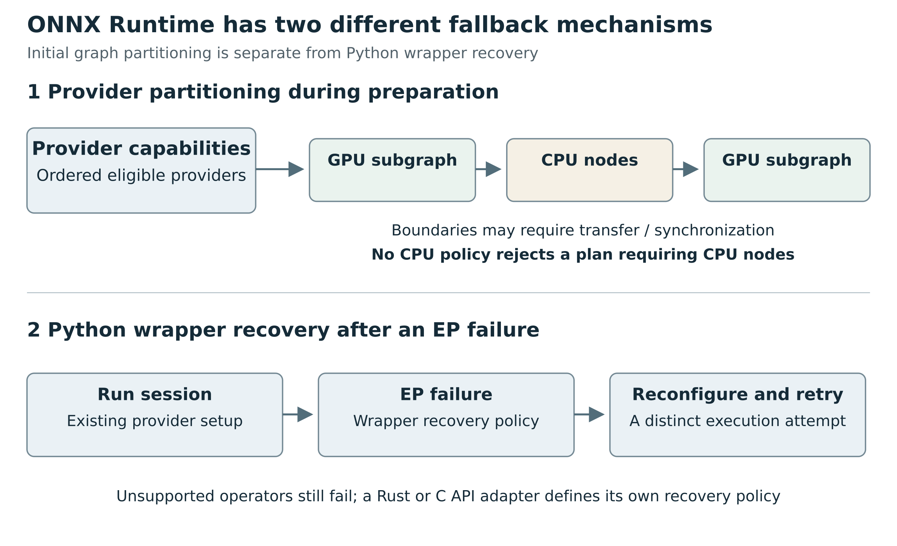

Figure 9. Initial provider partitioning and Python wrapper retry after an execution-provider failure are separate mechanisms and separate policy decisions.

### Quantization changes the graph and its admissible targets

ONNX deployment commonly represents quantization using quantized operators or explicit quantize/dequantize patterns. The pinned ORT quantization API distinguishes `QOperator` and `QDQ`, static calibration, dynamic quantization, weight/activation types, per-channel choices and numerous options. These are not equivalent to a single `int8=true` property. Quantization can change node patterns, operator domains, attributes and kernel availability. [R108](#ref-108)

A correct qualification record binds the quantized graph hash, quantizer version/options, calibration procedure and representative data domain, permitted arithmetic/accumulator behavior, runtime build and provider settings. For static calibration, bad or unrepresentative data can invalidate the intended accuracy envelope even if conversion and execution succeed. For weight-only quantization, supported block sizes and operand paths are runtime-specific. “Four bit” does not establish that a GGUF encoding, an ONNX graph and a native tensor library use interchangeable storage or kernels.

Avoid ranking runtime performance from these interfaces alone. The study establishes where optimizations and restrictions occur, not which route is faster for Pantograph's workload. That answer requires authorized measurements including preprocessing, host/device transfers, first-load compilation, steady-state invocation, memory, concurrency and task accuracy.

### Vision walkthrough: the runtime sees arrays, the user expects meaning

Consider a qualified image classifier exported as an ONNX graph. The package should identify the graph's exact input boundary: for example, preprocessed floating-point NCHW images of a particular size, or raw byte NHWC images if transforms were incorporated. The original image decode, orientation, resize interpolation, crop or letterbox policy, channel order, scaling and per-channel normalization must be fixed. A wrong transform can produce plausible labels with no runtime error.

The graph exposes output names, types and shapes. The task adapter must still know whether to apply softmax or sigmoid, which class-axis ordering to use, which labels correspond to indices and what thresholds mean. An image classifier with independent labels is not the same task as exclusive multiclass classification. Applying softmax to a multi-label head can create a convincing but incorrect API result.

Detection and segmentation expose why a generic `predict` wrapper cannot stop at output tensors. A detector may return already-filtered detections or raw box/class candidates; non-maximum suppression may be inside the graph or outside it. Postprocessing must know coordinate conventions, original-to-resized geometry, score combination and thresholding rules. A segmentation adapter must know whether it returns logits, class IDs or mask probabilities; what resizing is permitted; and how class labels align with channels. A depth model's tensor may encode relative depth rather than metric distance. These are proposed task-contract distinctions, not claims that every such model exports or runs on every provider.

A proposed vision qualification has three checkpoints: golden preprocessed tensors from the reference recipe; graph-output parity before decoding; and task-output parity after geometry/label reconstruction. Include a non-square image, an orientation case, small or empty detections, multiple batch sizes where supported, and malformed-input rejection. For a graph advertised as dynamic, add legal and illegal sizes. Log actual placement so that the test also establishes which device contract was exercised.

The upstream Optimum wrapper illustrates the separation: `ORTModelForImageClassification` is a task-aware class around an ORT session. A graph engine and a classification adapter are distinct layers even when distributed together. [R109](#ref-109)

### CTC speech walkthrough: one graph invocation is not one chat token

The inspected Optimum-ONNX source includes a real `ORTModelForCTC`, associated with `AutoModelForCTC`, and explicitly named supported model families such as HuBERT and Wav2Vec2. Its example obtains a processor, prepares audio at a declared sample rate, gets frame-level logits, selects token IDs and calls processor decoding. Its ONNX export configuration for HuBERT-derived models computes the output sequence-length expression from convolution kernels and strides. These sources show both the graph route and the irreducible processor/head semantics. [R109](#ref-109) [R110](#ref-110)

For a Wav2Vec2-family CTC package, inspect the actual exported input schema rather than assuming all models take the same audio features. A common boundary is waveform `input_values`; other audio families consume features. The adapter must bind sample rate, channel/downmix policy, normalization, padding and valid lengths. The output's time dimension represents encoder frames, not raw sample indices. Its conversion to time must use the model's downsampling and decoding rules. The inspected Wav2Vec2 feature extractor checks a supplied sample rate against its configured rate, and its tokenizer documentation relates token/frame offsets to the model downsampling ratio and sample rate. [R111](#ref-111) [R112](#ref-112)

Greedy CTC decoding collapses repeated labels and removes the blank label according to the tokenizer/decoder contract. The inspected Wav2Vec2 tokenizer groups consecutive equal tokens and removes its configured CTC blank token. [R111](#ref-111) Beam decoding with a language model is a different algorithm with an additional dependency. Neither is an autoregressive language-model sampling loop. A CTC transcript event cannot safely be fabricated by treating every framewise argmax as a newly generated chat token: repeated labels, blanks and later context matter.

For streaming use, the existence of an offline CTC graph is insufficient evidence. Define whether the model is causal or needs right context, what overlap is used, how duplicate boundary frames are discarded, whether recurrent state exists, and when partial text can become final. The proposed API should support revision of partial hypotheses if that task requires it; append-only text chunks are not universal.

Goldens should include the exact waveform/preprocessed input, frame logits and valid-frame counts, token/blank handling, transcript, and timestamps if promised. Test silence, short clips near convolution-length limits, mixed lengths in a padded batch, and chunk boundaries under a genuinely supported streaming recipe. All of these are proposed qualifications; no speech model was run here.

### Tabular walkthrough: a strong argument for a graph complement

Many tabular deployments do not need a Transformer implementation at all. The ONNX-ML domain includes traditional ML operators, and the inspected ORT CPU kernel table lists `TreeEnsembleClassifier` and `ZipMap`. sklearn-onnx's pipeline conversion documentation explains how preprocessing steps and predictors become graph nodes, with registered converters and shape calculators. Unsupported/custom estimators need suitable conversion logic; even a subclass can lack the expected registration. This is broad reach with real limits. [R103](#ref-103) [R113](#ref-113)

Consider a fitted pipeline with numeric imputation and scaling, categorical encoding and a classifier. If all stages are faithfully exported, the graph can preserve more of the inference recipe than an archive containing only learned coefficients or tree nodes. Yet the contract outside the graph still includes input-column names/order, expected data types, missing-value semantics and output labels. If a feature was measured in centimeters during training, a well-typed tensor in meters can execute perfectly and be wrong.

Classifier output shape is itself configurable. The upstream sklearn-onnx example shows probabilities as a list of maps keyed by labels when `ZipMap` is used, a probability matrix when it is disabled, separate class columns in another option, and an option to retain class labels as an additional output. It also shows a multi-output classifier returning a sequence of probability matrices. These are direct counterexamples to an API that assumes every model returns one dense embedding-like vector. [R114](#ref-114)

A deployment can deliberately normalize such outputs into a versioned `ClassificationResult` containing label identities and scores. That is an explicit, tested adapter transformation. It should not be an undocumented tensor squeeze or a guess that class labels are `[0,1,2]`. The cited example deliberately uses labels that differ from zero-based column positions.

The proposed qualification includes rows with missing values, unseen categorical values under the declared encoder policy, reordered or absent columns, singleton and multi-row batches, values near decision thresholds, and nontrivial string/integer label sets. Compare both transformed feature tensors and final outputs with the fitted reference pipeline. Passing this profile would qualify a bounded tabular task on the selected ORT build, not every ONNX consumer: another runtime may lack ONNX-ML, map/sequence support or the same operator versions.

### Custom operators are the point where “portable data” can require code again

A model can refer to a custom domain or an operator that ORT does not implement in its installed build. A model-local function body may be expanded into supported primitives; a genuinely external custom operator needs an implementation and schema matching its domain, type, version and inputs. ORT's custom-op facilities support registration and shared libraries exporting `RegisterCustomOps`. Custom operators are distinct from contrib operators that are already built into a particular ORT distribution. [R107](#ref-107) [R115](#ref-115)

Three remedies have different costs and trust implications:

- Decompose or rewrite the computation into supported standard graph operators, then revalidate equivalence
- Supply a controlled custom kernel/library with its own version, ABI, device implementations and tests
- Keep that family on an already-supported framework route until a portable deployment exists

Automatically loading a library named in untrusted model metadata would turn model admission into native code execution. It is not an acceptable implication of “the graph needs this operator.” The application should allowlist approved operator packages, record their hashes and licensing, and reject unapproved executable dependencies. A custom kernel can also reintroduce state or external effects beyond the normal stateless inference-graph model; its task and trust contract must disclose that.

The least-maintenance remedy depends on reuse. A standard decomposition reused across hundreds of graphs is valuable. A one-off opaque custom operator that wraps an entire framework may simply move the existing framework dependency behind an ONNX-shaped label. That can be a practical bridge, but should not be marketed internally as native universal compatibility.

### Stateful generation is an orchestration layer above a graph session

ONNX inference-model semantics are normally stateless apart from random-number behavior: persistent state is represented explicitly through inputs/outputs or managed by a higher-level runtime. An autoregressive deployment can have an initial decoder and a past-aware decoder, or another graph arrangement. Its controller owns tokenizer/prompt handling, the association of past and present tensors, attention masks and positions, sampling, termination, cancellation and batch/beam bookkeeping. Output buffers named `present_*` do not by themselves establish how to reuse them safely. [R096](#ref-096)

ONNX Runtime GenAI supplies a higher-level layer around graph execution. Its README describes preprocessing/postprocessing, generation, logits processing, search/sampling and KV management. [R117](#ref-117) Its inspected test configuration records model type, special tokens, context length, decoder filename, head information and past/present name patterns. [R116](#ref-116)

The package remains model-family/configuration aware even though its neural graphs run in ORT. Its support envelope should be assessed separately from plain ORT operator coverage.

A streaming API should report semantic progress, not confuse asynchronous invocation with partial inference. A single image-classification session can execute asynchronously and still yield one result. A CTC pipeline can revise a partial transcript. A generation controller can emit token or text deltas. A time-series model can update a hidden state without emitting text. These should be represented by typed task events and explicit state/lifetime semantics.

## OpenVINO: frontend, model, device compiler and request are distinct layers
### Reading a model is not compiling it

OpenVINO distinguishes a model representation from a compiled model and an inference request. `ov::Core` can read supported model representations; conversion can produce `ov::Model`; compilation selects a device and properties; a compiled model creates requests. The core API separately exposes available devices, properties, `query_model`, `compile_model`, extensions and compiled-model import. These separations are useful building blocks for a staged capability probe. [R118](#ref-118) [R119](#ref-119)

The frontend landscape is broader than ONNX. The inspected conversion documentation includes framework paths such as PyTorch and TensorFlow, and the PyTorch frontend accepts several object forms including `nn.Module`, scripted forms and `torch.export.ExportedProgram`. For an `nn.Module`, documented conversion can use example-input tracing. Conversion availability therefore does not imply arbitrary framework execution: capture assumptions, frontend translations, unsupported operations and target-device restrictions still apply. [R120](#ref-120)

Likewise, “OpenVINO supports ONNX” is too coarse to be a model promise. The source repository's supported-operation page distinguishes frontend operations and device conformance. It also embeds a data-as-of date earlier than the repository snapshot. Its separate ONNX verified-model page states that marked cells mean inference completed without errors and cites an older release/date. These documents are useful pointers, but neither a current branch label nor a green table cell proves current numerical/task qualification. Prefer the concrete model, API probe, actual compilation and task tests. [R121](#ref-121) [R122](#ref-122)

### A careful compile-and-capability walkthrough

For a candidate vision, audio or structured-tensor graph, a proposed OpenVINO adapter would perform the following steps:

1. Read/convert the pinned package under an approved frontend and extension policy. Record which inputs, outputs, parameter types and partial shapes the resulting `ov::Model` actually exposes.
2. Reconcile that graph boundary with the task's semantic schema. If conversion flattened a nested source output into several graph outputs, record that mapping rather than rediscovering it by array position.
3. Enumerate available devices and inspect supported properties. A property accepted for one plugin or at `Core` level is not necessarily valid for every compiled-model or device instance.
4. Set the intended device, shape profile, precision/execution policy and performance hints explicitly. Avoid making reproducibility depend on a changing default.
5. Call `query_model` on that model with those device properties. Its result maps operation names to supporting devices. Missing operations are evidence to resolve or reject, not a reason to declare support from the model's filename.
6. Compile the model for the intended device/mode and properties. Compilation can fail even after useful query results, for example because the assembled graph, resource needs or shape combinations are not admissible. A query is evidence, not the final loading certificate.
7. Inspect the compiled model's exposed properties/ports as applicable; create a request, bind correctly typed tensors with safe lifetimes, and execute under the scheduler's ownership.
8. Compare independent goldens before publishing a qualification record. Include the compiled target and numerical policy, not just the frontend source format.

The first seven steps reflect the separation in the inspected APIs and documentation; the final qualification policy is a proposal for Pantograph. `query_model` is especially valuable because it gives a reasoned intermediate stage between metadata-based plausibility and actual execution. It does not prove accuracy or performance. [R118](#ref-118) [R119](#ref-119) [R123](#ref-123)


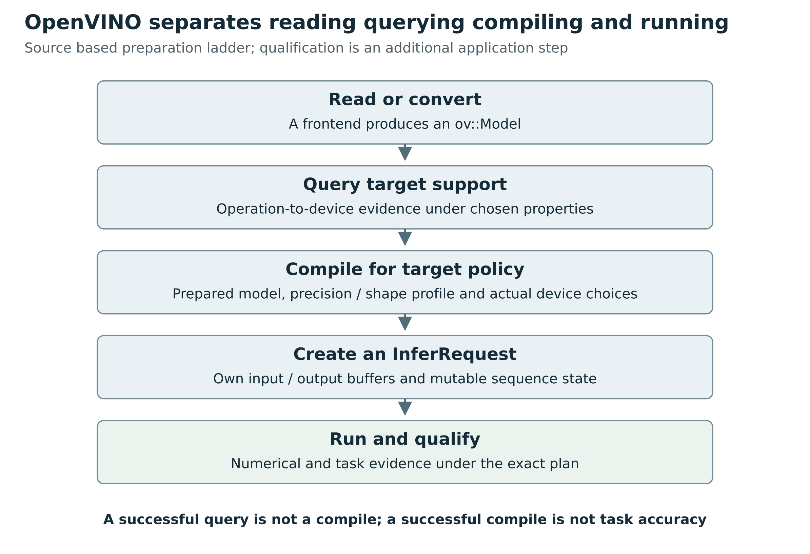

Figure 10. Read or convert, query, compile and request execution establish different facts. Numerical and task qualification remain additional evidence.

### Integrated preprocessing changes the contract

OpenVINO's `PrePostProcessor` can incorporate declared transformations into the model: input precision/layout, color conversion, resizing, mean subtraction and scaling. The inspected example transforms a byte BGR NHWC input into the representation required by the network. That is a useful route to reducing duplicated application preprocessing and exposing more work to compilation. [R124](#ref-124)

It still needs a precise recipe. “Normalize image” is not enough: mean subtraction and division operate in a specific channel order and numerical range, and resize interpolation/target dimensions must match. The documentation explicitly notes that a fully dynamic spatial input does not tell the resize step what target size to choose. If these transforms are integrated, the resulting model's raw-input schema differs from the original network's schema. Store and hash that prepared artifact or transformation recipe; don't keep advertising the old preprocessed-tensor boundary.

The same principle applies to postprocessing and non-image inputs. A model can incorporate some normalization or decoding operations, but this does not guarantee that label names, calibration, geometry or physical units are recoverable. The application should know which stage owns each transformation and test the boundary once, rather than applying or omitting it based on heuristics.

### Dynamic shape is not dynamic everything

OpenVINO represents fixed shapes with `Shape` and potentially dynamic shapes with `PartialShape`. Its dynamic-shape documentation discusses bounds and runtime allocation/compilation tradeoffs. But representability in a model is not identical to support by every plugin. The inspected GPU documentation explicitly distinguishes its dynamic-shape limits, including lack of dynamic-rank support in that documented path. [R119](#ref-119) [R125](#ref-125)

A shape profile should express what changes and what does not. Batch size may vary while channels remain fixed; audio duration may vary while feature width stays fixed; height/width may be bounded; two input axes may need to agree. An adapter should reject an out-of-profile input before attempting expensive allocation or compiling arbitrary new variants. Bounded dynamic profiles can be useful for deployment predictability, but the bounds should come from the application/model contract and qualification, not be invented to disguise an exporter restriction.

Compiled artifacts require separate identity from portable model artifacts. `Core::import_model` documentation ties imported compiled models to the relevant device/context. Cache and compiled-blob reuse should therefore be keyed by the inputs that determine compilation, including model/preprocessing identity, runtime/plugin and relevant device/driver properties, shape/precision configuration and extension set. Treat a compiled blob as a target-dependent derivative with a validated reuse envelope, not a universally portable replacement for the original model. [R118](#ref-118)

### AUTO, HETERO and a fixed target make different promises

OpenVINO's `AUTO` mode can select devices and has startup/runtime fallback behavior controlled by properties. Its documentation provides a way to query execution devices and to exclude CPU from the candidate list. `HETERO` addresses operation/subgraph distribution across devices; its documented automatic mode assigns operations according to support and priorities. Those are different behaviors from compiling for one explicitly named physical target. [R126](#ref-126) [R127](#ref-127)

An application might reasonably request “best available local execution within a latency/memory budget,” in which case controlled selection and fallback are useful. Another might require a particular accelerator with no CPU execution. The API should encode these as different placement policies. Do not report only `device=GPU` if a composite mode or actual execution uses additional devices. Also distinguish frontend acceptance from plugin coverage: successfully translating an ONNX operator to an OpenVINO operation does not prove the NPU, GPU and CPU all implement it equally.

Performance hints and precision controls are part of numerical policy, not harmless cosmetic options. OpenVINO's inspected precision guide distinguishes accuracy and performance execution modes; performance mode permits transformations that may affect accuracy. Quantized operators and hardware capabilities add further distinctions. Record these choices and evaluate task metrics under them. A promise based on floating-point reference outputs cannot be carried unchanged to a differently optimized precision policy merely because the same source model was used. [R128](#ref-128)

### Request-local state must follow the user's sequence

OpenVINO stateful models can use `ReadValue` and `Assign` to retain state across calls. The request exposes `query_state` and reset APIs. Its documentation notes that state belongs to an inference request: using separate requests for one logical sequence does not automatically transfer it. This matters for recurrent audio, time-series models and generative decoding, not just transformer KV caches. [R129](#ref-129)

A scheduler that pools requests must therefore distinguish reusable compiled weights from sequence-owned mutable state. Two users can share a compiled model without sharing a recurrent history. A canceled request should not be returned to the pool until execution is finished and its state disposition is known. Resetting must happen at the proper boundary between independent sequences; a buffer that exists after reset is not necessarily a meaningful materialized initial state to serialize and reuse.

The request API separately exposes synchronous inference, asynchronous start, wait, timeout wait, cancellation and completion callbacks. The header documents busy-state restrictions during an active request. A Rust wrapper must manage buffer lifetimes, callback ownership and synchronization across this API, rather than equating an async launch with safe reuse of the same request or its tensors. Again, a generic “streaming supported” flag would conceal the important distinctions. [R130](#ref-130)


# 8 Beyond chat and image generation

## Embeddings and retrieval
A dense embedding request must identify whether it embeds queries, documents or another role. The role may select prompts, branches or preprocessing. Its result should include representation kind, vector dimension, normalization status and an embedding-space/recipe identity. The latter prevents silently mixing vectors produced by different tokenization, pooling or projection revisions.

Sparse embeddings need index/value pairs and a vocabulary identity. Multi-vector embeddings need a variable number of vectors and a late-interaction interpretation. Returning all three as `Vec<f32>` loses essential structure. The inspected sentence-transformers implementation includes configurable pooling and can use different execution backends, which illustrates why the semantic recipe should remain stable above its execution substrate [R006](#ref-006) [R005](#ref-005) [R020](#ref-020).

Reranking is different from independent embedding. A cross-encoder evaluates a query and candidate together. Scores may be logits, transformed scores or calibrated probabilities, and are not automatically comparable across models. A rerank result should preserve candidate identity and score semantics. Sorting results should not discard input correlation or silently reinterpret scores as probabilities.

## Classification and regression
Classification can be binary, multiclass or multilabel. These tasks differ in whether outputs are mutually exclusive and whether sigmoid or softmax interpretation is appropriate. The task schema should name labels, ordering, thresholds, optional calibration and score semantics. A model with three logits but missing label mapping is not fully configured for a business task.

Regression needs target names, units, scaling/inverse transforms and uncertainty interpretation. A one-dimensional output can mean a raw margin, a normalized target, a monetary quantity or a physical measurement. Tensor shape alone cannot distinguish them.

Tabular inference adds feature ordering, categorical vocabulary, missing values and preprocessing state. A tree ensemble is not naturally a transformer configuration. XGBoost's official model-IO documentation distinguishes stable model serialization from unstable memory snapshots and notes that language-defined custom objective/metric functions are not stored in the standard model file. This supports a separate native/tree or graph adapter instead of forcing every predictor through a neural-network family registry [R035](#ref-035).

A practical tabular contract should reject missing required columns and unknown category behavior unless the training recipe explicitly defines handling. It should not infer feature order from whichever order a caller's JSON object happens to use.

## Image classification
A classifier's input contract must specify color mode, resize/crop/pad recipe, interpolation, value range, channel order and normalization. A valid RGB tensor with the wrong normalization can produce a confident wrong answer. Preprocessing should be part of the qualified recipe, with exact intermediate fixtures where practical.

Output contracts should preserve label mapping and whether the scores are logits, probabilities or another measure. Top-k is an output selection option, not evidence that the model's class set matches the caller's ontology. A runtime capable of executing a ViT backbone is not automatically qualified to classify using a particular head and preprocessing recipe.

## Detection and segmentation
Object detection returns a variable number of objects. The contract must name box encoding, coordinate frame, pixel/normalized units, score threshold, category mapping and any suppression/postprocessing semantics. A box in resized model coordinates cannot be silently returned as if it referred to the original image. The inspected Transformers detection pipeline carries original target size into postprocessing and converts results to its documented box form [R036](#ref-036).

Segmentation needs even more structure: semantic class maps, instance masks and panoptic segment identities are different result types. Mask resolution and interpolation policy matter. A one-channel mask may be probabilities or discrete labels; interpolating it with the wrong rule changes semantics.

Interactive segmentation can take points, boxes or previous masks. The prompt coordinates must be transformed consistently with the image. A generic image-plus-text interface is inadequate for these non-text prompts. A shared geometry component can reduce duplication, but it must carry the forward and inverse transform metadata through the task.

## Depth and geometry
Depth output needs a declaration of metric versus relative depth, units, invalid-value representation, and the camera/coordinate assumptions required for any downstream point cloud. A visually plausible grayscale image is not a sufficient depth contract.

Point clouds and meshes add coordinate frame, handedness, scale, topology and vertex/feature correspondence. A sparse 3D model may require neighborhood graphs, voxel indices or quantization of coordinates. These are preprocessing semantics and operator requirements, not an invitation to encode everything as untyped JSON.

The current Pantograph modality enum already includes point clouds and meshes, but the backend task contract must be rich enough to use them meaningfully. A modality's presence in an enum does not implement its geometry or execution path.

## Speech recognition is several algorithms
An ASR request should provide audio with explicit sampling rate, channel layout and time origin. The recipe determines resampling, downmixing, feature extraction, chunking and decoding. A timestamped result should specify units, whether intervals are absolute or relative, and whether a segment is provisional or final.

CTC and sequence-to-sequence models illustrate why task labels alone are insufficient. CTC decoding collapses repeated symbols and blank positions, with optional language-model decoding. Sequence-to-sequence decoding generates token sequences under a different procedure. Whisper has additional generation and timestamp behavior. The inspected Transformers ASR pipeline chooses among seq2seq, Whisper, CTC and other branches and applies different parameter restrictions and postprocessing [R037](#ref-037).

Pantograph's current Python ASR loader explicitly constructs AutoModelForSpeechSeq2Seq. It should not claim the entire ASR algorithm family. A future ASR adapter can share audio transport and some feature primitives while selecting a decoder-specific recipe.

Streaming adds state. A backend may need overlapping acoustic context, alignment state and delayed finalization. A text delta should not be confused with a final transcript segment. Dropping a stream may discard state without stopping the producer; lifecycle semantics must be explicit.

## Speech synthesis and audio codecs
A text-to-speech pipeline may combine text normalization, a tokenizer or phonemizer, acoustic generation, speaker conditioning and a vocoder. A direct waveform model and a spectrogram-plus-vocoder composition should expose the same high-level audio result only when sample rate, channels and temporal meaning are specified.

Audio codec tokens require codebook layout, number of quantizers, frame rate and decoding implementation. “Token generation” does not make them natural-language token IDs. A shared generative loop can be reused, but the task contract must retain codec-specific structure and avoid routing its output through a text tokenizer.

Incremental audio output needs ordering, time position and end-of-stream semantics. Chunk boundaries may not be interchangeable with decoder state boundaries. Qualification should test concatenation or overlap handling rather than only whether the first chunk sounds plausible.

## Video and multimodal time
Video tasks require frame timing, sampling policy, orientation and alignment with audio or text. Two decoders that select different frames can feed the same network different information. A fixed frame count does not specify the temporal interval those frames represent.

A multimodal processor may expand one image into multiple crops or tiles, produce patch masks, insert modality placeholders or synchronize audio segments. A task session needs a recipe version for that alignment. Simple concatenation of independent embeddings is not a universal multimodal model interface.

For streaming video or audio-video, backpressure and dropped-frame policy can alter the task. The contract should distinguish “latest frame” processing from processing every frame and should state whether timestamps are capture times or processing times.

## Time series and probabilistic forecasts
A forecasting model may consume past values, observed-value masks, static categorical/real features and known future covariates. It needs a time frequency, context/horizon definition and scaling recipe. The inspected TimeSeriesTransformer explicitly uses such inputs, supports multiple output distribution families and rescales generated values [R038](#ref-038).

Calling a method named `generate` here does not mean text generation. Outputs may be samples over horizon and target axes. Reducing them to a point forecast, quantile or interval is a postprocessing decision that should be visible. Numerical tolerances alone do not establish forecast calibration.

Missing-value masks and known-future inputs deserve especially careful contracts. Supplying future target values by mistake could produce a seemingly excellent but invalid evaluation. The request schema should separate observed history, known covariates and unknown future targets rather than accept one unconstrained tensor dictionary.

## Structured decision and pointer heads
Consider a learned decision model that selects one candidate from a variable set. A suitable request contains typed state features, candidate IDs and candidate features, an eligibility mask and any state/history. A result identifies a selected candidate or a distribution over the same candidate identities. It may also provide an explicit abstain/no-valid-candidate outcome.

This is not necessarily language generation. A pointer head's output axis is the candidate set, not a tokenizer vocabulary. Its shape relation is `number_of_logits == number_of_candidates`; padding and eligibility masks are semantic constraints. Returning an integer without the candidate-set identity risks applying the decision to a reordered list.

A declarative wrapper can describe this signature for a graph or native family adapter. It cannot make an arbitrary custom head executable without its computation. If the head is a known projection/attention pattern within a validated family, a reusable adapter can accept new weights. If it introduces a novel operation, it requires implementation, export support or admitted custom code.

Decision Transformer supplies a separate concrete example. The inspected implementation consumes states, actions, returns-to-go and timesteps and emits state/action/return predictions, with a configurable action transformation. These are task-specific trajectories and continuous outputs despite transformer internals [R039](#ref-039) [R040](#ref-040). Executing predicted actions in an external environment is a separate application authority, not an implied capability of an inference session.

## Scientific tensors and graph models
Scientific models may require complex values, physical units, structured grids, irregular meshes, sparse matrices or boundary conditions. Graph neural networks may require node/edge identity, adjacency representation and graph batching conventions. A backend that supports dense matrix multiplication is not automatically qualified for sparse segment reductions or custom neighborhood operators.

The common tensor container should be expressive enough to describe these inputs, but support should still be explicit. A graph-runtime route may offer useful reuse if its operators and shape semantics are supported. A native family route may be appropriate when preprocessing or state is tightly coupled to the architecture. Forcing all such tasks into a language-model API would lose the very semantics needed for correctness.

## Trace a forecasting model through its inputs and output head

The inspected TimeSeriesTransformer code assembles lagged numerical values with time and static features, uses observed-value masks in scaling, and returns the location/scale information needed by later steps. Its prediction class selects a distribution head. Its generation procedure repeats cases for parallel samples, draws successive future values and returns axes for case, sample, horizon and target. Those mechanics are implemented in model code; they are not supplied by the word transformer or by a tokenizer. [R038](#ref-038)

For an illustrative univariate forecast, suppose the context contains 24 points, the largest required lag is 7 and the requested horizon is 6. The required history is then longer than the visible context window: the lag construction needs earlier values. If a host sees a context length of 24 and discards all older history, it can produce a syntactically plausible request that cannot supply the model's intended features. The invariant belongs in the input contract rather than in a chat-style maximum-token field.

Suppose two series have very different magnitudes. Scaling is part of how their inputs are made comparable, and inverse scaling is part of the output's meaning. A backend that returns normalized decoder values as if they were original units is wrong even if the internal neural computation matches. Missing observations need an observed mask; replacing a missing value with zero without that mask changes the evidence the model receives.

A probabilistic head raises another distinction. Several forecast samples are not several generated text alternatives. Their axis describes draws from a numerical predictive distribution across the horizon. A mean, median or quantile forecast is a later interpretation. Collapsing that axis to an arbitrary first sample changes the product. A task API should make the requested reduction and units explicit, while a raw tensor API should retain the full named structure.

The source's use of a method named generate is therefore a useful warning. Method names are library conventions. They do not supply semantic type information. A runtime that implements autoregressive language decoding cannot automatically execute the required distribution projection, sampling, lag update or inverse scaling for this forecasting model.

## Trace a Decision Transformer through its sequence

The inspected DecisionTransformer creates separate learned projections for returns, states and actions, adds timestep embeddings and interleaves the projected values into a longer causal sequence. It expands the mask to match. After the transformer, different sequence positions feed state, return and action prediction heads; the action path can apply a configured tanh. It consumes embeddings directly rather than interpreting states as vocabulary token IDs. [R039](#ref-039)

An illustrative two-step trajectory contains a return, state and action for the first step and corresponding fields for the second. The neural sequence has positions for each of these roles. Preserving the order matters: the representation of a state is used for a different prediction than the representation after an action. A generic wrapper that flattens the values in a different order can keep all dimensions legal while changing the causal information available to each head.

The model's weights identify learned mappings for particular state and action schemas. They do not tell a host whether the first state feature means velocity, temperature or battery charge unless that semantic schema is carried separately. Likewise, an action vector has meaning only with its dimension ordering, units and valid range. Tokenizer-free does not mean preprocessing-free.

These two examples expose a useful commonality and a useful difference. Both use transformer blocks and history. They can share tensor operators, attention machinery and some execution infrastructure. Their input construction, heads, rollout procedures and output interpretation are different. Broad compatibility should reuse the common computation while preserving the task-specific remainder, rather than assume a common backbone makes one universal generate interface sufficient.

## Detection preserves geometry through the neural call

The inspected object-detection pipeline stores the original image height and width before calling the image processor, carries that target size around the model invocation, and passes it into postprocessing. It maps output label IDs through model configuration. It also contains a distinct document-layout route that classifies OCR words and restores their boxes. The pipeline's common output form therefore sits above more than one computation and preprocessing path. [R036](#ref-036)

For an illustrative image resized from 1200 by 800 to a smaller model input, a box expressed in model-space coordinates cannot be used directly to crop the original. If padding or cropping was added, a simple scale factor may be insufficient. The processor's actual transform must determine the inverse mapping. This is why returning raw graph outputs and returning detected objects are separate contracts.

A label index has a similar dependency. Index 4 means whichever class the supplied model's label map assigns to it. A host's own fifth label is not a substitute. These are simple errors, but they survive tensor shape checks and can look plausible in a UI. Qualification should therefore compare original-space boxes and label identities, not only raw logits.

## Audio dispatch chooses an algorithm and its allowed options

The inspected ASR pipeline identifies distinct Whisper, speech-seq2seq, transducer and CTC routes, with a separate CTC-with-language-model path. Its waveform preprocessing handles channel reduction, sample-rate conversion, chunk alignment and stride bookkeeping. These choices occur outside the acoustic neural model. The current upstream pipeline's breadth is not inherited by Pantograph's narrower speech-seq2seq construction. [R037](#ref-037)

A stride describes audio context that helps a chunk be recognized but should not necessarily be emitted twice. Its relationship to sample count changes under resampling. A wrapper that resamples the waveform but leaves stride offsets in the original sample units can corrupt chunk boundaries while still producing intelligible words. A final transcript alone may conceal repeated or missing content at the seams.

CTC logits describe framewise symbols with blank/repeat decoding. A speech-seq2seq decoder generates symbols conditioned on encoded audio under another procedure. A transducer maintains another alignment/state relationship. Sharing an audio input container is useful, but a supported decoder recipe must still be selected. The architecture implementation and the application-level transcription algorithm are both part of compatibility.


# Part III A Pantograph architecture that can grow


# 9 What Pantograph has today

## Inspection boundary
This chapter describes source at Pantograph commit 4938e405c7f656365eefdca492774ccae110c90d, verified as main on 2026-10-02. It does not claim that a deployment was executed or benchmarked. The consumed Pumas revision is f87c3da8276a914a54c6f4f36d617bef9d9f424e. Pumas main was separately observed at e37bbf4b964a0e2aadf25f80ab71edd8fa6b3eb3. A newer producer snapshot must not be substituted for the dependency the application actually builds against.

Pantograph's workspace manifest refers to Candle main, but Cargo.lock resolves its three Candle crates to 0.9.2-alpha.2 at 88ed7911de9e88196b1f55b199145d22647f415e. Transformers is constrained by requirements to >=4.52,<4.54 rather than locked to a single observed installed environment. These two forms of dependency specification establish different levels of reproducibility [R021](#ref-021) [R022](#ref-022) [R008](#ref-008) [R023](#ref-023).

## The existing separation is valuable
`model_contracts.rs` is explicitly Transformers-aligned and explicitly says model-package facts do not select a live runtime. It already models task/modality evidence, artifact kinds, processor components, generation options, custom-code policy, backend hints and lifecycle phases. `BackendCompatibilityReport` checks static backend facts against package facts and requests. Runtime placement, admission and queue policy remain elsewhere [R001](#ref-001) [R024](#ref-024).

The redesign should preserve this separation. Pumas remains the authority for selected package artifacts and approved load targets. The runtime owns implementation and execution facts. The scheduler owns resource admission and selection among eligible candidates. A model inventory must not grow into a hidden runtime selector, and a runtime adapter must not guess local library paths from a model label.

Existing types already distinguish absent, invalid, unsupported and uninspected component states. Generation options are structured and include provenance/compatibility diagnostics and namespaced backend extensions. This is a useful foundation; the compatibility problem does not call for replacing all of it with a generic JSON object.

## The common backend trait has both useful and narrow assumptions
The `InferenceBackend` trait combines backend identity and capabilities; start/stop/readiness and health; selected-text load and completion; chat streaming; text embeddings; reranking; image generation and image batching; audio transcription; and KV-cache operations. Some methods are required while others default to explicit unsupported errors. Chat currently accepts an OpenAI-compatible JSON string, while other tasks use more specific request types [R025](#ref-025).

This interface is serviceable for its present task set. It also reveals the cost of growth: adding every new model type as another method makes the backend trait increasingly broad and uneven. A backend for a tabular regressor should not need meaningful chat, rerank or KV-cache behavior. A semantic segmentation model should not be represented merely as image understanding that returns text.

The current `InferenceTaskId` enum includes text generation, chat completion, embedding, reranking, image generation, image understanding, depth, audio transcription, video understanding and multimodal generation. It does not contain generic image classification, object detection, segmentation, tabular regression/classification, numerical forecasting or structured pointer/action selection. Some represented tasks have `execution_supported: false` in their canonical task contracts. The existence of a type or enum variant is therefore not evidence of an implemented execution path [R001](#ref-001).

A future migration can retain typed convenience methods while moving execution dispatch to task-bound sessions and a versioned registry. It should not make every task a chat completion or force all outputs into a text-shaped result.

## Current adapter reachability
### llama.cpp

Pantograph's llama.cpp adapter declares chat, embedding and reranking task capabilities, GGUF artifact support, streaming, external connection, device selection and KV-cache features. Its capability structure separately gates runtime variants. These are adapter declarations, not a proof that every GGUF architecture or multimodal projector will work in every selected runtime build [R026](#ref-026).

The upstream runtime study must still examine architecture support, tokenizer metadata, quantization, projector requirements and server task options. An OpenAI-compatible transport provides request/response convenience. It does not standardize the meaning of every backend extension or prove that a given checkpoint supports tools.

### PyTorch and Transformers

The current PyTorch backend is in-process embedded Python through PyO3. Its static task declarations cover text generation and audio transcription as stable, and image generation as experimental. It does not declare general embedding or reranking support. The worker's Transformers loader selector accepts a causal-language-model route and an automatic-speech-recognition route [R027](#ref-027) [R028](#ref-028).

The text route uses AutoTokenizer and AutoModelForCausalLM. The ASR route explicitly uses AutoModelForSpeechSeq2Seq, AutoProcessor and an ASR pipeline. This is not a generic route for all architectures in the entire Transformers library. In particular, the seq2seq ASR loader should not be described as automatically covering CTC, transducer or arbitrary audio models [R028](#ref-028).

Some comments still say trust_remote_code is true. The inspected executable load functions instead default it to false, accept an explicit policy decision, and reject packages requiring custom code when policy is closed. Current behavior should be described from those functions and the policy contract rather than stale comments [R028](#ref-028).

### Diffusers

The generic upstream Diffusers loader and Pantograph's admitted Diffusers path have substantially different breadth. Pantograph accepts only StableDiffusionPipeline with a closed set of built-in component identities. It rejects custom pipeline/class mappings, uses local safetensors loading, and checks a specific Diffusers runtime version of 0.37.0. This is a deliberate bounded compatibility profile, not universal Diffusers support [R019](#ref-019).

The dependency file itself names Diffusers without a version pin. The runtime guard narrows which installed version can pass this route. Both facts matter without inferring which version happens to be installed.

### Candle

The Candle adapter currently has a staged embedding load planner. It requires `model_type == bert`, resolves tokenizer and safetensors components, chooses an admitted dtype/device representation and loads resources. It does not construct and run an executable BERT model. Its `start` method returns an explicit not-implemented startup failure. The CPU runtime variant is also declared unavailable for this reason [R029](#ref-029).

The static embedding task capability is marked stable, but execution readiness is unavailable. This is a concrete reason to separate declarations, readiness and qualification. It would be misleading either to say that Pantograph currently executes Candle BERT embeddings or to say upstream Candle lacks vision because a local comment says so. The local adapter and upstream runtime are distinct systems.

The remaining embedding method in this adapter follows an HTTP endpoint pattern, but the staged start path never establishes a usable runtime. Its presence is not evidence of a functioning native embedding pipeline.

## Static compatibility is advisory rather than complete qualification
`check_model_compatibility` currently evaluates task evidence, source kind, preprocessing, postprocessing and requested option diagnostics. Unknown component/source status does not become supported. It checks contract versions, validation state, backend hint overlap and custom-code support [R024](#ref-024).

Those checks are useful preconditions. They do not yet constitute a complete architecture/operator/tensor-layout/dtype/device/version compatibility certificate. The distinction should be explicit in UI and scheduling inputs. An artifact can pass a source-format and task-evidence check but fail a model-specific loading plan or a target-device operator.

The proposed extension is an evidence-bearing compatibility envelope layered on this factual report. It should not add heuristic architecture inference to scheduler policy. Backend adapters should produce their own bounded support constraints and validation reasons.

## Weight-loading permissiveness deserves a separate qualification policy
The inspected compatibility shim replaces Transformers' `dispatch_model` in some conditions. It attempts to reload unresolved meta parameters from safetensors, can translate a `language_model.` prefix to `model.`, can slice a tensor to an expected shape, and materializes remaining meta parameters or buffers with `torch.empty` before tying weights [R030](#ref-030).

This source behavior is not, by itself, a demonstrated production failure. The affected route, checkpoint and dependency combination would need reproduction. It is nevertheless a strong design warning: successful object construction can conceal incomplete or semantically altered weight binding. Shape slicing is not a general architecture-conversion rule, and allocated uninitialized storage is not evidence that required learned weights were recovered.

For inference compatibility, a future loader should instead report a binding audit: loaded required tensors, permitted aliases, explicitly transformed tensors, optional or intentionally initialized parameters, unexpected tensors and unresolved requirements. Any family-specific recovery should be narrow, named, versioned and tested against a reference. Broad global monkey patches make the application's supported envelope difficult to reason about and increase upgrade cost.

## Artifact freshness is not yet an immutable content lease
Pumas exposes an approved local load target with an optional content fingerprint, but the inspected pinned producer populates that fingerprint with `None`. Pantograph's current full package-facts bridge accepts Owner access and rejects LocalClient and ReadOnly roles for that operation [R031](#ref-031) [R032](#ref-032) [R033](#ref-033).

A future loading plan should bind to exact selected content and verify freshness at load time. This is proposed work, not an existing guarantee. It should be implemented with Pumas rather than by bypassing its ownership boundary. Hashing only the largest weight file is insufficient when configuration, tokenizer, generation defaults or composed components can change execution.

## Session ownership is an architectural constraint
The gateway owns a single active backend behind a read/write lock. Its selected-text lifecycle has explicit load and completion/drain hooks. A design with multiple resident models, simultaneous independent sessions or backend/device migration therefore requires more than adding one factory method. It needs explicit resident-object ownership, session leases, completion observation and resource accounting [R034](#ref-034) [R025](#ref-025).

The inference design must coordinate with scheduler and node-execution ownership at that boundary. A node may receive a result stream before a producer has quiesced. Canceling or dropping the consumer is not universal proof that a GPU kernel or Python worker has stopped. The session should expose terminal output status separately from resource-safe drain, and the scheduler should release claims only on the appropriate lifecycle evidence.


# 10 Separating identity capability and execution

## Design objective
Pantograph needs an interface that lets the rest of the application request a well-defined task, discover eligible implementations, load the selected artifact safely, and observe execution correctly. It should not require the scheduler or workflow node to understand BERT parameter prefixes, Whisper feature extraction, ONNX operator versions or diffusion component constructors.

The architecture proposed here is a design, not current implementation. It evolves the existing separation between model facts, backend compatibility and scheduler ownership. It does not require a single universal neural-network representation. Different backends can keep their native execution objects behind a common lifecycle and semantic contract.

## Six contracts with different owners
### Artifact descriptor

The artifact descriptor answers what is being requested. It identifies the selected Pumas model/artifact, immutable revision or verified content closure, package dialect, component dependencies and relevant metadata evidence. It does not decide which device to use or whether a runtime can execute the package.

A descriptor should preserve original facts alongside normalized fields and provenance. For example, `model_type`, `architectures`, pipeline class and module list are source evidence; a normalized family key is an interpretation with a recorded resolver version. This makes misclassification debuggable and supports future reinterpretation without losing original evidence.

The descriptor should be immutable once used to build a plan. If Pumas reports a changed tokenizer or shard set, the old plan is stale. Mutable local paths should be resolved through an artifact lease or equivalent freshness contract rather than treated as content identity.

### Capability discovery

A backend describes its installed build and known support envelopes. A capability query combines a task, artifact evidence, requested options, input shape envelope and target-runtime facts. It returns a structured assessment, not a ranking decision.

A useful result contains eligibility, required evidence not yet available, constraints, unsupported fields, selected candidate adapter, required components and the exact runtime/dependency/device profile to which the answer applies. It also distinguishes static knowledge from a dynamic probe result. A CPU capability declaration does not imply the process has memory to load a model now.

Discovery should not silently load a model or mutate residency. If qualification needs a costly compile or test execution, represent that as a separately authorized preparation/qualification operation. This keeps resource accounting honest and avoids candidate enumeration unexpectedly allocating device memory.

### Validated load plan

The load plan answers how this exact artifact will become executable. It names the architecture or graph adapter, config schema, tensor-binding rules, preprocessing and postprocessing recipes, task head, runtime build, dtypes, quantization path, device placement and trust decisions. It lists required files and transformations. It records a fingerprint covering all these selections.

A plan is not an arbitrary script supplied by model metadata. It is a serializable description built by trusted resolver code using registered implementations. A plan might say “load BERT encoder with this schema, bind these shard tensors, apply this pooling recipe and normalize the result.” The runtime resolves those registered operations. It should never turn an unvalidated class string into unrestricted code execution.

Plans can expose estimated load and steady-state resource requirements with provenance and uncertainty. The scheduler uses those facts for admission. The backend remains responsible for reporting actual load/execution outcomes and resource observations.

### Task contract

The task contract answers what inputs and outputs mean. It defines semantic fields, schemas, shape relations, units, batching constraints, option semantics and result commitment rules. It can also declare required preprocessing roles and acceptable execution modes.

An embedding contract names representation kind, dimensions or bounded dynamic shape, normalization, similarity interpretation and recipe identity. A detection contract names coordinate frame and box convention. A transcription contract names timestamp units and partial/final segment behavior. A forecast contract names horizon, frequency, target units and whether the output is samples, distribution parameters, quantiles or a point estimate.

The same backend can expose several task contracts from one loaded family. The same task can be implemented by several backends. Neither relation should be forced into one-to-one mapping.

### Loaded session

The session is an opaque handle to a validated executable binding. It carries the artifact/plan fingerprint, supported task signatures, resident-object identity, device assignment and lifecycle state. It should not leak runtime-specific model pointers into workflow code.

A loaded model and a request session are not always identical. Multiple requests may share immutable weights while owning separate KV caches, diffusion random-number state or audio stream state. Conversely, one composed task may depend on multiple resident components. A future concurrency design should distinguish resident component handles from per-execution state and make sharing constraints explicit.

The backend declares whether a session is reentrant, serialized, batchable, clonable, shareable across tasks or tied to a single stateful stream. These are capability facts, not assumptions inferred from Rust `Send + Sync` or a Python object reference.

### Execution lifecycle

Execution accepts a task-validated request against a session and returns typed events or one typed result. Events carry stable request correlation, sequence numbers and task-specific payloads. The lifecycle distinguishes accepted, running, partial output, committed output, failed, cancellation requested, cancelled and drained states where appropriate.

Resource-safe completion matters. Returning a final token or dropping an event stream may precede producer termination. The backend must expose when owned work has actually stopped using resident state and device resources. A cancellation request is not proof of arbitrary kernel preemption. Some runtimes can cancel cooperatively between steps; some must finish an operation; some require process termination with broader consequences.

The node and scheduler should observe these states without reconstructing backend internals. A session cannot be evicted merely because the caller stopped listening if its producer still owns the memory.


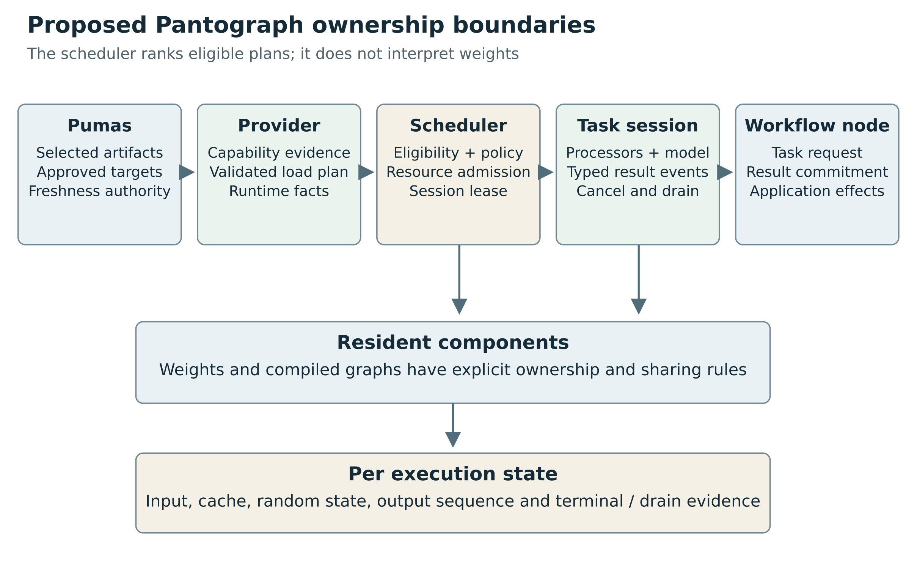

Figure 11. Pumas owns selected artifact facts and approved targets. Providers own capability and executable plans; the scheduler owns admission; task sessions own execution state. This diagram describes a proposed design.

## A conceptual Rust surface
The following sketch communicates responsibilities only. It is not proposed production code and is intentionally incomplete.

```rust
trait BackendProvider {
    fn describe(&self) -> BackendBuildDescriptor;
    fn assess(&self, query: CapabilityQuery) -> CompatibilityAssessment;
    fn plan(&self, request: PlanRequest) -> Result<ValidatedLoadPlan, PlanError>;
    async fn load(&self, plan: ValidatedLoadPlan, lease: ResourceLease)
        -> Result<LoadedSession, LoadError>;
}

trait TaskSession {
    fn contract(&self) -> TaskContractRef;
    async fn execute(&self, request: ValidatedTaskRequest)
        -> Result<ExecutionHandle, ExecutionError>;
    async fn cancel(&self, execution: ExecutionId) -> CancellationReceipt;
    async fn drain(&self, execution: ExecutionId) -> DrainOutcome;
    async fn close(&self) -> CloseOutcome;
}
```

A real implementation must settle ownership, object safety, async lifetime handling, event transport and resource leases. Those decisions should follow the selected runtime topology and existing scheduler contracts. The important design point is that “model package,” “provider,” “loaded session” and “request execution” are separate objects.

## Typed ports and extensible task identifiers
A single `infer(json)` function maximizes apparent extensibility but moves validation and documentation into informal conventions. A giant closed enum gives strong typing for existing tasks but requires coordinated core changes for each extension. Pantograph can combine their strengths.

Use stable namespaced task identifiers and schema versions in the wire/control plane, with typed Rust request/result adapters for well-known tasks. Register extension schemas explicitly. An extension declares semantic input/output contracts, required fields, accepted optional fields and feature/version negotiation rules. Unknown required semantics reject; optional diagnostic metadata may be preserved without affecting execution.

Do not allow an unrecognized task to run merely because its payload is syntactically valid JSON. Schema validity establishes structure, not model capability. The backend still must advertise and qualify an implementation for that task ID and version.

A tensor-level escape hatch can be useful for research and custom numerical models, but it needs a signature contract: tensor names, dtypes, shape expressions, axis meanings, layout, units, ownership and preprocessing status. It should be labeled raw tensor execution rather than silently presented as a recognized application task.
## Loading is a transaction with a commit point

Treat loading as preparation followed by publication. Preparation acquires a resource lease, verifies freshness, opens immutable artifacts, constructs components and performs the required readiness checks. Publication exposes the session to callers. A failure before publication releases or drains everything acquired by that attempt and leaves no half-ready session in a global slot.

For composed models, publication should cover the full required component set. If the text encoder is ready but the denoiser failed, the pipeline is not ready merely because one component exists. Components can remain cached under an explicit retention policy, but that is a separate residency decision with its own lease and accounting.

Loading can be cancelled, yet some underlying operations may not stop immediately. The loader must report cancellation requested and hold ownership until all operations finish or a governed worker termination establishes cleanup. A timeout is a caller observation, not automatic proof that the load attempt is gone. This is the same lifecycle distinction needed during inference.

A plan should be single-use or explicitly reusable under a freshness check. A reusable plan is a recipe bound to identities, not permission to trust whatever files now occupy the old paths. Any migration from mutable package directories to immutable content leases must be coordinated with the artifact owner.


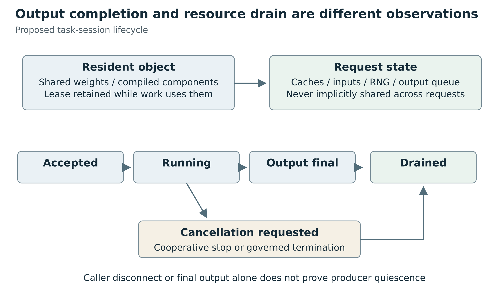

Figure 12. Weights and compiled components can be shared only under an explicit policy. Request state, output commitment, cancellation and drain remain separately observable.

## Separate resident state from execution state

Resident state contains shared weights, compiled graphs, kernels and perhaps reusable immutable processor resources. Execution state contains inputs, mutable caches, random state, output queues and cancellation. Some existing libraries combine these in one object. The adapter can still present a safe logical separation by serializing access or cloning/resetting state under a documented policy.

Do not infer that a task is stateless merely because it returns one result. A model can retain a cache between calls. Do not infer that a task is stateful merely because it streams results: an image batch can emit independent completed images without maintaining an application-level conversation. These properties belong in the contract.

A useful execution handle exposes ordered events and a terminal outcome, plus a separate drain observation. An event might be a provisional transcript revision, an audio chunk with a time origin, a completed embedding batch or a progress update that carries no result. The envelope can be common while payloads remain task-specific. A text-only delta type would force other tasks to lose their semantics.

## Proposed information carried by a runtime plan
The following is an API-design checklist, not an implemented Pantograph schema:

**Artifact identity:** source revision; component roles; content hashes; graph/weights/external-data files; tokenizer, processor and label assets; conversion and quantization records; model-license evidence.

**Computation identity:** runtime route and revision; implemented family identifier or graph IR/operator imports; approved custom operators/extensions; tensor binding rules or graph input/output schema; graph-transform options.

**Semantic task identity:** task/version; input modalities and their meaning; preprocessing/postprocessing recipe/version; output labels, units and geometry; required decoder/search policy; permitted partial-result semantics.

**Execution envelope:** device/provider candidates and priority; whether partitioning, CPU execution or runtime retry is permitted; shape constraints; dtype/precision/quantization choices; resource limits; actual placement evidence when available.

**State contract:** none, caller-carried tensors, request-owned recurrent state, or runtime-managed sequence state; reset/resume/export support; ownership and concurrency restrictions; cancellation and failure disposition; cache compatibility fingerprint.

**Evidence:** source-declared support, adapter reachability, load/compile result, numerical/task goldens and tolerances, tested hardware/runtime build, known exclusions and invalidation conditions.

This need not become one enormous object exposed to every caller. Some fields belong in a package record, some in a private execution plan and others in public diagnostics. The important design rule is that the implementation must not silently discard facts on which correctness depends.


# 11 Family adapters and extension registries

## Family adapters as the main reuse boundary
A family adapter connects package evidence to a validated recipe. Its responsibilities are narrow:

- Recognize a known family using strong evidence and return ambiguity rather than guessing
- Parse and validate the family-specific configuration envelope
- Enumerate required tensor bindings and permitted transformations
- Bind supported task heads and preprocessing/postprocessing recipes
- Declare operator, dtype, shape and device requirements
- Produce actionable diagnostics for unsupported semantic variants

Shared infrastructure handles artifact resolution, shard indexing, safe tensor reads, path validation, revision handling, component caching, device discovery, event transport and telemetry. Shared primitives implement common normalization, pooling, resizing or audio transforms where semantics truly match. Family adapters compose these primitives rather than duplicate them.

A registry entry must be more precise than a map from `model_type` to constructor. It should identify supported config versions and critical fields, head variants, tensor layouts, quantization schemes, component signatures and runtime constraints. “BERT base and large with supported encoder config and these pooling modules” is a meaningful envelope. “Anything called BERT” is not.

Unknown metadata needs a classification. Pure provenance fields can be ignored for execution after being retained. Unknown semantic fields must block or require explicit qualification. Blindly failing on every added description field is unnecessarily brittle; blindly ignoring every unknown field is unsafe for correctness.

## Avoiding a second giant model zoo
The host should not reimplement all architecture selection knowledge already maintained by a backend. A Transformers adapter can delegate built-in class selection to its qualified Transformers version and capture the chosen implementation in the plan. A Candle adapter needs a native family registry because Candle model modules supply concrete Rust implementations. A graph-runtime adapter can validate graph/operator capabilities instead of reproducing high-level family mappings.

These are different adapter strategies behind one control plane. A common host registry indexes capabilities and task contracts; it need not contain every runtime's internal architecture table. This reduces duplication and makes upstream upgrades a versioned adapter qualification event.

There are also limits to generic family parameterization. A new optional operation cannot be supported just by adding a config key if no native implementation exists. Reusing a base block is appropriate only when the structural and numerical semantics are actually shared. Family adapters should prefer small explicit branches over large unverified compatibility heuristics.

## Extension mechanisms and their costs
Statically compiled Rust adapters are the simplest native extension route. They share the host's dependency/build graph and benefit from compile-time checking, but adding one may require rebuilding Pantograph.

A versioned process protocol permits independently packaged runtimes and stronger failure isolation. It introduces serialization, lifecycle, startup and deployment costs. Large tensors should use a carefully owned shared-memory or file-handle mechanism when appropriate, with bounds and cleanup semantics; JSON/base64 for every tensor is not a universal transport strategy.

Dynamically loading Rust trait objects from unrelated shared libraries should not be assumed to be a stable ABI. If in-process binary plugins are needed, define a stable FFI/WIT-like boundary or another explicitly versioned ABI and own the compatibility testing. An extension registry is a semantic mechanism; it does not magically solve binary compatibility or security.

Custom Python code remains a distinct trust domain whether embedded or in a subprocess. A process boundary can improve isolation and recoverability, but it is not a security sandbox by itself. Filesystem, network, device and credential access need an explicit policy.
## The smallest useful registry
The proposed registry should register executable families and task recipes, not every public model ID. A family entry declares which configuration semantics it implements, how it resolves weights, and which task adapters can use it. Package identities select and qualify those entries. That architecture scales with semantic novelty rather than repository count.

An illustrative interface, deliberately not presented as an existing Candle API, is:

```rust
trait NativeFamily {
    fn inspect(&self, package: &ArtifactInventory)
        -> Result<FamilyEvidence, CompatibilityRejection>;
    fn plan(&self, evidence: &FamilyEvidence, task: &TaskRequest,
            runtime: &RuntimeProfile)
        -> Result<NativeLoadPlan, CompatibilityRejection>;
    fn load(&self, plan: &NativeLoadPlan, weights: &ValidatedWeights)
        -> Result<Box<dyn TaskSession>, LoadError>;
}
```

The interface is secondary to the invariants. `inspect` does not execute model code. `plan` resolves all behavior-changing choices and reports unsupported ones. `load` cannot silently substitute a different checkpoint, task head, processor, dtype, or execution route. `TaskSession` has task-specific request and response variants; it does not flatten image masks, codec frames, and text streams into one undifferentiated array.

One might implement the registry with an enum of known families, constructor functions, trait objects, or another normal Rust mechanism. The choice need not be settled before designing the qualification contract. Avoid turning a Rust implementation detail into a product-level compatibility promise.

A useful split has three reusable layers:

1. Artifact services: local/Hub identity, shard discovery, metadata inventory, bounded I/O, immutable caching, and loading reports
2. Family implementations: tensor binding, forward semantics, caches, heads, and supported configuration variants
3. Task recipes: tokenization or media processing, prompting, batching, generation algorithms, pooling, decoding, coordinate restoration, and result formatting

A single family may serve several tasks. A single task recipe may accept several families. A multimodal or diffusion task may require a graph of components. Keep these relations many-to-many rather than forcing every package into one model-name switch.

## How far a generic family descriptor should go
A declarative family descriptor is valuable when it chooses from a finite, validated vocabulary: separate versus fused attention projections, bias conventions, supported normalization, one of several RoPE algorithms, attention-mask behavior, MLP activation, tied output head, and known tensor mappings. The implementation can specialize frequent cases while retaining a common planning vocabulary.

Its hard limit is the operator and control-flow vocabulary. A new state-space update, mixture-of-experts routing rule, recurrent cache format, positional encoding, or cross-modal merge rule cannot be represented unless the vocabulary already expresses its semantics. Expanding that vocabulary creates an interpreter or compiler project. That may be worthwhile for a defined target, but it brings schema versioning, shape inference, operator coverage, error handling, optimization, security, and device qualification obligations.

Candle's ONNX evaluator is a concrete example of runtime-described computation rather than a counterexample to those obligations. It dispatches supported graph operations and has an explicit unsupported-operation error. Graph representation moves the compatibility boundary toward an operator set; it does not eliminate the boundary. Using Candle's evaluator should also not be confused with using ONNX Runtime and its execution providers. [R077](#ref-077).

There are two common overcorrections to avoid. The first is implementing one enormous “universal transformer” with dozens of weakly constrained booleans. The second is forking the entire BERT or Llama implementation for every renamed tensor key. A better path is to extract a common operation or pattern after two real implementations demonstrate equivalent semantics, retain explicit family configuration validators, and add differential tests around the extracted seam. Abstraction should follow proven equivalence, not visual resemblance of model diagrams.


# 12 Data contracts across modalities

## Start with semantics rather than modality labels
Text, image, audio and tensor are useful transport categories. They do not fully specify a task. An image may be a classifier input, a depth field, an instance mask, a generated sample or a visualization of numbers. Audio may mean a waveform, a codec token sequence, a spectrogram or a stream with timing constraints. The backend must know the intended interpretation.

A broad task system should support a small collection of reusable semantic containers and explicit task schemas. Tensor payloads need names, dtypes, shapes, axis meanings, strides/layout, units, ownership and validity masks. Image payloads need dimensions, color interpretation and coordinate transforms. Audio needs sample rate, channel layout, sample representation and time origin. Structured records need field schema, categorical mappings and missing-value semantics. Ragged lists need lengths and stable item identities rather than implicit padding alone.

The following cases are design stress tests. They are not claims that any one backend currently implements every task. Their purpose is to expose the information a backend-neutral interface must preserve.
## Shape expressions are relationships

A signature that lists a tensor's dimensions is incomplete when dimensions relate to other inputs. A pointer head requires one output logit per candidate. A segmentation result relates to the original image geometry. A time-series forecast relates to batch, horizon and target axes. A sparse graph model relates edge endpoints to node identities. These relationships must be validated, not left as comments.

Use symbolic dimensions and explicit relations where helpful: B for batch, N for candidates, H for horizon, C for channels. Symbols should be scoped to a request or component, not globally guessed by equal integer sizes. Two dimensions both equal to 128 need not denote the same axis. A schema can express output candidates equals input candidates while permitting hidden width to vary independently.

Shape validation should include boundedness. A dynamic dimension means variable within an admitted envelope, not unbounded allocation. Integer arithmetic for element counts and byte sizes must be checked before allocation. A ragged representation should include offsets or lengths with monotonicity and bounds checks. A sparse tensor should specify index ordering and duplicate-index policy where operations depend on them.


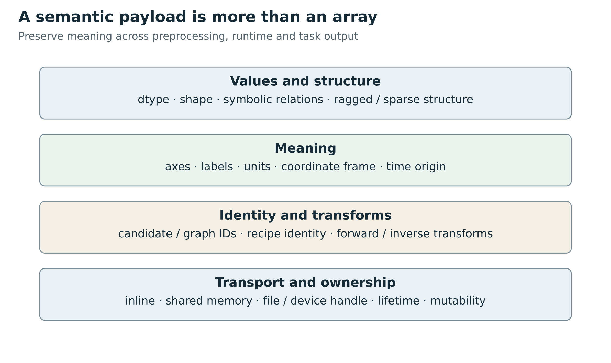

Figure 13. Values and shapes need axis meaning, units, identities and transforms. Transport ownership is a separate contract.

## Distinguish representation from transport

A tensor can be transported inline, through a shared-memory handle, as an immutable file, or in a runtime-owned device buffer. Those are transport choices. Dtype, axes, units and semantic role are representation properties. Mixing them makes it hard to replace transport without changing the task API.

For a borrowed buffer, specify lifetime and who may mutate it. For a device buffer, specify device ownership, synchronization and whether the recipient can use it without copying. For a file reference, require approved path or artifact authority, verified bounds and a lifetime covering execution. A raw address in JSON is not a safe cross-process tensor protocol.

Zero-copy is an optimization with obligations. It can couple the producer's lifetime to a consumer and delay eviction. It can expose mutable memory to concurrent requests. A design should first establish ownership and semantics, then optimize copies where profiling justifies the complexity. No performance measurements in this book support a universal zero-copy recommendation.

## Geometry requires an invertible record of what happened

An image preprocessing recipe should record the actual transform parameters applied to each input. Resize followed by center crop is not the same as resize with padding. A detected box needs the corresponding inverse mapping to the original coordinate frame. For a mask, interpolation must respect whether values are continuous probabilities or discrete labels.

The contract should specify the reference point for coordinates: pixel centers or edges, inclusive or exclusive bounds where relevant, and normalized or physical units. It should preserve orientation handling and padding regions. If the transform is not invertible, the result should report the information loss and its allowed interpretation rather than invent original-space precision.

An analogous rule applies to audio and time. Resampling, chunking and overlap define a mapping from model frames to source sample positions. A transcript timestamp without that mapping may be offset even when the words are correct. Video adds frame sampling and variable timestamps. A common temporal container can share these concepts without pretending that every task uses the same decoding algorithm.

## A decision model needs identity as well as values

For a candidate-selection task, attach stable candidate IDs and a candidate-set identity to the request. Preserve the identity through padding, batching, permutation and postprocessing. The result refers to those IDs, not merely to the last array position seen by a wrapper. An eligibility mask is part of the computation and should be validated against the same candidate order.

Qualification should include a permutation test when the intended architecture is permutation equivariant, and an explicit order-sensitivity test when order is meaningful. The expected property must come from the model/task design; it cannot be assumed for every pointer-like model. Include no-valid-candidate behavior, tied scores, padded items and extreme candidate counts within the envelope.

Returning a predicted action is inference. Applying it to a robot, a financial system, a user account or another external environment is a separate action with separate validation and authority. The backend API should make it possible to inspect and reject a prediction before any application effect. A generalized inference interface should not quietly become an executor of every output it produces.

## Version semantic schemas deliberately

A wire schema can remain syntactically compatible while changing meaning. A score field changing from logit to probability, a depth field changing from relative units to meters, or timestamps changing from chunk-relative to stream-relative is a semantic version change even if the field is still a floating-point number.

Task contracts need explicit compatibility rules. Adding an optional diagnostic field can be backward compatible. Adding a required input, changing an axis meaning or changing a default transformation requires negotiation or a new contract version. Preserve the effective version in results and evidence records so older workflow nodes do not misinterpret new outputs.

Namespaced extension fields should follow the same discipline. They are useful for capabilities not yet standardized, but they are not a way to hide behavior-changing options from validation. Unknown required extensions reject. Unknown optional informational extensions may be retained or ignored under a clearly documented rule.

Appendix A consolidates the broad task inventory and the semantic requirements that each task adds.

## Keep a typed tensor escape hatch without losing semantic tasks
A low-level tensor invocation route is useful for scientific, tabular, time-series and custom graphs whose application semantics Pantograph does not yet standardize. It can validate names, types, shapes, device location and ownership, return typed values and surface graph errors. It should be honestly labeled tensor execution: it does not imply that Pantograph understands the meaning of every output.

Alongside it, task adapters can offer stable contracts for classification, detection, segmentation, embeddings, reranking, transcription, generation and other useful families. Such adapters should compile semantic payloads into an execution recipe and decode results, rather than requiring every runtime to pretend it is a language server. A runtime can support a tensor graph before Pantograph offers a polished semantic task wrapper for it. Conversely, a semantic wrapper can be implemented through different runtimes without promising identical performance or bitwise outputs.

Complex values need an explicit policy. A dense-tensor-only first version may be a sensible scope limit, but it must reject or clearly qualify maps, sequences, optionals and sparse outputs. It should not coerce a tabular `ZipMap` into an unlabeled vector or flatten a structured action into arbitrary JSON and call that universal compatibility.


# Part IV Operating a compatibility program


# 13 Qualification before promises

## A loading success is only one test
A compatibility program must distinguish five questions: can the package be recognized; can its parameters be bound to an implementation; can that implementation execute on a target; does it reproduce the intended numerical/task behavior; and can it do so under the required lifecycle and resource policy? One successful forward pass answers only a small portion of those questions.

Qualification should produce a bounded evidence record. It names the exact artifact closure, adapter/runtime builds, device/driver profile, task contract, options, input envelope, preprocessing recipe, numerical policy and test suite revision. Its result must include failures and exclusions. A certificate should not say “all BERT models work” after one short sequence on CPU.

The word certificate here denotes an engineering evidence record, not a mathematical proof or external accreditation. Tests cannot establish correctness for every arbitrary future input or custom program. They can establish a transparent supported envelope and make regressions easier to detect.

## A layered qualification suite
### Package and configuration tests

Test ordinary packages, sharded packages, missing files, duplicated or inconsistent manifest entries, malformed JSON, invalid paths, excessive dimensions, unknown required fields and stale revisions. Reject artifact ambiguity rather than choosing the first plausible file. Verify that base-model and adapter dependencies resolve to the intended revisions.

Configuration tests should enumerate semantic branches. For an attention family, examples may vary positional representation, head grouping, bias flags, normalization, activation and cache behavior. The family adapter must either implement each branch or reject it specifically. Merely parsing an unknown field into an ignored map is not coverage.

### Tensor-binding tests

Build a required-parameter inventory from the selected implementation. Validate names, shapes, dtypes, tensor layouts, shards and tied-weight rules. Exercise known aliases and conversions individually. Test missing required tensors, unexpected extra tensors, mismatched task heads and invalid quantization metadata.

A binding report should distinguish a legitimate tied alias from a missing parameter; a documented transpose from arbitrary shape repair; and an intentionally initialized optional head from an incomplete inference checkpoint. The inspected Pantograph meta-tensor shim is a useful reason to make this report explicit rather than infer correctness from whether loading returned without an exception [R030](#ref-030).

### Preprocessing and postprocessing goldens

Capture exact token IDs, masks, special-token placement and chat templates where deterministic. Use multilingual, whitespace, empty, added-token, padding and truncation cases. For images, record intermediate geometry and normalized tensors. For audio, record sampling rate conversion, channel handling, feature dimensions and selected signal fixtures. For tabular data, record feature ordering, categorical maps and missing-value behavior.

Postprocessing tests should cover class mappings, box inverse transforms, mask resolution, CTC collapse, embedding pooling/normalization, forecast inverse scaling and pointer candidate identities. These tests often catch errors that final human-readable outputs hide.

### Numerical differential tests

Compare a pinned reference implementation and the candidate backend on the same exact inputs and weight revision. Compare intermediate activations at carefully chosen boundaries as well as final outputs. This localizes disagreement to preprocessing, tensor binding, operator behavior or decoding.

Tolerance must be justified for the dtype, operator and workload. Floating-point reduction order, fused kernels and quantization can prevent bitwise agreement even when behavior is acceptable. Conversely, a loose cosine threshold can hide a bad classifier head. Use absolute/relative error, distributional or ranking measures and task metrics as appropriate; document how thresholds were selected. Do not present illustrative tolerance numbers as measured guarantees.

For autoregressive models, compare logits and a deterministic bounded decoding path before stochastic generation. For diffusion, compare fixed intermediate denoising states in a controlled tiny fixture and separately validate the full pipeline. One attractive generated image is not a parity test. For speech, include token/alignment and task-level checks. For forecasting, compare scaling and distribution parameters as well as aggregate forecasts.

### Task correctness tests

Parity with another implementation can reproduce the same mistake. Add task-level fixtures based on intended semantics: label identities, box coordinates, missing-data cases, known signal alignment, candidate masks and output constraints. Measure relevant application metrics on licensed, appropriately representative data when evaluating actual model quality.

The backend compatibility program should not conflate model quality with implementation compatibility. A faithfully executed weak model is compatible but may be unsuitable. A numerically wrong implementation can occasionally score well on a small dataset. Both dimensions should remain visible.

### Lifecycle and resource tests

Test repeated load/unload, cancellation during preprocessing/loading/execution/postprocessing, consumer disconnect, worker crash, timeout, out-of-memory, warm reuse, batch member failure and cleanup. Verify that resource claims remain held until the producer is drained or safely terminated. Test whether state from one request can leak into another.

For streaming, test sequence order, backpressure, provisional/final semantics, cancellation after partial output and exactly-once result commitment at the host boundary. A successful first token does not qualify the lifecycle. Stateful audio, video, KV caches and diffusion sessions need their own reset and reuse tests.

## A reproducible qualification record
A proposed record could contain the following fields:

```json
{
  "artifact_closure_digest": "verified digest of all execution inputs",
  "task_contract": "pantograph.embedding.dense/v1",
  "family_adapter": "candle.bert_embedding/v1",
  "runtime_build": "exact commit and enabled features",
  "device_profile": "recorded CPU or GPU and driver identity",
  "numeric_profile": "dtype and quantization recipe",
  "preprocess_recipe_digest": "tokenizer and transform identity",
  "supported_input_envelope": "schema and bounded shape constraints",
  "evidence": ["tensor audit", "tokenizer goldens", "reference parity", "lifecycle suite"],
  "exclusions": ["unimplemented family variants"],
  "suite_revision": "immutable test revision"
}
```

This is a schema sketch. The strings above are descriptions, not fabricated test outcomes. An actual record should store machine-readable constraints and references to reproducible results, not opaque prose.

Qualification cache keys must include all behavior-changing dependencies. Updating a tokenizer, quantizer, custom processor, runtime kernel or task-head recipe can invalidate only the records that depend on it. A dependency graph enables targeted requalification rather than rebuilding the entire matrix after every change.

## The unavoidable matrix and how to control it
The naive test space multiplies model families, config variants, heads, tensor layouts, dtypes, quantization schemes, processors, tasks, devices, runtime versions, shapes and options. This can grow faster than a small team can exhaustively test.

The answer is not to replace the matrix with an optimistic boolean. Define representative envelopes and risk-based coverage. Use tiny synthetic models for operator and binding coverage, real checkpoints for representative integration, and selected target hardware for deployment qualification. Add tests for interactions known to be coupled, such as quantization with fused projections or left padding with last-token pooling.

Combinatorial or pairwise test selection can reduce redundant combinations, but it is not proof that all higher-order interactions are safe. The declared support envelope should reflect tested and reasoned coverage. Unsupported or untested variants should remain visible. A request outside the envelope can trigger explicit qualification rather than silent production experimentation.
## A worked qualification plan for native embeddings

Begin with one real, licensed package whose reference recipe is understood and a tiny synthetic family fixture whose complete weights are easy to inspect. The tiny fixture isolates binding and operator behavior. The real package tests ecosystem integration. Neither alone is sufficient. Pin both artifacts and the reference implementation before generating expected outputs.

At the package layer, include a single-file form and a sharded form containing the same tensors. The final outputs should agree under the same recipe. Add fixtures for a missing shard, an index that names an absent tensor, duplicate keys, an unexpected prefix, and an unsupported semantic configuration. Tests should assert the specific error class and verify that no session becomes visible after rejection.

At the text layer, compare token IDs and masks exactly for unequal-length strings, Unicode, whitespace, empty input, added tokens and maximum-length boundaries. Freeze the query/document role and prompt rules. A model can pass a vector cosine comparison on ordinary English while still mishandling added tokens or a padded batch. Exact intermediate fixtures prevent such cases from disappearing into a broad aggregate score.

At the tensor layer, compare the encoder output at selected boundaries, then masked pooling, then normalization. Document the reference dtype, candidate dtype and comparison statistics. Do not choose an attractive threshold and declare it a guarantee. Establish tolerances using observed numerical variation across permitted implementations and the sensitivity of the downstream task. Keep acceptance thresholds versioned and explain changes.

At the semantic layer, verify invariants that follow from the recipe. The same sentence alone and in a padded batch should have equivalent output if the contract promises batch independence. A normalized nonzero vector should have the expected norm within tolerance. Query and document prompts must follow their distinct branches. If dimensions or representation change, the output should carry a different recipe identity so an existing vector store cannot silently mix them.

At the lifecycle layer, repeatedly create, use, cancel and close sessions. Cancel before tokenization, during load, during a batch and after output is emitted. Verify the resource lease is released only after drain. Follow a cancelled request with a fresh request and compare its output to a clean-process reference to detect inherited state. Exercise a failed batch member and specify whether the batch is atomic or returns per-item outcomes.

The qualification record then lists the actual supported configuration and task recipe, tested artifacts, shape bounds, devices, numeric profiles, suite revision and exclusions. If only CPU F32 has been checked, the record should say so. Supporting GPU execution is a new evidence step even when no application code changes.

## Avoid circular reference testing

A golden produced by the same adapter under test mainly detects regression, not semantic correctness. A stronger reference comes from an independently maintained implementation or an analytically constructed tiny model. Even then, both implementations can share an incorrect assumption, so include task-level invariants and reviewed preprocessing fixtures.

Preserve how goldens were created. Record commands or procedures, implementation versions, exact inputs and relevant environment facts. A binary output without provenance is difficult to trust when a future update disagrees. Human approval of a golden refresh should examine the reason for the change, not only accept a new checksum.

For stochastic tasks, separate controlled numerical checks from distributional behavior. Fix initial latent tensors in diffusion rather than relying on cross-runtime seed equality. Compare pre-sampling logits for autoregressive models. Evaluate audio chunk boundaries with deterministic signal fixtures. Use statistical tests only for the questions that are genuinely statistical, with explicit sample sizes and uncertainty in any measured report.
## Negative tests protect broad compatibility
The most important native tests may be refusals. A correct rejection is safer than plausible-looking wrong output. Include unknown forward-affecting options, unsupported attention modes, ambiguous tensor aliases, conflicting shard names, path escapes, oversized shapes, missing tokenizer assets, invalid head dimensions, unsupported quantization codes, and unavailable device kernels.

Also test the routing layer. An unsupported native family may select a qualified Python route; an integrity failure must not bypass validation. A cancellation during loading must release partial resources. A failed probe must not leave the backend marked ready. An artifact or runtime update must invalidate the old qualification key. A user-requested dtype or device constraint must not be silently dropped to obtain a successful result.

Some failures deserve process isolation rather than an attempt to catch everything. Rust error propagation helps ordinary load failures; it does not make out-of-memory termination, native-library faults, or all device failures recoverable in-process. The runtime boundary should be selected according to the application's availability and trust requirements.

## Pin the complete evidence, not just the model ID
A qualification key should include immutable model artifact digests, normalized family configuration, task recipe version, tensor adapter version, runtime commit and build features, tokenizer/processor identity, dtype/quantization, and device profile. Store the test corpus and reference implementation revision alongside the result. This is how a “works here” observation becomes reusable evidence rather than folklore.

Upstream's CI is useful but not a substitute for this application matrix. At the inspected commit, the Rust workflow checks multiple operating systems and architecture configurations, runs workspace tests and documentation tests, formatting, and Clippy. A separate CUDA workflow runs tests in specified CUDA containers on a named GPU runner group and is gated to same-repository pull requests. These definitions establish test infrastructure, not that this research ran it, that every external PR receives every hardware test, or that every checkpoint/task combination is covered. [R078](#ref-078) [R079](#ref-079).

A successful build only proves that the selected Rust code type-checks and links in that environment. A passing small unit test proves a narrower behavior. A successful model load is stronger structural evidence. A numerical comparison establishes a particular mathematical path. A task-quality and lifecycle test establishes a product-level slice. Report those stages separately.

## A matrix that communicates what was actually established
The following rows are candidate qualification profiles, not a present Pantograph support matrix:

| Candidate route | Irreducible semantic work | Runtime/device evidence | Representative golden |
|---|---|---|---|
| llama.cpp text decoder | tokenizer, prompt, architecture variation, decoding and state | supported family/encodings, loaded graph, placement and context envelope | prompt token IDs, selected logits, deterministic decode and abort/reuse |
| llama.cpp vision pair | matching language/media components, image transforms, interleaving and positions | libmtmd route and selected backend coverage | processor/chunk fixtures, paired answer/OCR fixtures and malformed media |
| llama.cpp audio-input family | waveform/sample-rate policy, encoder path, prompt/task | specific supported projector family and binary/API route | audio preprocessing, transcript/answer and length boundaries |
| ORT vision graph | decode/resize/normalization, head/labels, geometry | IR/opsets, provider partition, shape/type coverage | preprocessed tensor, raw outputs, final labels/boxes/masks |
| ORT CTC graph | sample rate, padding, frame length, blank/repeat decoding | actual exported schema and provider coverage | frame logits, valid lengths, transcript, supported stream boundaries |
| ORT tabular pipeline | feature schema, missing/category policies, output labels | ONNX-ML/value-type kernels in the installed build | transformed rows and labeled scores including missing/unseen values |
| ORT custom-domain graph | custom-op semantics and external dependencies | allowlisted library ABI, domain/version and per-device kernels | op reference cases plus whole-task parity and failure tests |
| OpenVINO compiled graph | prepared input/output recipe, model/task interpretation | frontend success, query, compilation and actual properties/devices | reference outputs under exact precision and shape profile |
| OpenVINO stateful sequence | initialization/reset, sequence ownership and partial results | request-local state and asynchronous lifecycle | interleaved independent sequences, cancellation, reset and restart |

A row should accumulate evidence over time. At minimum, bind it to immutable artifacts, adapter/runtime builds, task recipe, device/driver class, numerical policy and admitted shape/input envelope. Tests are evidence of a bounded claim, not a mathematical guarantee for all future inputs. Record exclusions just as carefully as successes.


# 14 Security failure and fallback

## Native execution still needs a trust boundary
Safetensors is designed to store tensor data without pickle's executable object deserialization. That is an important property, but it is not a complete model-package security policy. Packages also contain configurations, tokenizer assets, templates, paths, and sometimes code references. Resource exhaustion, decompression behavior, enormous declared shapes, malformed media, and adversarial templates remain concerns for the host application. [R076](#ref-076).

For the proposed native route, use bounded parsers, checked size arithmetic, file-count and aggregate-byte limits, header limits, safe relative paths, and maximum sequence/image/audio dimensions. Treat an unsupported semantic configuration as a refusal to select that route, rather than an invitation to silently ignore the field. Support harmless extra descriptive metadata without conflating it with novel forward-program behavior.

Candle's memory-mapped loaders are marked unsafe because of the underlying mapping contract. A production cache should make mapped artifacts immutable for the mapping's lifetime; downloading and validating into a separate file before publishing a content-addressed entry is safer than modifying a mapped file in place. The absence of Python execution does not remove this lifetime concern. [R066](#ref-066).

Compiled Rust is not a process sandbox. Native kernels, allocator behavior, device drivers, and panics still share the host's failure boundary when inference is in-process. Conversely, a Python fallback is not necessarily remote code execution: an audited installed Transformers or Diffusers implementation can load supported data-only packages with remote-code loading disabled. The policy question is which code is trusted, which artifact is used, and what privileges the runtime has, not simply whether its implementation language is Python.

## Treat metadata as data even when it resembles a program

Model packages can name classes, libraries, paths, templates and dependencies. Those strings describe requested semantics; they do not grant authority to import code, fetch a remote file, mount a path or access credentials. A planner should map admitted names to installed implementations through a registry. Unknown names remain evidence of a missing capability until an explicit extension route is approved.

A package inspection phase should have bounded I/O and no repository-code execution. If execution is necessary to discover a custom model, that becomes a different operation with a visible trust decision. Separating the phases helps users understand what “inspect” actually does and prevents a catalog refresh from becoming arbitrary program execution.

The artifact closure should include executable code when code is admitted, with a separate code identity and policy. Pinning a weight revision while importing mutable custom code does not reproduce the computation. A model repository may reference a different code repository, and a processor may have code independent of the model class. The trust boundary must cover all of them.

## Resource limits are compatibility limits

A package can be structurally valid yet exceed the application's safe resource envelope. Header lengths, file counts, tensor sizes, decompression ratios, media duration and dynamic shapes need bounds. These are not merely denial-of-service concerns. They also make loading estimates and scheduler admission meaningful.

Report resource-policy rejection separately from unsupported semantics. A model may fit the implementation but exceed the user's configured memory budget. A malformed shape should fail validation before multiplication overflows. A supported audio task can still reject an excessive duration if no chunking recipe has been qualified. Silent chunking would be a task change unless the recipe defines it.

## Failure isolation is a deployment choice

An in-process runtime can offer simpler calls and direct tensor access. A worker process can offer a clearer crash boundary and independent environment packaging. Neither topology is universally best. The decision depends on native extension stability, custom-code policy, data sensitivity, startup cost, device sharing and operational recovery.

A process is not automatically a sandbox. Its credentials, filesystem, network, device access and inherited environment still matter. A sandbox can also reduce functionality in ways that affect compatibility, such as preventing an implicit download or denying an unsupported cache path. Those constraints belong in the execution profile and should produce actionable errors rather than opportunistic policy bypasses.

The current Pantograph PyO3 path is an embedded-Python implementation. A separately constrained worker is a possible future topology, not a feature already established by that source. Any migration should test lifecycle and resource behavior explicitly, particularly when a shared accelerator is involved.
## Errors should describe the failed boundary
A stable error taxonomy improves both user experience and maintenance. Proposed classes include:

| Boundary | Example code | Appropriate next step |
|---|---|---|
| Artifact identity | artifact_missing or artifact_stale | Resolve through Pumas or refresh evidence |
| Package parsing | invalid_package_schema | Correct package or select another artifact |
| Recognition | ambiguous_family or unknown_family | Supply strong evidence or install a supported adapter |
| Configuration | unsupported_config_variant | Narrow family extension or admitted alternate runtime |
| Tensor binding | missing_required_tensor or layout_mismatch | Correct artifact/conversion; do not guess |
| Task semantics | unsupported_task_head | Select the intended trained head or task adapter |
| Preprocessing | unsupported_processor_recipe | Implement/qualify processor or use a qualified route |
| Operators | unsupported_operator_dtype_device | Choose an admitted execution profile |
| Runtime | dependency_version_unqualified | Use qualified environment or run qualification |
| Policy | custom_code_denied or network_denied | Respect policy; obtain new authority if appropriate |
| Resource admission | insufficient_memory | Wait, use allowed batching/placement or report limit |
| Execution | runtime_failure or numerical_failure | Diagnose with bounded retry policy |
| Lifecycle | cancellation_pending or drain_failed | Preserve ownership until termination is established |

The error should carry phase, request correlation, stable model/plan identity, evidence source and bounded diagnostic detail. It should distinguish retryable under unchanged conditions from recoverable only after a specific change. A generic `model_load_failed` string can remain a transport fallback, but it should not be the only internal classification.

## Fallback is a policy decision with semantic constraints
A useful fallback order is not globally fixed. It depends on the requested task, latency/resource constraints, offline requirements, allowed code trust and required numerical profile. A native Candle path may be preferred for a qualified family; a specialized llama.cpp route may fit a supported generative family; a graph runtime may cover an exported numerical task; a controlled Python route may preserve the widest custom-model semantics.

Every transition should preserve artifact identity or disclose a deliberate conversion, preserve the task contract, and remain inside the user's execution policy. A cloud service is not an interchangeable fallback for a local-private task. Enabling remote code is not an acceptable automatic response to a native unsupported-family error. Switching models is not a runtime fallback.

Resource recovery also has semantic limits. Reducing an independent batch size can preserve outputs if the model is qualified for that equivalence. Truncating context, resizing input differently, dropping candidates, changing precision or switching decoding strategy can change the requested computation. Those changes require an explicit policy, not a hidden OOM recovery heuristic.

After partial output, fallback is more difficult. A restarted generation may emit a different sequence or duplicate visible output. A stateful stream may have consumed input that cannot simply be replayed. The host should commit output under an explicit strategy: restart before publication, resume from a compatible checkpoint, or report the partial failure. Do not silently splice results from semantically incompatible sessions.

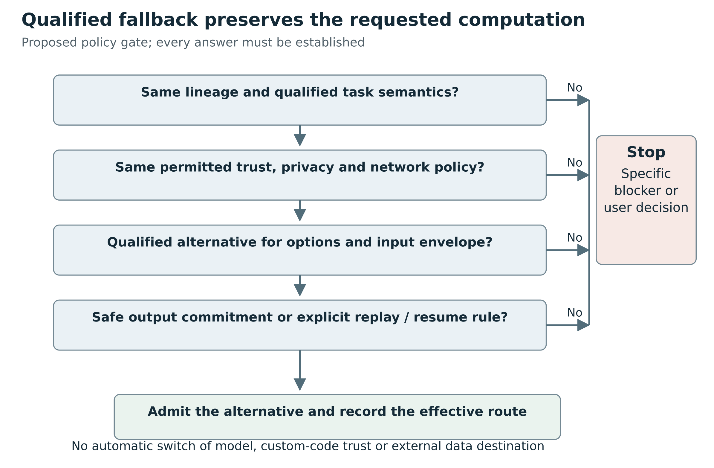

Figure 14. Fallback preserves artifact and task meaning, policy, qualification and output commitment. A failed integrity or trust check is not permission to try a more permissive loader.

## Artifact trust and licensing do not disappear after conversion
Separate three trust boundaries: reading a data artifact, executing the conversion/training-framework environment, and loading runtime/operator/processor code. A restricted graph or GGUF parser can reduce dependence on arbitrary model-repository Python, but native parsers and kernels still consume untrusted structures and allocate resources. Bound file sizes, nesting, dimensions and allocation, validate component paths, use maintained builds, and isolate high-risk conversion or execution when the application requires it. These are recommended controls, not a claim that a specific vulnerability was reproduced.

Hashes establish integrity relative to known bytes, not that a model is benign or accurate. Metadata can describe a license or provenance but must not be treated as self-authenticating. GGUF has license metadata fields; ONNX artifacts can carry model metadata; neither grants rights independently of the original model and redistribution terms. The inspected runtime source licenses are MIT for llama.cpp and ONNX Runtime and Apache-2.0 for OpenVINO, while model weights, tokenizers, labels, custom operators, converters and bundled device components can have their own terms. Preserve those component-level records and avoid claiming the runtime's license relicenses the package. [R080](#ref-080) [R133](#ref-133) [R134](#ref-134) [R135](#ref-135)

A useful admission policy should prohibit implicit network retrieval, arbitrary executable imports and unapproved dynamic libraries during supposedly read-only probing. Conversion may legitimately need the original model class; run it only under an explicit approved code policy and preserve its provenance. Fallback from a data-only runtime route to a framework route with custom code is a trust change, not merely a performance optimization.


## Error categories should identify the failed boundary
Useful proposed diagnostic categories include:

- `ArtifactMalformed` or `ComponentMissing`: bad GGUF shard set, missing ONNX external data, absent matching projector
- `ArchitectureUnsupported`: the runtime/converter lacks the declared family
- `ExportUnsupported` or `ExportConstraintViolation`: capture/lowering failed or requested shapes exceed the recorded export assumptions
- `OperatorUnsupported`: domain/version/type/attribute not implemented by the permitted providers or extension set
- `PreprocessingContractMismatch`: incompatible sample rate, image layout, feature schema or tokenizer recipe
- `TaskHeadMismatch`: a base encoder presented as a classifier, or raw scores mistaken for a different head contract
- `DevicePlanRejected`: unsupported placement, required CPU partition forbidden, unavailable plugin, or inadmissible compile properties
- `NumericalQualificationFailed`: graph loaded but the accepted error/task tolerance was not met
- `ExecutionAborted` with state disposition: cancellation is known, but state reuse requires a specific follow-up action
- `TrustPolicyRejected`: conversion/custom operator/runtime package requires executable code or access outside the approved policy

Each should include actionable structured detail without leaking secrets or embedding arbitrarily large model content into logs. Avoid converting an unsupported graph into a silent call to an unrelated model or task. A fallback must preserve the agreed semantic task and trust constraints, and material changes to placement or precision should be visible.


# 15 Maintenance economics

## Quantization deserves its own identity
“Int8” or “4-bit” is not a complete representation. Compatibility may depend on signedness, symmetric/asymmetric encoding, group size, per-tensor/per-channel scales, zero points, packing order, activation quantization, outlier handling, mixed precision and kernel assumptions. Weight-only quantization and KV-cache quantization are different features.

A load plan should name the actual quantization recipe and supported kernels. Repacking or dequantizing can be an explicit conversion path with its own resource and numerical implications. Merely reading quantized bytes does not establish that the runtime computes with the expected semantics.

A different quantization path can be a valid fallback only if the execution policy admits the resulting numerical change and the task is qualified under it. It must not be silently chosen because the original kernel is unavailable.

## Maintenance cost belongs in the architecture
A useful qualitative cost model separates reusable substrate cost, family implementation cost, per-variant qualification cost, runtime upgrade cost and incident cost. The goal is to reduce repeated plumbing without shifting correctness risk into incidents.

Per-checkpoint wrappers scale poorly when most checkpoints share computation. A validated family adapter amortizes construction and tensor mapping across many checkpoints. A shared processor primitive amortizes one normalization or resampling implementation. A common lifecycle protocol amortizes cancellation, telemetry and resource ownership. These are genuine reductions in ongoing work.

There remains irreducible cost when new semantics arrive. A new activation, attention branch, audio decoder, sparse operator or task head needs implementation or an alternative runtime that already supplies it. Declaring “generic support” by ignoring fields hides this cost rather than removing it.

Prioritize family envelopes by expected user demand, breadth of checkpoints covered, quality of upstream references, implementation reuse and qualification burden. This resembles a constrained coverage problem: choose a set of adapters that covers valuable requested cases under a maintenance budget. Such a model can guide planning, but numerical benefits require real workload and engineering data; this research supplies no invented cost estimates.

## Version upgrades as controlled experiments
Treat a backend/runtime upgrade as a change to the supported envelope. Resolve exact versions, read relevant breaking changes, rerun the affected contract and golden suites, compare capability deltas and retain a known-good rollback profile. A broad dependency range is convenient during development but insufficient as a production compatibility record.

Prefer narrow compatibility shims tied to specific versions and a removal condition. Global monkey patches to private internals tend to accumulate ambiguous interactions. When upstream offers a stable extension point, use it. When upstream lacks one, a bounded contribution with tests can reduce downstream maintenance for everyone. The Candle roadmap should evaluate such seams separately from application-specific dispatch policy.

Support tiers should be tied to evidence. Experimental can mean a working but limited qualified envelope; stable should mean a documented supported profile and regression coverage. Roadmap should never appear eligible for execution. Runtime-unavailable and unsupported-architecture should not be conflated: the former may be fixed by environment setup, while the latter requires new implementation or a different qualified route.
## Measure coverage in useful cases

Repository counts make poor progress metrics. A hundred fine-tunes with one shared recipe can require less work than one novel custom processor. A support program should track valuable execution cases and their evidence: task family, semantic branch, representation, target device and actual user demand.

Useful measures include the proportion of requested cases served by qualified routes, repeated integration work avoided by family reuse, time to diagnose a rejected case, regressions introduced by runtime upgrades and maintenance ownership for each native seam. This book supplies no numerical estimates for these measures. They become useful once the application records real demand and engineering outcomes.

Native prioritization should consider more than nominal model popularity. Prefer a well-defined reference, stable package conventions, realistic fixtures, reusable primitives and a maintainer who can own the envelope. A high-demand family with rapidly changing custom code may initially be better served by an ecosystem route while native work targets a stable subset.

## Make deprecation part of the contract

A supported envelope may shrink when an upstream runtime removes an API, a driver becomes unavailable or a correctness defect is found. Compatibility records need an explicit status history. A previously qualified case can become withdrawn with a reason; it should not remain eligible merely because an old cache entry says success.

Deprecation should identify affected artifacts or envelopes, the replacement route if one is qualified, and whether stored outputs remain semantically compatible. An embedding-recipe change may require re-embedding a collection. A label-map correction may require reinterpreting previous predictions. The upgrade cost can live outside the runtime itself, which is why recipe identity must reach downstream applications.

Keep a known-good profile where policy and dependencies permit, but do not use rollback to hide a security or correctness withdrawal. Migration tests should validate both execution and result interpretation. A successful new load is not enough if consumers expect the old score semantics.

## Graph deployment reduces one kind of maintenance and introduces another
A useful cost model separates recurring per-checkpoint qualification, per-family semantics, reusable conversion, runtime/operator maintenance, packaging and target qualification. A graph runtime can reduce the per-family runtime implementation term when many models lower into already-supported primitives. It does not erase exporter maintenance, processor/head adapters, model changes, driver/kernel issues or task tests.

llama.cpp amortizes specialized family implementations and serves many supported checkpoint variants efficiently through one deployment style. The application benefits from its tokenizer, decode/state and multimodal infrastructure, but inherits the need to track family/runtime/projector compatibility and evolving APIs. Its maintenance model is attractive for supported language-centered tasks, not a reason to force tabular trees or arbitrary scientific graphs into GGUF.

ORT's broad operator and provider ecosystem can make a complementary route particularly useful for image, audio, tabular and numerical models with stable exports. Its recurring costs include exporter and opset transitions, custom/contrib operator dependencies, provider partition changes and schema/shape behavior. A pinned exported artifact may allow deployment without the training framework, but only after a trustworthy conversion and qualification process has produced it.

OpenVINO adds another useful compilation route when its frontends, transformations and device plugins fit the target deployment. Integrated preprocessing and state support can simplify parts of application code. The cost moves into prepared-model provenance, plugin properties, shape profiles, compilation/cache management and target-specific qualification. It should be evaluated against the actual intended hardware and tasks, not as an abstract “supports everything ONNX” substitute.

The operational goal is a small number of reusable semantic family/task adapters with many qualified artifact revisions, rather than a bespoke implementation per checkpoint or one unqualified universal loader. New formats should be added when they buy reusable coverage or deployment properties that justify their sustained test and packaging cost.


# Part V A practical native roadmap


# 16 A staged Candle compatibility roadmap

The following roadmap is proposed work. No implementation or pull request was made for this research. Each milestone requires its own review and qualification.

## First finish a truthful native vertical slice in Pantograph
The first milestone is a real executable embedding route, with honest readiness reporting. The current staged BERT resource load is a useful starting point, but it should not be promoted to “ready” until the family is constructed, the exact task recipe is selected, and a request can complete under the contract.

A bounded initial slice is BERT-family encoder plus a declared supported pooling/projection/normalization recipe, using local immutable safetensors and CPU F32. The restriction is a rollout choice, not a claim that Candle only supports this combination. The acceptance condition should include batch-versus-single equivalence, correct mask handling, reproducible artifact identity, cancellation/cleanup, and structured rejection of unsupported variants. A second checkpoint with different dimensions but the same supported recipe should load without another hard-coded model-ID branch. That is a direct test of the desired maintenance property.

The next vertical slice should exercise a different contract, such as ViT classification or Whisper transcription. Adding many chat checkpoints first would leave multimodal and non-generative assumptions undiscovered. Native route selection, typed inputs, preprocessing evidence, numerical checks, and output attribution should work across both slices before a generic registry becomes a stable platform commitment.


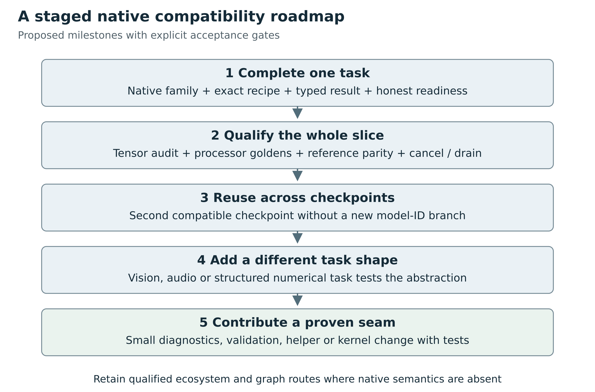

Figure 15. Each stage has an acceptance gate. The first useful unit is a complete qualified task; new native families and upstream seams follow demonstrated demand.

## Upstream seam: loading diagnostics and error propagation
A small Candle contribution can be more valuable than a universal loader proposal. Candidate work includes:

- Propagate nested family-construction errors rather than panicking, with minimal malformed-weight fixtures
- Add an opt-in strict multi-safetensors inventory that detects duplicate names and index/header mismatches
- Expose metadata-oriented inspection needed to report missing and unexpected tensors before expensive device materialization
- Improve prefix/alias diagnostics without guessing that an exact tensor key is a namespace
- Test parameter aliases against tensor-backed and initializer-backed builders

These suggestions align with existing seams: `VarBuilder`, `SimpleBackend`, safetensors wrappers, and small `candle-nn` tests. They should not require Candle to adopt Pantograph's task registry or package-management policy. Upstream maintainers may prefer a helper in examples, a separate crate, or a downstream prototype before stabilizing a new core API. That decision should be made with maintainers, not assumed in a roadmap.

A concrete first proposal could use the existing Llama `unwrap()` location as a narrowly scoped regression-hardening PR. Its acceptance criteria would be a descriptive returned error for a missing block tensor, unchanged successful loading, and a cheap CPU-only test. The point is to improve a reusable failure boundary, not to present source inspection as a confirmed production bug.

## Upstream seam: make reusable task components easier to reuse
A substantial amount of useful task logic currently lives in examples. Some helpers already exist, including chat-template handling and shard discovery. Begin by using and testing those helpers rather than creating competing copies. For behavior still embedded in an example, propose small library-quality pieces with explicit contracts.

Embedding pooling is an attractive bounded case: masked mean pooling, denominator policy, L2 normalization, shape checks, and tests for variable-length batches can be reused across encoders without claiming a complete Sentence Transformers interpreter. Audio preprocessing and decoder strategy separation are another case, but the task is larger because segmentation, language tokens, timestamps, and fallback behavior interact. Diffusion schedulers already expose traits; reusable assembly validation can build on those instead of inventing a second scheduler system.

A helper's documentation should state whether it is merely numerical computation or a specific ecosystem-compatible recipe. “Masked mean” is a precise operation. “Compatible embeddings” is a promise requiring tokenizer, prompting, truncation, projection, and normalization context. Good naming prevents users from assuming the second from the first.

## Upstream seam: semantic family validation and documented feature envelopes
Family configuration validation is a high-leverage alternative to adding speculative genericity. For each supported family, identify configuration values that change execution and validate them before allocating weights. Return structured or at least precise errors for unsupported modes. Qwen3's explicit rejection of sliding-window mode is preferable to quietly running full attention under the same family name; the application can plan another route from that evidence.

A useful support document can be generated from explicit metadata maintained beside tests, but it should distinguish:

- Implementation present
- Configuration variant accepted
- Task recipe implemented
- Artifact layout accepted
- Device/dtype path tested
- End-to-end behavior qualified

Automated extraction of `pub mod` declarations can populate the first category, not the others. A generated support page that collapses them into a green checkmark would be worse than the source-level ambiguity it replaced.

## Kernels and shared architecture blocks come after an identified need
Adding a missing operator can unlock several families. It is also one of the most expensive contributions to qualify, because CPU, CUDA, and Metal can differ in dtype, layout, and shape behavior. Start from a concrete unsupported family or an observed bottleneck and specify the mathematical operation. Provide a straightforward reference implementation where practical, then optimize behind the same contract.

Performance acceptance must name the workload and measurement method. Measure end-to-end latency and memory as well as the kernel itself; moving data between host and device can erase an apparent local improvement. This research contains no such measurements. Statements about smaller binaries, less runtime packaging, or potential native integration benefits should not be rewritten as claims that Candle is faster than a particular Python runtime on the user's models.

Likewise, extraction of a shared transformer block should require equivalence tests for all adopting families. Differences such as Q/K normalization, rotary layout, layer ordering, attention bias, gated activations, and cache offsets are easy to lose in a broad refactor. An explicit family module with correct semantics is preferable to a universal component that silently selects the wrong branch.


## Rust-native is a design axis, not a false binary
A Rust application can retain Rust ownership, scheduling, streaming and task APIs while calling a native C/C++ engine through a binding. The inspected `ort` project describes itself primarily as a Rust wrapper for Microsoft's ONNX Runtime, with alternatives; its Cargo manifest exposes dynamic-loading and provider/build features. At this pin it targets the ORT 1.30 API while the separately inspected ORT main snapshot reports 1.31.0. This mismatch is exactly why bindings and runtime binaries must be pinned and checked as a pair rather than combined from independently “latest” sources. It is not itself evidence of an incompatibility bug. An alternate pure-Rust backend behind an ort-shaped API does not inherit Microsoft ORT's operator or execution-provider coverage. [R131](#ref-131)

Intel's `openvino-rs` repository contains high-level and low-level C-API bindings and runtime library discovery/linking support. That is a credible Rust integration route whose inference semantics and kernels remain OpenVINO's. Its source includes additional GenAI bindings, but the existence of those crates is not a qualification of every model or pipeline. [R132](#ref-132)

llama.cpp exposes a C API and can also be used through a managed server process; Pantograph currently uses the latter route. FFI can reduce protocol overhead and offer finer-grained state control, while a process boundary can help isolate crashes and simplify some packaging/lifecycle boundaries. Neither is automatically the right answer. Compare needed API coverage, error/state ownership, upgrade cadence, platform packaging, crash isolation and tested behavior before choosing.

Candle offers a different route: Rust-native tensor/model implementations with the family coverage and kernel constraints examined in the dedicated chapter. It can share Pantograph's task recipes, artifacts and qualification fixtures with graph-backed routes even when their forward computation implementations differ. A future Candle contribution should target a reusable missing family/operator/processor seam with an independent reference, rather than treating a generic safetensors loader as the main obstacle to all-model compatibility.

## Practical recommendation for Pantograph's roadmap
Keep the already-audited current adapters distinct from possible future routes. The inspected Pantograph sources do not establish an executable ONNX Runtime or OpenVINO adapter; an ONNX package fixture or backend hint is not one. The current llama.cpp adapter demonstrates one specialized process integration, not blanket upstream reachability. [R026](#ref-026) [R136](#ref-136)

For broad model coverage with controlled maintenance, add a graph-runtime complement only around a small number of end-to-end task profiles first. A fixed-shape image classifier, a supported CTC family and a tabular pipeline would stress different semantic/data contracts more effectively than adding a second chat-only route. These are proposed candidate profiles, not an instruction to implement all three immediately or evidence that their target artifacts already exist.

Reuse task preprocessing/postprocessing recipes and independent goldens across native, Python and graph-backed routes where their semantics match. Preserve an honest low-level tensor path for graphs whose task semantics are application-owned. Make placement, precision and state policy explicit early; otherwise each new runtime will smuggle different assumptions into a nominally shared `generate` or `infer` function.

The most important conclusion is that broad compatibility is achieved by moving semantic knowledge into maintained, versioned representations at the right layer. GGUF plus llama.cpp centralizes supported architecture knowledge in a specialized runtime. ONNX can serialize computation in portable operators. OpenVINO can translate and compile supported models for particular devices. None eliminates the obligation to know what the inputs mean, what the outputs mean, which code and assets are required, and what evidence supports the promised task.


# 17 Conclusions and design decisions

## Verdict on the Transformers convention hypothesis
The hypothesis is substantially correct at the package and family-dispatch layers. Adopting established metadata, tokenizers, processor descriptions and task-oriented factories reduces integration work and makes existing ecosystem support accessible. It is weaker at the universal-runtime layer. Automatic loading works because a maintained implementation registry, task mapping and dependency ecosystem stand behind it.

The recommended Pantograph design is therefore additive: preserve Transformers-aligned evidence, add explicit alternate artifact and composition dialects, and keep a backend-neutral task/session contract above them. Use a generic substrate to eliminate repeated plumbing. Use validated family adapters to contain semantic variation. Keep an explicit, qualified fallback for cases whose implementation is not native. This approach rewards reuse while making the remaining architecture work visible.
## The recommended architecture

Use a common control plane for identity, evidence, planning, admission, lifecycle and observability. Use explicit task contracts for semantic inputs and outputs. Let backends retain their native implementation strategies underneath: installed Transformers classes, composed pipelines, Candle families, llama.cpp architecture builders or graph compilers. The host should connect these strategies, not erase their differences.

Preserve Hugging Face metadata at the discovery edge. It is a large practical source of reuse and a useful shared language for many families. Preserve alternative graph and specialized package dialects alongside it. Normalize facts with provenance, and record which trusted resolver interpreted them. Avoid making every model pretend to be a causal language model or every package pretend to have a tokenizer.

Build a validated plan before publishing a session. The plan binds exact artifacts, implementation and recipe versions, tensor rules, numeric profile, device requirements and policy. A successful load is one evidence stage. Reference and deployment qualification establish stronger bounded claims. The scheduler selects only among eligible cases and retains resource ownership until work has actually drained.

## Where native Candle fits

Candle offers a substantial collection of native family implementations and reusable tensor/loading machinery. It already demonstrates that one compiled Rust family can accept many checkpoint dimensions and weights. Its model and example code also exposes the work that remains outside a tensor engine: processors, heads, pooling, generation, schedules, state and semantic results.

For Pantograph, the first credible milestone is an end-to-end qualified native task, not another resource loader. A bounded embedding family is a reasonable candidate because it exercises artifact identity, tokenizer behavior, tensor binding, actual computation, task postprocessing and lifecycle without requiring every generative feature at once. The choice should ultimately follow actual demand and available reference fixtures.

A second deliberately different task should test the architecture's breadth. Vision geometry, CTC audio or a graph-backed tabular predictor would expose assumptions that another decoder-only language family might not. The purpose is not to claim a large model zoo quickly. It is to prove that task semantics, variable structure and non-text results have a natural place in the interface.

Potential upstream contributions should be small, reusable and evidence-driven: better loading diagnostics, strict opt-in inventory validation, reusable task components, explicit semantic configuration checks, or a demonstrated missing kernel. Application policy, scheduler decisions and a universal Pantograph registry should remain downstream unless an upstream use case genuinely supports them. No contribution is proposed as accepted or necessary before implementation and maintainer discussion.

## What broad compatibility can honestly mean

Broad compatibility means a growing set of valuable, qualified family and task envelopes with low repeated work per compatible checkpoint. It does not mean that every future custom model is inferable from its weights. If a new model introduces new program semantics, those semantics must be supplied through native code, a supported graph or an admitted execution environment.

The design succeeds when adding an ordinary fine-tune is mostly data validation and qualification; adding a known layout is a small tested transformation; adding a new family is explicit implementation work; and unsupported cases fail with explanations that identify the real gap. It also succeeds when choosing another runtime preserves the user's task, artifact and policy instead of concealing a semantic substitution.

The most important output of a backend is therefore more than a tensor. It is a tensor or task result accompanied by a defensible account of what was executed, under which recipe and runtime, within which supported envelope, and with which lifecycle guarantees. That account is what turns a collection of loaders into a maintainable inference system.


# Appendix A Task and family design matrix

This matrix is a design inventory. It is not a claim that Pantograph currently executes these tasks, that every upstream model can be exported, or that all device paths are qualified. The execution route must be selected for an exact artifact and recipe.

| Task | Input and output meaning | Reusable implementation boundary | Qualification emphasis |
|---|---|---|---|
| Dense embeddings | Text/image role to vectors with recipe identity | Encoder family plus pooling/projection recipe | Masks, prompts, normalization, batch independence |
| Sparse or multi-vector retrieval | Vocabulary weights or a variable vector set | Sparse head or late-interaction recipe | Index identity, ragged lengths, scoring interpretation |
| Cross-encoder reranking | Query/candidate pairs to correlated scores | Encoder plus trained scoring head | Pair truncation, candidate order, score meaning |
| Classification | Labeled single/multilabel outcomes | Backbone or tree model plus head/schema | Label order, activation, thresholds, preprocessing |
| Regression and tabular prediction | Named features to targets with units | Tree/native/graph predictor plus feature pipeline | Column order, categories, missing values, inverse scaling |
| Detection | Image to variable boxes and labels | Detector plus decode and geometry recipe | Original coordinate restoration, suppression, thresholds |
| Segmentation | Image and optional prompts to class/instance masks | Segmenter plus prompt and mask transforms | Coordinate agreement, discrete versus continuous masks |
| Depth and 3D geometry | Image/points to a geometric field | Model plus camera/coordinate interpretation | Metric/relative distinction, units, invalid values |
| CTC transcription | Audio features to collapsed symbol sequence | Acoustic model plus CTC decoder | Blank/repeat rules, lengths, alignment, streaming context |
| Seq2seq transcription | Audio features to generated transcript | Encoder-decoder plus language/task decode recipe | Timestamp options, segment boundaries, token policy |
| TTS and audio codecs | Text/conditioning or waveform to timed audio | Acoustic model, codec, vocoder composition | Rate, channels, frames, chunk state, decoder agreement |
| Video and multimodal | Timed frames/audio/text to task results | Processor and aligned component composition | Frame selection, timing, modality placeholders |
| Forecasting | History/covariates to future distribution or values | Numerical model plus scale/time recipe | Masks, leakage prevention, horizon, inverse transforms |
| Candidate selection | State/candidate set to identity or abstention | Known pointer/head or graph signature | Candidate identities, eligibility, padding, no-valid case |
| Trajectory/action prediction | State/history to predicted action values | Policy family plus action schema | State/reset, units, constraints; application remains separate |
| Scientific and graph tasks | Structured tensors/topology to physical outputs | Operator graph or native family | Sparse operations, axes, units, boundary conditions |

# Appendix B Proposed capability and plan schemas

The following schemas communicate responsibilities. They are not compilable production definitions, existing Pantograph APIs or accepted upstream designs. The exact Rust ownership and asynchronous interfaces require review against the chosen deployment topology.

## Artifact descriptor

```text
ArtifactDescriptor
  identity
    source authority and selected model identity
    immutable revision and verified content closure
    selected variant and dependency closure
  evidence
    original metadata with provenance
    package dialect and resolver revision
    task and architecture candidates
  inventory
    approved file roles, sizes and digests
    tensor names, shapes, stored dtypes and shard owners
    processor, template, label and component assets
  policy
    data and executable-code trust decisions
    license/admissibility facts relevant to the application
```

The descriptor does not choose a runtime or device. It preserves original evidence and separately records normalized interpretations. A local path is a location governed by artifact authority, not a substitute for immutable identity.

## Capability assessment

```text
CapabilityAssessment
  candidate provider and exact build
  requested task contract and input/options envelope
  interpretation
    selected family / graph / composition strategy
    recognized semantic configuration
  decision
    eligible | unsupported | unqualified | unknown
    structured blockers and missing evidence
  constraints
    task head, processor and output requirements
    dtype, quantization, shape, operator and device requirements
    state, batching, streaming and concurrency limits
  evidence
    inspected artifact scope
    structural, load, reference and deployment records
    evidence dependencies and expiration / withdrawal state
```

Runtime availability and current resource admission should remain separate facts. An installed provider can be available while a requested architecture is unsupported. A qualified case can be temporarily inadmissible because its resource lease cannot be granted.

## Validated load plan

```text
ValidatedLoadPlan
  plan identity and artifact closure identity
  registered implementation and schema revisions
  selected task contract and recipe revision
  required components and typed connections
  required tensor bindings
    exact names and allowed aliases
    named layout transformations
    tied-weight derivations and explicit optional tensors
  effective processor and generation / decode options
  runtime build, execution provider and placement
  stored dtype, compute dtype and quantization recipe
  trust, network, resource and lifecycle policy
  estimated resource needs with uncertainty
  evidence references and explicit exclusions
```

Effective options should be recorded after precedence is resolved. Preserve which value came from the model package, application default or request. A request to use a particular precision or device cannot disappear merely because a fallback succeeds without it.

## Execution envelope

```text
ExecutionHandle
  execution identity and parent request identity
  resident component identities and session identity
  plan identity and effective route
  ordered events
    accepted / running / progress
    task-specific provisional output
    task-specific committed output
    failed / cancellation requested / cancelled
  terminal outcome
  drain outcome and resource-release evidence
```

An event sequence number helps detect duplicates and ordering errors, but it does not alone provide exactly-once effects. The workflow layer must define commitment and replay behavior. Inference returns predictions; any external action based on them needs a separate application boundary.

## Unknown field policy

Classify fields by role. Unknown descriptive metadata can be preserved without affecting execution. Unknown semantic configuration requires rejection or explicit qualification. Unknown optional diagnostic extensions may be ignored under a documented rule. Unknown required task extensions reject. Do not replace this classification with either blanket permissiveness or blanket rejection of every new metadata key.

# Appendix C Acceptance recipes

These are proposed acceptance recipes. No rows represent tests executed for this book. Every future result should identify exact artifacts, reference versions, numeric profile, hardware and suite revision.

## Native embedding slice

1. Recognize one supported encoder configuration and an explicit supported pooling/normalization recipe
2. Validate complete tensors and processor assets, including sharded and single-file forms
3. Compare tokenizer IDs and masks exactly against a pinned reference
4. Compare selected encoder, pooling and final vector boundaries with justified tolerances
5. Verify unequal-length batch behavior, role prompts, truncation and empty-input policy
6. Run cancellation, repeated load/unload, failed-load cleanup and independent-request tests
7. Load a second compatible checkpoint without adding a model-ID-specific constructor
8. Publish only the tested device, dtype, input and recipe envelope

## Vision classification slice

1. Bind the correct classification head and label order
2. Match color handling, interpolation, crop/pad, rescaling and normalization
3. Compare preprocessed tensors, backbone output and logits
4. Verify unusual aspect ratios, orientation handling, invalid media and size bounds
5. Preserve logits versus probabilities and single-label versus multilabel semantics
6. Test batching, cancellation and device-specific paths separately

## Speech recognition slice

1. Name the ASR algorithm family and supported decoder options
2. Match decoded PCM, channel handling, sample rate and feature extraction
3. Compare selected acoustic/encoder/decoder intermediates
4. Test silence, short/long audio, supported languages and boundary conditions
5. Verify timestamp units, segment origin, provisional/final behavior and chunk overlap
6. Reject unsupported options rather than silently narrowing the task

## Graph runtime slice

1. Record exporter provenance, graph revision, external data and task wrapper
2. Validate input/output signature, operator domains/versions and custom-op policy
3. Record actual provider partitioning and fallback placement
4. Exercise the declared dynamic-shape range and relevant control-flow branches
5. Compare the graph to the reference computation and the wrapper to task semantics
6. Test compilation/cache invalidation and cleanup under failure

## Generative slice

1. Match tokenization or conditioning, special tokens and generation defaults
2. Compare deterministic pre-sampling logits or fixed-noise denoising boundaries
3. Validate supported stopping, sampling, schedule and guidance options
4. Check cache/state reset, concurrent-request isolation and incremental/full computation agreement
5. Define output commitment before supporting fallback after partial output
6. Separate seed reproducibility claims from device/numeric equivalence claims

# Appendix D Research limits and unresolved decisions

The research establishes what the inspected source expresses and what a proposed design should preserve. It does not establish end-to-end behavior for a particular deployment. In particular, source declarations, example code and CI workflow definitions are not evidence that this work executed tests or that every public checkpoint works.

The following work remains before implementation decisions can be considered qualified:

- Identify the highest-value real Pantograph workloads and their exact artifact/task requirements
- Resolve the actual installed Python environment rather than infer it from a dependency range
- Reproduce the source-visible weight-loading recovery paths with authorized small fixtures before assigning incident severity
- Run native family parity and lifecycle suites on the chosen deployment hardware
- Decide the concurrency and resource ownership model for multiple resident sessions
- Coordinate immutable artifact/freshness guarantees with Pumas ownership
- Establish whether graph export preserves each chosen model and its needed dynamic cases
- Measure end-to-end latency, memory, startup and maintenance cost for representative routes
- Review proposed upstream Candle seams with maintainers before assuming placement or acceptance
- Set data licenses, privacy rules and retention policy for qualification corpora and golden outputs

A support claim should remain at the evidence level actually established. “Implementation present,” “adapter route exposed,” “loads,” “reference-qualified” and “deployment-qualified” are different claims. The distinction is essential to the roadmap rather than a footnote to it.

# Appendix E Inspected application and ecosystem revisions

The table distinguishes a consumed dependency from a newer upstream snapshot. Main-branch identities were observed during research on 2 October 2026; future source changes do not retroactively change these observations.

| System | Inspected revision | Meaning |
|---|---|---|
| Pantograph | 4938e405c7f656365eefdca492774ccae110c90d | Application source audit |
| Pumas consumed | f87c3da8276a914a54c6f4f36d617bef9d9f424e | Actual dependency used for load-target claims |
| Pumas upstream | e37bbf4b964a0e2aadf25f80ab71edd8fa6b3eb3 | Separate current reference |
| Candle consumed | 88ed7911de9e88196b1f55b199145d22647f415e | Lockfile version 0.9.2-alpha.2 |
| Candle upstream | 5ba5d5b468b5b1df40e82dd3d556987bedeea041 | Upstream version 0.11.0 |
| Transformers in range | a5923d4de7df2fbd1f373dfcfe983216b79b6937 | v4.53.3 reference within >=4.52,<4.54 |
| Transformers upstream | 35924ec379eec682bbdca219886e16eff4df8b09 | Separate current implementation comparison |
| Diffusers upstream | 578c9b2c6636ab2424a0e56186268b83623656b2 | Component-loader research |
| llama.cpp upstream | a4cb4c61fd9d9c2066c7c1747821d3d65b8943bd | Specialized family and multimodal source |
| ONNX Runtime upstream | 27f3d47e38cd949539662415f3791cf9ed751cbd | Main reports 1.31.0; no release assertion |
| ONNX specification | a24171e36ee8d9ed42548f0e9bf78628e4d3cc9e | IR, operator and external-data semantics |
| OpenVINO upstream | c9879810c9ae1cb48d2b0f4cf0aee51b12ea0bac | Frontend, compile and request research |
| Sentence Transformers | 4a3b5cd6ec718e421f57e824a41ed3fd99595df6 | Composition and pooling research |

Pantograph's admitted Diffusers route additionally checks runtime version 0.37.0. Its generic dependency file is not an exact installed-environment record. The graph and specialized runtime chapter provides its own pinned versions; none is silently substituted for the executable selected by Pantograph.


# Pinned sources and version evidence

All source links below are primary sources. GitHub links with full commits identify immutable inspected snapshots. Documentation URLs without a commit were consulted on 2 October 2026 and may change. The book reports source inspection, not execution, hardware qualification or performance measurement.

<a id="ref-001"></a>

[R001] [MrScripty/Pantograph · crates/inference/src/model_contracts.rs · 4938e405c7f656365eefdca492774ccae110c90d](https://github.com/MrScripty/Pantograph/blob/4938e405c7f656365eefdca492774ccae110c90d/crates/inference/src/model_contracts.rs)

<a id="ref-002"></a>

[R002] [github.com/safetensors/safetensors](https://github.com/safetensors/safetensors)

<a id="ref-003"></a>

[R003] [safetensors/safetensors · docs/safetensors.schema.json · main](https://github.com/safetensors/safetensors/blob/main/docs/safetensors.schema.json)

<a id="ref-004"></a>

[R004] [huggingface/diffusers · src/diffusers/pipelines/pipeline_utils.py · 578c9b2c6636ab2424a0e56186268b83623656b2](https://github.com/huggingface/diffusers/blob/578c9b2c6636ab2424a0e56186268b83623656b2/src/diffusers/pipelines/pipeline_utils.py). Selected source locations: [lines 920-1106](https://github.com/huggingface/diffusers/blob/578c9b2c6636ab2424a0e56186268b83623656b2/src/diffusers/pipelines/pipeline_utils.py#L920-L1106)

<a id="ref-005"></a>

[R005] [huggingface/sentence-transformers · sentence_transformers/base/model.py · 4a3b5cd6ec718e421f57e824a41ed3fd99595df6](https://github.com/huggingface/sentence-transformers/blob/4a3b5cd6ec718e421f57e824a41ed3fd99595df6/sentence_transformers/base/model.py). Selected source locations: [lines 1207-1320](https://github.com/huggingface/sentence-transformers/blob/4a3b5cd6ec718e421f57e824a41ed3fd99595df6/sentence_transformers/base/model.py#L1207-L1320); [lines 1131-1320](https://github.com/huggingface/sentence-transformers/blob/4a3b5cd6ec718e421f57e824a41ed3fd99595df6/sentence_transformers/base/model.py#L1131-L1320)

<a id="ref-006"></a>

[R006] [huggingface/sentence-transformers · sentence_transformers/sentence_transformer/modules/pooling.py · 4a3b5cd6ec718e421f57e824a41ed3fd99595df6](https://github.com/huggingface/sentence-transformers/blob/4a3b5cd6ec718e421f57e824a41ed3fd99595df6/sentence_transformers/sentence_transformer/modules/pooling.py)

<a id="ref-007"></a>

[R007] [huggingface/transformers · src/transformers/models/auto/modeling_auto.py · 35924ec379eec682bbdca219886e16eff4df8b09](https://github.com/huggingface/transformers/blob/35924ec379eec682bbdca219886e16eff4df8b09/src/transformers/models/auto/modeling_auto.py)

<a id="ref-008"></a>

[R008] [MrScripty/Pantograph · requirements.txt · 4938e405c7f656365eefdca492774ccae110c90d](https://github.com/MrScripty/Pantograph/blob/4938e405c7f656365eefdca492774ccae110c90d/requirements.txt)

<a id="ref-009"></a>

[R009] [huggingface/transformers · src/transformers/models/auto/configuration_auto.py · a5923d4de7df2fbd1f373dfcfe983216b79b6937](https://github.com/huggingface/transformers/blob/a5923d4de7df2fbd1f373dfcfe983216b79b6937/src/transformers/models/auto/configuration_auto.py). Selected source locations: [lines 1180-1242](https://github.com/huggingface/transformers/blob/a5923d4de7df2fbd1f373dfcfe983216b79b6937/src/transformers/models/auto/configuration_auto.py#L1180-L1242)

<a id="ref-010"></a>

[R010] [huggingface/transformers · src/transformers/models/auto/configuration_auto.py · 35924ec379eec682bbdca219886e16eff4df8b09](https://github.com/huggingface/transformers/blob/35924ec379eec682bbdca219886e16eff4df8b09/src/transformers/models/auto/configuration_auto.py). Selected source locations: [lines 381-446](https://github.com/huggingface/transformers/blob/35924ec379eec682bbdca219886e16eff4df8b09/src/transformers/models/auto/configuration_auto.py#L381-L446)

<a id="ref-011"></a>

[R011] [huggingface/transformers · src/transformers/models/auto/auto_factory.py · 35924ec379eec682bbdca219886e16eff4df8b09](https://github.com/huggingface/transformers/blob/35924ec379eec682bbdca219886e16eff4df8b09/src/transformers/models/auto/auto_factory.py). Selected source locations: [lines 181-197](https://github.com/huggingface/transformers/blob/35924ec379eec682bbdca219886e16eff4df8b09/src/transformers/models/auto/auto_factory.py#L181-L197); [lines 389-420](https://github.com/huggingface/transformers/blob/35924ec379eec682bbdca219886e16eff4df8b09/src/transformers/models/auto/auto_factory.py#L389-L420)

<a id="ref-012"></a>

[R012] [huggingface/transformers · src/transformers/models/auto/auto_factory.py · a5923d4de7df2fbd1f373dfcfe983216b79b6937](https://github.com/huggingface/transformers/blob/a5923d4de7df2fbd1f373dfcfe983216b79b6937/src/transformers/models/auto/auto_factory.py)

<a id="ref-013"></a>

[R013] [huggingface/transformers · src/transformers/modeling_utils.py · 35924ec379eec682bbdca219886e16eff4df8b09](https://github.com/huggingface/transformers/blob/35924ec379eec682bbdca219886e16eff4df8b09/src/transformers/modeling_utils.py)

<a id="ref-014"></a>

[R014] [huggingface/transformers · src/transformers/models/auto/tokenization_auto.py · 35924ec379eec682bbdca219886e16eff4df8b09](https://github.com/huggingface/transformers/blob/35924ec379eec682bbdca219886e16eff4df8b09/src/transformers/models/auto/tokenization_auto.py)

<a id="ref-015"></a>

[R015] [huggingface/transformers · src/transformers/models/auto/processing_auto.py · 35924ec379eec682bbdca219886e16eff4df8b09](https://github.com/huggingface/transformers/blob/35924ec379eec682bbdca219886e16eff4df8b09/src/transformers/models/auto/processing_auto.py). Selected source locations: [lines 217-363](https://github.com/huggingface/transformers/blob/35924ec379eec682bbdca219886e16eff4df8b09/src/transformers/models/auto/processing_auto.py#L217-L363)

<a id="ref-016"></a>

[R016] [huggingface/transformers · src/transformers/generation/configuration_utils.py · 35924ec379eec682bbdca219886e16eff4df8b09](https://github.com/huggingface/transformers/blob/35924ec379eec682bbdca219886e16eff4df8b09/src/transformers/generation/configuration_utils.py)

<a id="ref-017"></a>

[R017] [huggingface.co/docs/transformers/en/custom_models](https://huggingface.co/docs/transformers/en/custom_models)

<a id="ref-018"></a>

[R018] [huggingface/transformers · src/transformers/dynamic_module_utils.py · 35924ec379eec682bbdca219886e16eff4df8b09](https://github.com/huggingface/transformers/blob/35924ec379eec682bbdca219886e16eff4df8b09/src/transformers/dynamic_module_utils.py)

<a id="ref-019"></a>

[R019] [MrScripty/Pantograph · crates/inference/torch/worker_diffusion.py · 4938e405c7f656365eefdca492774ccae110c90d](https://github.com/MrScripty/Pantograph/blob/4938e405c7f656365eefdca492774ccae110c90d/crates/inference/torch/worker_diffusion.py). Selected source locations: [lines 63-185](https://github.com/MrScripty/Pantograph/blob/4938e405c7f656365eefdca492774ccae110c90d/crates/inference/torch/worker_diffusion.py#L63-L185)

<a id="ref-020"></a>

[R020] [huggingface/sentence-transformers · sentence_transformers/base/modules/transformer.py · 4a3b5cd6ec718e421f57e824a41ed3fd99595df6](https://github.com/huggingface/sentence-transformers/blob/4a3b5cd6ec718e421f57e824a41ed3fd99595df6/sentence_transformers/base/modules/transformer.py)

<a id="ref-021"></a>

[R021] [MrScripty/Pantograph · Cargo.toml · 4938e405c7f656365eefdca492774ccae110c90d](https://github.com/MrScripty/Pantograph/blob/4938e405c7f656365eefdca492774ccae110c90d/Cargo.toml). Selected source locations: [lines 85-94](https://github.com/MrScripty/Pantograph/blob/4938e405c7f656365eefdca492774ccae110c90d/Cargo.toml#L85-L94)

<a id="ref-022"></a>

[R022] [MrScripty/Pantograph · Cargo.lock · 4938e405c7f656365eefdca492774ccae110c90d](https://github.com/MrScripty/Pantograph/blob/4938e405c7f656365eefdca492774ccae110c90d/Cargo.lock). Selected source locations: [lines 1523-1562](https://github.com/MrScripty/Pantograph/blob/4938e405c7f656365eefdca492774ccae110c90d/Cargo.lock#L1523-L1562)

<a id="ref-023"></a>

[R023] [MrScripty/Pantograph · requirements-diffusion.txt · 4938e405c7f656365eefdca492774ccae110c90d](https://github.com/MrScripty/Pantograph/blob/4938e405c7f656365eefdca492774ccae110c90d/requirements-diffusion.txt)

<a id="ref-024"></a>

[R024] [MrScripty/Pantograph · crates/inference/src/backend/compatibility.rs · 4938e405c7f656365eefdca492774ccae110c90d](https://github.com/MrScripty/Pantograph/blob/4938e405c7f656365eefdca492774ccae110c90d/crates/inference/src/backend/compatibility.rs). Selected source locations: [lines 162-361](https://github.com/MrScripty/Pantograph/blob/4938e405c7f656365eefdca492774ccae110c90d/crates/inference/src/backend/compatibility.rs#L162-L361)

<a id="ref-025"></a>

[R025] [MrScripty/Pantograph · crates/inference/src/backend/mod.rs · 4938e405c7f656365eefdca492774ccae110c90d](https://github.com/MrScripty/Pantograph/blob/4938e405c7f656365eefdca492774ccae110c90d/crates/inference/src/backend/mod.rs). Selected source locations: [lines 1065-1268](https://github.com/MrScripty/Pantograph/blob/4938e405c7f656365eefdca492774ccae110c90d/crates/inference/src/backend/mod.rs#L1065-L1268)

<a id="ref-026"></a>

[R026] [MrScripty/Pantograph · crates/inference/src/backend/llamacpp.rs · 4938e405c7f656365eefdca492774ccae110c90d](https://github.com/MrScripty/Pantograph/blob/4938e405c7f656365eefdca492774ccae110c90d/crates/inference/src/backend/llamacpp.rs). Selected source locations: [lines 91-158](https://github.com/MrScripty/Pantograph/blob/4938e405c7f656365eefdca492774ccae110c90d/crates/inference/src/backend/llamacpp.rs#L91-L158)

<a id="ref-027"></a>

[R027] [MrScripty/Pantograph · crates/inference/src/backend/pytorch.rs · 4938e405c7f656365eefdca492774ccae110c90d](https://github.com/MrScripty/Pantograph/blob/4938e405c7f656365eefdca492774ccae110c90d/crates/inference/src/backend/pytorch.rs). Selected source locations: [lines 103-130](https://github.com/MrScripty/Pantograph/blob/4938e405c7f656365eefdca492774ccae110c90d/crates/inference/src/backend/pytorch.rs#L103-L130); [lines 1013-1085](https://github.com/MrScripty/Pantograph/blob/4938e405c7f656365eefdca492774ccae110c90d/crates/inference/src/backend/pytorch.rs#L1013-L1085); [lines 1-17](https://github.com/MrScripty/Pantograph/blob/4938e405c7f656365eefdca492774ccae110c90d/crates/inference/src/backend/pytorch.rs#L1-L17)

<a id="ref-028"></a>

[R028] [MrScripty/Pantograph · crates/inference/torch/worker.py · 4938e405c7f656365eefdca492774ccae110c90d](https://github.com/MrScripty/Pantograph/blob/4938e405c7f656365eefdca492774ccae110c90d/crates/inference/torch/worker.py). Selected source locations: [lines 308-376](https://github.com/MrScripty/Pantograph/blob/4938e405c7f656365eefdca492774ccae110c90d/crates/inference/torch/worker.py#L308-L376); [lines 796-909](https://github.com/MrScripty/Pantograph/blob/4938e405c7f656365eefdca492774ccae110c90d/crates/inference/torch/worker.py#L796-L909); [lines 1280-1373](https://github.com/MrScripty/Pantograph/blob/4938e405c7f656365eefdca492774ccae110c90d/crates/inference/torch/worker.py#L1280-L1373)

<a id="ref-029"></a>

[R029] [MrScripty/Pantograph · crates/inference/src/backend/candle.rs · 4938e405c7f656365eefdca492774ccae110c90d](https://github.com/MrScripty/Pantograph/blob/4938e405c7f656365eefdca492774ccae110c90d/crates/inference/src/backend/candle.rs). Selected source locations: [lines 100-176](https://github.com/MrScripty/Pantograph/blob/4938e405c7f656365eefdca492774ccae110c90d/crates/inference/src/backend/candle.rs#L100-L176); [lines 262-369](https://github.com/MrScripty/Pantograph/blob/4938e405c7f656365eefdca492774ccae110c90d/crates/inference/src/backend/candle.rs#L262-L369); [lines 535-555](https://github.com/MrScripty/Pantograph/blob/4938e405c7f656365eefdca492774ccae110c90d/crates/inference/src/backend/candle.rs#L535-L555); [lines 76-88](https://github.com/MrScripty/Pantograph/blob/4938e405c7f656365eefdca492774ccae110c90d/crates/inference/src/backend/candle.rs#L76-L88); [lines 275-289](https://github.com/MrScripty/Pantograph/blob/4938e405c7f656365eefdca492774ccae110c90d/crates/inference/src/backend/candle.rs#L275-L289); [lines 546-553](https://github.com/MrScripty/Pantograph/blob/4938e405c7f656365eefdca492774ccae110c90d/crates/inference/src/backend/candle.rs#L546-L553)

<a id="ref-030"></a>

[R030] [MrScripty/Pantograph · crates/inference/torch/worker_transformers.py · 4938e405c7f656365eefdca492774ccae110c90d](https://github.com/MrScripty/Pantograph/blob/4938e405c7f656365eefdca492774ccae110c90d/crates/inference/torch/worker_transformers.py). Selected source locations: [lines 42-133](https://github.com/MrScripty/Pantograph/blob/4938e405c7f656365eefdca492774ccae110c90d/crates/inference/torch/worker_transformers.py#L42-L133)

<a id="ref-031"></a>

[R031] [MrScripty/Pumas-Library · rust/crates/pumas-core/src/models/artifact_load_target.rs · f87c3da8276a914a54c6f4f36d617bef9d9f424e](https://github.com/MrScripty/Pumas-Library/blob/f87c3da8276a914a54c6f4f36d617bef9d9f424e/rust/crates/pumas-core/src/models/artifact_load_target.rs). Selected source locations: [lines 58-82](https://github.com/MrScripty/Pumas-Library/blob/f87c3da8276a914a54c6f4f36d617bef9d9f424e/rust/crates/pumas-core/src/models/artifact_load_target.rs#L58-L82)

<a id="ref-032"></a>

[R032] [MrScripty/Pumas-Library · rust/crates/pumas-core/src/model_library/artifact_load_target.rs · f87c3da8276a914a54c6f4f36d617bef9d9f424e](https://github.com/MrScripty/Pumas-Library/blob/f87c3da8276a914a54c6f4f36d617bef9d9f424e/rust/crates/pumas-core/src/model_library/artifact_load_target.rs). Selected source locations: [lines 310-334](https://github.com/MrScripty/Pumas-Library/blob/f87c3da8276a914a54c6f4f36d617bef9d9f424e/rust/crates/pumas-core/src/model_library/artifact_load_target.rs#L310-L334)

<a id="ref-033"></a>

[R033] [MrScripty/Pantograph · crates/pantograph-embedded-runtime/src/pumas_dispatch_package_facts.rs · 4938e405c7f656365eefdca492774ccae110c90d](https://github.com/MrScripty/Pantograph/blob/4938e405c7f656365eefdca492774ccae110c90d/crates/pantograph-embedded-runtime/src/pumas_dispatch_package_facts.rs). Selected source locations: [lines 103-160](https://github.com/MrScripty/Pantograph/blob/4938e405c7f656365eefdca492774ccae110c90d/crates/pantograph-embedded-runtime/src/pumas_dispatch_package_facts.rs#L103-L160)

<a id="ref-034"></a>

[R034] [MrScripty/Pantograph · crates/inference/src/gateway.rs · 4938e405c7f656365eefdca492774ccae110c90d](https://github.com/MrScripty/Pantograph/blob/4938e405c7f656365eefdca492774ccae110c90d/crates/inference/src/gateway.rs). Selected source locations: [lines 130-157](https://github.com/MrScripty/Pantograph/blob/4938e405c7f656365eefdca492774ccae110c90d/crates/inference/src/gateway.rs#L130-L157)

<a id="ref-035"></a>

[R035] [xgboost.readthedocs.io/en/stable/tutorials/saving_model.html](https://xgboost.readthedocs.io/en/stable/tutorials/saving_model.html)

<a id="ref-036"></a>

[R036] [huggingface/transformers · src/transformers/pipelines/object_detection.py · 35924ec379eec682bbdca219886e16eff4df8b09](https://github.com/huggingface/transformers/blob/35924ec379eec682bbdca219886e16eff4df8b09/src/transformers/pipelines/object_detection.py). Selected source locations: [lines 117-177](https://github.com/huggingface/transformers/blob/35924ec379eec682bbdca219886e16eff4df8b09/src/transformers/pipelines/object_detection.py#L117-L177)

<a id="ref-037"></a>

[R037] [huggingface/transformers · src/transformers/pipelines/automatic_speech_recognition.py · 35924ec379eec682bbdca219886e16eff4df8b09](https://github.com/huggingface/transformers/blob/35924ec379eec682bbdca219886e16eff4df8b09/src/transformers/pipelines/automatic_speech_recognition.py). Selected source locations: [lines 210-225](https://github.com/huggingface/transformers/blob/35924ec379eec682bbdca219886e16eff4df8b09/src/transformers/pipelines/automatic_speech_recognition.py#L210-L225)

<a id="ref-038"></a>

[R038] [huggingface/transformers · src/transformers/models/time_series_transformer/modeling_time_series_transformer.py · 35924ec379eec682bbdca219886e16eff4df8b09](https://github.com/huggingface/transformers/blob/35924ec379eec682bbdca219886e16eff4df8b09/src/transformers/models/time_series_transformer/modeling_time_series_transformer.py). Selected source locations: [lines 1114-1520](https://github.com/huggingface/transformers/blob/35924ec379eec682bbdca219886e16eff4df8b09/src/transformers/models/time_series_transformer/modeling_time_series_transformer.py#L1114-L1520); [lines 810-912](https://github.com/huggingface/transformers/blob/35924ec379eec682bbdca219886e16eff4df8b09/src/transformers/models/time_series_transformer/modeling_time_series_transformer.py#L810-L912)

<a id="ref-039"></a>

[R039] [huggingface/transformers · src/transformers/models/decision_transformer/modeling_decision_transformer.py · 35924ec379eec682bbdca219886e16eff4df8b09](https://github.com/huggingface/transformers/blob/35924ec379eec682bbdca219886e16eff4df8b09/src/transformers/models/decision_transformer/modeling_decision_transformer.py). Selected source locations: [lines 501-664](https://github.com/huggingface/transformers/blob/35924ec379eec682bbdca219886e16eff4df8b09/src/transformers/models/decision_transformer/modeling_decision_transformer.py#L501-L664)

<a id="ref-040"></a>

[R040] [arxiv.org/abs/2106.01345](https://arxiv.org/abs/2106.01345)

<a id="ref-041"></a>

[R041] [huggingface/candle · commit identity · 5ba5d5b468b5b1df40e82dd3d556987bedeea041](https://github.com/huggingface/candle/commit/5ba5d5b468b5b1df40e82dd3d556987bedeea041)

<a id="ref-042"></a>

[R042] [huggingface/candle · commit identity · 88ed7911de9e88196b1f55b199145d22647f415e](https://github.com/huggingface/candle/commit/88ed7911de9e88196b1f55b199145d22647f415e)

<a id="ref-043"></a>

[R043] [huggingface/candle · README.md · 5ba5d5b468b5b1df40e82dd3d556987bedeea041](https://github.com/huggingface/candle/blob/5ba5d5b468b5b1df40e82dd3d556987bedeea041/README.md)

<a id="ref-044"></a>

[R044] [huggingface/candle · candle-transformers/src/lib.rs · 5ba5d5b468b5b1df40e82dd3d556987bedeea041](https://github.com/huggingface/candle/blob/5ba5d5b468b5b1df40e82dd3d556987bedeea041/candle-transformers/src/lib.rs)

<a id="ref-045"></a>

[R045] [huggingface/candle · candle-transformers/src/models/mod.rs · 5ba5d5b468b5b1df40e82dd3d556987bedeea041](https://github.com/huggingface/candle/blob/5ba5d5b468b5b1df40e82dd3d556987bedeea041/candle-transformers/src/models/mod.rs)

<a id="ref-046"></a>

[R046] [huggingface/candle · candle-transformers/src/models/mod.rs · 88ed7911de9e88196b1f55b199145d22647f415e](https://github.com/huggingface/candle/blob/88ed7911de9e88196b1f55b199145d22647f415e/candle-transformers/src/models/mod.rs)

<a id="ref-047"></a>

[R047] [huggingface/candle · candle-transformers/src/models/llama.rs · 5ba5d5b468b5b1df40e82dd3d556987bedeea041](https://github.com/huggingface/candle/blob/5ba5d5b468b5b1df40e82dd3d556987bedeea041/candle-transformers/src/models/llama.rs). Selected source locations: [lines 38-103](https://github.com/huggingface/candle/blob/5ba5d5b468b5b1df40e82dd3d556987bedeea041/candle-transformers/src/models/llama.rs#L38-L103); [lines 515-533](https://github.com/huggingface/candle/blob/5ba5d5b468b5b1df40e82dd3d556987bedeea041/candle-transformers/src/models/llama.rs#L515-L533); [lines 14-103](https://github.com/huggingface/candle/blob/5ba5d5b468b5b1df40e82dd3d556987bedeea041/candle-transformers/src/models/llama.rs#L14-L103); [lines 480-512](https://github.com/huggingface/candle/blob/5ba5d5b468b5b1df40e82dd3d556987bedeea041/candle-transformers/src/models/llama.rs#L480-L512); [lines 515-526](https://github.com/huggingface/candle/blob/5ba5d5b468b5b1df40e82dd3d556987bedeea041/candle-transformers/src/models/llama.rs#L515-L526)

<a id="ref-048"></a>

[R048] [huggingface/candle · candle-nn/src/var_builder.rs · 5ba5d5b468b5b1df40e82dd3d556987bedeea041](https://github.com/huggingface/candle/blob/5ba5d5b468b5b1df40e82dd3d556987bedeea041/candle-nn/src/var_builder.rs). Selected source locations: [lines 12-105](https://github.com/huggingface/candle/blob/5ba5d5b468b5b1df40e82dd3d556987bedeea041/candle-nn/src/var_builder.rs#L12-L105); [lines 576-906](https://github.com/huggingface/candle/blob/5ba5d5b468b5b1df40e82dd3d556987bedeea041/candle-nn/src/var_builder.rs#L576-L906); [lines 186-227](https://github.com/huggingface/candle/blob/5ba5d5b468b5b1df40e82dd3d556987bedeea041/candle-nn/src/var_builder.rs#L186-L227); [lines 493-573](https://github.com/huggingface/candle/blob/5ba5d5b468b5b1df40e82dd3d556987bedeea041/candle-nn/src/var_builder.rs#L493-L573)

<a id="ref-049"></a>

[R049] [huggingface/candle · candle-transformers/src/models/bert.rs · 5ba5d5b468b5b1df40e82dd3d556987bedeea041](https://github.com/huggingface/candle/blob/5ba5d5b468b5b1df40e82dd3d556987bedeea041/candle-transformers/src/models/bert.rs). Selected source locations: [lines 17-99](https://github.com/huggingface/candle/blob/5ba5d5b468b5b1df40e82dd3d556987bedeea041/candle-transformers/src/models/bert.rs#L17-L99); [lines 465-532](https://github.com/huggingface/candle/blob/5ba5d5b468b5b1df40e82dd3d556987bedeea041/candle-transformers/src/models/bert.rs#L465-L532); [lines 535-630](https://github.com/huggingface/candle/blob/5ba5d5b468b5b1df40e82dd3d556987bedeea041/candle-transformers/src/models/bert.rs#L535-L630); [lines 150-459](https://github.com/huggingface/candle/blob/5ba5d5b468b5b1df40e82dd3d556987bedeea041/candle-transformers/src/models/bert.rs#L150-L459)

<a id="ref-050"></a>

[R050] [huggingface/candle · candle-examples/examples/bert/main.rs · 5ba5d5b468b5b1df40e82dd3d556987bedeea041](https://github.com/huggingface/candle/blob/5ba5d5b468b5b1df40e82dd3d556987bedeea041/candle-examples/examples/bert/main.rs). Selected source locations: [lines 58-95](https://github.com/huggingface/candle/blob/5ba5d5b468b5b1df40e82dd3d556987bedeea041/candle-examples/examples/bert/main.rs#L58-L95); [lines 149-203](https://github.com/huggingface/candle/blob/5ba5d5b468b5b1df40e82dd3d556987bedeea041/candle-examples/examples/bert/main.rs#L149-L203)

<a id="ref-051"></a>

[R051] [huggingface/candle · candle-transformers/src/models/qwen3.rs · 5ba5d5b468b5b1df40e82dd3d556987bedeea041](https://github.com/huggingface/candle/blob/5ba5d5b468b5b1df40e82dd3d556987bedeea041/candle-transformers/src/models/qwen3.rs). Selected source locations: [lines 15-33](https://github.com/huggingface/candle/blob/5ba5d5b468b5b1df40e82dd3d556987bedeea041/candle-transformers/src/models/qwen3.rs#L15-L33); [lines 120-240](https://github.com/huggingface/candle/blob/5ba5d5b468b5b1df40e82dd3d556987bedeea041/candle-transformers/src/models/qwen3.rs#L120-L240)

<a id="ref-052"></a>

[R052] [huggingface/candle · candle-examples/examples/llama/main.rs · 5ba5d5b468b5b1df40e82dd3d556987bedeea041](https://github.com/huggingface/candle/blob/5ba5d5b468b5b1df40e82dd3d556987bedeea041/candle-examples/examples/llama/main.rs). Selected source locations: [lines 210-289](https://github.com/huggingface/candle/blob/5ba5d5b468b5b1df40e82dd3d556987bedeea041/candle-examples/examples/llama/main.rs#L210-L289)

<a id="ref-053"></a>

[R053] [huggingface/candle · candle-transformers/src/generation/mod.rs · 5ba5d5b468b5b1df40e82dd3d556987bedeea041](https://github.com/huggingface/candle/blob/5ba5d5b468b5b1df40e82dd3d556987bedeea041/candle-transformers/src/generation/mod.rs)

<a id="ref-054"></a>

[R054] [huggingface/candle · candle-examples/src/chat_template.rs · 5ba5d5b468b5b1df40e82dd3d556987bedeea041](https://github.com/huggingface/candle/blob/5ba5d5b468b5b1df40e82dd3d556987bedeea041/candle-examples/src/chat_template.rs). Selected source locations: [lines 141-224](https://github.com/huggingface/candle/blob/5ba5d5b468b5b1df40e82dd3d556987bedeea041/candle-examples/src/chat_template.rs#L141-L224)

<a id="ref-055"></a>

[R055] [huggingface/candle · candle-transformers/src/models/vit.rs · 5ba5d5b468b5b1df40e82dd3d556987bedeea041](https://github.com/huggingface/candle/blob/5ba5d5b468b5b1df40e82dd3d556987bedeea041/candle-transformers/src/models/vit.rs). Selected source locations: [lines 22-68](https://github.com/huggingface/candle/blob/5ba5d5b468b5b1df40e82dd3d556987bedeea041/candle-transformers/src/models/vit.rs#L22-L68); [lines 384-415](https://github.com/huggingface/candle/blob/5ba5d5b468b5b1df40e82dd3d556987bedeea041/candle-transformers/src/models/vit.rs#L384-L415)

<a id="ref-056"></a>

[R056] [huggingface/candle · candle-examples/examples/vit/main.rs · 5ba5d5b468b5b1df40e82dd3d556987bedeea041](https://github.com/huggingface/candle/blob/5ba5d5b468b5b1df40e82dd3d556987bedeea041/candle-examples/examples/vit/main.rs). Selected source locations: [lines 26-58](https://github.com/huggingface/candle/blob/5ba5d5b468b5b1df40e82dd3d556987bedeea041/candle-examples/examples/vit/main.rs#L26-L58)

<a id="ref-057"></a>

[R057] [huggingface/candle · candle-examples/src/imagenet.rs · 5ba5d5b468b5b1df40e82dd3d556987bedeea041](https://github.com/huggingface/candle/blob/5ba5d5b468b5b1df40e82dd3d556987bedeea041/candle-examples/src/imagenet.rs). Selected source locations: [lines 1-43](https://github.com/huggingface/candle/blob/5ba5d5b468b5b1df40e82dd3d556987bedeea041/candle-examples/src/imagenet.rs#L1-L43)

<a id="ref-058"></a>

[R058] [huggingface/candle · candle-transformers/src/models/clip/mod.rs · 5ba5d5b468b5b1df40e82dd3d556987bedeea041](https://github.com/huggingface/candle/blob/5ba5d5b468b5b1df40e82dd3d556987bedeea041/candle-transformers/src/models/clip/mod.rs). Selected source locations: [lines 92-151](https://github.com/huggingface/candle/blob/5ba5d5b468b5b1df40e82dd3d556987bedeea041/candle-transformers/src/models/clip/mod.rs#L92-L151)

<a id="ref-059"></a>

[R059] [huggingface/candle · candle-transformers/src/models/whisper/mod.rs · 5ba5d5b468b5b1df40e82dd3d556987bedeea041](https://github.com/huggingface/candle/blob/5ba5d5b468b5b1df40e82dd3d556987bedeea041/candle-transformers/src/models/whisper/mod.rs). Selected source locations: [lines 17-58](https://github.com/huggingface/candle/blob/5ba5d5b468b5b1df40e82dd3d556987bedeea041/candle-transformers/src/models/whisper/mod.rs#L17-L58)

<a id="ref-060"></a>

[R060] [huggingface/candle · candle-transformers/src/models/whisper/model.rs · 5ba5d5b468b5b1df40e82dd3d556987bedeea041](https://github.com/huggingface/candle/blob/5ba5d5b468b5b1df40e82dd3d556987bedeea041/candle-transformers/src/models/whisper/model.rs). Selected source locations: [lines 374-399](https://github.com/huggingface/candle/blob/5ba5d5b468b5b1df40e82dd3d556987bedeea041/candle-transformers/src/models/whisper/model.rs#L374-L399)

<a id="ref-061"></a>

[R061] [huggingface/candle · candle-examples/examples/whisper/main.rs · 5ba5d5b468b5b1df40e82dd3d556987bedeea041](https://github.com/huggingface/candle/blob/5ba5d5b468b5b1df40e82dd3d556987bedeea041/candle-examples/examples/whisper/main.rs). Selected source locations: [lines 710-769](https://github.com/huggingface/candle/blob/5ba5d5b468b5b1df40e82dd3d556987bedeea041/candle-examples/examples/whisper/main.rs#L710-L769); [lines 165-277](https://github.com/huggingface/candle/blob/5ba5d5b468b5b1df40e82dd3d556987bedeea041/candle-examples/examples/whisper/main.rs#L165-L277); [lines 243-277](https://github.com/huggingface/candle/blob/5ba5d5b468b5b1df40e82dd3d556987bedeea041/candle-examples/examples/whisper/main.rs#L243-L277); [lines 691-706](https://github.com/huggingface/candle/blob/5ba5d5b468b5b1df40e82dd3d556987bedeea041/candle-examples/examples/whisper/main.rs#L691-L706)

<a id="ref-062"></a>

[R062] [huggingface/candle · candle-transformers/src/models/encodec.rs · 5ba5d5b468b5b1df40e82dd3d556987bedeea041](https://github.com/huggingface/candle/blob/5ba5d5b468b5b1df40e82dd3d556987bedeea041/candle-transformers/src/models/encodec.rs). Selected source locations: [lines 763-794](https://github.com/huggingface/candle/blob/5ba5d5b468b5b1df40e82dd3d556987bedeea041/candle-transformers/src/models/encodec.rs#L763-L794)

<a id="ref-063"></a>

[R063] [huggingface/candle · candle-transformers/src/models/stable_diffusion/mod.rs · 5ba5d5b468b5b1df40e82dd3d556987bedeea041](https://github.com/huggingface/candle/blob/5ba5d5b468b5b1df40e82dd3d556987bedeea041/candle-transformers/src/models/stable_diffusion/mod.rs). Selected source locations: [lines 59-140](https://github.com/huggingface/candle/blob/5ba5d5b468b5b1df40e82dd3d556987bedeea041/candle-transformers/src/models/stable_diffusion/mod.rs#L59-L140); [lines 461-527](https://github.com/huggingface/candle/blob/5ba5d5b468b5b1df40e82dd3d556987bedeea041/candle-transformers/src/models/stable_diffusion/mod.rs#L461-L527)

<a id="ref-064"></a>

[R064] [huggingface/candle · candle-transformers/src/models/stable_diffusion/schedulers.rs · 5ba5d5b468b5b1df40e82dd3d556987bedeea041](https://github.com/huggingface/candle/blob/5ba5d5b468b5b1df40e82dd3d556987bedeea041/candle-transformers/src/models/stable_diffusion/schedulers.rs)

<a id="ref-065"></a>

[R065] [huggingface/candle · candle-examples/examples/stable-diffusion/main.rs · 5ba5d5b468b5b1df40e82dd3d556987bedeea041](https://github.com/huggingface/candle/blob/5ba5d5b468b5b1df40e82dd3d556987bedeea041/candle-examples/examples/stable-diffusion/main.rs). Selected source locations: [lines 592-704](https://github.com/huggingface/candle/blob/5ba5d5b468b5b1df40e82dd3d556987bedeea041/candle-examples/examples/stable-diffusion/main.rs#L592-L704); [lines 708-813](https://github.com/huggingface/candle/blob/5ba5d5b468b5b1df40e82dd3d556987bedeea041/candle-examples/examples/stable-diffusion/main.rs#L708-L813)

<a id="ref-066"></a>

[R066] [huggingface/candle · candle-core/src/safetensors.rs · 5ba5d5b468b5b1df40e82dd3d556987bedeea041](https://github.com/huggingface/candle/blob/5ba5d5b468b5b1df40e82dd3d556987bedeea041/candle-core/src/safetensors.rs). Selected source locations: [lines 462-523](https://github.com/huggingface/candle/blob/5ba5d5b468b5b1df40e82dd3d556987bedeea041/candle-core/src/safetensors.rs#L462-L523); [lines 435-493](https://github.com/huggingface/candle/blob/5ba5d5b468b5b1df40e82dd3d556987bedeea041/candle-core/src/safetensors.rs#L435-L493)

<a id="ref-067"></a>

[R067] [huggingface/candle · candle-examples/src/lib.rs · 5ba5d5b468b5b1df40e82dd3d556987bedeea041](https://github.com/huggingface/candle/blob/5ba5d5b468b5b1df40e82dd3d556987bedeea041/candle-examples/src/lib.rs). Selected source locations: [lines 125-175](https://github.com/huggingface/candle/blob/5ba5d5b468b5b1df40e82dd3d556987bedeea041/candle-examples/src/lib.rs#L125-L175); [lines 12-31](https://github.com/huggingface/candle/blob/5ba5d5b468b5b1df40e82dd3d556987bedeea041/candle-examples/src/lib.rs#L12-L31)

<a id="ref-068"></a>

[R068] [huggingface/candle · candle-nn/tests/layer_norm.rs · 5ba5d5b468b5b1df40e82dd3d556987bedeea041](https://github.com/huggingface/candle/blob/5ba5d5b468b5b1df40e82dd3d556987bedeea041/candle-nn/tests/layer_norm.rs). Selected source locations: [lines 66-112](https://github.com/huggingface/candle/blob/5ba5d5b468b5b1df40e82dd3d556987bedeea041/candle-nn/tests/layer_norm.rs#L66-L112)

<a id="ref-069"></a>

[R069] [huggingface/candle · candle-transformers/src/quantized_var_builder.rs · 5ba5d5b468b5b1df40e82dd3d556987bedeea041](https://github.com/huggingface/candle/blob/5ba5d5b468b5b1df40e82dd3d556987bedeea041/candle-transformers/src/quantized_var_builder.rs). Selected source locations: [lines 11-103](https://github.com/huggingface/candle/blob/5ba5d5b468b5b1df40e82dd3d556987bedeea041/candle-transformers/src/quantized_var_builder.rs#L11-L103)

<a id="ref-070"></a>

[R070] [huggingface/candle · candle-core/src/quantized/mod.rs · 5ba5d5b468b5b1df40e82dd3d556987bedeea041](https://github.com/huggingface/candle/blob/5ba5d5b468b5b1df40e82dd3d556987bedeea041/candle-core/src/quantized/mod.rs). Selected source locations: [lines 285-346](https://github.com/huggingface/candle/blob/5ba5d5b468b5b1df40e82dd3d556987bedeea041/candle-core/src/quantized/mod.rs#L285-L346); [lines 759-789](https://github.com/huggingface/candle/blob/5ba5d5b468b5b1df40e82dd3d556987bedeea041/candle-core/src/quantized/mod.rs#L759-L789)

<a id="ref-071"></a>

[R071] [huggingface/candle · candle-transformers/src/models/quantized_llama.rs · 5ba5d5b468b5b1df40e82dd3d556987bedeea041](https://github.com/huggingface/candle/blob/5ba5d5b468b5b1df40e82dd3d556987bedeea041/candle-transformers/src/models/quantized_llama.rs). Selected source locations: [lines 367-445](https://github.com/huggingface/candle/blob/5ba5d5b468b5b1df40e82dd3d556987bedeea041/candle-transformers/src/models/quantized_llama.rs#L367-L445)

<a id="ref-072"></a>

[R072] [huggingface/candle · candle-core/src/device.rs · 5ba5d5b468b5b1df40e82dd3d556987bedeea041](https://github.com/huggingface/candle/blob/5ba5d5b468b5b1df40e82dd3d556987bedeea041/candle-core/src/device.rs). Selected source locations: [lines 5-21](https://github.com/huggingface/candle/blob/5ba5d5b468b5b1df40e82dd3d556987bedeea041/candle-core/src/device.rs#L5-L21)

<a id="ref-073"></a>

[R073] [huggingface/candle · candle-core/Cargo.toml · 5ba5d5b468b5b1df40e82dd3d556987bedeea041](https://github.com/huggingface/candle/blob/5ba5d5b468b5b1df40e82dd3d556987bedeea041/candle-core/Cargo.toml). Selected source locations: [lines 49-76](https://github.com/huggingface/candle/blob/5ba5d5b468b5b1df40e82dd3d556987bedeea041/candle-core/Cargo.toml#L49-L76)

<a id="ref-074"></a>

[R074] [huggingface/candle · candle-core/src/custom_op.rs · 5ba5d5b468b5b1df40e82dd3d556987bedeea041](https://github.com/huggingface/candle/blob/5ba5d5b468b5b1df40e82dd3d556987bedeea041/candle-core/src/custom_op.rs). Selected source locations: [lines 7-41](https://github.com/huggingface/candle/blob/5ba5d5b468b5b1df40e82dd3d556987bedeea041/candle-core/src/custom_op.rs#L7-L41)

<a id="ref-075"></a>

[R075] [huggingface/candle · candle-core/src/backend.rs · 5ba5d5b468b5b1df40e82dd3d556987bedeea041](https://github.com/huggingface/candle/blob/5ba5d5b468b5b1df40e82dd3d556987bedeea041/candle-core/src/backend.rs)

<a id="ref-076"></a>

[R076] [huggingface.co/docs/safetensors/index](https://huggingface.co/docs/safetensors/index)

<a id="ref-077"></a>

[R077] [huggingface/candle · candle-onnx/src/eval.rs · 5ba5d5b468b5b1df40e82dd3d556987bedeea041](https://github.com/huggingface/candle/blob/5ba5d5b468b5b1df40e82dd3d556987bedeea041/candle-onnx/src/eval.rs). Selected source locations: [lines 2560-2568](https://github.com/huggingface/candle/blob/5ba5d5b468b5b1df40e82dd3d556987bedeea041/candle-onnx/src/eval.rs#L2560-L2568)

<a id="ref-078"></a>

[R078] [huggingface/candle · .github/workflows/rust-ci.yml · 5ba5d5b468b5b1df40e82dd3d556987bedeea041](https://github.com/huggingface/candle/blob/5ba5d5b468b5b1df40e82dd3d556987bedeea041/.github/workflows/rust-ci.yml)

<a id="ref-079"></a>

[R079] [huggingface/candle · .github/workflows/ci_cuda.yaml · 5ba5d5b468b5b1df40e82dd3d556987bedeea041](https://github.com/huggingface/candle/blob/5ba5d5b468b5b1df40e82dd3d556987bedeea041/.github/workflows/ci_cuda.yaml)

<a id="ref-080"></a>

[R080] [ggml-org/ggml · docs/gguf.md · 353b63b439f27ab2cc19dac97ab1681ba6d2d084](https://github.com/ggml-org/ggml/blob/353b63b439f27ab2cc19dac97ab1681ba6d2d084/docs/gguf.md)

<a id="ref-081"></a>

[R081] [ggml-org/llama.cpp · src/llama-arch.h · a4cb4c61fd9d9c2066c7c1747821d3d65b8943bd](https://github.com/ggml-org/llama.cpp/blob/a4cb4c61fd9d9c2066c7c1747821d3d65b8943bd/src/llama-arch.h)

<a id="ref-082"></a>

[R082] [ggml-org/llama.cpp · src/models/llama.cpp · a4cb4c61fd9d9c2066c7c1747821d3d65b8943bd](https://github.com/ggml-org/llama.cpp/blob/a4cb4c61fd9d9c2066c7c1747821d3d65b8943bd/src/models/llama.cpp)

<a id="ref-083"></a>

[R083] [ggml-org/llama.cpp · src/llama-model.cpp · a4cb4c61fd9d9c2066c7c1747821d3d65b8943bd](https://github.com/ggml-org/llama.cpp/blob/a4cb4c61fd9d9c2066c7c1747821d3d65b8943bd/src/llama-model.cpp)

<a id="ref-084"></a>

[R084] [ggml-org/llama.cpp · src/llama-model-loader.cpp · a4cb4c61fd9d9c2066c7c1747821d3d65b8943bd](https://github.com/ggml-org/llama.cpp/blob/a4cb4c61fd9d9c2066c7c1747821d3d65b8943bd/src/llama-model-loader.cpp)

<a id="ref-085"></a>

[R085] [ggml-org/llama.cpp · conversion/llama.py · a4cb4c61fd9d9c2066c7c1747821d3d65b8943bd](https://github.com/ggml-org/llama.cpp/blob/a4cb4c61fd9d9c2066c7c1747821d3d65b8943bd/conversion/llama.py)

<a id="ref-086"></a>

[R086] [ggml-org/llama.cpp · conversion/__init__.py · a4cb4c61fd9d9c2066c7c1747821d3d65b8943bd](https://github.com/ggml-org/llama.cpp/blob/a4cb4c61fd9d9c2066c7c1747821d3d65b8943bd/conversion/__init__.py)

<a id="ref-087"></a>

[R087] [ggml-org/llama.cpp · convert_hf_to_gguf.py · a4cb4c61fd9d9c2066c7c1747821d3d65b8943bd](https://github.com/ggml-org/llama.cpp/blob/a4cb4c61fd9d9c2066c7c1747821d3d65b8943bd/convert_hf_to_gguf.py)

<a id="ref-088"></a>

[R088] [ggml-org/llama.cpp · conversion/base.py · a4cb4c61fd9d9c2066c7c1747821d3d65b8943bd](https://github.com/ggml-org/llama.cpp/blob/a4cb4c61fd9d9c2066c7c1747821d3d65b8943bd/conversion/base.py)

<a id="ref-089"></a>

[R089] [ggml-org/llama.cpp · src/llama-vocab.cpp · a4cb4c61fd9d9c2066c7c1747821d3d65b8943bd](https://github.com/ggml-org/llama.cpp/blob/a4cb4c61fd9d9c2066c7c1747821d3d65b8943bd/src/llama-vocab.cpp)

<a id="ref-090"></a>

[R090] [ggml-org/llama.cpp · include/llama.h · a4cb4c61fd9d9c2066c7c1747821d3d65b8943bd](https://github.com/ggml-org/llama.cpp/blob/a4cb4c61fd9d9c2066c7c1747821d3d65b8943bd/include/llama.h)

<a id="ref-091"></a>

[R091] [ggml-org/llama.cpp · docs/multimodal.md · a4cb4c61fd9d9c2066c7c1747821d3d65b8943bd](https://github.com/ggml-org/llama.cpp/blob/a4cb4c61fd9d9c2066c7c1747821d3d65b8943bd/docs/multimodal.md)

<a id="ref-092"></a>

[R092] [ggml-org/llama.cpp · tools/mtmd/README.md · a4cb4c61fd9d9c2066c7c1747821d3d65b8943bd](https://github.com/ggml-org/llama.cpp/blob/a4cb4c61fd9d9c2066c7c1747821d3d65b8943bd/tools/mtmd/README.md)

<a id="ref-093"></a>

[R093] [ggml-org/llama.cpp · tools/mtmd/mtmd.h · a4cb4c61fd9d9c2066c7c1747821d3d65b8943bd](https://github.com/ggml-org/llama.cpp/blob/a4cb4c61fd9d9c2066c7c1747821d3d65b8943bd/tools/mtmd/mtmd.h)

<a id="ref-094"></a>

[R094] [ggml-org/llama.cpp · tools/mtmd/mtmd.cpp · a4cb4c61fd9d9c2066c7c1747821d3d65b8943bd](https://github.com/ggml-org/llama.cpp/blob/a4cb4c61fd9d9c2066c7c1747821d3d65b8943bd/tools/mtmd/mtmd.cpp)

<a id="ref-095"></a>

[R095] [ggml-org/llama.cpp · ggml/src/ggml-backend.cpp · a4cb4c61fd9d9c2066c7c1747821d3d65b8943bd](https://github.com/ggml-org/llama.cpp/blob/a4cb4c61fd9d9c2066c7c1747821d3d65b8943bd/ggml/src/ggml-backend.cpp)

<a id="ref-096"></a>

[R096] [onnx/onnx · docs/IR.md · a24171e36ee8d9ed42548f0e9bf78628e4d3cc9e](https://github.com/onnx/onnx/blob/a24171e36ee8d9ed42548f0e9bf78628e4d3cc9e/docs/IR.md)

<a id="ref-097"></a>

[R097] [onnx/onnx · docs/Versioning.md · a24171e36ee8d9ed42548f0e9bf78628e4d3cc9e](https://github.com/onnx/onnx/blob/a24171e36ee8d9ed42548f0e9bf78628e4d3cc9e/docs/Versioning.md)

<a id="ref-098"></a>

[R098] [onnx/onnx · docs/ExternalData.md · a24171e36ee8d9ed42548f0e9bf78628e4d3cc9e](https://github.com/onnx/onnx/blob/a24171e36ee8d9ed42548f0e9bf78628e4d3cc9e/docs/ExternalData.md)

<a id="ref-099"></a>

[R099] [pytorch/pytorch · docs/source/onnx.md · 53a4d4161da8ddac06ee324855c042bf5819ae3a](https://github.com/pytorch/pytorch/blob/53a4d4161da8ddac06ee324855c042bf5819ae3a/docs/source/onnx.md)

<a id="ref-100"></a>

[R100] [pytorch/pytorch · torch/onnx/__init__.py · 53a4d4161da8ddac06ee324855c042bf5819ae3a](https://github.com/pytorch/pytorch/blob/53a4d4161da8ddac06ee324855c042bf5819ae3a/torch/onnx/__init__.py)

<a id="ref-101"></a>

[R101] [microsoft/onnxruntime · include/onnxruntime/core/framework/execution_provider.h · 27f3d47e38cd949539662415f3791cf9ed751cbd](https://github.com/microsoft/onnxruntime/blob/27f3d47e38cd949539662415f3791cf9ed751cbd/include/onnxruntime/core/framework/execution_provider.h)

<a id="ref-102"></a>

[R102] [microsoft/onnxruntime · onnxruntime/core/framework/graph_partitioner.cc · 27f3d47e38cd949539662415f3791cf9ed751cbd](https://github.com/microsoft/onnxruntime/blob/27f3d47e38cd949539662415f3791cf9ed751cbd/onnxruntime/core/framework/graph_partitioner.cc)

<a id="ref-103"></a>

[R103] [microsoft/onnxruntime · docs/OperatorKernels.md · 27f3d47e38cd949539662415f3791cf9ed751cbd](https://github.com/microsoft/onnxruntime/blob/27f3d47e38cd949539662415f3791cf9ed751cbd/docs/OperatorKernels.md)

<a id="ref-104"></a>

[R104] [microsoft/onnxruntime · docs/Reduced_Operator_Kernel_build.md · 27f3d47e38cd949539662415f3791cf9ed751cbd](https://github.com/microsoft/onnxruntime/blob/27f3d47e38cd949539662415f3791cf9ed751cbd/docs/Reduced_Operator_Kernel_build.md)

<a id="ref-105"></a>

[R105] [microsoft/onnxruntime · onnxruntime/core/session/inference_session.cc · 27f3d47e38cd949539662415f3791cf9ed751cbd](https://github.com/microsoft/onnxruntime/blob/27f3d47e38cd949539662415f3791cf9ed751cbd/onnxruntime/core/session/inference_session.cc)

<a id="ref-106"></a>

[R106] [microsoft/onnxruntime · onnxruntime/python/onnxruntime_inference_collection.py · 27f3d47e38cd949539662415f3791cf9ed751cbd](https://github.com/microsoft/onnxruntime/blob/27f3d47e38cd949539662415f3791cf9ed751cbd/onnxruntime/python/onnxruntime_inference_collection.py)

<a id="ref-107"></a>

[R107] [microsoft/onnxruntime · include/onnxruntime/core/session/onnxruntime_c_api.h · 27f3d47e38cd949539662415f3791cf9ed751cbd](https://github.com/microsoft/onnxruntime/blob/27f3d47e38cd949539662415f3791cf9ed751cbd/include/onnxruntime/core/session/onnxruntime_c_api.h)

<a id="ref-108"></a>

[R108] [microsoft/onnxruntime · onnxruntime/python/tools/quantization/quantize.py · 27f3d47e38cd949539662415f3791cf9ed751cbd](https://github.com/microsoft/onnxruntime/blob/27f3d47e38cd949539662415f3791cf9ed751cbd/onnxruntime/python/tools/quantization/quantize.py)

<a id="ref-109"></a>

[R109] [huggingface/optimum-onnx · optimum/onnxruntime/modeling.py · ebfc7c31ee639716c323b59573f27a3a9263ffb5](https://github.com/huggingface/optimum-onnx/blob/ebfc7c31ee639716c323b59573f27a3a9263ffb5/optimum/onnxruntime/modeling.py)

<a id="ref-110"></a>

[R110] [huggingface/optimum-onnx · optimum/exporters/onnx/model_configs.py · ebfc7c31ee639716c323b59573f27a3a9263ffb5](https://github.com/huggingface/optimum-onnx/blob/ebfc7c31ee639716c323b59573f27a3a9263ffb5/optimum/exporters/onnx/model_configs.py)

<a id="ref-111"></a>

[R111] [huggingface/transformers · src/transformers/models/wav2vec2/tokenization_wav2vec2.py · 35924ec379eec682bbdca219886e16eff4df8b09](https://github.com/huggingface/transformers/blob/35924ec379eec682bbdca219886e16eff4df8b09/src/transformers/models/wav2vec2/tokenization_wav2vec2.py)

<a id="ref-112"></a>

[R112] [huggingface/transformers · src/transformers/models/wav2vec2/feature_extraction_wav2vec2.py · 35924ec379eec682bbdca219886e16eff4df8b09](https://github.com/huggingface/transformers/blob/35924ec379eec682bbdca219886e16eff4df8b09/src/transformers/models/wav2vec2/feature_extraction_wav2vec2.py)

<a id="ref-113"></a>

[R113] [onnx/sklearn-onnx · docs/pipeline.rst · 449ec0526152514345a00370356131e325b9abc0](https://github.com/onnx/sklearn-onnx/blob/449ec0526152514345a00370356131e325b9abc0/docs/pipeline.rst)

<a id="ref-114"></a>

[R114] [onnx/sklearn-onnx · docs/tutorial/plot_dbegin_options_zipmap.py · 449ec0526152514345a00370356131e325b9abc0](https://github.com/onnx/sklearn-onnx/blob/449ec0526152514345a00370356131e325b9abc0/docs/tutorial/plot_dbegin_options_zipmap.py)

<a id="ref-115"></a>

[R115] [onnxruntime.ai/docs/reference/operators/add-custom-op.html](https://onnxruntime.ai/docs/reference/operators/add-custom-op.html)

<a id="ref-116"></a>

[R116] [microsoft/onnxruntime-genai · test/models/hf-internal-testing/tiny-random-gpt2-fp32/genai_config.json · 40c8c6cb5952deca95033ee7a96c0fa50b7ec7e9](https://github.com/microsoft/onnxruntime-genai/blob/40c8c6cb5952deca95033ee7a96c0fa50b7ec7e9/test/models/hf-internal-testing/tiny-random-gpt2-fp32/genai_config.json)

<a id="ref-117"></a>

[R117] [microsoft/onnxruntime-genai · README.md · 40c8c6cb5952deca95033ee7a96c0fa50b7ec7e9](https://github.com/microsoft/onnxruntime-genai/blob/40c8c6cb5952deca95033ee7a96c0fa50b7ec7e9/README.md)

<a id="ref-118"></a>

[R118] [openvinotoolkit/openvino · src/inference/include/openvino/runtime/core.hpp · c9879810c9ae1cb48d2b0f4cf0aee51b12ea0bac](https://github.com/openvinotoolkit/openvino/blob/c9879810c9ae1cb48d2b0f4cf0aee51b12ea0bac/src/inference/include/openvino/runtime/core.hpp)

<a id="ref-119"></a>

[R119] [openvinotoolkit/openvino · docs/articles_en/openvino-workflow/running-inference/model-representation.rst · c9879810c9ae1cb48d2b0f4cf0aee51b12ea0bac](https://github.com/openvinotoolkit/openvino/blob/c9879810c9ae1cb48d2b0f4cf0aee51b12ea0bac/docs/articles_en/openvino-workflow/running-inference/model-representation.rst)

<a id="ref-120"></a>

[R120] [openvinotoolkit/openvino · docs/articles_en/openvino-workflow/model-preparation/convert-model-pytorch.rst · c9879810c9ae1cb48d2b0f4cf0aee51b12ea0bac](https://github.com/openvinotoolkit/openvino/blob/c9879810c9ae1cb48d2b0f4cf0aee51b12ea0bac/docs/articles_en/openvino-workflow/model-preparation/convert-model-pytorch.rst)

<a id="ref-121"></a>

[R121] [openvinotoolkit/openvino · docs/articles_en/documentation/compatibility-and-support/supported-operations.rst · c9879810c9ae1cb48d2b0f4cf0aee51b12ea0bac](https://github.com/openvinotoolkit/openvino/blob/c9879810c9ae1cb48d2b0f4cf0aee51b12ea0bac/docs/articles_en/documentation/compatibility-and-support/supported-operations.rst)

<a id="ref-122"></a>

[R122] [openvinotoolkit/openvino · docs/articles_en/documentation/compatibility-and-support/supported-models-onnx.rst · c9879810c9ae1cb48d2b0f4cf0aee51b12ea0bac](https://github.com/openvinotoolkit/openvino/blob/c9879810c9ae1cb48d2b0f4cf0aee51b12ea0bac/docs/articles_en/documentation/compatibility-and-support/supported-models-onnx.rst)

<a id="ref-123"></a>

[R123] [openvinotoolkit/openvino · docs/articles_en/openvino-workflow/running-inference/inference-devices-and-modes/query-device-properties.rst · c9879810c9ae1cb48d2b0f4cf0aee51b12ea0bac](https://github.com/openvinotoolkit/openvino/blob/c9879810c9ae1cb48d2b0f4cf0aee51b12ea0bac/docs/articles_en/openvino-workflow/running-inference/inference-devices-and-modes/query-device-properties.rst)

<a id="ref-124"></a>

[R124] [openvinotoolkit/openvino · docs/articles_en/openvino-workflow/running-inference/optimize-inference/optimize-preprocessing.rst · c9879810c9ae1cb48d2b0f4cf0aee51b12ea0bac](https://github.com/openvinotoolkit/openvino/blob/c9879810c9ae1cb48d2b0f4cf0aee51b12ea0bac/docs/articles_en/openvino-workflow/running-inference/optimize-inference/optimize-preprocessing.rst)

<a id="ref-125"></a>

[R125] [openvinotoolkit/openvino · docs/articles_en/openvino-workflow/running-inference/inference-devices-and-modes/gpu-device.rst · c9879810c9ae1cb48d2b0f4cf0aee51b12ea0bac](https://github.com/openvinotoolkit/openvino/blob/c9879810c9ae1cb48d2b0f4cf0aee51b12ea0bac/docs/articles_en/openvino-workflow/running-inference/inference-devices-and-modes/gpu-device.rst)

<a id="ref-126"></a>

[R126] [openvinotoolkit/openvino · docs/articles_en/openvino-workflow/running-inference/inference-devices-and-modes/auto-device-selection.rst · c9879810c9ae1cb48d2b0f4cf0aee51b12ea0bac](https://github.com/openvinotoolkit/openvino/blob/c9879810c9ae1cb48d2b0f4cf0aee51b12ea0bac/docs/articles_en/openvino-workflow/running-inference/inference-devices-and-modes/auto-device-selection.rst)

<a id="ref-127"></a>

[R127] [openvinotoolkit/openvino · docs/articles_en/openvino-workflow/running-inference/inference-devices-and-modes/hetero-execution.rst · c9879810c9ae1cb48d2b0f4cf0aee51b12ea0bac](https://github.com/openvinotoolkit/openvino/blob/c9879810c9ae1cb48d2b0f4cf0aee51b12ea0bac/docs/articles_en/openvino-workflow/running-inference/inference-devices-and-modes/hetero-execution.rst)

<a id="ref-128"></a>

[R128] [openvinotoolkit/openvino · docs/articles_en/openvino-workflow/running-inference/optimize-inference/precision-control.rst · c9879810c9ae1cb48d2b0f4cf0aee51b12ea0bac](https://github.com/openvinotoolkit/openvino/blob/c9879810c9ae1cb48d2b0f4cf0aee51b12ea0bac/docs/articles_en/openvino-workflow/running-inference/optimize-inference/precision-control.rst)

<a id="ref-129"></a>

[R129] [openvinotoolkit/openvino · docs/articles_en/openvino-workflow/running-inference/inference-request/stateful-models.rst · c9879810c9ae1cb48d2b0f4cf0aee51b12ea0bac](https://github.com/openvinotoolkit/openvino/blob/c9879810c9ae1cb48d2b0f4cf0aee51b12ea0bac/docs/articles_en/openvino-workflow/running-inference/inference-request/stateful-models.rst)

<a id="ref-130"></a>

[R130] [openvinotoolkit/openvino · src/inference/include/openvino/runtime/infer_request.hpp · c9879810c9ae1cb48d2b0f4cf0aee51b12ea0bac](https://github.com/openvinotoolkit/openvino/blob/c9879810c9ae1cb48d2b0f4cf0aee51b12ea0bac/src/inference/include/openvino/runtime/infer_request.hpp)

<a id="ref-131"></a>

[R131] [pykeio/ort · Cargo.toml · 5dc34f82b2c3c19a622314774c086157f4f31f48](https://github.com/pykeio/ort/blob/5dc34f82b2c3c19a622314774c086157f4f31f48/Cargo.toml)

<a id="ref-132"></a>

[R132] [intel/openvino-rs · README.md · 8782ff8bc5ac3f01899406fc4157d2e2ed4a0ef5](https://github.com/intel/openvino-rs/blob/8782ff8bc5ac3f01899406fc4157d2e2ed4a0ef5/README.md)

<a id="ref-133"></a>

[R133] [openvinotoolkit/openvino · LICENSE · c9879810c9ae1cb48d2b0f4cf0aee51b12ea0bac](https://github.com/openvinotoolkit/openvino/blob/c9879810c9ae1cb48d2b0f4cf0aee51b12ea0bac/LICENSE)

<a id="ref-134"></a>

[R134] [ggml-org/llama.cpp · LICENSE · a4cb4c61fd9d9c2066c7c1747821d3d65b8943bd](https://github.com/ggml-org/llama.cpp/blob/a4cb4c61fd9d9c2066c7c1747821d3d65b8943bd/LICENSE)

<a id="ref-135"></a>

[R135] [microsoft/onnxruntime · LICENSE · 27f3d47e38cd949539662415f3791cf9ed751cbd](https://github.com/microsoft/onnxruntime/blob/27f3d47e38cd949539662415f3791cf9ed751cbd/LICENSE)

<a id="ref-136"></a>

[R136] [MrScripty/Pantograph · crates/inference/Cargo.toml · 4938e405c7f656365eefdca492774ccae110c90d](https://github.com/MrScripty/Pantograph/blob/4938e405c7f656365eefdca492774ccae110c90d/crates/inference/Cargo.toml)

