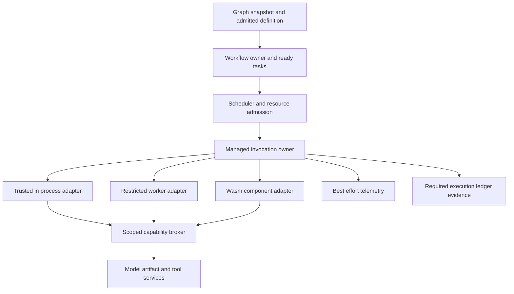
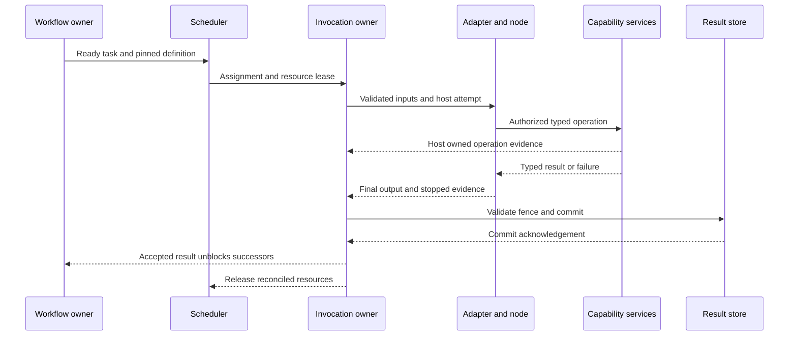

# Pantograph Node Execution and Dynamic Extensions

Execution contracts transparent observability and custom code without rebuilding the host

**Research date:** 2 October 2026  
**Repository baseline:** Pantograph `4938e405c7f656365eefdca492774ccae110c90d`, verified against `main` on the research date  
**Status:** Source-grounded design research; proposed APIs are illustrative, not implemented or approved architecture  
**Companion papers:** Pantograph Execution Ledger and Provenance develops durable evidence, retention and evaluation. The scheduler research owns ready-task placement and physical resource admission; the inference-backend research owns model, semantic task and runtime compatibility. Their proposed contracts remain proposals.

**Reading guide:** Sections 1 to 4 establish the requirement, observation limits, comparative research and language boundaries. Section 5 audits the current source. Sections 6 to 14 develop proposed contracts, lifecycle flows and qualification experiments. The complete source bibliography follows the conclusion.

## Executive result

The requirement is coherent if stated precisely: **a node author supplies useful computation and a small, versioned contract; Pantograph supplies execution identity, admission, supervision, lifecycle observation, capability-mediated effects, and result commitment.** Authors need not write tracing, timing, exception logging, or attempt bookkeeping in every node. They still need to declare what the computation accepts, produces, needs, and may affect. Arbitrary native code cannot simultaneously retain unrestricted access and provide an enforceable promise that every effect is observed.

Pantograph is unusually well positioned for this design because ADR-007 already assigns baseline node observability to the embedded runtime. The gap is not that nobody has conceived a wrapper. It is that several existing pieces represent different levels of maturity and are not interchangeable:

1. `NodeExecutor` and `NodeRegistry` provide in-process execution and callback registration. They do not establish a packaged runtime plugin protocol, security boundary, or live upgrade policy.
2. Built-in descriptors are collected at link time. Their presence in a palette does not prove their executability through the scheduler.
3. The current canonical task classifier recognizes a narrow first-stage set and rejects other node types. Graph derivation obtains built-in contracts. A newly registered callback therefore does not automatically become a supported canonical task.
4. Runtime-created observation contexts and guarantee categories exist, but their constructors and booleans are not proofs of mediation. A symbol search did not establish canonical composition of the narrow `NodeExecutionDiagnosticsRecorder`. Separately, the `NodeExecutionWorkflowLedgerSink` is constructed and injected in named canonical host/session paths. The question is consistent coverage, attribution and acknowledgement, not whether Pantograph has any host-owned observation. [N13, N23]
5. The existing computed behavior digest hashes the node contract, not executable code or dependencies. Runtime extensibility requires additional immutable implementation identity.

The recommended direction is **one managed invocation contract with several execution adapters**, introduced incrementally through the existing owners. Keep trusted built-ins in process. Add an isolated worker adapter for broad Python/native-library use or a WebAssembly component adapter for tightly mediated portable logic, depending on actual author needs. Do not start with a universal language runtime, load arbitrary Rust trait objects across a dynamic-library boundary, or put code-loading policy inside the scheduler. [N01-N12]

## 1 Clarifying the requirement

"A node is just custom code" contains at least four distinct choices.

**Authoring simplicity.** A plain function should remain readable as domain logic. A manifest, generated binding, or registration call can carry platform concerns separately. Avoid requiring a node to create its own run IDs, spans, lifecycle events, resource reservations, or compliance records.

**Extension without rebuilding Pantograph.** The host binary should discover and invoke a new implementation without recompiling itself. A Rust or Wasm node may still need its own build. Installing an interpreted source package, loading a compiled component, and adding a new node instance to an existing graph are different operations.

**Operational visibility.** Pantograph should know which implementation ran, with which declared inputs and capabilities, when it started and stopped, what it returned, what failed, and whether its resources actually stopped. That can be owned at the invocation boundary.

**Freedom and trust.** The implementation may range from a pure transformation written by the user to a third-party package that can spawn processes, read files, load native extensions, or invoke models. These demand different containment. "Custom" describes authorship; it does not establish safety or malice.

A useful working requirement is:

> Pantograph executes versioned node programs through a host-controlled boundary. Baseline execution observation is automatic. Rich observations of model, tool, file, cache, and network operations arise from managed capability calls. Newly installed node packages may be admitted without rebuilding the host, subject to explicit compatibility and trust policy. Unmediated behavior is rejected or visibly classified with reduced guarantees.

This preserves two legitimate alternatives: trusted developer extensions with broad freedom, and restricted extensions with stronger enforceable guarantees. It does not make the user choose a language before the needed workload is understood.

## 2 What transparent observability can promise

### 2 1 Four observation layers

**Boundary facts** can be automatic: admitted definition/version, invocation identity, input validation, wall-clock start/end, terminal status, exception category, output validation, cancellation request and acknowledgement, worker exit, and result acceptance. The host knows these because it owns the call.

**Mediated-operation facts** can also be automatic: a model call's selected model/task/runtime, a tool operation's target and idempotency key, artifact reads/writes, cache hits, or a granted network request. The node calls a useful operation; the host capability adapter supplies identity and observation around it. Calling `models.classify(...)` is domain work, not tracing boilerplate.

**Runtime/environment facts** may come from samplers or runtime hooks: CPU time, process RSS, Wasm memory, stdout/stderr, exceptions, and supported library spans. Their scope and quality vary. Process RSS is not necessarily memory attributable exclusively to one concurrent task. Sampling misses short peaks. An asynchronous model request's wall time may include queueing, transfer and drain.

**Algorithmic meaning** is generally unavailable from a plain outer wrapper: "finished semantic phase 3," exact percentage complete, why a branch was selected, which record is semantically important, or whether an external side effect is reversible. Supply optional semantic progress/events, subdivide the node, or use a managed API that exposes the relevant operation. Do not fabricate meaning from CPU utilization or infer that a quiet function is hung.

OpenTelemetry's zero-code documentation makes the same important boundary: library/environment instrumentation can reveal application edges without normally instrumenting the application logic itself. Dapper demonstrated broad transparency by instrumenting common libraries and using sampling; it did not require omniscience over every instruction. Aspect-oriented programming supplies useful vocabulary for separating a cross-cutting concern from domain logic. Pantograph need not adopt a general aspect weaver to apply the principle. [E01-E03]

### 2 2 Transparency is about authorship not zero perturbation

No tracing code in the authored function does not mean no instrumentation runs. Wrapping, serializing, sampling, queuing and exporting have costs. Some observation changes scheduling and timing. Define a measurable budget for orchestration overhead, tail latency, memory, bytes retained and dropped events. Prefer monotonic clocks for duration and wall-clock timestamps for correlation. Record the observer version and sampling mode with any benchmark.

For Rust async execution, put the span on the invocation future rather than keeping a span-enter guard alive across an await. The `tracing` documentation explicitly warns that the latter can misattribute other tasks. Spawned work and worker IPC also need explicit context propagation, even when generated by the host/SDK. [E04]

### 2 3 Separate evidence completeness from application correctness and security

A node may be fully observed at its declared boundary and still compute the wrong answer. It may be resource-contained while its semantic operation is unauthorized. It may log every event but leak data through an overly broad network grant. These are independent dimensions.

A clearer proposed guarantee record has separate fields:

- lifecycle observation: complete, partial, unknown
- effect mediation: enforced, cooperative, bypass present, unknown
- isolation profile and tested target: in-process trusted, restricted worker, Wasm, other
- resource measurement scope/availability
- payload capture/redaction policy
- durable acceptance status for required evidence

Existing enum categories can remain a presentation summary, derived from those facts. "ManagedFull" should mean complete with respect to a documented observation contract, never "all instructions, intentions and side effects are known."

## 3 Lessons from existing execution systems

### Functions and state updates are different contracts

LangGraph makes node authorship ordinary function authorship, but its state model matters: a returned update is applied through a reducer for each state key. Compilation performs graph checks and binds runtime facilities; it is not rebuilding a native host binary. This distinction resolves an ambiguity in “dynamic nodes”: defining a new graph, registering a callable in a language runtime and installing executable code into an already deployed Rust application are three different capabilities. [E16]

Consider two parallel nodes that both return an `items` field. Replacing the field, appending lists, taking a set union and rejecting concurrent writes are four different graph semantics. A function signature alone does not select one. This is an illustrative counterexample, not an observed LangGraph defect. It shows why a plain-function author API can coexist with a substantial engine contract. Port types describe acceptable data; update and merge rules describe how concurrent results become graph state. A system that borrows the authoring syntax must still choose the semantics.

The same issue appears with caches and retries. A cached return value can be valid as a value yet inappropriate as a new side effect or as a repeated state update. A reusable output and an instruction to mutate shared state are different objects. Treating every node return as an unqualified JSON object postpones these questions rather than answering them.

### Task wrappers and durable orchestration solve different problems

Prefect's task abstraction adds task-run identity, state tracking, retry/cache behavior and operational visibility to decorated functions. Dagster ops expose declared inputs, outputs and configuration, with an execution context available when needed. These are concrete demonstrations that the platform can own routine execution bookkeeping while the function remains recognizable domain code. They do not remove the contract or make a language annotation a portable serialization specification. [E18, E19]

Temporal separates activity implementations from deterministic workflow orchestration. Activity writes should be idempotent; the retry boundary is part of the operation's design. Workflow replay has a stronger requirement than re-invoking an arbitrary function: replay must preserve compatible command behavior. Worker interceptors provide a central place to wrap invocation and outbound operations. These mechanisms answer three distinct questions: what runs, how it is observed and what can be safely reconstructed from history. [E06, E07, E17]

For example, let a node send an email and then lose its completion response. A retry can send a second message even when the engine records exactly one accepted node result. A task wrapper can identify both attempts, and a history can explain the ambiguity; neither alone changes the remote mail service into an atomic participant. A stable operation key accepted by the destination, a queryable provider receipt or an explicit reconciliation policy is needed. This reasoning applies across frameworks and is why “retries supported” is not equivalent to “effects happen once.”

### Hooks change visibility and authority independently

Dask exposes scheduler and worker plugins with lifecycle/transition hooks. Its scheduler plugins execute in the scheduler thread, which makes them powerful and means slow or failing instrumentation can affect a critical owner. Ray supplies remote functions and runtime environments for code/dependency execution, while its ordinary cluster trust model expects trusted code and an external security boundary. Packaging, distribution, observation and isolation are separable mechanisms. [E20, E21, E24, E15]

An observer can therefore be transparent to the author but operationally privileged. If it sees raw arguments, accesses credentials or writes external telemetry, it needs an explicit data policy. If it runs synchronously in a control-plane callback, it needs a latency and failure budget. Moving the observer out of the node body does not make its work free or remove its authority. These are consequences of where interception occurs, not reasons to force authors to duplicate logging code.

### Program boundaries define the available evidence

An ordinary host call can measure that an invocation began, returned or raised an exception. A mediated file read adds a stronger fact: a particular operation was checked and completed through a known service. A contained guest with no other file route supports stronger coverage than an unrestricted native function with the same wrapper. Wasmtime's import boundary and WIT's explicit imported/exported interfaces offer one way to make this distinction concrete. A C ABI offers interoperability, but by itself does not restrict what native code does with the process's authority. [E08, E11, E12]

A useful thought experiment is two functions with identical arguments, outputs and timings. One computes locally; the other additionally sends the input over an unobserved socket. Their outer lifecycle traces can be identical. No outer wrapper can infer the hidden effect from those traces alone. To distinguish them, the system must mediate the network path, instrument a lower boundary with adequate coverage, or accept a weaker guarantee. A manifest describing a pure function is not evidence that the second function cannot run.

This yields the central research conclusion: the simplest author API is compatible with strong observation only when the runtime owns the relevant boundary. It is not necessary to adopt a general aspect weaver, a distributed task system or a universal sandbox. The appropriate mechanism depends on which operations must be known and which authority must be withheld.

### Comparison criteria for an extension experiment

A useful experiment should hold the authored computation fixed and vary the boundary: trusted in-process call, supervised worker and restricted component. Measure installation/import latency, warm call overhead, data copies, cancellation-to-quiescence, memory scope and required-evidence acknowledgement separately. Execute both a small transformation and a realistic dependency-heavy node; a long model call can hide substantial control overhead.

The result should identify which guarantee became enforceable, which remained cooperative and what it cost. Passing a pure-function example establishes the wrapper path. Passing a native-library example establishes that dependency path. Neither proves platform-wide hostile-code containment. This experimental separation is more informative than scoring frameworks with a single “dynamic,” “observable” or “safe” checkbox.


| System | Useful mechanism | What Pantograph can borrow | What it does not establish |
|---|---|---|---|
| LangGraph | Nodes are ordinary sync/async functions with state and optional runtime/config context; state updates are applied through reducers | Plain authored functions, injected services, explicit state-update semantics | Rust plugin ABI, hostile-code isolation, or arbitrary deep semantic observation [E16] |
| Temporal | Registered activities plus deterministic workflow orchestration; worker interceptors wrap inbound/outbound calls | Separate logical operation from attempts; central lifecycle interception; version-aware replay boundaries | Exactly-once arbitrary external effects or transparent unrestricted replay [E06, E07, E17] |
| Prefect | Decorated Python tasks automatically acquire run state, runtime metadata, retry/cache behavior | Thin registration layer and centrally owned task lifecycle | That every task is pure, every timeout stops native work, or local state is durably accepted immediately [E18] |
| Dagster | Ops declare inputs/outputs/configuration and may receive an injected execution context | Explicit data contracts with optional context; definition separated from invocation | That optional context itself enforces authority or that a Python type annotation is a cross-language artifact schema [E19] |
| Dask | Scheduler/worker lifecycle plugins observe transitions | Engine-owned observation hooks and bounded diagnostic work | Untrusted instrumentation isolation; scheduler plugins run privileged code in the scheduler's own thread [E20] |
| Ray | Remote functions and runtime environments distribute code/dependencies | Separate definition/deployment/environment from invocation; explicit worker ownership | Ordinary task execution as a sandbox; cluster security still has an external trust boundary [E15, E21, E24] |

Sources: [E06, E07, E15-E21, E24]. These are mechanism comparisons, not drop-in replacement recommendations. Their runtime model, persistence semantics and deployment assumptions differ from Pantograph's local-first Rust host.

The common pattern is a small authored computation within a larger execution protocol. The platform obtains task-level visibility from controlling invocation, rather than requiring every useful function to emit its own start/finish events. The hard part is not syntactic wrapping; it is preserving meaning under concurrency, crashes, effects, retries and upgrades.

## 4 Dynamic loading options for a Rust host

### 4 1 In process trusted Rust registrations

Best for built-ins and code shipped with Pantograph. It gives direct types, low serialization cost and easy integration. Current traits and factories already support this level. A linked-in registry does not meet post-deployment external-code loading by itself. Keep it as an adapter implementation and benchmark baseline, not the only extension story.

### 4 2 Native dynamic libraries

A versioned C-compatible ABI or another deliberately stabilized ABI can load separately built native code. Plain Rust trait objects and Rust ABI are not a durable plugin contract: the Rust Reference gives the native Rust ABI no stability guarantee. FFI also needs explicit ownership/allocation, panic/unwind, threading, lifetime and unload rules. [E08]

This option is appropriate only for trusted native extensions where in-process compromise/crash is acceptable. A signature can establish who supplied bytes, not what those bytes may do. Native code shares the process's authority; a manifest is not enforcement. Do not unload a library while callbacks, futures, types, destructors or worker threads originating from it remain live. For early designs, process replacement is easier to reason about than hot-unloading native code.

### 4 3 Python or JavaScript worker processes

A small worker protocol can receive typed requests, invoke a plain function, and return typed results/events. This supports Python scientific/native libraries or JavaScript packages without rebuilding the Rust host. Python entry-point metadata offers a standard discovery mechanism, but discovery and executing/importing the entry point are different stages. [E09]

A process boundary provides crash separation and a lifecycle the host can supervise. By itself it does not deny filesystem, network, environment or credential access. Add an explicit OS sandbox profile, controlled environment and working directory, approved executable/package digest, resource quotas, and process-tree ownership where the target supports them. A virtual environment solves dependency organization, not hostile-code containment. Node.js explicitly says its `vm` module is not a security mechanism; it should not be used as the claimed hostile-code boundary. [E10]

The protocol should be negotiated, length-delimited/bounded and request-correlated. Treat stdout/stderr as untrusted logs, not as an authoritative result protocol unless the worker protocol reserves and validates a separate framed stream. Per-attempt processes give stronger state separation but cost startup time; worker pools improve throughput but require reset/contamination tests and environment/version pinning.

### 4 4 WebAssembly components

WIT worlds specify imported and exported interfaces, making a useful language-neutral node boundary. A node component can export computation and import only the host capabilities it needs. Wasmtime documents memory isolation, checked control transfer and imports/exports as the external interaction boundary. That is much closer to enforceable mediation than a cooperative wrapper around unrestricted native code. [E11, E12]

Fuel or epoch interruption can bound Wasm execution; resource limiters constrain configured VM resources. These do not automatically bound an arbitrary blocking host import, all host allocations, a GPU request, or spawned external work. The host must enforce deadlines and quotas on its own capabilities too. Interruption and observation also have overhead; qualify it for representative nodes. [E13, E14]

Wasm is attractive for parsing, transformation, validation, routing and portable custom logic. It is not a promise that every Python package, CUDA extension, native ML stack or operating-system API works inside the guest. Such work can call mediated host services or use a separately isolated native worker. Pin the chosen Wasm/WASI/component toolchain and supported features; documentation-level availability of an async/stream feature does not establish that all target language bindings and packaged platforms support it.

Portable Wasm and engine-specific precompiled native artifacts have different trust requirements. Accept portable modules/components through validating compilation by default. Wasmtime's unsafe deserialization APIs are not safe for arbitrary downloaded bytes. Only deserialize unchanged artifacts from a trusted compatible build/cache, with verified compilation provenance and integrity; a filename or digest alone is insufficient. Keep mapped compiled files immutable for their lifetime. Bound compilation and installation resources as well as guest execution. The cited live API documentation is not qualification of a deployed runtime version. [E25]

### 4 5 Remote task service

The same bounded invocation protocol could later reach an authenticated remote host. That adds data-placement authorization, transfer/artifact availability, leases, fencing, failure detection, capability freshness and network uncertainty. It should follow a proven local supervised protocol, not be smuggled in as a plugin-loader detail. A distributed task framework is not automatically a multi-tenant security boundary: Ray's security documentation requires trusted code and isolation outside ordinary cluster execution. [E15]

### 4 6 Decision with alternatives preserved

Prefer **trusted built-ins plus one external adapter first**. Choose a restricted Python worker first if immediate custom nodes require NumPy/PyTorch/native packages and the code's trust profile can be supported by the desktop platforms. Choose Wasm first if controlled transformations and enforceable mediation matter more than unrestricted native ecosystems. Retain native dynamic libraries as an expert, trusted option only when measured needs justify ABI and lifecycle complexity.

No framework comparison establishes which choice fits the user's actual nodes. A two-node qualification experiment, one realistic dependency-heavy node and one pure transformation, should decide the first external adapter.

## 5 Current implementation and integration gaps

### 5 1 Existing responsibilities should survive the extension design

`ARCHITECTURE.md` assigns graph semantics and materialized non-runtime node execution to `node-engine`/`workflow-nodes`; node contracts to `pantograph-node-contracts`; workflow/run orchestration to workflow-service; resource selection to scheduler/registry; and concrete runtime execution to embedded-runtime. Public runs use execution sessions. A generic extension facility must feed these owners rather than restore a parallel direct-runtime path. [N01]

ADR-007 is even more direct: runtime-created context owns attribution, cancellation, progress, lineage, managed capability routing, and guarantee classification. Node-engine events are lower-level facts; durable attribution and compliance meaning do not belong to each node implementation or host binding. This is architectural support for transparent baseline observability, not evidence that every path is already fully integrated. [N02]

### 5 2 An executor registry is not yet a plugin system

The current `NodeExecutor` is an async Rust trait receiving task ID, JSON input map, graph-flow context, and `ExecutorExtensions`, returning a JSON output map. `NodeRegistry::register_callback` wraps a closure and stores it through a shared executor factory. The registry can merge another registry; duplicate names overwrite entries. Built-ins are registered as metadata-only entries by iterating `inventory` descriptors collected in the link unit. Their metadata is projected into canonical built-in contracts separately. [N03, N04, N22]

`ExecutorExtensions` is an in-process typed dependency map using `Any + Send + Sync`. It supports trusted injection; it is not a serialized plugin ABI or an enforced capability-grant system. [N21]

This is useful dependency injection and dispatch. However, the inspected types do not themselves define:

- a package manifest, executable digest, signature policy, or dependency lock
- on-disk discovery, an installation transaction, or a loader for an external module
- a negotiated wire/ABI version or language-independent invocation boundary
- concurrent registry snapshot replacement and in-flight version pinning
- sandbox enforcement, permission grants, memory/CPU limits, or worker lifecycle

The distinction matters operationally. `RegistryTaskExecutor` holds `Arc<NodeRegistry>` and resolves a type from `_data.node_type`, with a task-name fallback. Registration takes mutable registry access; this is not itself a hot-reload design. Callback executors ignore the supplied graph context/extensions and expose only task ID and inputs to the callback. A capability-aware SDK cannot assume those callbacks already receive managed capability handles. [N03]

### 5 3 Canonical scheduler integration is narrower than low level execution

Graph derivation collects `workflow_nodes::builtin_node_contracts()`. The current classifier treats `puma-lib` as materialization, supported `llm-inference` as runtime inference, text/boolean input as source input, and text-output as non-runtime node-engine work. Other types are `Unsupported`, including other nonempty inference-contract cases. The non-runtime adapter currently translates the `TextOutput` template only. [N05-N07]

The one-task core API creates a fresh graph-flow context, empty extensions, and a `CoreTaskExecutor`; it calls `execute_task` and returns outputs. It does not take a `NodeExecutionContext`, diagnostics recorder, plugin adapter, or event sink. Broader scheduler orchestration may record task transitions around it; the specific one-task helper is not an automatic reuse of DemandEngine lifecycle interception. [N08]

Consequently, the integration task is larger and clearer than "add a plugin to the registry": replace built-in-only task-definition lookup with an admitted, immutable catalog snapshot; classify executability from an approved binding to an execution adapter; and make all admitted paths pass through the same supervision and output-validation boundary. Preserve typed unsupported outcomes rather than introducing a catch-all arbitrary-JSON execution escape.

### 5 4 Canonical contracts are useful but do not yet express the whole operational promise

`NodeTypeContract` includes ports, execution semantics, capability requirements, inference-task contracts, authoring metadata, version and digest. Ports include requirement/cardinality, value type, constraints and schema references. Effective contracts can incorporate configuration-dependent ports. These are substantive foundations. [N09]

Nevertheless, a constraint field in a descriptor is not evidence that runtime payload values are checked against it at every boundary. `PortContract::validate` in the inspected file validates its label; `NodeTypeContract::validate` checks metadata, behavior version and input/output port kinds. Connection compatibility and effective-contract formation are different questions from validating an actual returned tensor shape, JSON object, artifact handle or stream chunk. A new external adapter needs explicit value validation. [N09]

`NodeBehaviorVersion` derives a default digest by serializing the contract after clearing its digest. That detects contract changes, not an implementation change with unchanged ports. It may also change when descriptive contract metadata changes. Keep contract, implementation, environment and configuration identities distinct; do not simply relabel this digest as a code hash. [N10]

### 5 5 Observation contracts exist guarantee evidence needs a stronger producer

`NodeExecutionContext` associates workflow/run attribution, effective contract, attempt, cancellation, progress, lineage, capabilities and classified guarantee. `NodeExecutionGuaranteeEvidence` distinguishes managed-full, managed-partial, escape-hatch and unsafe/unobserved states. The classifier is based on supplied booleans. `NodeManagedCapabilities::from_requirements` creates route records with availability set true; these route structures expose availability checks, not concrete authorized file/network/model operations. [N11, N12]

This is a representation of evidence, not a sandbox. For a restricted extension, only the host should construct its authoritative evidence, based on adapter enforcement and actual mediated operations. A declared required capability must not become a grant merely because it appears in a manifest.

The narrower `NodeExecutionDiagnosticsRecorder` stores contexts keyed by node ID and enriches matching events with run and attempt facts. If one recorder were shared across concurrent runs or retries using the same node ID, later registration could replace an earlier context; the current key is not a complete attempt identity. This is a conditional design risk, not a demonstrated production race. Scope recorders per attempt/run or use a composite key before relying on them for dynamic concurrent execution. [N13]

This recorder must not be confused with `NodeExecutionWorkflowLedgerSink`, whose construction and injection are visible in `embedded_workflow_host.rs` and `workflow_execution_session_execution.rs`. That sink already captures workflow/node facts and I/O artifact observations. Some setup paths discard construction errors with `.ok()` and use a null sink fallback. Existing wiring is therefore positive evidence; it does not settle whether required observation fails visibly or whether every canonical adapter emits every needed fact. The ledger companion examines these distinctions. [N23]

The legacy demand path emits start, input-resolved and completion events around execution and caches outputs. Its send helpers deliberately ignore event-sink errors. `BroadcastEventSink` also ignores send failure. These choices can be reasonable for best-effort UI progress, but do not establish lossless audit delivery. The cache-hit path emits completion without fresh computation. A ledger must preserve that distinction rather than count it as a new execution. [N14, N15]

### 5 6 Existing process and foreign language paths require careful qualification

The process node is disabled by default and uses an explicit command allowlist. Its implementation supports arguments, working directory, environment, stdin, timeout and captured outputs. This is a useful opt-in safety control. It is not a complete sandbox: the inspected path does not establish path/digest-pinned executable identity, per-argument capability policy, environment isolation, bounded pipe buffers, CPU/RAM quotas, network restrictions, or descendant-process containment. Allowing a general-purpose interpreter can authorize far more behavior than the executable's name suggests. [N16]

A Rustler callback bridge also exists, with JSON request/response and timeout. It is evidence of prior cross-language experimentation, not automatically the supported future execution seam. The old architecture/lifecycle plan proposed removing unproved callback/runtime ownership, but that plan is explicitly superseded. The active successor requires fresh domain review, respects existing ADRs and supported consumers, and rejects wholesale speculative rewrites. No decision here should resurrect a historical plan as present authority. [N17-N19]

## 6 The proposed managed execution contract

### 6 1 Distinct identities

Use distinct identities for the node type, immutable implementation artifact, graph node instance, graph revision, logical invocation, retry attempt, worker/session, and output artifact. A trace ID is useful correlation, not authorization or a unique durable event key.

An illustrative identity envelope is:

```text
NodeDefinitionRef = (namespace, node_type, contract_version,
                     contract_digest, implementation_digest, adapter_kind)
InvocationRef     = (workflow_id, graph_revision, run_id, node_id, invocation_id)
AttemptRef        = (InvocationRef, attempt_number, generation, assignment_id)
EffectRef         = (logical_operation_id, stable_suboperation_key)
EventRef          = (producer_epoch, producer_sequence, event_id, AttemptRef)
```

Retry attempts have different attempt IDs while a retried external logical operation usually needs the same deduplication key. Do not derive effect idempotency solely from an attempt number. A worker reports correlation; the host binds it to an already admitted request and rejects spoofed or stale claims.

### 6 2 Author facing API and host facing protocol are different surfaces

The easiest pure node remains:

```text
normalize_text(input: NormalizeInput) -> NormalizeOutput
```

A node needing managed services may use:

```text
classify(input: ClassificationInput, services: DeclaredServices)
    -> ClassificationResult
```

`DeclaredServices` should expose only authorized domain operations, not the scheduler, global registry, raw process launcher or ledger database. An SDK can bind ambient per-invocation context internally, or accept explicit dependencies for testability. Ambient context must remain correctly scoped under async work; explicit injection is easier to reason about but can be generated. Neither choice requires application-authored tracing.

The internal adapter protocol is richer:

```text
describe(metadata_only) -> NodeDefinition
prepare(approved_definition, granted_capabilities, limits) -> PreparedHandle
invoke(prepared_handle, AttemptEnvelope, ValidatedInputHandles) -> OwnedExecution
OwnedExecution.events -> bounded typed event stream
OwnedExecution.cancel(reason) -> cancellation_requested
OwnedExecution.await_terminal() -> Outcome + quiescence evidence
OwnedExecution.close() -> cleanup outcome
```

These names are explanatory. They should deepen existing interfaces where possible rather than create a second universal execution framework. `describe` must not casually import or run an untrusted package in the control plane. Data-only metadata comes first; any necessary introspection runs inside the chosen execution boundary.

Pantograph also has a typed runtime-host seam with versioned requests, cancellation context, validated scheduler handoff, typed inputs, correlated responses and path-free typed outputs. This is a useful existing integration base. Its current contract is not already a universal custom-language plugin protocol, and an extension adapter must preserve the seam's authority and validation boundaries. [N20]

The host owns retry policy, deadlines, attempt identity and output commitment. A node may report a typed retry hint, but should not independently retry a side effect while the outer scheduler also retries it without a bounded combined policy.

### 6 3 Required descriptor dimensions

The admitted definition should associate:

1. **Data contract:** typed input/output ports, required/optional/nullable rules, cardinality, schema version, configuration schema, units/shapes where relevant, and bounded payload sizes.
2. **Execution binding:** supported adapter/protocol version, entry point, implementation digest, dependency/environment identity, and platform requirements.
3. **Effects and state:** pure/read-only/effectful/unknown declarations, state scope, retry safety, cache eligibility, and any state migration/checkpoint contract.
4. **Capabilities:** requested model tasks, artifact scopes, file/network/tool access, secrets by scoped handle, and optional versus required dependencies.
5. **Lifecycle:** batch/stream/reactive/manual behavior, cancellation support, concurrency/reentrancy, deadlines, readiness prerequisites, and output commitment semantics.
6. **Observation:** minimum automatic facts, optional semantic events, data-capture policy, and the enforceable guarantee of its selected adapter.

Do not trust these declarations as evidence of behavior merely because they parse. Admission compares them with the adapter's real capabilities, the granted policy and qualification results. For unknown third-party code, "pure" is a claim to restrict and test, not permission to expose host APIs.

### 6 4 Validate values at both sides

Graph-time checks establish connection compatibility. Invocation-time checks establish that actual values satisfy the resolved contract. Output validation happens before downstream tasks are unblocked. Reject missing required outputs, malformed values, undeclared outputs according to an explicit policy, overlarge values, invalid references and a changed dynamic-port schema.

Use typed artifact references or stream handles for large media/tensors rather than embedding all data in an unbounded JSON object. Validate ownership and access on dereference. Type names should express semantics, such as classification scores with label mapping, bounding boxes with coordinate convention, or timestamps with sampling rate. The inference backend owns how models realize such tasks; the node contract consumes those task semantics. A string-to-JSON escape does not establish compatibility.

Opaque language objects should not become the cross-trust serialization format. Python's pickle documentation warns that unpickling can execute arbitrary code. A data protocol still requires size, nesting and allocation limits even when it avoids executable deserialization. [E05]

## 7 Lifecycle cancellation retry cache and state

### 7 1 Host owned lifecycle

A proposed invocation passes through definition resolution, admission, input readiness/validation, resource acquisition, adapter preparation, running, draining, output validation, result commit and resource release. Preserve blocked, rejected, failed, cancelled and unknown outcomes separately. Waiting for human input should yield a durable continuation description where supported, rather than require a suspended worker and live stack forever.

Not every state needs to become a new public enum. The key is that the owner can answer whether work was admitted, began, produced provisional data, stopped, committed and released resources. An accepted launch is not a completed node; a completed compute call is not necessarily a retained/committed output.

### 7 2 Cancellation is a protocol not a boolean

The existing atomic cancellation token can support cooperative checks. It cannot forcibly interrupt arbitrary native code that never checks it. Distinguish:

- requested: the owner recorded intent and rejects new mediated work
- signalled: the adapter delivered a cancellation message/token/signal
- quiescent: the producer and its owned subwork have actually stopped
- committed terminal state: the authoritative task outcome is recorded
- cleanup complete: leases, handles and processes were reconciled

Quiescence evidence must come from a trusted adapter or supervisor observing its actual execution boundary; an untrusted guest's own "stopped" message is insufficient. A deadline stops the host waiting only if the protocol says so; it does not prove a worker, external request, GPU operation or descendant process stopped. Do not release memory reservations or accept a new conflicting owner while the old execution still uses them. Escalation should be adapter-specific: cooperative signal, grace interval, then a supported hard boundary. After a crash or partition, use an unknown/reconciliation state when effects may have occurred.

### 7 3 Retry and result commitment

Three policies should be distinguishable: no automatic retry, retry safe by purity or verified idempotency, and retry requiring reconciliation/compensation. A transient transport failure does not tell the host whether an external mutation happened.

For a database, payment, file publication or external tool effect, stable operation identity must be enforced at the destination or within a transactional/conditional-write protocol. Exactly-once visible Pantograph result commitment is possible under a suitable authoritative store and fencing design; exactly-once arbitrary external side effects do not follow from it. Temporal's activity guidance recommends idempotent writes and timeout/retry contracts, while its workflow replay rules constrain deterministic orchestration. These are useful distinctions rather than a reason to convert every node into Temporal workflow code. [E06, E07]

Output commitment should compare the active attempt/generation and graph snapshot, validate the returned contract/artifacts, and atomically accept one result for the logical invocation. Late results remain evidence but cannot overwrite newer committed state or unblock successors. Source inspection here does not claim Pantograph currently enforces every element of this proposed invariant.

### 7 4 Cache is an explicit semantic choice

A cache key may include implementation digest, effective contract, normalized inputs/configuration, relevant dependency/environment identity, capability/model facts and state version. More inputs may be necessary for external data freshness. Do not promise correct caching of arbitrary effectful nodes merely because inputs are equal.

Keep a cache-hit event separate from a compute attempt. Cached output provenance references the producing invocation and the reuse decision. Changing implementation with identical ports invalidates any cache keyed only by contract identity. Nondeterministic model inference may be intentionally cached as prior-result reuse, but that is a declared product policy rather than proof of deterministic recomputation.

### 7 5 Stateful nodes and reentrancy

The present shared callback executor can carry shared state; a Rust `Send + Sync` bound does not define the desired semantic state scope. Specify one of attempt-local, run-local, workflow-session-local, or explicitly shared service state. Default to fresh invocation state for simple functions, and require deliberate opt-in for shared actors/services.

Durable state needs schema/version, serialization ownership, checkpoint timing, restore compatibility, concurrent access and conflict policy. A live model session or KV cache may be a managed runtime handle rather than a portable checkpoint. Reusing a worker process is not permission to leak run-local state between users or workflows. Hot upgrade must not mutate a live stateful instance's code underneath it.

## 8 Streaming and backpressure

Streaming has at least three channels: user data, semantic progress, and operational diagnostics. They should not silently share a single unbounded queue or the same loss policy.

Data chunks need port/stream ID, attempt/generation, sequence, schema and final outcome. A token stream is only one payload type. Images, audio frames, tabular batches and structured patches need their own semantics. Progress can be coalesced; debug telemetry may be sampled or dropped with counters. Required terminal/audit records need a distinct durable acceptance policy. A slow UI must not block the process supervisor from receiving a worker's exit.

Define limits for queue bytes, chunk bytes, in-flight chunks, subscribers and total retained output. Apply credits, bounded channels or pull-based consumption. If a downstream node can start on a partial stream, it needs a different readiness and failure-propagation contract from the existing materialized-input path. Initial extensibility can explicitly require materialized outputs between tasks while still streaming previews to the UI. That smaller promise avoids accidentally redesigning the graph engine.

Never treat a partial preview as a committed final output. A failed attempt can leave visible preview chunks that must be marked incomplete. A retry either starts a distinct stream or follows a verified resumable stream protocol. Reusing sequence numbers without an attempt epoch can interleave incompatible outputs.

## 9 Admission installation and hot upgrade

Runtime extension should be an explicit transaction:

1. Discover a data-only manifest from an authorized package source.
2. Resolve immutable package/dependency identities and verify the installation policy.
3. Validate node schemas, namespace uniqueness, adapter/protocol compatibility and declared capability requests.
4. Construct grants from user/host policy and execution context; deny absent required permissions.
5. Prepare or qualify the adapter in isolation, without executing package initialization in the control plane.
6. Publish an immutable catalog revision atomically.
7. Pin submitted run snapshots to admitted definition revisions.
8. Route new runs to a new revision while old attempts drain under their original revision.
9. Retire an old implementation only when live execution/state/checkpoint references allow it.

"Install" should not silently replace a built-in sharing the same string ID. Namespaced IDs and explicit replacement policy improve on the current overwrite-on-registration behavior. A revocation differs from an upgrade: policy may prohibit new attempts of a known-bad version while requiring active attempts to cancel. If a prior version is unavailable on restart, report that the run cannot resume compatibly; do not silently use latest.

A definition's immutable artifact digest is necessary but insufficient. Dependencies, worker executable, relevant environment, generated wrappers, interpreter/compiler/runtime version and capability adapter semantics can affect results. Store enough identity to explain what ran without claiming perfect reproducibility of nondeterministic hardware or external services.

## 10 Security and observation integrity

Saltzer and Schroeder's least-privilege, fail-safe-default and complete-mediation principles are directly relevant: a permitted operation should have a narrowly scoped route, and every protected access should be checked at its actual authority boundary. [E22]

For Pantograph, distinguish three useful deployment profiles:

- **Trusted local developer:** first-party or explicitly trusted packages can run in-process or broad workers. Automatic boundary observation is available; effect mediation is cooperative unless constrained by the environment.
- **Restricted extension:** a component or OS-isolated worker has only scoped capability access. Host mediation can enforce the declared effects within that boundary, subject to runtime/OS correctness.
- **Untrusted third-party/agent-generated code:** treat code, metadata, dependency installation, output and logs as adversarial. Use a qualified sandbox and narrowly scoped broker; if a platform cannot enforce the required profile, reject it rather than quietly downgrade.

Resource containment, data isolation and code provenance are separate controls. Linux cgroups provide CPU/memory accounting and limits; they are not by themselves a filesystem/network permission model. Other desktop platforms require their own verified mechanisms. No single Linux sandbox claim establishes macOS or Windows support. [E23]

The worker must not author authoritative run attribution, grants, completed ledger records or success guarantees. It can emit claims/events; the host validates and enriches them. Rate-limit malformed messages, huge logs, progress floods and recursively nested outputs. Render logs safely rather than executing terminal/HTML control content. Do not put secrets, raw model prompts or file contents in spans by default.

Observation that silently disappears under overload is not complete. Conversely, an unavailable tracing backend should not accidentally turn a pure successful computation into a retry that repeats a mutation. Define two paths: best-effort telemetry with visible loss accounting, and required execution/effect evidence with explicit admission/commit behavior. Their persistence and retention design belongs to the ledger paper.

## 11 Proposed ownership and lifecycle flows

### 11 1 Ownership and adapter boundaries



Figure 1. Proposed responsibilities layered over the existing owners. This is not a proposal for one new universal runtime or one process per box. The scheduler admits work and resources; an admitted adapter loads and supervises node code. Required evidence and best effort telemetry have different delivery contracts. Model execution remains under the established runtime host authority.

### 11 2 A successful managed attempt



Figure 2. Proposed successful invocation. The capability operation passes through the scoped broker, omitted from the drawing for legibility. Output acceptance and resource release require separate idempotent reconciliation. No distributed atomic transaction across all boxes is implied. A restricted adapter must independently establish quiescence; a guest message alone cannot prove it.

### 11 3 Cancellation and late output


Figure 3. Proposed cancellation protocol. A late success from a stale attempt remains reconciliation evidence; it cannot publish a cancelled result. Unknown external effects need operation-specific reconciliation. A cancellation request and a timeout are not evidence that physical resource use ended.

## 12 A practical migration sequence

**First, establish a single invocation boundary.** Trace one canonical non-runtime node and one runtime-backed node end to end. Record where attempt identity, cancellation, diagnostics and result acceptance actually originate. Resolve any missing context registration without changing author code.

**Second, make the definition catalog authoritative.** Introduce immutable admitted definition references into graph snapshots and task derivation. Replace node-name special cases only where an approved adapter and typed contract can preserve existing invariants. Keep unsupported nodes rejected while this migration proceeds.

**Third, prove a trusted registration API.** Execute an ordinary pure function through the managed path and demonstrate lifecycle/error observation with no node-authored diagnostics. Verify output validation, retry attempt separation and code-identity cache invalidation.

**Fourth, add one external adapter.** Choose it from real node requirements. Include discovery, compatibility negotiation, bounded transport, start/import supervision, cancellation/drain, and package/environment identity. Do not claim runtime extensibility from a palette-only demonstration.

**Fifth, enforce a restricted capability profile.** Route artifact/model/tool operations through host-owned services. Test denied operations and honest guarantee reduction where a trusted escape hatch is allowed. Keep runtime inference compatibility under its existing owner.

**Sixth, qualify upgrade and crash recovery.** Install v2 while v1 is running; prove old attempts remain pinned, new runs select the intended version, late outputs are fenced, and a cold restart cannot silently substitute code.

This sequence is deliberately not an implementation backlog with inferred priorities or a new code change authorization. It is a way to reduce uncertainty before selecting a final architecture.

## 13 Qualification claims and falsifiers

No repository builds, model runs, plugin loads, arbitrary-code execution or hardware benchmarks were performed for this report. The following are proposed experiments.

| Claim | Representative test | Falsifier |
|---|---|---|
| No tracing boilerplate | Plain function returns, throws, waits and is cancelled through every admitted adapter | Missing/misattributed start or terminal facts without authored tracing |
| New nodes without host rebuild | Install new external package and invoke through a saved scheduler-backed graph | Only UI metadata appears, or canonical classifier rejects it |
| Attempt isolation | Concurrent runs with same node ID; retry before delayed prior event arrives | Old context overwrites new attribution or late output commits |
| Honest error reporting | Typed error, panic, process crash, startup failure, malformed frame, OOM | Any false success or unclassified terminal loss |
| Safe cancellation | Busy CPU, blocked I/O, child process, model request, output drain | Deadline returns but leased work continues unreported |
| Bounded streaming | Slow/absent consumer, huge chunk, unlimited logs, progress flood | Unbounded host memory or supervisor starvation |
| Declared permissions enforced | Attempt undeclared artifact/file/network/model access in restricted profile | Success through a bypass while guarantee remains full |
| Upgrade pinning | v1 active, install v2, restart, revoke v1 | Active run changes implementation silently |
| Retry safety | Crash after external effect but before completion acknowledgement | Duplicate effect where idempotency was promised |
| Cache correctness | Same ports but changed code/dependency/state; cache hit replay | Stale result accepted under an insufficient key |
| Observation integrity | Exporter unavailable, durable evidence queue full, malformed worker IDs | Invisible loss, forged authority, or accidental effect retry |
| Portability | Representative supported OS and language package paths | Sandbox/lifecycle claim based solely on a different platform |

Measure cold installation/import time, warm invocation overhead, payload-copy cost, throughput, p50/p95/p99 orchestration latency, peak memory, cancellation-to-quiescence latency and observation bytes/loss. Compare no-observer, boundary-only, capability-observed and full-debug configurations. Use real lightweight nodes as well as model calls so large inference time does not hide control-plane cost. Do not import benchmark numbers from another framework as Pantograph results.

## 14 Decisions that determine the design

These questions need decisions eventually, but none blocks the research brief:

1. **First authors and languages:** are initial nodes first-party Rust, the user's Python packages, JavaScript functions, or untrusted downloaded/agent-written code?
2. **Required dependencies:** do they need native Python/CUDA libraries, arbitrary OS processes or only managed model/tool services?
3. **Trust promise:** is cooperative observation sufficient for trusted code, or must the host prevent unobserved effects?
4. **Installation lifecycle:** may a host/worker restart when adding nodes, or is uninterrupted versioned installation required? "No recompile" alone does not imply hot replacement.
5. **Observation depth:** are lifecycle, typed inputs/outputs and managed calls sufficient, or are internal phases required? Optional semantics must be authored or supplied by a known runtime.
6. **State and effects:** are nodes pure transforms, retriable external operations, long-lived stateful services, or a mixture?
7. **Stream semantics:** are streams UI previews until final materialization, or can successors consume partial data?
8. **Supported desktop targets:** which OSs must enforce the same restricted-code promises?

The first implementation decision is therefore the kind of code to support initially: dependency-heavy Python/native-library code, or tightly restricted transformations mediated by the host. Selecting one adapter first does not permanently exclude the other.

## Conclusion

Pantograph can make ordinary node authorship feel like writing a function while still owning the difficult execution protocol. The strongest architecture is neither "every node writes its own tracing" nor "the engine can magically understand all arbitrary code." It is an explicit managed boundary: stable definitions, validated data, scoped services, supervised execution, truthful observation and fenced result commitment.

The existing source already contains important pieces and a matching observability decision. The next design work should join them through the canonical scheduler path, close identity and enforcement gaps, and choose one external execution adapter from real requirements. That delivers runtime extensibility without confusing extensibility, observability, durability and security into one promise.

## Evidence and method

The report combines read only source inspection at the pinned revision with primary standards, papers and official product documentation retrieved on 2 October 2026. The node source investigation materialized 36 repository files; the linked ledger investigation separately inspected its producer and persistence paths. The current implementation descriptions are limited to named files, call sites and disclosed searches. No repository build, test suite, plugin execution, containment attack, real model benchmark or performance measurement was performed. Proposed APIs, invariants and experiments are design synthesis.

The bibliography supplies direct, immutable repository links wherever practical. Live external documentation is date qualified. A type definition, accepted architectural decision or unit test is evidence about its own scope; none alone establishes end to end runtime guarantees. Package trust, supported platforms and representative workloads remain qualification inputs.

## References

### Repository sources

#### N01 - Architecture ownership and canonical execution

[ARCHITECTURE.md, lines 59-143](https://github.com/MrScripty/Pantograph/blob/4938e405c7f656365eefdca492774ccae110c90d/ARCHITECTURE.md#L59-L143)

Supports session/scheduler-backed target flow; node-contract, graph/non-runtime, scheduler, runtime-host and diagnostics ownership. Describes an ongoing transition, not acceptance of every legacy path.

#### N02 - Accepted managed-observability decision

[ADR-007, lines 1-55](https://github.com/MrScripty/Pantograph/blob/4938e405c7f656365eefdca492774ccae110c90d/docs/adr/ADR-007-managed-runtime-observability-ownership.md#L1-L55)

Ordinary node implementations should not own baseline diagnostics; embedded-runtime owns context/cancellation/progress/lineage/capability routing and guarantee classification. Durable ledger persistence is a separate owner. Design authority does not prove production coverage.

#### N03 - In-process registry, callbacks and execution dispatch

[registry.rs, lines 32-155](https://github.com/MrScripty/Pantograph/blob/4938e405c7f656365eefdca492774ccae110c90d/crates/node-engine/src/registry.rs#L32-L155), [lines 229-404](https://github.com/MrScripty/Pantograph/blob/4938e405c7f656365eefdca492774ccae110c90d/crates/node-engine/src/registry.rs#L229-L404)

`NodeExecutor`, factory, mutable registration, callback wrapping, link-unit inventory, overwrite/merge behavior, shared factory, ignored callback context/extensions, `Arc<NodeRegistry>` and type lookup. Does not establish an external package loader, stable ABI or live registry replacement. No claim that an unused loader cannot exist elsewhere.

#### N04 - Link-time descriptor collection

[descriptor.rs, lines 47-97](https://github.com/MrScripty/Pantograph/blob/4938e405c7f656365eefdca492774ccae110c90d/crates/node-engine/src/descriptor.rs#L47-L97)

Static task metadata, function-pointer descriptor and `inventory::collect!`; descriptive UI/port metadata is distinct from runtime implementation packaging.

#### N05 - Built-in-only canonical task contract lookup

[task_graph.rs, lines 112-221](https://github.com/MrScripty/Pantograph/blob/4938e405c7f656365eefdca492774ccae110c90d/crates/pantograph-workflow-service/src/workflow/task_graph.rs#L112-L221)

Task graph derivation uses contracts from `builtin_node_contracts`, calls the classifier, and stores typed task templates/projections. New callback registration is not proof of canonical task admission.

#### N06 - Narrow first-stage classifier

[task_execution_classification.rs, lines 1-52](https://github.com/MrScripty/Pantograph/blob/4938e405c7f656365eefdca492774ccae110c90d/crates/pantograph-workflow-service/src/workflow/task_execution_classification.rs#L1-L52)

Pumas materialization; `llm-inference` with inference task facts; text/boolean source inputs; text output; typed unsupported fallback. Existing tests at lines 64-144 reinforce intended scope.

#### N07 - Canonical non-runtime adapter

[non_runtime_task_adapter.rs, lines 19-113](https://github.com/MrScripty/Pantograph/blob/4938e405c7f656365eefdca492774ccae110c90d/crates/pantograph-workflow-service/src/workflow/non_runtime_task_adapter.rs#L19-L113)

`TextOutput`-only template mapping; typed materialized inputs; one-task execution; output conversion and result validation. It does not use registry executor resolution.

#### N08 - Single-task core execution helper

[single_task.rs, lines 27-67](https://github.com/MrScripty/Pantograph/blob/4938e405c7f656365eefdca492774ccae110c90d/crates/node-engine/src/single_task.rs#L27-L67), [lines 117-170](https://github.com/MrScripty/Pantograph/blob/4938e405c7f656365eefdca492774ccae110c90d/crates/node-engine/src/single_task.rs#L117-L170)

Request contains task ID, explicit node type and input map. Helper creates fresh context/empty extensions/core executor and returns outputs; no event-sink/context argument. The report does not infer absence of surrounding scheduler lifecycle events.

#### N09 - Canonical port/type/effective-node contracts

[lib.rs, lines 318-461](https://github.com/MrScripty/Pantograph/blob/4938e405c7f656365eefdca492774ccae110c90d/crates/pantograph-node-contracts/src/lib.rs#L318-L461), [lines 596-815](https://github.com/MrScripty/Pantograph/blob/4938e405c7f656365eefdca492774ccae110c90d/crates/pantograph-node-contracts/src/lib.rs#L596-L815)

Port constraints, execution semantics, capability requirements, metadata, schema references, `NodeTypeContract`, contract validation and dynamic effective ports. Distinguish metadata validation from validation of runtime values against every constraint.

#### N10 - Contract-derived behavior identity

[behavior.rs, lines 1-43](https://github.com/MrScripty/Pantograph/blob/4938e405c7f656365eefdca492774ccae110c90d/crates/pantograph-node-contracts/src/behavior.rs#L1-L43)

Default behavior digest serializes the contract after removing its existing digest. No implementation code/dependency bytes enter this function. An explicitly provided digest is syntactically validated but this function does not fetch/verify executable content.

#### N11 - Runtime-created context, cooperative cancellation and guarantees

[node_execution.rs, lines 123-280](https://github.com/MrScripty/Pantograph/blob/4938e405c7f656365eefdca492774ccae110c90d/crates/pantograph-embedded-runtime/src/node_execution.rs#L123-L280), [lines 357-416](https://github.com/MrScripty/Pantograph/blob/4938e405c7f656365eefdca492774ccae110c90d/crates/pantograph-embedded-runtime/src/node_execution.rs#L357-L416)

Attribution/effective contract/attempt fields; progress; atomic cancellation token; four guarantee states classified from supplied evidence flags. Structural evidence representation is not proof that a restricted runtime enforces the flags.

#### N12 - Managed capability route records

[node_execution_capabilities.rs, lines 18-88](https://github.com/MrScripty/Pantograph/blob/4938e405c7f656365eefdca492774ccae110c90d/crates/pantograph-embedded-runtime/src/node_execution_capabilities.rs#L18-L88), [lines 110-179](https://github.com/MrScripty/Pantograph/blob/4938e405c7f656365eefdca492774ccae110c90d/crates/pantograph-embedded-runtime/src/node_execution_capabilities.rs#L110-L179)

Serializable route facts, availability guard, capability wrappers and `from_requirements` setting availability true. These types do not themselves implement authorized model/file/network operations or enforce a sandbox.

#### N13 - Diagnostics recorder correlation

[node_execution_diagnostics.rs, lines 68-126](https://github.com/MrScripty/Pantograph/blob/4938e405c7f656365eefdca492774ccae110c90d/crates/pantograph-embedded-runtime/src/node_execution_diagnostics.rs#L68-L126), [lines 128-276](https://github.com/MrScripty/Pantograph/blob/4938e405c7f656365eefdca492774ccae110c90d/crates/pantograph-embedded-runtime/src/node_execution_diagnostics.rs#L128-L276)

Contexts keyed by node ID; event projection matches execution/run and task; output summaries and attempt derived from registered context. The collision concern is conditional on sharing a recorder across colliding node IDs. A connected GitHub search for the exact `NodeExecutionDiagnosticsRecorder` symbol returned definition, public re-export and tests; no production construction site appeared. That search alone is not exhaustive proof of no indirect wiring.

#### N14 - Demand-engine interception and cache distinction

[engine/execution_core.rs, lines 27-171](https://github.com/MrScripty/Pantograph/blob/4938e405c7f656365eefdca492774ccae110c90d/crates/node-engine/src/engine/execution_core.rs#L27-L171), [execution_events.rs, lines 1-63](https://github.com/MrScripty/Pantograph/blob/4938e405c7f656365eefdca492774ccae110c90d/crates/node-engine/src/engine/execution_events.rs#L1-L63)

Start/input/output lifecycle around ordinary execution; cache-hit completion; ignored sink-send results. These paths are not automatically the canonical one-task adapter path. Failures can be handled by higher layers; no claim of complete failure-event absence is made.

#### N15 - Event-sink delivery semantics

[events/sinks.rs, lines 1-125](https://github.com/MrScripty/Pantograph/blob/4938e405c7f656365eefdca492774ccae110c90d/crates/node-engine/src/events/sinks.rs#L1-L125)

Synchronous sink trait, no-op/vector/broadcast sinks, ignored broadcast send result. Does not provide durable acknowledgement or a universal bounded audit channel.

#### N16 - Opt-in process node and its actual containment

[system/process.rs, lines 19-91](https://github.com/MrScripty/Pantograph/blob/4938e405c7f656365eefdca492774ccae110c90d/crates/workflow-nodes/src/system/process.rs#L19-L91), [lines 193-356](https://github.com/MrScripty/Pantograph/blob/4938e405c7f656365eefdca492774ccae110c90d/crates/workflow-nodes/src/system/process.rs#L193-L356)

Disabled-by-default exact command allowlist, arguments/environment/cwd, async command launch, kill-on-drop, unbounded `read_to_end` buffers and timeout/kill/wait path. Limits are scoped to this implementation; no exploit or runtime qualification was attempted. It is not treated as proof of a complete process-tree sandbox.

#### N17 - Existing Rustler callback bridge

[callback_bridge.rs, lines 12-119](https://github.com/MrScripty/Pantograph/blob/4938e405c7f656365eefdca492774ccae110c90d/crates/pantograph-rustler/src/callback_bridge.rs#L12-L119)

JSON callback request, pending map, BEAM message, timeout and JSON result. Evidence of existing code, not proof of a supported canonical runtime extensibility contract.

#### N18 - Superseded lifecycle/binding plan

[historical plan, lines 1-15](https://github.com/MrScripty/Pantograph/blob/4938e405c7f656365eefdca492774ccae110c90d/docs/plans/current-standards-remediation/architecture-lifecycle-and-bindings/plan.md#L1-L15), [lines 99-108](https://github.com/MrScripty/Pantograph/blob/4938e405c7f656365eefdca492774ccae110c90d/docs/plans/current-standards-remediation/architecture-lifecycle-and-bindings/plan.md#L99-L108)

Historical callback removal and deepened process ownership proposal. Explicitly superseded; not current implementation authority and not evidence that deletion occurred.

#### N19 - Active successor plan

[active plan, lines 1-21](https://github.com/MrScripty/Pantograph/blob/4938e405c7f656365eefdca492774ccae110c90d/docs/plans/domain-architecture-and-multimodal/plan.md#L1-L21), [lines 43-57](https://github.com/MrScripty/Pantograph/blob/4938e405c7f656365eefdca492774ccae110c90d/docs/plans/domain-architecture-and-multimodal/plan.md#L43-L57), [lines 116-195](https://github.com/MrScripty/Pantograph/blob/4938e405c7f656365eefdca492774ccae110c90d/docs/plans/domain-architecture-and-multimodal/plan.md#L116-L195)

Active plan, blocked acceptance, preserved ADRs, historical supersession, fresh domain review, runtime-host ownership, representative evidence and avoidance of speculative wholesale rewrite. This research is not a claim that the plan accepted a plugin architecture.

#### N20 - Supporting typed runtime-host seam

[runtime_host_execution.rs, lines 17-193](https://github.com/MrScripty/Pantograph/blob/4938e405c7f656365eefdca492774ccae110c90d/crates/pantograph-runtime-host-contracts/src/runtime_host_execution.rs#L17-L193), [lines 245-401](https://github.com/MrScripty/Pantograph/blob/4938e405c7f656365eefdca492774ccae110c90d/crates/pantograph-runtime-host-contracts/src/runtime_host_execution.rs#L245-L401)

Versioned request, cancellation context, validated scheduler handoff, typed inputs, typed path-free outputs and correlated response. This is not assumed to be a universal custom-language protocol already.

#### N21 - Typed extension injection

[extensions.rs, lines 1-72](https://github.com/MrScripty/Pantograph/blob/4938e405c7f656365eefdca492774ccae110c90d/crates/node-engine/src/extensions.rs#L1-L72)

In-process `Any + Send + Sync` dependency map. Useful for trusted injection; neither serialized ABI nor enforceable capability-grant system.

#### N22 - Built-in contract projection

[workflow-nodes/contracts.rs, lines 22-78](https://github.com/MrScripty/Pantograph/blob/4938e405c7f656365eefdca492774ccae110c90d/crates/workflow-nodes/src/contracts.rs#L22-L78)

Built-in registry metadata projection into canonical contracts, default version `1.0.0` and absent provided digest. Source helps distinguish descriptive registration, canonical definition and implementation identity.

#### N23 Centralized workflow ledger sink and canonical composition

[Host composition lines 316 to 370](https://github.com/MrScripty/Pantograph/blob/4938e405c7f656365eefdca492774ccae110c90d/crates/pantograph-embedded-runtime/src/embedded_workflow_host.rs#L316-L370), [session composition lines 279 to 348](https://github.com/MrScripty/Pantograph/blob/4938e405c7f656365eefdca492774ccae110c90d/crates/pantograph-embedded-runtime/src/workflow_execution_session_execution.rs#L279-L348), [sink implementation lines 394 to 631](https://github.com/MrScripty/Pantograph/blob/4938e405c7f656365eefdca492774ccae110c90d/crates/pantograph-embedded-runtime/src/node_execution_ledger.rs#L394-L631).

Named entry points construct and inject `NodeExecutionWorkflowLedgerSink`. Construction error suppression and null sink fallback are visible. This establishes wiring in these paths without claiming universal adapter coverage or guaranteed durable acknowledgement. This is a different type from the narrower diagnostics recorder in N13.

### Primary external sources

All references below were opened or retrieved through web research on 2 October 2026. Product documentation evolves; examples in the paper illustrate mechanisms, not a promise of API stability or a version-qualified integration with Pantograph. No secondary framework comparisons are relied on.

#### E01 - OpenTelemetry zero-code instrumentation

[Official conceptual documentation](https://opentelemetry.io/docs/concepts/instrumentation/zero-code/)

Source supports automatically instrumenting common libraries/environment while application-specific internals generally need additional instrumentation. Used to bound the observability promise, not to prescribe an exporter.

#### E02 - Dapper

Sigelman et al., Google (2010), [Dapper, a Large-Scale Distributed Systems Tracing Infrastructure](https://research.google/pubs/dapper-a-large-scale-distributed-systems-tracing-infrastructure/)

Primary research on low-overhead transparent tracing through common libraries and sampling. Not an assertion that sampling is adequate for mandatory provenance or that its reported overhead transfers to Pantograph.

#### E03 - Aspect-oriented programming

Kiczales et al. (1997), [Aspect-Oriented Programming, author-hosted paper](https://www.cs.ubc.ca/~gregor/papers/kiczales-ECOOP1997-AOP.pdf)

Primary conceptual basis for separating cross-cutting concerns from component logic. The proposed design uses a known invocation boundary; it does not require a general aspect language or code weaving system.

#### E04 - Rust tracing async span correctness

[`tracing::Span` official crate documentation](https://docs.rs/tracing/latest/tracing/struct.Span.html)

Warns about span-enter guards held across await; recommends instrumentation attached to futures or generated async instrumentation. Relevant to avoiding misattribution under concurrency.

#### E05 - Python serialization security

[`pickle` documentation](https://docs.python.org/3/library/pickle.html)

Warns that pickle can execute arbitrary code during unpickling. The paper's bounded data-protocol recommendation is a design inference from this risk, not a statement that JSON alone is a sandbox.

#### E06 - Temporal activity definition

[Activity Definition](https://docs.temporal.io/activity-definition)

Activities are registered worker functions with serializable values; write operations should be idempotent; timeouts, retry policy and heartbeat are explicit. No broad exactly-once external-effect guarantee is imported.

#### E07 - Temporal deterministic orchestration

[Workflow Definition](https://docs.temporal.io/workflow-definition)

Replay requires deterministic workflow command behavior and version-aware changes; external nondeterministic work belongs in activities. Contrast with arbitrary node code, not a request to adopt Temporal.

#### E08 - Rust ABI

[Rust Reference: external blocks and ABI](https://doc.rust-lang.org/reference/items/external-blocks.html)

Native Rust ABI has no stability guarantees; C ABI has target-specific interoperability semantics. The paper's ownership/unload/panic contract is engineering synthesis, not a claim that `extern C` alone makes all Rust data FFI-safe.

#### E09 - Python package entry-point metadata

[`importlib.metadata`](https://docs.python.org/3/library/importlib.metadata.html)

Standard distribution metadata and entry-point discovery. Discovery is kept separate from importing/executing a plugin.

#### E10 - JavaScript VM boundary

[Node.js VM documentation](https://nodejs.org/api/vm.html)

Explicitly says `node:vm` is not a security mechanism for untrusted code. This does not deny the possibility of other properly isolated JavaScript runtimes.

#### E11 - Component interface contract

[WIT Worlds](https://component-model.bytecodealliance.org/design/worlds.html), [WIT reference](https://component-model.bytecodealliance.org/design/wit.html)

Worlds define import/export interfaces; WIT describes types/contracts rather than program behavior. Component tooling support and version qualification remain deployment requirements.

#### E12 - Wasmtime security

[Wasmtime security model](https://docs.wasmtime.dev/security.html)

Memory isolation and import/export boundary; capability-based WASI filesystem access; explicit runtime mitigations/limitations. No claim of invulnerability or automatic restriction of overprivileged host imports.

#### E13 - Wasmtime interruption

[Interrupting Wasm Execution](https://docs.wasmtime.dev/examples-interrupting-wasm.html)

Fuel and epoch options; trap versus async yield; overhead/determinism tradeoffs. No numerical performance claim is transferred to Pantograph.

#### E14 - Wasmtime store/resource hooks

[`wasmtime::Store` API](https://docs.wasmtime.dev/api/wasmtime/struct.Store.html)

Store lifetime, resource limiters, fuel/epoch controls and call hooks. Supports a supervised VM adapter design; does not establish host-wide CPU/RAM or external-request limits automatically.

#### E15 - Ray trust model

[Ray security documentation](https://docs.ray.io/en/latest/ray-security/index.html)

Ordinary cluster execution expects trusted code and external isolation. The statement is scoped to normal Ray tasks/clusters; it is not a denial of separately documented sandbox products or experimental integrations.

#### E16 - LangGraph node/state API

[LangGraph Graph API](https://docs.langchain.com/oss/python/langgraph/graph-api)

Functions as nodes, state updates/reducers and optional runtime/configuration. The paper does not equate graph compilation with native host-binary recompilation or claim unrestricted internal tracing.

#### E17 - Temporal worker interception

[Go SDK interceptor package](https://pkg.go.dev/go.temporal.io/sdk/interceptor)

Inbound/outbound interception contracts and tracing facilities. Used as a mechanism example; not a promise of one identical interceptor contract across every Temporal language SDK.

#### E18 - Prefect task lifecycle

[Prefect tasks](https://docs.prefect.io/v3/concepts/tasks)

Decorated Python functions, automatically recorded run metadata/states, retries/cache/concurrency; task-run updates can be eventually consistent in external views. No general external-system transaction guarantee inferred from task terminology.

#### E19 - Dagster ops

[Dagster ops guide](https://docs.dagster.io/guides/build/ops)

Defined inputs/outputs, configuration and optional injected execution context. Used for contract/authoring separation, not language-independent sandboxing.

#### E20 - Dask lifecycle plugins

[Dask distributed plugins](https://distributed.dask.org/en/stable/plugins.html)

Scheduler/worker lifecycle hooks and transition observation; scheduler plugins run code in the scheduler thread with substantial access. Relevant caution for observer isolation and performance.

#### E21 - Ray runtime environments

[Environment Dependencies](https://docs.ray.io/en/latest/ray-core/handling-dependencies.html)

Runtime environments define dependencies/environment for tasks and actors. Dependency packaging is distinct from security containment and stable behavior identity.

#### E22 - Security principles

Saltzer and Schroeder (1975), [The Protection of Information in Computer Systems, author-hosted publication](https://web.mit.edu/Saltzer/www/publications/protection/Basic.html)

Primary source for least privilege, complete mediation and fail-safe defaults. Applying them to host capability grants is this report's design synthesis.

#### E23 - Linux resource controls

[Linux kernel cgroup v2 documentation](https://docs.kernel.org/admin-guide/cgroup-v2.html)

CPU/memory controllers and hierarchical process-resource control. Does not establish equivalent desktop OS implementations or replace file/network permission boundaries.

#### E24 - Ray task API

[Ray tasks](https://docs.ray.io/en/latest/ray-core/tasks.html)

Remote function/task abstraction. Included to ground the comparative table separately from runtime-environment and security documentation.


#### E25 Wasmtime compiled artifact deserialization safety

[Module deserialization](https://docs.wasmtime.dev/api/wasmtime/struct.Module.html#method.deserialize), [mapped file deserialization](https://docs.wasmtime.dev/api/wasmtime/struct.Module.html#method.deserialize_file), [Component deserialization](https://docs.wasmtime.dev/api/wasmtime/component/struct.Component.html#method.deserialize).

Live official API documentation accessed 2 October 2026, displaying 50.0.0-dev. Deserialization consumes trusted unmodified engine-produced compiled artifacts and is unsafe for arbitrary input; component deserialization inherits the module safety requirements. Mapped compiled files must remain unchanged. This source supports the trust distinction, not a stable target-runtime or platform qualification claim.
