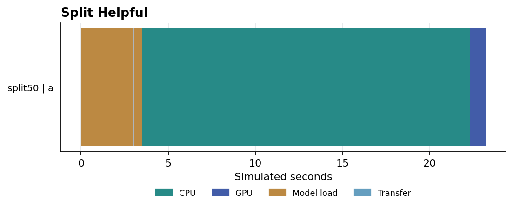
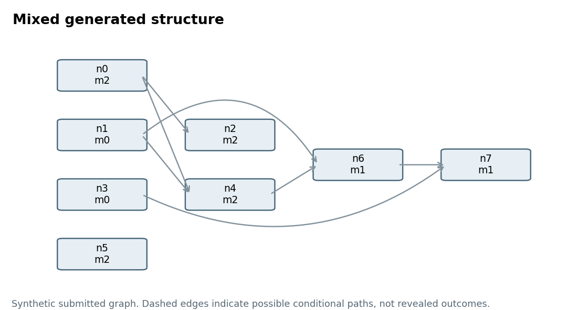

# Pantograph scheduler v2 evaluation

## Conclusion

V2 implements the richer scheduling contracts in a standalone CPU discrete-event simulator. It does not run neural networks or modify Pantograph. The unoptimized reference completion search is computationally expensive: it can improve selected synthetic schedules while spending far more real planning time than those synthetic workloads last. This is a practical limitation, not a hidden benchmark win.

The final C3 fresh-seed population contains 56 runs: 1 budget_exceeded, 55 terminal. It is reported separately from the revealed historical reruns. Deep search remains a research mechanism whose planning cost is not yet practical for these short synthetic workloads.

The historical C1 plus O1 re-evaluation contains 168 runs. Of 33 search runs, the outcomes are 3 budget_exceeded, 30 terminal. On the 30 complete search/earliest-finish pairs, search has 27 wins, 1 tie and 2 losses. These complete-pair counts do not erase budget-exceeded or other incomplete cases.

The independent audit is included in review/independent-v2-audit.md. C1 and O1 acceptance concerns their recorded fingerprints; the later C2/C3 disclosure correction has its own tests and fresh holdout evidence. The historical optimization experiment is not silently relabeled as C3.

## What the simulator implements

The general-workflow cohort includes real modeled static/dynamic whole-request batches, separate full CPU/GPU model copies, sequential split25/split50 plans, and host-weight offload with four recurring transfer windows. CPU work, boundary transfers and GPU work occur as distinct events. Model memory, activations, workspaces, output buffers and sequence state have separate leases. Named links share bandwidth, and host-level co-run penalties alter remaining service rates.

Memory is measured in declared GiB-like units and compute in synthetic work units per second. Each episode holds a fixed CPU/GPU capacity token independently of its weight bytes. Capacity is checked atomically for replicas, loader scratch, batch activation/workspace, input/output staging and KV. Splits use 25/75 or 50/50 weight partitions but distinct CPU work shares of 0.36 or 0.58, plus explicit boundary bytes and overhead factors. These values are declared toy profiles, not calibrated operator partitions. Loader scratch is a caller-declared envelope; per-chunk loader buffering and byte-content flow are not simulated, so a real backend must validate that envelope before relying on admission safety.

Whole-request batch work sums each member's declared work after padding to the largest shape, then applies the model's separate CPU/GPU batching curve. Workspace grows with batch size. Named storage, PCIe and host-network links divide bandwidth among concurrent transfers; compute/I/O and CPU/GPU co-runs receive declared slowdown factors. A detailed shared-memory-bandwidth allocator is not implemented.

Compatibility requires the same model identity and revision, dtype, adapter, operation, shape/padding bucket and serving contract. Per-member input/output bounds enter capacity accounting. Dtype is an identity label, not a simulated conversion kernel or calibrated precision-speed model. The iterative cohort uses bounded prefill chunks and one-token decode quanta. Batch membership can change between iterations. Each sequence retains its model pin and KV reservation, and actual output stopping remains hidden. Used KV bytes grow inside a maximum reservation; this is not incremental block reuse. Time to first token and inter-token delay are recorded.

Priority boosts are scoped to an app or workflow, clipped to a factor from one to four, and expire. A round-robin protected-service turn stops conflicting new admissions while admitted output consumers and active sequences drain. The iterative fair control charges completed prefill/decode service, rather than using hidden output lengths. Nonstarvation depends on the declared finite work/output limits, eventual cleanup, feasible CPU escape and available workers; the prototype makes no unconditional latency or starvation theorem for arbitrary arrivals and failures.

Policies consume an immutable observation, not the execution world. Recursive future decisions are rebuilt from future observations. The owner remains responsible for graph readiness and branch resolution. Continuations use a nominal branch assumption and public output mean/cap for sequence stops; two timing factors do not form a calibrated joint uncertainty model. The proposal ranks completion outcomes across two event depths and a common earliest-finish continuation; it is a bounded recursive search, not an implementation of every general beam-search alternative in the paper.

Omissions include internal microbatch pipeline overlap, tensor collectives, arbitrary operator sharding, live migration/repartition, kernel preemption, learned timing calibration, real allocator enforcement and durable distributed fencing. Deadline enforcement and a quantitative aborted-token-work metric are also omitted. The 54-row implementation matrix and eight semantic gates are in reports/implementation_coverage.md. Partial rows remain partial.

## Correctness review and repaired contracts

The pre-audit frozen source completed 161 of 168 experiment runs and exceeded its budget on seven search runs, including all three iterative search runs. Independent adversarial review nevertheless found eight contract failures, plus a builder-found remote-staging failure and smaller input/measurement gaps. Those old outcomes remain archived and do not validate the repaired code. C1 was independently rechecked on 59 builder tests, 23 adversarial methods, 13 independently enumerated oracle cases and 46 additional procedural runs. O1 is a later implementation-only revision with separate equivalence checks.

Unified memory maps logical CPU/GPU allocations to one physical backing capacity. Equal-content copies are charged separately. A verified-alias ledger primitive is tested, but model-level alias sharing is not simulated.

Protected service includes active iterative requests. A cold target can block new conflicting admissions while existing sequences continue to a release boundary. Their declared output limits bound the modeled remaining service; no actual stop length is revealed to the policy.

For retained-output progress, the implementation reserves each admitted workflow's entire intermediate-output closure, including all join inputs, before its first producer starts. Aggregate closure reservations leave a declared common CPU escape envelope. The exact ten-unit producer/consumer counterexample and a multi-input join are executable tests. This contract is deliberately conservative: a serially feasible workflow can be rejected if its complete closure does not fit. Static whole-request groups retain their required members during protection. Static-plus-iterative groups and cross-workflow dependency edges are rejected. Capacity safety remains conditional on the declared input and progress contract.

## Experimental boundaries and reproduction

The design manifest predates implementation. Development used seeds 11 and 23; validation used 137 and 149. The original held-out population uses 1009, 2027 and 4001 across eleven families. Family/configuration variation includes chains, parallel queues, fork/join, mixed graphs, bursts, hot models, memory pressure, heterogeneous hosts, hidden branches, iterative requests and priority stress. The same capabilities, forecast information, batch/KV limits and service obligations are available to every policy. The iterative cohort additionally includes a token-service-oriented fair baseline.

Executable correctness fixes made during development are recorded in reports/revision_journal.md. Earlier development and validation sources are preserved and are not pooled into the final locked comparison. Every sealed manifest records source, scenario and contract hashes. The accepted C1 and optimized O1 manifests are separate authorities. Correctness repair and implementation optimization are followed by re-evaluation of the same revealed test population, not a claim of a fresh unseen generalization test. No objective weights, batch-size menu or search limits were tuned to those outcomes.

Each final run has a 300-second experiment wall budget. Budget-exceeded, rejected, failed, deadlocked, truncated and exception outcomes remain explicit. A failed required workflow has no finite accepted makespan. Complete-only means below are labeled with their denominators and cannot be interpreted as an all-run success statistic.

Run from the package directory using Python 3.11 or newer:

    python -m unittest discover -s tests -v
    python -m scheduler_v2 run --family mixed --seed 11 --policy earliest
    python -m scheduler_v2 run --family iterative --seed 11 --policy search --trace traces/example.jsonl
    python run_evaluation.py --phase test --label replay --workers 4 --trace

The simulator and tests use the standard library. Report rebuilding optionally requires matplotlib and reportlab. Search can take minutes per small scenario. Replaying the sealed test with changed code is deliberately refused; create a separately named experiment rather than overwriting its evidence.

## Final C3 visibility correction and fresh holdout

A final counterfactual check found that app-queue retirement consulted unreleased hidden workflows. A related metadata path exposed generations for hidden forecasts. C2 limits those aggregates to disclosed demand, excludes pending descriptors in frontier-only mode, rejects duplicate forecast IDs, and rejects injected internal cleanup events. Only engine-generated cleanup from observed lifecycle actions is exposed as a known future release. C3 then removes latent heap-layout effects by exporting certified cleanup in actual chronological order. The complete 27-field disclosure inventory covers every built-in policy and recursive continuation path. Unordered metadata is canonical; public submission/admission, batch, stage and fairness order remain semantic. Earlier sources and all results remain archived. These are correctness changes, not further performance-equivalence claims.

The C2 run on seed 9001 began before the cleanup-order finding and was stopped: 26 records and 30 interrupted/unrecorded slots remain in reports/postrepair_holdout_interrupted.json. Seed 9001 is explicitly revealed. After the C3 freeze, replacement seed 9029 was declared without examining its scenarios, with the same eleven families, five policies plus iterative fair control, workload size, four workers and 300-second cap. No policy settings were selected using either seed. This is one fresh seed, not a broad generalization study.

The final population has 56 runs: 1 budget_exceeded, 55 terminal. Search versus earliest has 9 wins, 0 ties and 1 loss among 10 complete pairs. All incomplete runs remain in the 56-run denominator.

| Family | FIFO | Residency | Earliest | Critical | Search |
|---|---:|---:|---:|---:|---:|
| bursts | 12.92 | 24.71 | 17.86 | 17.76 | 12.92 |
| chain | 19.20 | 23.19 | 18.60 | 18.60 | 17.00 |
| fork join | 35.27 | 17.44 | 16.47 | 15.82 | 10.63 |
| heterogeneous | 11.68 | 19.58 | 10.45 | 11.20 | 11.70 |
| iterative | 16.00 | 16.00 | 12.91 | 11.75 | budget_exceeded |
| memory | 17.19 | 21.90 | 15.90 | 20.63 | 14.61 |
| mixed | 13.70 | 15.69 | 11.48 | 16.52 | 11.08 |
| parallel | 20.85 | 21.17 | 25.88 | 12.59 | 10.75 |
| priority | 7.64 | 7.64 | 24.77 | 11.80 | 7.25 |
| shared models | 14.03 | 17.39 | 11.94 | 13.22 | 8.17 |
| unknown branch | 11.90 | 11.90 | 11.75 | 10.43 | 11.09 |

Cells show synthetic seconds or the explicit noncompletion outcome. The iterative fair control and every full metric remain in reports/c3_fresh_evaluation.json. Real planning overhead is still material; see the per-run planning CPU/wall and whole-run budget fields.

| Policy | Runs | Mean planner wall s | Mean planner CPU s | Mean run CPU s | Budget exceeded |
|---|---:|---:|---:|---:|---:|
| fifo | 11 | 0.10 | 0.10 | 0.12 | 0 |
| residency | 11 | 0.09 | 0.09 | 0.11 | 0 |
| earliest | 11 | 0.17 | 0.17 | 0.19 | 0 |
| critical | 11 | 0.14 | 0.14 | 0.16 | 0 |
| search | 11 | 116.74 | 116.72 | 116.79 | 1 |
| fair | 1 | 0.34 | 0.34 | 0.40 | 0 |

For budget-interrupted rows, planner columns are lower bounds covering completed calls; run CPU and wall include the interrupted call. The four evaluation workers share a real host, so this is a practical cost observation rather than a calibrated deployment benchmark.

## C3 historical regression

The separate affected-history population replays bursts, priority and iterative serving across seeds 1009, 2027 and 4001, using the same matched policies and caps. It contains 48 runs: 3 budget_exceeded, 45 terminal. These are revealed regression cases, not fresh generalization evidence. Exact comparisons to O1 remain in reports/c3_targeted_evaluation.json.

## Historical C1 plus O1 matched results

Mean accepted batch makespan in synthetic seconds. Each cell shows mean (complete runs / expected runs). Lower is better within this declared metric. An incomplete search run is not assigned an artificially short time.

| Family | FIFO | Residency | Earliest | Critical | Search |
|---|---:|---:|---:|---:|---:|
| bursts | 26.43 (3/3) | 22.02 (3/3) | 14.35 (3/3) | 17.46 (3/3) | 12.99 (3/3) |
| chain | 22.13 (3/3) | 22.13 (3/3) | 25.19 (3/3) | 25.19 (3/3) | 19.37 (3/3) |
| fork join | 23.03 (3/3) | 23.03 (3/3) | 16.59 (3/3) | 17.43 (3/3) | 15.26 (3/3) |
| heterogeneous | 12.87 (3/3) | 14.87 (3/3) | 20.30 (3/3) | 14.13 (3/3) | 9.77 (3/3) |
| iterative | 20.75 (3/3) | 20.76 (3/3) | 19.22 (3/3) | 20.17 (3/3) | - (0/3) |
| memory | 24.52 (3/3) | 24.52 (3/3) | 31.53 (3/3) | 23.83 (3/3) | 20.64 (3/3) |
| mixed | 14.57 (3/3) | 23.69 (3/3) | 16.77 (3/3) | 16.00 (3/3) | 12.65 (3/3) |
| parallel | 15.81 (3/3) | 20.15 (3/3) | 13.99 (3/3) | 15.06 (3/3) | 10.26 (3/3) |
| priority | 20.26 (3/3) | 20.26 (3/3) | 15.76 (3/3) | 15.63 (3/3) | 11.22 (3/3) |
| shared models | 12.77 (3/3) | 12.77 (3/3) | 15.59 (3/3) | 15.43 (3/3) | 10.22 (3/3) |
| unknown branch | 13.80 (3/3) | 13.80 (3/3) | 13.68 (3/3) | 11.79 (3/3) | 9.11 (3/3) |

Complete-pair percentages and family averages are descriptive. Three test seeds per family are not sufficient to establish a robust tail guarantee or broad production generalization. The exact per-scenario outcomes, flow times, maximum ready wait, token metrics and resource peaks remain in reports/c1_optimized_evaluation.json.

## Planning time and unfinished experiments

Synthetic execution seconds come from declared CU and bandwidth profiles. Planner wall and process CPU seconds come from the real host. Those clocks are not calibrated to one another. The same-schedule serialized accounting field adds measured planning wall time to synthetic elapsed time under an explicit one-second-for-one-second assumption; it is not an end-to-end Pantograph benchmark or a proof about a real deployment. The legacy field is named serialized_overhead_upper_bound_s, but no hardware upper bound is established, and interrupted-call time is absent from it.

| Policy | Runs | Mean planner wall s | Mean planner CPU s | Mean run CPU s | Budget exceeded |
|---|---:|---:|---:|---:|---:|
| fifo | 33 | 0.07 | 0.07 | 0.08 | 0 |
| residency | 33 | 0.07 | 0.07 | 0.08 | 0 |
| earliest | 33 | 0.16 | 0.16 | 0.18 | 0 |
| critical | 33 | 0.14 | 0.13 | 0.15 | 0 |
| search | 33 | 109.32 | 108.32 | 110.01 | 3 |
| fair | 3 | 0.46 | 0.46 | 0.53 | 0 |

The legacy max_ready_wait_s equals first-start delay among requests that actually started. It excludes never-started requests and later iterative waits; separate backlog, never-started and active-continuation metrics are recorded. None is a universal starvation bound. For interrupted runs, planner_wall_s and planner_cpu_s cover completed decisions only and are lower bounds on total planning cost. run_cpu_s, wall_s and operation_counts include the interrupted call. Timings vary with host load and the number of evaluation workers.

A four-request development profile recorded 546 candidate evaluations, 24,531 prediction events and 26,902 prediction-world constructions. Candidate generation accumulated about 73.5 profiler seconds and full-world eviction deep copies about 47.4 cumulative seconds. These timings overlap and profiling itself adds overhead. Repeated hypothetical state construction dominates, with continuation simulation multiplying that work. See reports/planning_cost_analysis.md and the saved profiler output.

The separately measured O1 performance revision preserves ordered candidate sets, decisions and execution outcomes in the completed comparisons. Original reference timings and budget failures remain part of the evidence. A budget can stop either implementation first; prefix equality alone establishes no completed result or universal speed guarantee.

## Historical implementation cost revision

O1 replaces full-world eviction copies with copied ledger/replica maps and caches immutable stage profiles and graph facts. Against accepted C1, the complete matched rerun gives 161 full trace comparisons and 7 common-prefix comparisons, with 0 trace differences and 0 complete-outcome differences. Ordered candidates and selected actions are included in those traces.

For complete search pairs, median planner process-CPU speedup is 1.53x (range 1.07x to 3.98x). Budget-exceeded references are excluded from this speedup statistic. A matching common prefix does not reveal either interrupted run's unknown complete outcome. In iterative seed 4001, O1 records 124 trace events before its cap versus C1's 140, so even this revision provides no universal progress guarantee.

Both original costs and revised costs remain in reports/optimization_comparison.json. Caches are bounded and cleared at the start of each experiment run. They do not store forecasts, latent future outcomes or mutable execution worlds. Synthetic execution outcomes are unchanged for complete equivalent cases; faster planning is an implementation result, not a newly tuned scheduling policy.

## Positive and negative mechanism fixtures

| Fixture | Outcome | Synthetic makespan | Actual modeled choice |
|---|---|---:|---|
| split_helpful | terminal | 23.22 | split50 batch 1 |
| split_harmful | terminal | 33.01 | cpu batch 1 |
| uniform_batched | terminal | 1.82 | gpu batch 4 |
| uniform_single | terminal | 3.56 | gpu batch 1 |
| padded_batched | terminal | 5.92 | gpu batch 4 |
| padded_single | terminal | 3.56 | gpu batch 1 |
| lookahead_true | terminal | 21.38 | gpu preload, cpu batch 1, cpu preload, offload preload, split25 preload, gpu batch 1 |
| lookahead_false | terminal | 22.41 | cpu batch 1, gpu batch 1 |
| bounded_failure | terminal with failed work | - | gpu batch 1 |
| truncated | truncated | - | gpu batch 1 |
| oracle_fifo | terminal | 2.00 | gpu batch 2, cpu batch 1 |
| oracle_residency | terminal | 2.00 | gpu batch 2, cpu batch 1 |
| oracle_earliest | terminal | 2.00 | gpu batch 1, cpu batch 1 |
| oracle_critical | terminal | 2.00 | gpu batch 1, cpu batch 1 |
| oracle_search | terminal | 2.00 | gpu batch 2, cpu batch 1 |

A terminal engine state can contain failed required work; the failure fixture therefore has no accepted makespan. The uniform batch improves its declared profile, while padding a short/long mixture makes batching worse. The split fixture chooses a real CPU/transfer/GPU plan when appropriate and returns to CPU execution when the link is very slow. Lookahead can reduce successor preparation time, but the trace also reveals unnecessary speculative copies; the prototype is not claimed to have optimal cache behavior.

The timeline is generated from phase-end events, not drawn from an assumed additive CPU/GPU speedup. Very short transfer intervals may be visually narrow.

Graphs come from the procedural generator. The workflow owner enforces their dependencies; a disclosed descendant does not become executable early. Additional serial, parallel, fork/join and conditional graphs and SVG originals are in output/figures.

## Verification and oracle scope

The builder suite records 75 tests in reports/c3-builder-tests.txt. Independent C3 verification re-runs the adversarial lifecycle, expanded post-history nonanticipation and separately enumerated oracle suites. Exact counts and source fingerprints are in the independent audit. It checks actual placement/batch/preload decisions, lifecycle release, protected sequence draining, hidden-state counterfactuals including recursive selection, output closure progress and explicit noncompletion accounting. Tests and a terminal simulation support only the represented contract. Independent review has its own scope and evidence.

The exact oracle enumerates a tiny warm, one-model, two-resource CPU/GPU batching contract for independent requests with known work, no transfers, no contention, no split mode and no iterative state. Three requests of work 2 have exact makespan 1.7 and completion sum 5.1 in that fixture. A separately specified engine schedule matches it. All five ordinary policies take 2.0 seconds on that same restricted fixture, versus the 1.7-second exact optimum. Their bounded dynamic-batch menu considers sizes 1, 2 and 4 and misses the legal batch of 3. This is a retained negative result about candidate coverage. The oracle does not certify the rich simulator or a general search optimum.

The initial implementation has no hardware-calibrated timing learner, no output-content validation and no production backend adapter. A favorable modeled completion time therefore does not establish useful hardware throughput. The next engineering step is to reduce remaining continuation-search cost without changing decisions, then validate profiles and leases against observed hardware traces before considering deployment.

## Evidence files

- frozen_contract.json and research/frozen-contract.sha256: pre-implementation choices
- reports/c3_fresh_sealed_manifest.json and reports/c3_fresh_evaluation.json: final C3 fresh population
- review/c3-source.sha256: final executable fingerprint
- reports/observation_disclosure_inventory.md and review/observation-boundary-inventory.md: complete information-flow audit
- reports/postrepair_holdout_interrupted.json: 26 preserved C2 seed-9001 records and 30 interrupted/unrecorded slots
- reports/c1_optimized_sealed_manifest.json: historical C1 plus O1 source/scenario/configuration hashes
- reports/c1_optimized_evaluation.json and reports/c1_optimized/: every historical C1 plus O1 outcome
- traces/c1_optimized/: historical C1 plus O1 decision and execution traces; original traces remain under traces/test
- reports/final_requirement_matrix.md and reports/implementation_coverage.md: 54 requirement-to-variable-to-decision-to-test rows and eight separate feature gates
- reports/revision_journal.md: fixes and historical snapshot boundaries
- reports/diagnostics.json and scenarios/: reproducible mechanism fixtures
- reports/planner_profile_manifest.json: profiler snapshot and scope
- review/: independent review and source fingerprints when complete

Research basis: the reviewed revised Pantograph scheduler paper dated 2 October 2026. Mechanism sources include [Accelerate offload](https://huggingface.co/docs/accelerate/en/concept_guides/big_model_inference), [FlexGen](https://proceedings.mlr.press/v202/sheng23a.html), [ORCA](https://www.usenix.org/conference/osdi22/presentation/yu), and [Triton batching](https://docs.nvidia.com/deeplearning/triton-inference-server/user-guide/docs/user_guide/batcher.html). These sources motivate abstractions; no published system speedup is transferred to this prototype.
